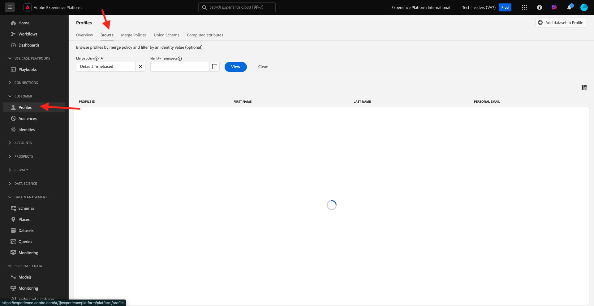

# 2.1.2 独自のリアルタイム顧客プロファイルの視覚化 – UI

この演習では、Adobe Experience Platformにログインし、独自のリアルタイム顧客プロファイルを UI で表示します。

## コンテキスト

リアルタイム顧客プロファイルでは、すべてのプロファイルデータがイベントデータと共に、既存のセグメントメンバーシップと共に表示されます。 表示されるデータは、Adobeアプリケーションや外部ソリューションなど、どこからでも取得できます。 これは、Adobe Experience Platformで最も強力なビュー、つまり真のレコードのエクスペリエンスシステムです。

## Adobe Experience Platformでの顧客プロファイルビューの使用

[Adobe Experience Platform](https://experience.adobe.com/platform) に移動します。 ログインすると、Adobe Experience Platformのホームページが表示されます。

続行する前に、**サンドボックス** を選択する必要があります。 選択するサンドボックスの名前は ``--aepSandboxName--`` です。 適切な [!UICONTROL &#x200B; サンドボックス &#x200B;] を選択すると、画面が変更され、専用の [!UICONTROL &#x200B; サンドボックス &#x200B;] が表示されます。

左側のメニューで、**プロファイル**、「参照 **の順に移動** ます。

Web サイトのプロファイルビューアパネルでは、複数の ID を検索できます。 すべての ID は名前空間にリンクされています。

プロファイルビューアパネルでは、ID と名前空間の次の組み合わせを表示できます。

| ID | 名前空間 |
|:-------------:| :---------------:|
| Experience CloudID （ECID） | 79943948563923140522865572770524243489 |
| Experience CloudID （ECID） | 70559351147248820114888181867542007989 |
| メール ID | woutervangeluwe+18112024-01@gmail.com |
| 携帯電話番号 ID | +32473622044+18112024-01 |

Adobe Experience Platformでは、すべての ID が同じように重要です。 以前は、ECID はAdobeコンテキストで最も重要な ID であり、他のすべての ID は階層的な関係で ECID にリンクされていました。 Adobe Experience Platformでは、これは該当しなくなり、すべての ID がプライマリ識別情報と見なすことができます。

通常、プライマリ識別子はコンテキストに依存します。 コールセンターに問い合わせる場合 **最も重要な ID は何ですか？彼ら** おそらく答えるだろう **電話番号！** しかし、CRM チームに質問すると、**メールアドレス！** Adobe Experience Platformは、この複雑さを理解し、管理します。 Adobe用アプリケーションであれ、非Adobe用アプリケーションであれ、すべてのアプリケーションは、プライマリと見なされる ID を参照することでAdobe Experience Platformと通信します。 そしてそれは単に機能します。

「**ID 名前空間**」フィールドで「**メール**」を選択し、「**ID 値**」フィールドで、前の演習で登録に使用したメールアドレスを入力します。 **表示** をクリックします。 すると、リストにプロファイルが表示されます。 **プロファイル ID** をクリックして、プロファイルを開きます。

これで、顧客プロファイルの重要な **プロファイル属性** の概要が表示されます。 プロファイルで使用可能なすべてのプロファイル属性を表示するには、「**属性**」をクリックします。

すべての属性の完全なリストが表示されます。

**イベント** に移動すると、プロファイルにリンクされているすべてのエクスペリエンスイベントのエントリを確認できます。

最後に、メニューオプション **オーディエンスメンバーシップ** に移動します。 ここでは、この顧客の選定中のすべてのオーディエンスを確認できます。 現在リストは空の場合がありますが、次のモジュールでは変更されます。

これで、Adobe Experience Platformのユーザーインターフェイスを使用して顧客のリアルタイムプロファイルを表示する方法を学びました。次は、PostmanとAdobe I/Oを使用して、Adobe Experience Platformの API に対してクエリを実行し、API を通じて同じ操作を行います。

次のステップ：[2.1.3 独自のリアルタイム顧客プロファイルを視覚化 – API](./ex3.md)

[モジュール 2.1 に戻る](./real-time-customer-profile.md)

[すべてのモジュールに戻る](../../../overview.md)
