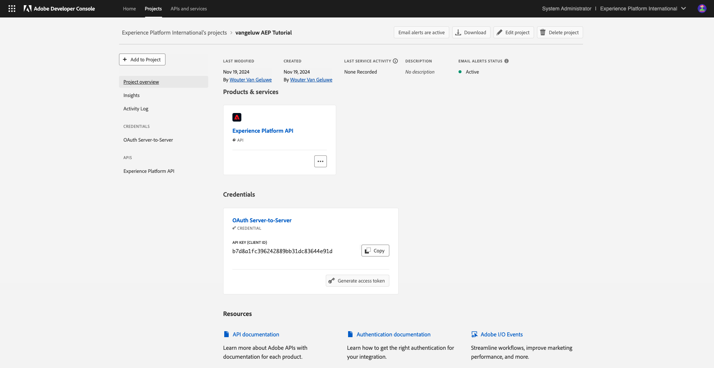
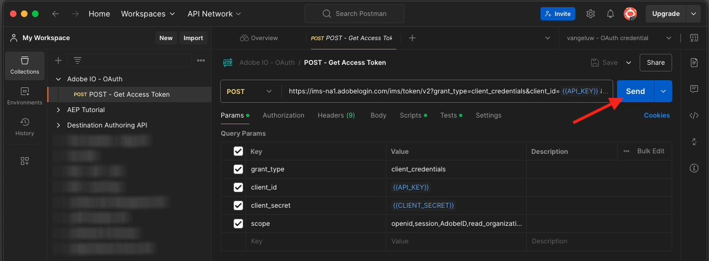
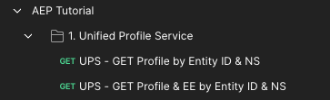
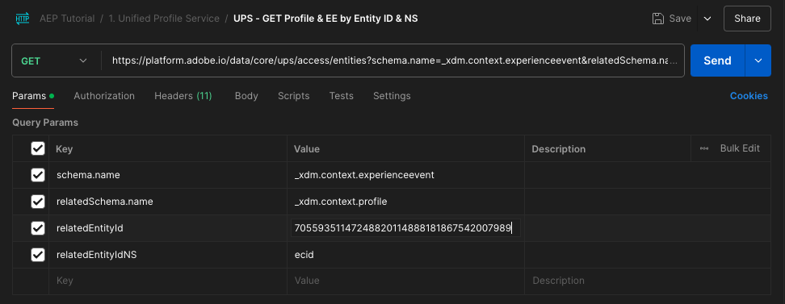

# 2.1.3 独自のリアルタイム顧客プロファイルの視覚化 – API

この演習では、PostmanとAdobe I/Oを使用してAdobe Experience Platform API をクエリし、独自のリアルタイム顧客プロファイルを表示します。

## コンテキスト

リアルタイム顧客プロファイルでは、すべてのプロファイルデータがイベントデータと共に、既存のオーディエンスメンバーシップと共に表示されます。 表示されるデータは、Adobeアプリケーションや外部ソリューションなど、どこからでも取得できます。 これは、レコードのエクスペリエンスシステムであるAdobe Experience Platformで最も強力なビューです。

リアルタイムAdobeプロファイルは、すべての顧客アプリケーションで使用できますが、コールセンターや店舗のクライアントリングアプリなどの外部ソリューションでも使用できます。 これを行うには、これらの外部ソリューションをAdobe Experience Platformの API に接続します。

## 識別子

Web サイトのプロファイルビューアパネルでは、複数の ID を検索できます。 すべての ID は名前空間にリンクされています。


X 線パネルには、ID と名前空間の 4 つの異なる組み合わせが表示されます。

| ID | 名前空間 |
|:-------------:| :---------------:|
| Experience CloudID （ECID） | 79943948563923140522865572770524243489 |
| Experience CloudID （ECID） | 70559351147248820114888181867542007989 |
| メール ID | woutervangeluwe+18112024-01@gmail.com |
| 携帯電話番号 ID | +32473622044+18112024-01 |

次の手順では、これらの識別子を覚えておいてください。

## Adobe I/Oプロジェクトの設定

この演習では、Adobe I/Oを非常に集中的に使用して、Platform の API に対してクエリを実行します。 以下の手順に従って、Adobe I/Oを設定してください。

[https://developer.adobe.com/console/home](https://developer.adobe.com/console/home) に移動します


画面の右上隅で正しいAdobe Experience Platform インスタンスを選択していることを確認してください。 インスタンスは `--aepImsOrgName--` です。 **新規プロジェクトを作成** をクリックします。


「**+ プロジェクトに追加**」を選択し、「**API**」を選択します。


次の画面が表示されます。


「**Experience PlatformAPI**」を選択し、「**次へ**」をクリックします。


この画面が表示されます。 資格情報の名前を指定：`--aepUserLdap-- - OAuth credential`。 「**次へ**」をクリックします。


次に、この統合で使用できる権限を定義する製品プロファイルを選択する必要があります。

必要な製品プロファイルを選択します。

>[!NOTE]
>
> 製品プロファイル名は、インスタンス固有なので、Adobe Experience Platform インスタンスで異なります。 適切なアクセス権を持つ製品プロファイルを 1 つ以上選択する必要があります。これらのプロファイルは、Adobe Admin Consoleと AEP の権限 UI で設定します。

**設定済み API を保存** をクリックします。


これで、Adobe I/Oの統合の準備が整いました。


**Postman用にダウンロード** ボタンをクリックし、**OAuth サーバー間** をクリックして、Postman環境をダウンロードします（環境がダウンロードされるまで待ちます。これには数秒かかる場合があります）。


IO プロジェクトには現在、汎用名があります。 統合にはわかりやすい名前を付ける必要があります。 示されているように、**プロジェクト X** （または類似の名前）をクリックします


**プロジェクトを編集** をクリックします。


統合の名前と説明を入力：`--aepUserLdap-- AEP Tutorial`。

「**保存**」をクリックします。


これで、Adobe I/Oの統合が完了しました。



>[!NOTE]
>
>このAdobe I/OプロジェクトがAdobe Experience Platformの権限設定にアクセスできるようにする追加の手順があります。 プロジェクトの API 資格情報は、Adobe Experience Platformの権限 UI に追加する必要があります。この UI には、システム管理者のアクセス権が必要です。 手順は以下に記載されていますが、必要なアクセス権限がない場合は、システム管理者に問い合わせて、これを処理してもらう必要がある場合があります。

## API 資格情報の AEP 権限

>[!IMPORTANT]
>
>システム管理者のアクセス権がない場合、この手順を自分で実行できず、**権限** UI にアクセスする権限もありません。 その場合は、システム管理者に問い合わせるか、組織のサポートチャネルに質問を投稿してください。

[Adobe Experience Platform](https://experience.adobe.com/platform) に移動します。 ログインすると、Adobe Experience Platformのホームページが表示されます。

**権限**/（役割 **に移動し、関連する製品プロファイルをクリック** ます。

>[!NOTE]
>
> 製品プロファイル名は、インスタンス固有なので、Adobe Experience Platform インスタンスで異なります。 適切なアクセス権を持つ製品プロファイルを 1 つ以上選択する必要があります。これらのプロファイルは、Adobe Admin Consoleと AEP の権限 UI で設定します。


**API 資格情報** をクリックします。


「**+ API 資格情報を追加**」をクリックします。


新しく作成されたAdobe I/Oプロジェクトを選択し、「**保存**」をクリックします。


## Adobe I/Oに対する認証

>[!IMPORTANT]
>
>Adobe社員の方は、こちらの説明に従って [PostBuster](./../../../postbuster.md) を使用してください。

[https://www.postman.com/downloads/](https://www.postman.com/downloads/) に移動します。

お使いの OS に関連するバージョンのPostmanをダウンロードしてインストールします。


Postmanをインストールしたら、アプリケーションを起動します。

Postmanには、環境とコレクションという 2 つのコンセプトがあります。

- 環境には、多かれ少なかれ一貫性のあるすべての環境変数が含まれています。 環境には、秘密鍵などのセキュリティ認証情報と共に、Platform 環境の IMSOrg などがあります。 環境ファイルは、前の演習でのAdobe I/O設定時にダウンロードしたファイルで、名前は **`oauth_server_to_server.postman_environment.json`** のようになります。

- コレクションには、使用可能な多数の API リクエストが含まれています。 2 つのコレクションを使用します
   - Adobe I/Oへの認証のための 1 つのコレクション
   - このモジュールの演習の 1 つのコレクション
   - 宛先オーサリング用の、Real-Time CDP モジュールの演習用の 1 つのコレクション

[postman.zip](./../../../assets/postman/postman_profile.zip) ファイルをローカルデスクトップにダウンロードしてください。

この **postman.zip** ファイルには、次のファイルがあります。

- `Adobe IO - OAuth.postman_collection.json`
- `AEP Tutorial.postman_collection.json`
- `Destination_Authoring_API.json`

**postman.zip** ファイルを解凍し、これらの 3 つのファイルをAdobe I/OからダウンロードしたPostmanと共に、デスクトップ上のフォルダーに保存します。そのフォルダーには、次の 4 つのファイルが必要です。


Postmanに戻ります。 **インポート** をクリックします。


**ファイル** をクリックします。


ダウンロードした 4 つのファイルを抽出したデスクトップ上のフォルダーに移動します。 これらの 4 つのファイルを同時に選択し、「開く **をクリックし** す。


**開く** をクリックすると、Postmanに読み込む環境とコレクションの概要が表示されます。 **インポート** をクリックします。


これで、API を使用してPostmanとの対話を開始するためにAdobe Experience Platformで必要なすべてが揃いました。

まず最初にすべきことは、正しく認証されていることを確認することです。 認証を受けるには、アクセストークンをリクエストする必要があります。

リクエストを実行する前に、適切な環境が選択されていることを確認します。 右上隅の「環境」ドロップダウンリストを確認すると、現在選択されている環境を確認できます。

選択した環境の名前は、`--aepUserLdap-- OAuth Credential` のようになります。


これで、Postman環境とコレクションが設定され、機能するようになりました。 PostmanからAdobe I/Oに対して認証できるようになりました。

**Adobe IO - OAuth** コレクションで、**POST - アクセストークンの取得** という名前のリクエストを選択します。 「**送信**」をクリックします。



数秒後、Postmanの **Body** セクションに応答が表示されます。


設定が成功すると、次の情報を含む同様の応答が表示されます。

| キー | 値 |
|:-------------:| :---------------:| 
| token_type | **ベアラー** |
| access_token | **eyJhbGciOiJSU...jrNZ6mdaQ** |
| expires_in | **86399** |

Adobe I/Oから、特定の値 **非常に長い access_token）と有効期限のウィンドウを持つ bearer**-token が提供されました。

受信したトークンは 24 時間有効になりました。 つまり、24 時間後にPostmanを使用してAdobe I/Oへの認証を行う場合は、このリクエストを再度実行して新しいトークンを生成する必要があります。

## リアルタイム顧客プロファイル API、スキーマ：プロファイル

これで、最初のリクエストを Platform のリアルタイム顧客プロファイル API に送信できます。

Postmanで、コレクションを探します **AEP チュートリアル**。



**1。 統合プロファイルサービス** で、名前が **UPS - エンティティ ID と NS によるGETプロファイル** の最初のリクエストをクリックします。


このリクエストには、次の 3 つの必須変数があります。

| キー | 値 | 定義 |
|:-------------:| :---------------:| :---------------:| 
| entityId | **id** | 特定の顧客 ID |
| entityIdNS | **名前空間** | id に適用できる特定の名前空間 |
| schema.name | **_xdm.context.profile** | 情報を受信する特定のスキーマ |

そのため、Adobe Experience Platformの API に対して、独自の ECID のすべてのプロファイル情報を返すよう依頼する場合は、次のようにリクエストを設定する必要があります。

| キー | 値 |
|:-------------:| :---------------:| 
| entityId | **yourECID** |
| entityIdNS | **ecid** |
| schema.name | **_xdm.context.profile** |


また、リクエストの **Header** - フィールドを検証する必要があります。 **ヘッダー** に移動します。 次の画面が表示されます。


>[!NOTE]
>
>使用しているAdobe Experience Platform サンドボックスの名前を指定する必要があります。 x-sandbox-name は `--aepSandboxName--` にしてください。

| キー | 値 |
| ----------- | ----------- |
| x-sandbox-name | `--aepSandboxName--` |


サンドボックス名を確認したら、「**送信**」をクリックして、リクエストを Platform に送信します。

Platform からすぐに応答が届き、次のようなメッセージが表示されます。


Platform からの完全な応答は次のとおりです。

```javascript
{
    "A2_ETHkJxMvxbiEmIZlAj8Qn": {
        "entityId": "A2_ETHkJxMvxbiEmIZlAj8Qn",
        "mergePolicy": {
            "id": "64e4b0ed-dfc3-4084-8e67-643e977168d7"
        },
        "sources": [
            "672a10cdb015162aefedfc0f",
            "672a10b1a05e282aee19737c"
        ],
        "tags": [
            "0938B898-469A-4513-8E86-87464307120F:va7",
            "3ba34930-405e-4b31-aafa-bac22d35203e:va7"
        ],
        "identityGraph": [
            "G7z3JAFBY4I6Rzg",
            "A2_ETHkJxMvxbiEmIZlAj8Qn",
            "BkFvK4QcJpSPByuDGF4UAS0wMQ",
            "BUF9zMKLrXq72p4HpbsHv1SDGF4UAS0wMUBnbWFpbC5jb20",
            "A29btmFXmrfrYbXQWISCT9ZD"
        ],
        "entity": {
            "_experienceplatform": {
                "identification": {
                    "core": {
                        "ecid": "79943948563923140522865572770524243489",
                        "phoneNumber": "+32473622044+18112024-01",
                        "email": "woutervangeluwe+18112024-01@gmail.com"
                    }
                }
            },
            "userAccount": {
                "ID": "3688250"
            },
            "pushNotificationDetails": [
                {
                    "denylisted": false,
                    "token": "2E0945F186CE5ED8CBFD1EB519A8CF38BA2B28A67FB381D45AA15EE37D289214",
                    "identity": {
                        "namespace": {
                            "code": "ECID"
                        },
                        "id": "70559351147248820114888181867542007989"
                    },
                    "platform": "apns",
                    "appID": "com.adobe.demosystem.dxdemo"
                }
            ],
            "personalEmail": {
                "address": "woutervangeluwe+18112024-01@gmail.com"
            },
            "_repo": {
                "createDate": "2024-11-18T10:39:12.296Z"
            },
            "extSourceSystemAudit": {
                "lastUpdatedDate": "2024-11-19T07:46:52.001Z"
            },
            "testProfile": true,
            "mobilePhone": {
                "number": "+32473622044"
            },
            "consents": {
                "metadata": {
                    "time": "2024-11-19T07:46:52.001Z"
                },
                "idSpecific": {
                    "ECID": {
                        "70559351147248820114888181867542007989": {
                            "collect": {
                                "val": "y"
                            }
                        }
                    }
                }
            },
            "person": {
                "name": {
                    "lastName": "Van Geluwe",
                    "firstName": "Wouter"
                }
            },
            "userActivityRegions": {
                "IRL1": {
                    "captureTimestamp": "2024-11-19T07:46:51.239Z"
                }
            },
            "identityMap": {
                "ecid": [
                    {
                        "id": "70559351147248820114888181867542007989"
                    },
                    {
                        "id": "79943948563923140522865572770524243489"
                    }
                ],
                "email": [
                    {
                        "id": "woutervangeluwe+18112024-01@gmail.com"
                    }
                ],
                "phone": [
                    {
                        "id": "+32473622044+18112024-01"
                    }
                ],
                "userid": [
                    {
                        "id": "3688250"
                    }
                ]
            }
        },
        "lastModifiedAt": "2024-11-19T07:47:23Z"
    }
}
```

これは、現在、この ECID で Platform で使用できるすべてのプロファイルデータです。

Platform のリアルタイム顧客プロファイルからプロファイルデータをリクエストするために ECID を使用する必要はありません。このデータをリクエストするには、任意の名前空間で任意の ID を使用できます。

Postmanに戻り、コールセンターを紹介し、**Phone** の名前空間と携帯電話番号を指定してリクエストを Platform に送信します。

したがって、特定の電話のすべてのプロファイル情報を返すように Platform の API に依頼する場合は、次のようにリクエストを設定する必要があります。

| キー | 値 |
|:-------------:| :---------------:| 
| entityId | **電話番号** |
| entityIdNS | **電話** （ecid を電話で置き換える） |
| schema.name | **_xdm.context.profile** |

電話番号に **+** などの特殊な記号が含まれている場合は、完全な電話番号を選択し、右クリックして **EncodeURIComponent** をクリックする必要があります。


すると、次のようになります。


また、リクエストの **Header** - フィールドを検証する必要があります。 **ヘッダー** に移動します。 次の画面が表示されます。


>[!NOTE]
>
>使用しているAdobe Experience Platform サンドボックスの名前を指定する必要があります。 x-sandbox-name は `--aepSandboxName--` にしてください。

| キー | 値 |
| ----------- | ----------- |
| x-sandbox-name | `--aepSandboxName--` |


「**送信**」をクリックして応答を確認すると、ECID を ID として使用していた場合と同じであることがわかります。


**email** の名前空間とメールアドレスを指定して、メールアドレスに対して同じ操作を行いましょう。

したがって、特定のメールアドレスのすべてのプロファイル情報を返すように Platform の API に依頼する場合は、次のようにリクエストを設定する必要があります。

| キー | 値 |
|:-------------:| :---------------:| 
| entityId | **youremail** |
| entityIdNS | **メール** （電話をメールに置き換える） |
| schema.name | **_xdm.context.profile** |

メールアドレスに **+** のような特殊な記号が含まれている場合は、完全なメールアドレスを選択し、右クリックして **EncodeURIComponent** をクリックする必要があります。


すると、次のようになります。


また、リクエストの **Header** - フィールドを検証する必要があります。 **ヘッダー** に移動します。 次の画面が表示されます。

>[!NOTE]
>
>使用しているAdobe Experience Platform サンドボックスの名前を指定する必要があります。 x-sandbox-name は `--aepSandboxName--` にしてください。


| キー | 値 |
| ----------- | ----------- |
| x-sandbox-name | `--aepSandboxName--` |

「**送信**」をクリックして応答を確認すると、ECID と電話番号で以前と同じであることが再び表示されます。


これは、ブランドに提供される非常に重要な種類の柔軟性です。 つまり、任意の環境が、独自の ID と名前空間を使用して、Platform にリクエストを送信できます。複数の名前空間と ID の複雑さを理解する必要はありません。

次に例を示します。

- コールセンターは、名前空間 **phone** を使用して Platform からデータをリクエストできます
- ロイヤルティシステムは、名前空間 **メール** を使用して Platform からデータをリクエストできます
- オンラインアプリケーションは、名前空間 **ecid** を使用できます

コールセンターは、ロイヤルティシステムで使用される識別子の種類を必ずしも把握しているわけではありません。また、ロイヤルティシステムは、オンラインアプリケーションで使用される識別子の種類を必ずしも把握しているわけではありません。 個々のシステムは、持っている情報を使用し、必要なときに必要な情報を取得できます。

## リアルタイム顧客プロファイル API、スキーマ：プロファイルと ExperienceEvent

プロファイルデータに関する Platform の API のクエリが正常に完了したら、ExperienceEvent データにも同じクエリを実行します。

Postmanで、コレクションを探します **AEP チュートリアル**。


**1。 統合プロファイルサービス** で、名前が **UPS - GETプロファイル &amp; EE （エンティティ ID と NS 別）の 2 番目のリクエストを選択します**。


このリクエストには、次の 4 つの必須変数があります。

| キー | 値 | 定義 |
|:-------------:| :---------------:|  :---------------:| 
| schema.name | **_xdm.context.experienceevent** | 情報を受信する特定のスキーマ。 この場合、ExperienceEvent スキーマにマッピングされたデータを探しています。 |
| relatedSchema.name | **_xdm.context.profile** | ExperienceEvent スキーマにマッピングされたデータを探している間に、そのデータを受信する ID を指定する必要があります。 ID にアクセスできるスキーマは Profile-schema なので、この関連スキーマは Profile-schema です。 |
| relatedEntityId | **id** | 特定の顧客 ID |
| 関連エンティティ IDns | **名前空間** | id に適用できる特定の名前空間 |

したがって、Platform の API に対して、独自の ecid のすべてのプロファイル情報を返すように依頼する場合は、次のようにリクエストを設定する必要があります。

| キー | 値 |
|:-------------:| :---------------:| 
| schema.name | **_xdm.context.experienceevent** |
| relatedSchema.name | **_xdm.context.profile** |
| relatedEntityId | **yourECID** |
| 関連エンティティ IDns | **ecid** |



また、リクエストの **Header** - フィールドを検証する必要があります。 **ヘッダー** に移動します。 次の画面が表示されます。


>[!NOTE]
>
>使用しているAdobe Experience Platform サンドボックスの名前を指定する必要があります。 x-sandbox-name は `--aepSandboxName--` にしてください。

| キー | 値 |
| ----------- | ----------- |
| x-sandbox-name | `--aepSandboxName--` |

「**送信**」をクリックして、リクエストを Platform に送信します。

Platform からすぐに応答が届き、次のようなメッセージが表示されます。


以下は、Platform からの完全な応答です。 この例では、この顧客の ECID にリンクされた ExperienceEvents が 8 つあります。 以下を見て、リクエストに様々な変数があることを確認してください。以下に表示されるのは、前の演習の Launch での設定の直接的な結果です。

また、X 線パネルに ExperienceEvent 情報が表示されている場合、以下のペイロードを使用して、製品名（以下のペイロードで productName を検索）や製品イメージの URL （以下のペイロードで productImageUrl を検索）などの情報を解析して取得します。

```javascript
{
    "_page": {
        "orderby": "timestamp",
        "start": "b1325606-9b96-4e51-b7dd-73aacf527c72-0",
        "count": 14,
        "next": ""
    },
    "children": [
        {
            "relatedEntityId": "A2_ETHkJxMvxbiEmIZlAj8Qn",
            "entityId": "b1325606-9b96-4e51-b7dd-73aacf527c72-0",
            "sourceId": "672a10b1074ceb2af0aa7034",
            "timestamp": 1731923802848,
            "entity": {
                "environment": {
                    "ipV4": "141.134.241.99",
                    "type": "browser",
                    "browserDetails": {
                        "userAgentClientHints": {
                            "mobile": false,
                            "platform": "macOS",
                            "brands": [
                                {
                                    "brand": "Chromium",
                                    "version": "130"
                                },
                                {
                                    "brand": "Google Chrome",
                                    "version": "130"
                                },
                                {
                                    "brand": "Not?A_Brand",
                                    "version": "99"
                                }
                            ]
                        },
                        "userAgent": "Mozilla/5.0 (Macintosh; Intel Mac OS X 10_15_7) AppleWebKit/537.36 (KHTML, like Gecko) Chrome/130.0.0.0 Safari/537.36",
                        "viewportHeight": 992,
                        "viewportWidth": 1920
                    }
                },
                "web": {
                    "webPageDetails": {
                        "name": "Home",
                        "viewName": "Home",
                        "pageViews": {
                            "value": 1
                        },
                        "URL": "https://dsn.adobe.com/web/vangeluw-QIMU"
                    },
                    "webReferrer": {
                        "URL": "https://auth.services.adobe.com/"
                    }
                },
                "_experienceplatform": {
                    "interactionDetails": {
                        "core": {
                            "channel": "web"
                        }
                    },
                    "demoEnvironment": {
                        "brandName": "vangeluw-QIMU"
                    },
                    "identification": {
                        "core": {
                            "ecid": "79943948563923140522865572770524243489"
                        }
                    }
                },
                "implementationDetails": {
                    "name": "https://ns.adobe.com/experience/alloy/reactor",
                    "version": "2.24.0+2.27.0",
                    "environment": "browser"
                },
                "identityMap": {
                    "ECID": [
                        {
                            "id": "79943948563923140522865572770524243489",
                            "authenticatedState": "ambiguous",
                            "primary": true
                        }
                    ]
                },
                "eventType": "web.webpagedetails.pageViews",
                "_id": "b1325606-9b96-4e51-b7dd-73aacf527c72-0",
                "placeContext": {
                    "localTime": "2024-11-18T10:56:42.848+01:00",
                    "localTimezoneOffset": -60
                },
                "device": {
                    "screenOrientation": "landscape",
                    "screenWidth": 1920,
                    "screenHeight": 1080
                },
                "timestamp": "2024-11-18T09:56:42.848Z"
            },
            "lastModifiedAt": "2024-11-18T09:56:45Z"
        },
    "_links": {
        "next": {
            "href": ""
        }
    }
}
```

これは、現在、この ECID に対して Platform で使用できるすべての ExperienceEvent データです。

ECID を使用して、Adobe Experience Platformのリアルタイムプロファイルから ExperienceEvent データをリクエストする必要はありません。任意の名前空間で任意の ID を使用して、このデータをリクエストできます。

次の手順：[2.1.4 オーディエンスの作成 – UI](./ex4.md)

[モジュール 2.1 に戻る](./real-time-customer-profile.md)

[すべてのモジュールに戻る](../../../overview.md)
