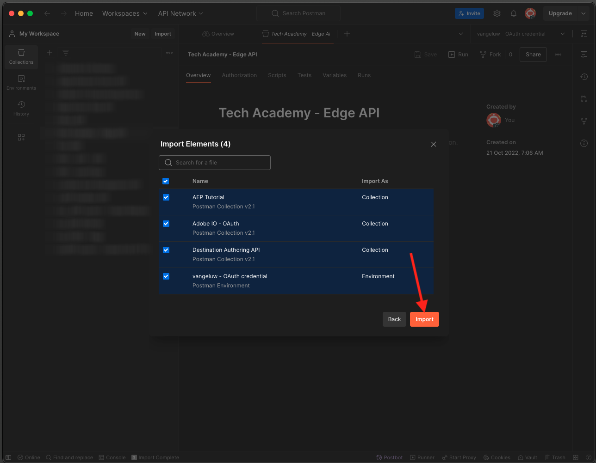

# 2.1.3 独自のリアルタイム顧客プロファイルの視覚化 – API

この演習では、PostmanとAdobe I/Oを使用してAdobe Experience Platform API をクエリし、独自のリアルタイム顧客プロファイルを表示します。

## ストーリー

リアルタイム顧客プロファイルでは、すべてのプロファイルデータがイベントデータと共に、既存のセグメントメンバーシップと共に表示されます。 表示されるデータは、Adobeアプリケーションや外部ソリューションなど、どこからでも取得できます。 これは、レコードのエクスペリエンスシステムであるAdobe Experience Platformで最も強力なビューです。

リアルタイムAdobeプロファイルは、すべての顧客アプリケーションで使用できますが、コールセンターや店舗のクライアントリングアプリなどの外部ソリューションでも使用できます。 これを行うには、これらの外部ソリューションをAdobe Experience Platformの API に接続します。

## 2.1.3.1 識別子

Web サイトのプロファイルビューアパネルでは、複数の ID を検索できます。 すべての ID は名前空間にリンクされています。


X 線パネルには、ID と名前空間の 4 つの異なる組み合わせが表示されます。

| ID | 名前空間 |
|:-------------:| :---------------:|
| Experience CloudID （ECID） | 12507560687324495704459439363261812234 |
| メール ID | woutervangeluwe+06022022-01@gmail.com |
| 携帯電話番号 ID | +32473622044+06022022-01 |

次の手順では、これらの識別子を覚えておいてください。

これらの ID を念頭に置いて、Postmanに移動します。

## 2.1.3.2Adobe I/Oプロジェクトの設定

この演習では、Adobe I/Oを非常に集中的に使用して、Platform の API に対してクエリを実行します。 以下の手順に従って、Adobe I/Oを設定してください。

[https://developer.adobe.com/console/home](https://developer.adobe.com/console/home) に移動します


画面の右上隅で正しいAdobe Experience Platform インスタンスを選択していることを確認してください。 インスタンスは `--envName--` です。


**新規プロジェクトを作成** をクリックします。

 または


「**+ プロジェクトに追加**」を選択し、「**API**」を選択します。


次の画面が表示されます。


**0}Adobe Experience Platform} アイコンをクリックします。**/images/api2.png）

**Experience PlatformAPI** をクリックします。


「**次へ**」をクリックします。


Adobe I/Oでセキュリティキーペアを生成するか、既存のキーペアをアップロードするかを選択できるようになりました。

**オプション 1 - キーペアを生成** を選択します。


**キーペアを生成** をクリックします。


約 30 秒間、スピナーが表示されます。


これが表示され、生成されたキーペアが zip ファイル **config.zip** としてダウンロードされます。

ファイル **config.zip** をデスクトップに解凍すると、2 つのファイルが含まれていることがわかります。


- **certificate_pub.crt** は公開鍵証明書です。 セキュリティの観点から見ると、これはオンラインアプリケーションとの統合を設定するために自由に使用される証明書です。
- **private.key** はあなたの秘密鍵です。 これは決して誰とも共有してはいけません。 秘密鍵は、API 実装への認証に使用するもので、秘密鍵であることが前提です。 秘密鍵を他のユーザーと共有すると、そのユーザーは実装にアクセスし、API を悪用して悪意のあるデータを Platform に取り込み、Platform に存在するすべてのデータを抽出することができます。


次の手順や、今後のAdobe I/OおよびAdobe Experience Platform API へのアクセスに必要になるので、**config.zip** ファイルは必ず安全な場所に保存してください。

「**次へ**」をクリックします。


次に、統合のために **製品プロファイル** を選択する必要があります。

必要な製品プロファイルを選択します。

**参考**：お使いのAdobe Experience Platform インスタンスでは、製品プロファイルの名前が異なります。 適切なアクセス権を持つ製品プロファイルを 1 つ以上選択する必要があります。このプロファイルは、Adobe Admin Consoleで設定します。


**設定済み API を保存** をクリックします。


数秒間スピナーが表示されます。


次に、統合が表示されます。


**Postman用にダウンロード** ボタンをクリックし、**サービスアカウント（JWT）** をクリックして、Postman環境をダウンロードします（環境がダウンロードされるまで待ちます。これには数秒かかる場合があります）。


**サービスアカウント（JWT）** が表示されるまで下にスクロールします。このアカウントでは、Adobe Experience Platformとの統合の設定に使用されるすべての統合詳細を確認できます。


IO プロジェクトには現在、汎用名があります。 統合にはわかりやすい名前を付ける必要があります。 示されているように、**プロジェクト 1** （または類似の名前）をクリックします。


**プロジェクトを編集** をクリックします。


統合の名前と説明を入力します。 命名規則として、`AEP API --aepUserLdap--` を使用します。 ldap を自分の ldap に置き換えます。
例えば、ldap が vangeluw の場合、統合の名前と説明は AEP API vangeluw になります。

**プロジェクトタイトル** として `AEP API --aepUserLdap--` と入力します。 「**保存**」をクリックします。


これで、Adobe I/Oの統合が完了しました。


## 2.1.3.3 Adobe I/OへのPostman認証

[https://www.getpostman.com/](https://www.getpostman.com/) に移動します。

**開始** をクリックします。


次に、Postmanをダウンロードしてインストールします。


Postmanをインストールしたら、アプリケーションを起動します。

Postmanには、環境とコレクションという 2 つのコンセプトがあります。

- 環境には、多かれ少なかれ一貫性のあるすべての環境変数が含まれています。 環境には、秘密鍵などのセキュリティ認証情報と共に、Platform 環境の IMSOrg などがあります。 環境ファイルは、前の演習でのAdobe I/O設定時にダウンロードしたファイルで、名前は **service.postman_environment.json** のようになります。

- コレクションには、使用可能な多数の API リクエストが含まれています。 2 つのコレクションを使用します
   - AdobeI/0 に対する認証用の 1 つのコレクション
   - このモジュールの演習の 1 つのコレクション
   - 宛先オーサリング用の、Real-Time CDP モジュールの演習用の 1 つのコレクション

[postman.zip](./../../../assets/postman/postman_profile.zip) ファイルをローカルデスクトップにダウンロードしてください。

この **postman.zip** ファイルには、次のファイルがあります。

- `_Adobe I-O - Token.postman_collection.json`
- `_Adobe Experience Platform Enablement.postman_collection.json`
- `Destination_Authoring_API.json`

**postman.zip** ファイルを解凍し、これらの 3 つのファイルをAdobe I/OからダウンロードしたPostmanと共に、デスクトップ上のフォルダーに保存します。そのフォルダーには、次の 4 つのファイルが必要です。


Postmanに戻ります。 **インポート** をクリックします。


**ファイルをアップロード** をクリックします。


ダウンロードした 4 つのファイルを抽出したデスクトップ上のフォルダーに移動します。 これらの 4 つのファイルを同時に選択し、「開く **をクリックし** す。


**開く** をクリックすると、Postmanに読み込む環境とコレクションの概要が表示されます。 **インポート** をクリックします。



これで、API を使用してPostmanとの対話を開始するためにAdobe Experience Platformで必要なすべてが揃いました。

まず最初にすべきことは、正しく認証されていることを確認することです。 認証を受けるには、アクセストークンをリクエストする必要があります。

リクエストを実行する前に、適切な環境が選択されていることを確認します。 右上隅の「環境」ドロップダウンリストを確認すると、現在選択されている環境を確認できます。

選択した環境の名前は次のようになります。


**目** アイコン、「編集 **の順にクリックして** 環境ファイルの秘密鍵を更新します。


その後、これが表示されます。 **PRIVATE_KEY** フィールドを除く、すべてのフィールドは事前入力されます。


秘密鍵は、Adobe I/Oプロジェクトを作成したときに生成されています。 **config.zip** という名前の zip ファイルとしてダウンロードされました。 その zip ファイルをデスクトップに抽出します。


フォルダー **config** を開き、ファイル **private.key** を任意のテキストエディターで開きます。


次に、これに似たものが表示され、すべてのテキストをクリップボードにコピーします。


Postmanに戻り、変数 **PRIVATE_KEY** の横のフィールド（列 **INITIAL VALUE** と **CURRENT VALUE** の両方）に秘密鍵を貼り付けます。 「**保存**」をクリックします。


これで、Postman環境とコレクションが設定され、機能するようになりました。 PostmanからAdobe I/Oに対して認証できるようになりました。

これを行うには、通信の暗号化と復号化を処理する外部ライブラリを読み込む必要があります。 このライブラリを読み込むには、**INIT: Load Crypto Library for RS256** という名前でリクエストを実行する必要があります。 **_Collection - トークンAdobe I/Oでこのリクエストを選択すると** 画面の中央に表示されます。


青い **送信** ボタンをクリックします。 数秒後、Postmanの **Body** セクションに応答が表示されます。


これで、暗号ライブラリが読み込まれ、Adobe I/Oに対して認証を行うことができます。

「**\_Generate - Token collection**」で、「**IMS: JWT Generate + Auth**」という名前のリクエストをAdobe I/Oします。 もう一度、リクエストの詳細が画面の中央に表示されます。


青い **送信** ボタンをクリックします。 数秒後、Postmanの **Body** セクションに応答が表示されます。


設定が成功すると、次の情報を含む同様の応答が表示されます。

| キー | 値 |
|:-------------:| :---------------:| 
| token_type | **ベアラー** |
| access_token | **eyJ4NXUiOiJpbXNfbmEx..QT7mqZkumN1tdsPEioOEl4087Dg** |
| expires_in | **86399973** |

Adobe I/Oから、特定の値 **この非常に長い access_token）と有効期限のウィンドウを持つ** bearer） – token が提供されました。

受信したトークンは 24 時間有効になりました。 つまり、24 時間後にPostmanを使用してAdobe I/Oへの認証を行う場合は、このリクエストを再度実行して新しいトークンを生成する必要があります。

## 2.1.3.4 リアルタイム顧客プロファイル API、スキーマ：プロファイル

これで、最初のリクエストを Platform のリアルタイム顧客プロファイル API に送信できます。

Postmanで、コレクション **_Adobe Experience Platform イネーブルメント** を見つけます。


**1。 統合プロファイルサービス** で、名前が **UPS - エンティティ ID と NS によるGETプロファイル** の最初のリクエストを選択します。


このリクエストには、次の 3 つの必須変数があります。

| キー | 値 | 定義 |
|:-------------:| :---------------:| :---------------:| 
| entityId | **id** | 特定の顧客 ID |
| entityIdNS | **名前空間** | id に適用できる特定の名前空間 |
| schema.name | **_xdm.context.profile** | 情報を受信する特定のスキーマ |

そのため、Adobe Experience Platformの API に対して、独自の ECID のすべてのプロファイル情報を返すよう依頼する場合は、次のようにリクエストを設定する必要があります。

| キー | 値 |
|:-------------:| :---------------:| 
| entityId | **yourECID** |
| entityIdNS | **ecid** |
| schema.name | **_xdm.context.profile** |


また、リクエストの **Header** - フィールドを検証する必要があります。 **ヘッダー** に移動します。 次の画面が表示されます。


| キー | 値 |
| ----------- | ----------- |
| x-sandbox-name | `--aepSandboxName--` |

>[!NOTE]
>
>使用しているAdobe Experience Platform サンドボックスの名前を指定する必要があります。 x-sandbox-name は `--aepSandboxName--` にしてください。

「**送信**」をクリックして、リクエストを Platform に送信します。

Platform からすぐに応答が届き、次のようなメッセージが表示されます。


Platform からの完全な応答は次のとおりです。

```javascript
{
    "A28iM3aJBJRbEQpOnUh5HOM9": {
        "entityId": "A28iM3aJBJRbEQpOnUh5HOM9",
        "mergePolicy": {
            "id": "e632ccb8-882a-4b5e-8375-96a1ba3df1aa"
        },
        "sources": [
            "61fe23c5be4b5f19485dc379",
            "profile-streaming-segment",
            "61fe23cfa07c1219489b3ba4"
        ],
        "tags": [
            "1644130566774:1542:232:va7",
            "0a1e9dd4-940a-46ec-9114-7e371cf5c4d0",
            "aep_ups_partitioned_profile_cdc_low_lag_sla_0:106:1090888313",
            "a6fed09e-2c56-403e-8692-4e99e4779dfa:IRL1",
            "1644419616318:2989:31:va7",
            "aep_ups_profile_change_event_prod_va7:71:7946633524-8361f22c-c09e-4364-b24b-b57435c4d14f"
        ],
        "identityGraph": [
            "BUF9zMKLrXq72p4HpbsHv1SSBnr0LTAxQGdtYWlsLmNvbQ",
            "GkicrkFjgmCjUg",
            "GtCbrkFjgkSOFg",
            "A2-AP9zOsakzNTe9Rqwf7Wse",
            "BkFuK4QcJpSPByuSBnr0LTAx",
            "A28jSB484ziuECF3fEoXmFlF",
            "A28iM3aJBJRbEQpOnUh5HOM9"
        ],
        "entity": {
            "_experienceplatform": {
                "individualCharacteristics": {},
                "loyaltyDetails": {
                    "level": "Basic",
                    "points": 0
                },
                "identification": {
                    "core": {
                        "phoneNumber": "+32473622044+06022022-01",
                        "email": "woutervangeluwe+06022022-01@gmail.com",
                        "loyaltyId": "5415776",
                        "ecid": "12019606991718502754997192487345616673",
                        "crmId": "1478212"
                    }
                }
            },
            "personalEmail": {
                "address": "woutervangeluwe+06022022-01@gmail.com"
            },
            "_repo": {
                "createDate": "2022-02-06T06:56:06.424Z"
            },
            "testProfile": true,
            "homeAddress": {
                "postalCode": "1831",
                "city": "Diegem",
                "street1": "Culliganlaan 2F"
            },
            "mobilePhone": {
                "number": "+32473622044+06022022-01"
            },
            "segmentMembership": {
                "ups": {
                    "bc999ded-b6d7-40d4-87a7-d3a280b950e3": {
                        "lastQualificationTime": "2022-02-09T20:38:33Z",
                        "status": "exited"
                    },
                    "23b1cd4e-d62f-44bd-8392-3095a33109c4": {
                        "lastQualificationTime": "2022-02-09T20:38:33Z",
                        "status": "exited"
                    },
                    "f0807704-a1c8-4ac4-85dd-60db2fbf18f1": {
                        "lastQualificationTime": "2022-02-09T20:38:33Z",
                        "status": "existing"
                    }
                }
            },
            "person": {
                "name": {
                    "lastName": "Van Geluwe",
                    "firstName": "Wouter"
                },
                "gender": "female",
                "birthDate": "1982-07-08"
            },
            "userActivityRegions": {
                "IRL1": {
                    "captureTimestamp": "2022-02-09T15:21:11Z"
                }
            },
            "identityMap": {
                "email": [
                    {
                        "id": "woutervangeluwe+06022022-01@gmail.com"
                    }
                ],
                "crmid": [
                    {
                        "id": "1478212"
                    }
                ],
                "ecid": [
                    {
                        "id": "12507560687324495704459439363261812234"
                    },
                    {
                        "id": "12019606991718502754997192487345616673"
                    },
                    {
                        "id": "38335942889672702722192106363935964471"
                    }
                ],
                "phone": [
                    {
                        "id": "+32473622044+06022022-01"
                    }
                ],
                "loyaltyid": [
                    {
                        "id": "5415776"
                    }
                ]
            }
        },
        "lastModifiedAt": "2022-02-09T20:38:36Z"
    }
}
```

これは、現在、この ECID で Platform で使用できるすべてのプロファイルデータです。

Platform のリアルタイム顧客プロファイルからプロファイルデータをリクエストするために ECID を使用する必要はありません。このデータをリクエストするには、任意の名前空間で任意の ID を使用できます。

Postmanに戻り、コールセンターを紹介し、**Phone** の名前空間と携帯電話番号を指定してリクエストを Platform に送信します。

したがって、特定の電話のすべてのプロファイル情報を返すように Platform の API に依頼する場合は、次のようにリクエストを設定する必要があります。

| キー | 値 |
|:-------------:| :---------------:| 
| entityId | **電話番号** |
| entityIdNS | **電話** （ecid を電話で置き換える） |
| schema.name | **_xdm.context.profile** |

電話番号に **+** などの特殊な記号が含まれている場合は、完全な電話番号を選択し、右クリックして **EncodeURIComponent** をクリックする必要があります。


すると、次のようになります。


また、リクエストの **Header** - フィールドを検証する必要があります。 **ヘッダー** に移動します。 次の画面が表示されます。


| キー | 値 |
| ----------- | ----------- |
| x-sandbox-name | `--aepSandboxName--` |

>[!NOTE]
>
>使用しているAdobe Experience Platform サンドボックスの名前を指定する必要があります。 x-sandbox-name は `--aepSandboxName--` にしてください。

青い **送信** ボタンをクリックし、応答を確認します。


**email** の名前空間とメールアドレスを指定して、メールアドレスに対して同じ操作を行いましょう。

したがって、特定のメールアドレスのすべてのプロファイル情報を返すように Platform の API に依頼する場合は、次のようにリクエストを設定する必要があります。

| キー | 値 |
|:-------------:| :---------------:| 
| entityId | **youremail** |
| entityIdNS | **メール** （電話をメールに置き換える） |
| schema.name | **_xdm.context.profile** |

メールアドレスに **+** のような特殊な記号が含まれている場合は、完全なメールアドレスを選択し、右クリックして **EncodeURIComponent** をクリックする必要があります。


すると、次のようになります。


また、リクエストの **Header** - フィールドを検証する必要があります。 **ヘッダー** に移動します。 次の画面が表示されます。


| キー | 値 |
| ----------- | ----------- |
| x-sandbox-name | `--aepSandboxName--` |

>[!NOTE]
>
>使用しているAdobe Experience Platform サンドボックスの名前を指定する必要があります。 x-sandbox-name は `--aepSandboxName--` にしてください。

青い **送信** ボタンをクリックし、応答を確認します。


これは、ブランドに提供される非常に重要な種類の柔軟性です。 つまり、任意の環境が、独自の ID と名前空間を使用して、Platform にリクエストを送信できます。複数の名前空間と ID の複雑さを理解する必要はありません。

次に例を示します。

- コールセンターは、名前空間 **phone** を使用して Platform からデータをリクエストします
- ロイヤルティシステムは、名前空間 **メール** を使用して Platform からデータをリクエストします
- オンラインアプリケーションでは、名前空間 **ecid** を使用する場合があります。

コールセンターは、ロイヤルティシステムで使用される識別子の種類を必ずしも把握しているわけではありません。また、ロイヤルティシステムは、オンラインアプリケーションで使用される識別子の種類を必ずしも把握しているわけではありません。 個々のシステムは、持っている情報を使用し、必要なときに必要な情報を取得できます。

## 2.1.3.5 リアルタイム顧客プロファイル API、スキーマ：プロファイルおよび ExperienceEvent

プロファイルデータに関する Platform の API のクエリが正常に完了したら、ExperienceEvent データにも同じクエリを実行します。

Postmanで、コレクション **_Adobe Experience Platform イネーブルメント** を見つけます。


**1。 統合プロファイルサービス** で、名前が **UPS - GETプロファイル &amp; EE （エンティティ ID と NS 別）の 2 番目のリクエストを選択します**。


このリクエストには、次の 4 つの必須変数があります。

| キー | 値 | 定義 |
|:-------------:| :---------------:|  :---------------:| 
| schema.name | **_xdm.context.experienceevent** | 情報を受信する特定のスキーマ。 この場合、ExperienceEvent スキーマにマッピングされたデータを探しています。 |
| relatedSchema.name | **_xdm.context.profile** | ExperienceEvent スキーマにマッピングされたデータを探している間に、そのデータを受信する ID を指定する必要があります。 ID にアクセスできるスキーマは Profile-schema なので、この関連スキーマは Profile-schema です。 |
| relatedEntityId | **id** | 特定の顧客 ID |
| 関連エンティティ IDns | **名前空間** | id に適用できる特定の名前空間 |

したがって、Platform の API に対して、独自の ecid のすべてのプロファイル情報を返すように依頼する場合は、次のようにリクエストを設定する必要があります。

| キー | 値 |
|:-------------:| :---------------:| 
| schema.name | **_xdm.context.experienceevent** |
| relatedSchema.name | **_xdm.context.profile** |
| relatedEntityId | **yourECID** |
| 関連エンティティ IDns | **ecid** |


また、リクエストの **Header** - フィールドを検証する必要があります。 **ヘッダー** に移動します。 次の画面が表示されます。


| キー | 値 |
| ----------- | ----------- |
| x-sandbox-name | `--aepSandboxName--` |

>[!NOTE]
>
>使用しているAdobe Experience Platform サンドボックスの名前を指定する必要があります。 x-sandbox-name は `--aepSandboxName--` にしてください。

「**送信**」をクリックして、リクエストを Platform に送信します。

Platform からすぐに応答が届き、次のようなメッセージが表示されます。


以下は、Platform からの完全な応答です。 この例では、この顧客の ECID にリンクされた ExperienceEvents が 8 つあります。 以下を見て、リクエストに様々な変数があることを確認してください。以下に表示されるのは、前の演習の Launch での設定の直接的な結果です。

また、X 線パネルに ExperienceEvent 情報が表示されている場合、以下のペイロードを使用して、製品名（以下のペイロードで productName を検索）や製品イメージの URL （以下のペイロードで productImageUrl を検索）などの情報を解析して取得します。

```javascript
{
    "_page": {
        "orderby": "timestamp",
        "start": "d686ab8a-2d0c-4722-9ff5-bfc1020b0b55-0",
        "count": 31,
        "next": ""
    },
    "children": [
        {
            "relatedEntityId": "A28iM3aJBJRbEQpOnUh5HOM9",
            "entityId": "d686ab8a-2d0c-4722-9ff5-bfc1020b0b55-0",
            "timestamp": 1644127126596,
            "entity": {
                "environment": {
                    "ipV4": "213.118.129.117",
                    "type": "browser",
                    "browserDetails": {
                        "viewportHeight": 969,
                        "viewportWidth": 1920,
                        "userAgent": "Mozilla/5.0 (Macintosh; Intel Mac OS X 10_15_7) AppleWebKit/537.36 (KHTML, like Gecko) Chrome/98.0.4758.80 Safari/537.36"
                    }
                },
                "web": {
                    "webPageDetails": {
                        "pageViews": {
                            "value": 1
                        },
                        "name": "vangeluw-OCUC",
                        "URL": "https://builder.adobedemo.com/run/vangeluw-OCUC"
                    },
                    "webReferrer": {
                        "URL": "https://adobe.okta.com/"
                    }
                },
                "_experienceplatform": {
                    "interactionDetails": {
                        "core": {
                            "channel": "web"
                        }
                    },
                    "demoEnvironment": {
                        "brandName": "vangeluw-OCUC"
                    },
                    "identification": {
                        "core": {
                            "ecid": "12507560687324495704459439363261812234"
                        }
                    }
                },
                "implementationDetails": {
                    "name": "https://ns.adobe.com/experience/alloy/reactor",
                    "version": "2.8.0+2.9.0",
                    "environment": "browser"
                },
                "identityMap": {
                    "ECID": [
                        {
                            "id": "12507560687324495704459439363261812234",
                            "authenticatedState": "ambiguous",
                            "primary": true
                        }
                    ]
                },
                "eventType": "web.webpagedetails.pageViews",
                "_id": "d686ab8a-2d0c-4722-9ff5-bfc1020b0b55-0",
                "placeContext": {
                    "localTime": "2022-02-06T06:58:46.596+01:00",
                    "localTimezoneOffset": -60
                },
                "device": {
                    "screenOrientation": "landscape",
                    "screenWidth": 1920,
                    "screenHeight": 1080
                },
                "timestamp": "2022-02-06T05:58:46.596Z"
            },
            "lastModifiedAt": "2022-02-06T05:59:48Z"
        },
        {
            "relatedEntityId": "A28iM3aJBJRbEQpOnUh5HOM9",
            "entityId": "919a46bf-a591-4c32-9201-b72250d5f5d9-0",
            "timestamp": 1644127129876,
            "entity": {
                "environment": {
                    "ipV4": "213.118.129.117",
                    "type": "browser",
                    "browserDetails": {
                        "viewportHeight": 969,
                        "viewportWidth": 1920,
                        "userAgent": "Mozilla/5.0 (Macintosh; Intel Mac OS X 10_15_7) AppleWebKit/537.36 (KHTML, like Gecko) Chrome/98.0.4758.80 Safari/537.36"
                    }
                },
                "web": {
                    "webPageDetails": {
                        "pageViews": {
                            "value": 1
                        },
                        "name": "vangeluw-OCUC#",
                        "URL": "https://builder.adobedemo.com/run/vangeluw-OCUC#"
                    },
                    "webReferrer": {
                        "URL": "https://adobe.okta.com/"
                    }
                },
                "_experienceplatform": {
                    "interactionDetails": {
                        "core": {
                            "channel": "web"
                        }
                    },
                    "demoEnvironment": {
                        "brandName": "vangeluw-OCUC"
                    },
                    "identification": {
                        "core": {
                            "ecid": "12507560687324495704459439363261812234"
                        }
                    }
                },
                "implementationDetails": {
                    "name": "https://ns.adobe.com/experience/alloy/reactor",
                    "version": "2.8.0+2.9.0",
                    "environment": "browser"
                },
                "identityMap": {
                    "ECID": [
                        {
                            "id": "12507560687324495704459439363261812234",
                            "authenticatedState": "ambiguous",
                            "primary": true
                        }
                    ]
                },
                "eventType": "web.webpagedetails.pageViews",
                "_id": "919a46bf-a591-4c32-9201-b72250d5f5d9-0",
                "placeContext": {
                    "localTime": "2022-02-06T06:58:49.876+01:00",
                    "localTimezoneOffset": -60
                },
                "device": {
                    "screenOrientation": "landscape",
                    "screenWidth": 1920,
                    "screenHeight": 1080
                },
                "timestamp": "2022-02-06T05:58:49.876Z"
            },
            "lastModifiedAt": "2022-02-06T05:59:48Z"
        },
        {
            "relatedEntityId": "A28iM3aJBJRbEQpOnUh5HOM9",
            "entityId": "41a80489-00d4-446c-b456-8cb19c3f309a-0",
            "timestamp": 1644130597134,
            "entity": {
                "environment": {
                    "ipV4": "213.118.129.117",
                    "type": "browser",
                    "browserDetails": {
                        "viewportHeight": 1001,
                        "viewportWidth": 1920,
                        "userAgent": "Mozilla/5.0 (Macintosh; Intel Mac OS X 10_15_7) AppleWebKit/537.36 (KHTML, like Gecko) Chrome/98.0.4758.80 Safari/537.36"
                    }
                },
                "web": {
                    "webPageDetails": {
                        "pageViews": {
                            "value": 1
                        },
                        "name": "login",
                        "URL": "https://builder.adobedemo.com/run/vangeluw-OCUC/login"
                    },
                    "webReferrer": {
                        "URL": "https://builder.adobedemo.com/run/vangeluw-OCUC/login"
                    }
                },
                "_experienceplatform": {
                    "interactionDetails": {
                        "core": {
                            "channel": "web"
                        }
                    },
                    "demoEnvironment": {
                        "brandName": "vangeluw-OCUC"
                    },
                    "identification": {
                        "core": {
                            "ecid": "12507560687324495704459439363261812234"
                        }
                    }
                },
                "implementationDetails": {
                    "name": "https://ns.adobe.com/experience/alloy/reactor",
                    "version": "2.8.0+2.9.0",
                    "environment": "browser"
                },
                "identityMap": {
                    "ECID": [
                        {
                            "id": "12507560687324495704459439363261812234",
                            "authenticatedState": "ambiguous",
                            "primary": true
                        }
                    ]
                },
                "eventType": "web.webpagedetails.pageViews",
                "_id": "41a80489-00d4-446c-b456-8cb19c3f309a-0",
                "placeContext": {
                    "localTime": "2022-02-06T07:56:37.134+01:00",
                    "localTimezoneOffset": -60
                },
                "device": {
                    "screenOrientation": "landscape",
                    "screenWidth": 1920,
                    "screenHeight": 1080
                },
                "timestamp": "2022-02-06T06:56:37.134Z"
            },
            "lastModifiedAt": "2022-02-06T06:56:38Z"
        },
        {
            "relatedEntityId": "A28jSB484ziuECF3fEoXmFlF",
            "entityId": "8ACC7B6C-2320-4865-B414-3B0CFA01F628",
            "timestamp": 1644419615000,
            "entity": {
                "environment": {
                    "ipV4": "213.118.129.117",
                    "browserDetails": {
                        "userAgent": "Mozilla/5.0 (iPhone; CPU OS 15_3 like Mac OS X; en_BE)"
                    }
                },
                "eventType": "application.login",
                "_id": "8ACC7B6C-2320-4865-B414-3B0CFA01F628",
                "_experienceplatform": {
                    "interactionDetails": {
                        "core": {
                            "channel": "mobile"
                        }
                    },
                    "demoEnvironment": {
                        "brandName": "vangeluw-2L6V"
                    },
                    "identification": {
                        "core": {
                            "ecid": "12019606991718502754997192487345616673",
                            "email": "woutervangeluwe+06022022-01@gmail.com"
                        }
                    }
                },
                "timestamp": "2022-02-09T15:13:35Z",
                "identityMap": {
                    "ECID": [
                        {
                            "id": "12019606991718502754997192487345616673",
                            "authenticatedState": "ambiguous",
                            "primary": true
                        }
                    ]
                }
            },
            "lastModifiedAt": "2022-02-09T15:13:38Z"
        },
        {
            "relatedEntityId": "A28jSB484ziuECF3fEoXmFlF",
            "entityId": "54F68CE5-E9E1-4AD0-91B1-7B607A9285C4",
            "timestamp": 1644419658000,
            "entity": {
                "environment": {
                    "ipV4": "213.118.129.117",
                    "browserDetails": {
                        "userAgent": "Mozilla/5.0 (iPhone; CPU OS 15_3 like Mac OS X; en_BE)"
                    }
                },
                "_experienceplatform": {
                    "interactionDetails": {
                        "core": {
                            "channel": "mobile"
                        }
                    },
                    "demoEnvironment": {
                        "brandName": "vangeluw-2L6V"
                    },
                    "identification": {
                        "core": {
                            "ecid": "12019606991718502754997192487345616673"
                        }
                    }
                },
                "identityMap": {
                    "ECID": [
                        {
                            "id": "12019606991718502754997192487345616673",
                            "authenticatedState": "ambiguous",
                            "primary": true
                        }
                    ]
                },
                "eventType": "commerce.productViews",
                "_id": "54F68CE5-E9E1-4AD0-91B1-7B607A9285C4",
                "commerce": {
                    "productViews": {
                        "value": 1
                    }
                },
                "productListItems": [
                    {
                        "quantity": 1,
                        "productAddMethod": "Mobile",
                        "_experienceplatform": {
                            "core": {
                                "mainCategory": "Women",
                                "productURL": "product1",
                                "imageURL": "https://contentviewer.s3.amazonaws.com/helium/wh08-white_main.jpg"
                            }
                        },
                        "priceTotal": 42,
                        "name": "Cassia Funnel Sweatshirt",
                        "SKU": "product1",
                        "currencyCode": "USD"
                    }
                ],
                "timestamp": "2022-02-09T15:14:18Z"
            },
            "lastModifiedAt": "2022-02-09T15:14:21Z"
        },
        {
            "relatedEntityId": "A2-AP9zOsakzNTe9Rqwf7Wse",
            "entityId": "bfe26684-bc3b-40c5-9fe5-5aba854c3227-0",
            "timestamp": 1644420036035,
            "entity": {
                "environment": {
                    "ipV4": "193.105.139.131",
                    "type": "browser",
                    "browserDetails": {
                        "viewportHeight": 969,
                        "viewportWidth": 1920,
                        "userAgent": "Mozilla/5.0 (Macintosh; Intel Mac OS X 10_15_7) AppleWebKit/537.36 (KHTML, like Gecko) Chrome/98.0.4758.80 Safari/537.36"
                    }
                },
                "web": {
                    "webPageDetails": {
                        "pageViews": {
                            "value": 1
                        },
                        "name": "vangeluw-OCUC",
                        "URL": "https://builder.adobedemo.com/run/vangeluw-OCUC"
                    },
                    "webReferrer": {
                        "URL": "https://adobe.okta.com/"
                    }
                },
                "_experienceplatform": {
                    "interactionDetails": {
                        "core": {
                            "channel": "web"
                        }
                    },
                    "demoEnvironment": {
                        "brandName": "vangeluw-OCUC"
                    },
                    "identification": {
                        "core": {
                            "ecid": "38335942889672702722192106363935964471"
                        }
                    }
                },
                "implementationDetails": {
                    "name": "https://ns.adobe.com/experience/alloy/reactor",
                    "version": "2.8.0+2.9.0",
                    "environment": "browser"
                },
                "identityMap": {
                    "ECID": [
                        {
                            "id": "38335942889672702722192106363935964471",
                            "authenticatedState": "ambiguous",
                            "primary": true
                        }
                    ]
                },
                "eventType": "web.webpagedetails.pageViews",
                "_id": "bfe26684-bc3b-40c5-9fe5-5aba854c3227-0",
                "placeContext": {
                    "localTime": "2022-02-09T16:20:36.035+01:00",
                    "localTimezoneOffset": -60
                },
                "device": {
                    "screenOrientation": "landscape",
                    "screenWidth": 1920,
                    "screenHeight": 1080
                },
                "timestamp": "2022-02-09T15:20:36.035Z"
            },
            "lastModifiedAt": "2022-02-09T15:20:39Z"
        },
        {
            "relatedEntityId": "A2-AP9zOsakzNTe9Rqwf7Wse",
            "entityId": "0480c434-8fcd-4a80-b298-c561276ac989-0",
            "timestamp": 1644420037078,
            "entity": {
                "environment": {
                    "ipV4": "193.105.139.131",
                    "type": "browser",
                    "browserDetails": {
                        "viewportHeight": 969,
                        "viewportWidth": 1920,
                        "userAgent": "Mozilla/5.0 (Macintosh; Intel Mac OS X 10_15_7) AppleWebKit/537.36 (KHTML, like Gecko) Chrome/98.0.4758.80 Safari/537.36"
                    }
                },
                "web": {
                    "webPageDetails": {
                        "pageViews": {
                            "value": 1
                        },
                        "name": "vangeluw-OCUC#",
                        "URL": "https://builder.adobedemo.com/run/vangeluw-OCUC#"
                    },
                    "webReferrer": {
                        "URL": "https://adobe.okta.com/"
                    }
                },
                "_experienceplatform": {
                    "interactionDetails": {
                        "core": {
                            "channel": "web"
                        }
                    },
                    "demoEnvironment": {
                        "brandName": "vangeluw-OCUC"
                    },
                    "identification": {
                        "core": {
                            "ecid": "38335942889672702722192106363935964471"
                        }
                    }
                },
                "implementationDetails": {
                    "name": "https://ns.adobe.com/experience/alloy/reactor",
                    "version": "2.8.0+2.9.0",
                    "environment": "browser"
                },
                "identityMap": {
                    "ECID": [
                        {
                            "id": "38335942889672702722192106363935964471",
                            "authenticatedState": "ambiguous",
                            "primary": true
                        }
                    ]
                },
                "eventType": "web.webpagedetails.pageViews",
                "_id": "0480c434-8fcd-4a80-b298-c561276ac989-0",
                "placeContext": {
                    "localTime": "2022-02-09T16:20:37.078+01:00",
                    "localTimezoneOffset": -60
                },
                "device": {
                    "screenOrientation": "landscape",
                    "screenWidth": 1920,
                    "screenHeight": 1080
                },
                "timestamp": "2022-02-09T15:20:37.078Z"
            },
            "lastModifiedAt": "2022-02-09T15:20:39Z"
        },
        {
            "relatedEntityId": "A2-AP9zOsakzNTe9Rqwf7Wse",
            "entityId": "6b1b3983-6966-4551-a711-6b6e410fd819-0",
            "timestamp": 1644420045993,
            "entity": {
                "environment": {
                    "ipV4": "193.105.139.131",
                    "type": "browser",
                    "browserDetails": {
                        "viewportHeight": 969,
                        "viewportWidth": 1920,
                        "userAgent": "Mozilla/5.0 (Macintosh; Intel Mac OS X 10_15_7) AppleWebKit/537.36 (KHTML, like Gecko) Chrome/98.0.4758.80 Safari/537.36"
                    }
                },
                "web": {
                    "webPageDetails": {
                        "pageViews": {
                            "value": 1
                        },
                        "name": "login",
                        "URL": "https://builder.adobedemo.com/run/vangeluw-OCUC/login"
                    },
                    "webReferrer": {
                        "URL": "https://adobe.okta.com/"
                    }
                },
                "_experienceplatform": {
                    "interactionDetails": {
                        "core": {
                            "channel": "web"
                        }
                    },
                    "demoEnvironment": {
                        "brandName": "vangeluw-OCUC"
                    },
                    "identification": {
                        "core": {
                            "ecid": "38335942889672702722192106363935964471"
                        }
                    }
                },
                "implementationDetails": {
                    "name": "https://ns.adobe.com/experience/alloy/reactor",
                    "version": "2.8.0+2.9.0",
                    "environment": "browser"
                },
                "identityMap": {
                    "ECID": [
                        {
                            "id": "38335942889672702722192106363935964471",
                            "authenticatedState": "ambiguous",
                            "primary": true
                        }
                    ]
                },
                "eventType": "web.webpagedetails.pageViews",
                "_id": "6b1b3983-6966-4551-a711-6b6e410fd819-0",
                "placeContext": {
                    "localTime": "2022-02-09T16:20:45.993+01:00",
                    "localTimezoneOffset": -60
                },
                "device": {
                    "screenOrientation": "landscape",
                    "screenWidth": 1920,
                    "screenHeight": 1080
                },
                "timestamp": "2022-02-09T15:20:45.993Z"
            },
            "lastModifiedAt": "2022-02-09T15:20:47Z"
        },
        {
            "relatedEntityId": "A2-AP9zOsakzNTe9Rqwf7Wse",
            "entityId": "ae0f3551-7753-4467-8547-8fdbb66c2214-0",
            "timestamp": 1644420058565,
            "entity": {
                "environment": {
                    "ipV4": "193.105.139.131",
                    "type": "browser",
                    "browserDetails": {
                        "viewportHeight": 969,
                        "viewportWidth": 1920,
                        "userAgent": "Mozilla/5.0 (Macintosh; Intel Mac OS X 10_15_7) AppleWebKit/537.36 (KHTML, like Gecko) Chrome/98.0.4758.80 Safari/537.36"
                    }
                },
                "web": {
                    "webPageDetails": {
                        "URL": "https://builder.adobedemo.com/run/vangeluw-OCUC/home"
                    },
                    "webReferrer": {
                        "URL": "https://adobe.okta.com/"
                    }
                },
                "_experienceplatform": {
                    "interactionDetails": {
                        "core": {
                            "channel": "web"
                        }
                    },
                    "demoEnvironment": {
                        "brandName": "vangeluw-OCUC"
                    },
                    "identification": {
                        "core": {
                            "ecid": "38335942889672702722192106363935964471",
                            "email": "woutervangeluwe+06022022-01@gmail.com"
                        }
                    }
                },
                "implementationDetails": {
                    "name": "https://ns.adobe.com/experience/alloy/reactor",
                    "version": "2.8.0+2.9.0",
                    "environment": "browser"
                },
                "identityMap": {
                    "ECID": [
                        {
                            "id": "38335942889672702722192106363935964471",
                            "authenticatedState": "ambiguous",
                            "primary": true
                        }
                    ]
                },
                "eventType": "web.login",
                "_id": "ae0f3551-7753-4467-8547-8fdbb66c2214-0",
                "placeContext": {
                    "localTime": "2022-02-09T16:20:58.565+01:00",
                    "localTimezoneOffset": -60
                },
                "device": {
                    "screenOrientation": "landscape",
                    "screenWidth": 1920,
                    "screenHeight": 1080
                },
                "timestamp": "2022-02-09T15:20:58.565Z"
            },
            "lastModifiedAt": "2022-02-09T15:20:59Z"
        },
        {
            "relatedEntityId": "A2-AP9zOsakzNTe9Rqwf7Wse",
            "entityId": "5e67a9c9-b201-4e21-bd3a-4d10475f6156-0",
            "timestamp": 1644420058653,
            "entity": {
                "environment": {
                    "ipV4": "193.105.139.131",
                    "type": "browser",
                    "browserDetails": {
                        "viewportHeight": 969,
                        "viewportWidth": 1920,
                        "userAgent": "Mozilla/5.0 (Macintosh; Intel Mac OS X 10_15_7) AppleWebKit/537.36 (KHTML, like Gecko) Chrome/98.0.4758.80 Safari/537.36"
                    }
                },
                "web": {
                    "webPageDetails": {
                        "pageViews": {
                            "value": 1
                        },
                        "name": "home",
                        "URL": "https://builder.adobedemo.com/run/vangeluw-OCUC/home"
                    },
                    "webReferrer": {
                        "URL": "https://adobe.okta.com/"
                    }
                },
                "_experienceplatform": {
                    "interactionDetails": {
                        "core": {
                            "channel": "web"
                        }
                    },
                    "demoEnvironment": {
                        "brandName": "vangeluw-OCUC"
                    },
                    "identification": {
                        "core": {
                            "ecid": "38335942889672702722192106363935964471"
                        }
                    }
                },
                "implementationDetails": {
                    "name": "https://ns.adobe.com/experience/alloy/reactor",
                    "version": "2.8.0+2.9.0",
                    "environment": "browser"
                },
                "identityMap": {
                    "ECID": [
                        {
                            "id": "38335942889672702722192106363935964471",
                            "authenticatedState": "ambiguous",
                            "primary": true
                        }
                    ]
                },
                "eventType": "web.webpagedetails.pageViews",
                "_id": "5e67a9c9-b201-4e21-bd3a-4d10475f6156-0",
                "placeContext": {
                    "localTime": "2022-02-09T16:20:58.653+01:00",
                    "localTimezoneOffset": -60
                },
                "device": {
                    "screenOrientation": "landscape",
                    "screenWidth": 1920,
                    "screenHeight": 1080
                },
                "timestamp": "2022-02-09T15:20:58.653Z"
            },
            "lastModifiedAt": "2022-02-09T15:21:00Z"
        },
        {
            "relatedEntityId": "A2-AP9zOsakzNTe9Rqwf7Wse",
            "entityId": "33253c5a-6a7e-4858-a7d2-4e6d4a1c7901-0",
            "timestamp": 1644420061804,
            "entity": {
                "environment": {
                    "ipV4": "193.105.139.131",
                    "type": "browser",
                    "browserDetails": {
                        "viewportHeight": 969,
                        "viewportWidth": 1920,
                        "userAgent": "Mozilla/5.0 (Macintosh; Intel Mac OS X 10_15_7) AppleWebKit/537.36 (KHTML, like Gecko) Chrome/98.0.4758.80 Safari/537.36"
                    }
                },
                "web": {
                    "webPageDetails": {
                        "pageViews": {
                            "value": 1
                        },
                        "name": "vangeluw-OCUC",
                        "URL": "https://builder.adobedemo.com/run/vangeluw-OCUC"
                    },
                    "webReferrer": {
                        "URL": "https://builder.adobedemo.com/run/vangeluw-OCUC/home"
                    }
                },
                "_experienceplatform": {
                    "interactionDetails": {
                        "core": {
                            "channel": "web"
                        }
                    },
                    "demoEnvironment": {
                        "brandName": "vangeluw-OCUC"
                    },
                    "identification": {
                        "core": {
                            "ecid": "38335942889672702722192106363935964471"
                        }
                    }
                },
                "implementationDetails": {
                    "name": "https://ns.adobe.com/experience/alloy/reactor",
                    "version": "2.8.0+2.9.0",
                    "environment": "browser"
                },
                "identityMap": {
                    "ECID": [
                        {
                            "id": "38335942889672702722192106363935964471",
                            "authenticatedState": "ambiguous",
                            "primary": true
                        }
                    ]
                },
                "eventType": "web.webpagedetails.pageViews",
                "_id": "33253c5a-6a7e-4858-a7d2-4e6d4a1c7901-0",
                "placeContext": {
                    "localTime": "2022-02-09T16:21:01.804+01:00",
                    "localTimezoneOffset": -60
                },
                "device": {
                    "screenOrientation": "landscape",
                    "screenWidth": 1920,
                    "screenHeight": 1080
                },
                "timestamp": "2022-02-09T15:21:01.804Z"
            },
            "lastModifiedAt": "2022-02-09T15:21:03Z"
        },
        {
            "relatedEntityId": "A2-AP9zOsakzNTe9Rqwf7Wse",
            "entityId": "d8e81fb7-6de9-44c1-b9c6-60d93b520209-0",
            "timestamp": 1644420071737,
            "entity": {
                "environment": {
                    "ipV4": "193.105.139.131",
                    "type": "browser",
                    "browserDetails": {
                        "viewportHeight": 969,
                        "viewportWidth": 1920,
                        "userAgent": "Mozilla/5.0 (Macintosh; Intel Mac OS X 10_15_7) AppleWebKit/537.36 (KHTML, like Gecko) Chrome/98.0.4758.80 Safari/537.36"
                    }
                },
                "web": {
                    "webPageDetails": {
                        "pageViews": {
                            "value": 1
                        },
                        "name": "vangeluw-OCUC",
                        "URL": "https://builder.adobedemo.com/run/vangeluw-OCUC"
                    },
                    "webReferrer": {
                        "URL": "https://builder.adobedemo.com/run/vangeluw-OCUC/home"
                    }
                },
                "_experienceplatform": {
                    "interactionDetails": {
                        "core": {
                            "channel": "web"
                        }
                    },
                    "demoEnvironment": {
                        "brandName": "vangeluw-OCUC"
                    },
                    "identification": {
                        "core": {
                            "ecid": "38335942889672702722192106363935964471"
                        }
                    }
                },
                "implementationDetails": {
                    "name": "https://ns.adobe.com/experience/alloy/reactor",
                    "version": "2.8.0+2.9.0",
                    "environment": "browser"
                },
                "identityMap": {
                    "ECID": [
                        {
                            "id": "38335942889672702722192106363935964471",
                            "authenticatedState": "ambiguous",
                            "primary": true
                        }
                    ]
                },
                "eventType": "web.webpagedetails.pageViews",
                "_id": "d8e81fb7-6de9-44c1-b9c6-60d93b520209-0",
                "placeContext": {
                    "localTime": "2022-02-09T16:21:11.737+01:00",
                    "localTimezoneOffset": -60
                },
                "device": {
                    "screenOrientation": "landscape",
                    "screenWidth": 1920,
                    "screenHeight": 1080
                },
                "timestamp": "2022-02-09T15:21:11.737Z"
            },
            "lastModifiedAt": "2022-02-09T15:21:14Z"
        }
    ],
    "_links": {
        "next": {
            "href": ""
        }
    }
}
```

これは、現在、この ECID に対して Platform で使用できるすべての ExperienceEvent データです。

ECID を使用して、Adobe Experience Platformのリアルタイムプロファイルから ExperienceEvent データをリクエストする必要はありません。任意の名前空間で任意の ID を使用して、このデータをリクエストできます。

次の手順：[2.1.4 セグメントの作成 – UI](./ex4.md)

[モジュール 2.1 に戻る](./real-time-customer-profile.md)

[すべてのモジュールに戻る](../../../overview.md)
