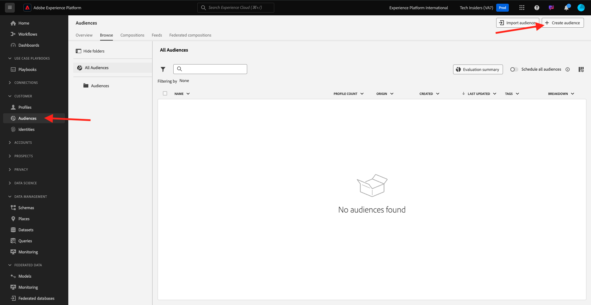
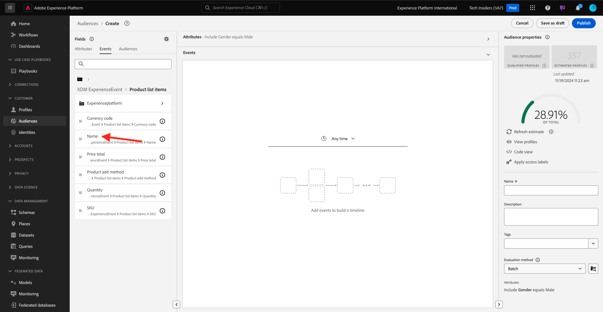

# 2.1.4 オーディエンスの作成 – UI

この演習では、Adobe Experience Platform Audience Builder を使用してオーディエンスを作成します。

[Adobe Experience Platform](https://experience.adobe.com/platform) に移動します。 ログインすると、Adobe Experience Platformのホームページが表示されます。


続行する前に、**サンドボックス** を選択する必要があります。 選択するサンドボックスの名前は ``--aepSandboxName--`` です。 適切な [!UICONTROL &#x200B; サンドボックス &#x200B;] を選択すると、画面が変更され、専用の [!UICONTROL &#x200B; サンドボックス &#x200B;] が表示されます。


左側のメニューの **オーディエンス** に移動します。 このページでは、既存のすべてのオーディエンスの概要を確認できます。 「**+ オーディエンスを作成**」ボタンをクリックして、新しいオーディエンスの作成を開始します。



「**ルールを作成**」を選択し、「**作成**」をクリックします。


新しいオーディエンスビルダーに移動すると、すぐに「**属性**」メニューオプションと「**XDM 個人プロファイル**」参照が表示されます。


XDM はエクスペリエンスビジネスを強化する言語なので、XDM はオーディエンスビルダーの基盤にもなります。 Platform で取り込まれるすべてのデータは XDM にマッピングする必要があり、そのため、すべてのデータは、そのデータの出所に関係なく、同じデータモデルの一部になります。 これにより、オーディエンスを構築する際に大きなメリットが得られます。この 1 つの Audience Builder UI からは、同じワークフローで任意のオリジンのデータを組み合わせることができます。 Audience builder 内で作成されたオーディエンスは、Adobe Target、Adobe Campaign、Adobe Audience Managerなどのソリューションに送信してアクティブ化できます。

すべての **男性** 顧客を含んだオーディエンスを作成しましょう。

gender 属性に到達するには、XDM を理解し、理解する必要があります。

性別は人物の属性です。この属性は「属性」の下に表示されます。 まず、「**XDM 個人プロファイル**」をクリックします。 その後、これが表示されます。 **XDM 個人プロファイル** ウィンドウで、「**人物**」を選択します。


その後、これが表示されます。 **Person** には、**Gender** 属性があります。 性別の属性をオーディエンスビルダーにドラッグします。


これで、事前入力されたオプションから特定の性別を選択できます。 この場合は、**Male** を選択します。


**男性** を選択した後、「推定を更新 **ボタンを押して、オーディエンスの母集団の推定を取得でき** す。 これは、結果のオーディエンスサイズに対する特定の属性の影響を確認できるように、ビジネスユーザーにとって非常に役立ちます。


次のような概算が表示されます。


次に、オーディエンスを少し絞り込む必要があります。 商品 **iPhone 15 Pro** を閲覧したすべての男性ユーザーのオーディエンスを構築する必要があります。

このオーディエンスを構築するには、エクスペリエンスイベントを追加する必要があります。 すべてのエクスペリエンスイベントを表示するには、**フィールド** メニューバーの **イベント** アイコンをクリックします。 次に、最上位の **XDM ExperienceEvents** ノードを確認します。 **XDM ExperienceEvent** をクリックします。


**製品リスト項目** に移動します。


**名前** を選択し、左側のメニューから **名前** オブジェクトをオーディエンスビルダーキャンバスの「**イベント**」セクションにドラッグ&amp;ドロップします。



次の画面が表示されます。


比較パラメーターは **次に等しい** とし、入力フィールドに「**iPhone 15 Pro**」と入力します。


オーディエンスビルダーに要素を追加するたびに、「**推定を更新**」ボタンをクリックして、オーディエンスの母集団の新しい推定を取得できます。

これまでのところ、UI を使用してオーディエンスを作成しただけでなく、オーディエンスを作成するためのコードオプションもあります。

オーディエンスを作成する場合、実際にはProfile Query Language（PQL）のクエリを作成しています。 PQL コードを視覚化するには、オーディエンスビルダーの右上隅にある **コードビュー** スイッチャーをクリックします。


これで、完全なPQL文を確認できます。

```sql
person.gender in ["male"] and CHAIN(xEvent, timestamp, [C0: WHAT(productListItems.exists(name.equals("iPhone 15 Pro", false)))])
```

また、「**プロファイルの表示** をクリックして、このオーディエンスに含まれる顧客プロファイルのサンプルをプレビューすることもできます。


最後に、オーディエンスに名前を付けます。
**評価方法** を **ストリーミング** に設定し、**Publish** をクリックします。

命名規則として、次を使用します。

- `--aepUserLdap-- - Male customers with interest in iPhone 15 Pro`


オーディエンスの概要ページに戻ります。


次の手順：[2.1.5 コールセンターでリアルタイム顧客プロファイルの動作を確認する &#x200B;](./ex5.md)

[モジュール 2.1 に戻る](./real-time-customer-profile.md)

[すべてのモジュールに戻る](../../../overview.md)
