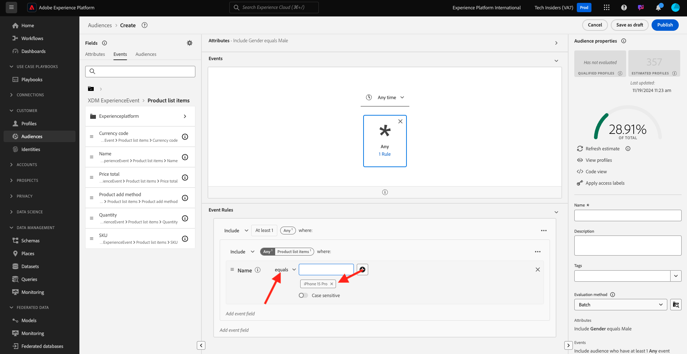

# 2.1.4 セグメントの作成 – UI

この演習では、Adobe Experience Platformのセグメントビルダーを使用してセグメントを作成します。

## ストーリー

[Adobe Experience Platform](https://experience.adobe.com/platform) に移動します。 ログインすると、Adobe Experience Platformのホームページが表示されます。


続行する前に、**サンドボックス** を選択する必要があります。 選択するサンドボックスの名前は ``--aepSandboxName--`` です。 これを行うには、画面上部の青い線のテキスト **[!UICONTROL 実稼動製品]** をクリックします。 適切な [!UICONTROL  サンドボックス ] を選択すると、画面が変更され、専用の [!UICONTROL  サンドボックス ] が表示されます。


左側のメニューの **セグメント** に移動します。 このページでは、既存のすべてのセグメントの概要を確認できます。 「**+ セグメントを作成**」ボタンをクリックして、新しいセグメントの作成を開始します。


新しいセグメントビルダーに移動すると、すぐに **属性** メニューオプションと **XDM 個人プロファイル** 参照が表示されます。


XDM はエクスペリエンスビジネスを強化する言語なので、XDM はセグメントビルダーの基盤にもなります。 Platform で取り込まれるすべてのデータは XDM にマッピングする必要があり、そのため、すべてのデータは、そのデータの出所に関係なく、同じデータモデルの一部になります。 これにより、セグメントを作成する際に大きなメリットが得られます。この 1 つのセグメントビルダー UI では、同じワークフローで任意のオリジンのデータを組み合わせることができます。 セグメントビルダー内で作成されたセグメントは、Adobe Target、Adobe Campaign、Adobe Audience Managerなどのソリューションに送信してアクティブ化できます。

すべての **男性** 顧客を含むセグメントを作成しましょう。

gender 属性に到達するには、XDM を理解し、理解する必要があります。

性別は人物の属性です。この属性は「属性」の下に表示されます。 まず、「**XDM 個人プロファイル**」をクリックします。 その後、これが表示されます。 **XDM 個人プロファイル** ウィンドウで、「**人物**」を選択します。


その後、これが表示されます。 **Person** には、**Gender** 属性があります。 性別の属性をセグメントビルダーにドラッグします。


これで、事前入力されたオプションから特定の性別を選択できます。 この場合は、**Male** を選択します。


**男性** を選択した後、「推定を更新 **ボタンを押すと、セグメントの母集団の推定を取得でき** す。 これは、結果のセグメントサイズに対する特定の属性の影響を確認できるように、ビジネスユーザーにとって非常に役立ちます。


次のような概算が表示されます。


次に、セグメントを少し調整する必要があります。 製品を表示したすべての男性の顧客のセグメントを作成する必要があります **Proteus フィットネスジャックシャツ（オレンジ）**。

このセグメントを作成するには、エクスペリエンスイベントを追加する必要があります。 すべてのエクスペリエンスイベントを表示するには、**フィールド** メニューバーの **イベント** アイコンをクリックします。


次に、最上位の **XDM ExperienceEvents** ノードを確認します。 **XDM ExperienceEvent** をクリックします。


**製品リスト項目** に移動します。


「**名前**」を選択し、左側のメニューから **名前** オブジェクトをセグメントビルダーキャンバスの「**イベント**」セクションにドラッグ&amp;ドロップします。


次の画面が表示されます。


比較パラメーターは **次に等しい** とし、入力フィールドに **MONTANA WIND JACKET** と入力します。



セグメントビルダーに要素を追加するたびに、「**推定を更新**」ボタンをクリックして、セグメント内の母集団の新しい推定を取得できます。

これまで、UI を使用してセグメントを作成したのみですが、セグメントを作成するためのコードオプションもあります。

セグメントを作成する場合、実際にはProfile Query Language（PQL）クエリを作成しています。 PQL コードを視覚化するには、セグメントビルダーの右上隅にある **コードビュー** スイッチャーをクリックします。


これで、完全なPQL文を確認できます。

```sql
person.gender in ["male"] and CHAIN(xEvent, timestamp, [C0: WHAT(productListItems.exists(name.equals("MONTANA WIND JACKET", false)))])
```

また、「**プロファイルを表示**」をクリックして、このセグメントに含まれる顧客プロファイルのサンプルをプレビューすることもできます。


最後に、セグメントに名前を付けて保存します。

命名規則として、次を使用します。

- `--aepUserLdap-- - Male customers with interest in Montana Wind Jacket`


次に、「**保存して閉じる**」ボタンをクリックしてセグメントを保存すると、セグメントの概要ページに戻ります。


次の演習に進み、API を使用してセグメントを作成できるようになりました。

次の手順：[2.1.5 セグメントの作成 – API](./ex5.md)

[モジュール 2.1 に戻る](./real-time-customer-profile.md)

[すべてのモジュールに戻る](../../../overview.md)
