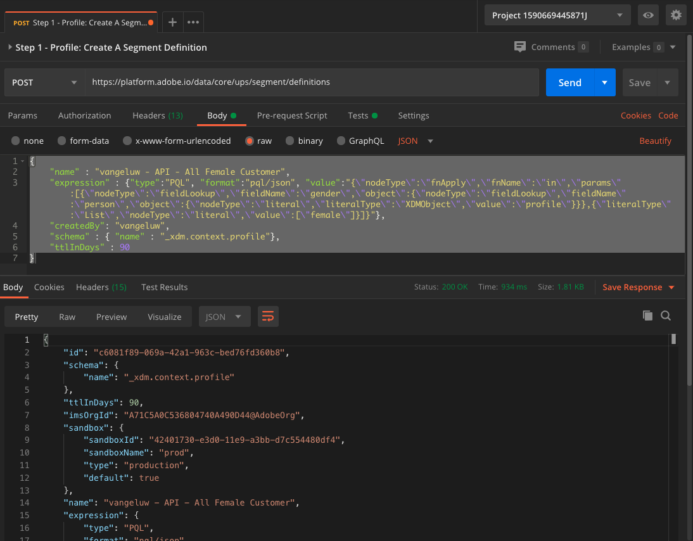

# 2.1.5 セグメントの作成 – API

この演習では、PostmanとAdobe I/Oを使用してセグメントを作成し、Adobe Experience Platformの API を使用してそのセグメントの結果をデータセットとして保存します。

## ストーリー

リアルタイム顧客プロファイルでは、すべてのプロファイルデータがイベントデータや既存のセグメントメンバーシップと共に表示されます。 表示されるデータは、Adobeアプリケーションや外部ソリューションなど、どこからでも取得できます。 これは、レコードのエクスペリエンスシステムであるAdobe Experience Platformで最も強力なビューです。

## 2.1.5.1 - Platform API を使用したセグメントの作成

Postmanに行きなさい。

コレクション **_Adobe Experience Platform Enablement** を見つけます。 このコレクションには、フォルダー **2 が表示されます。 セグメント**. この演習では、これらのリクエストを使用します。


次に、API を使用してセグメントを作成するために必要なすべての手順に従います。 次に、シンプルなセグメント「**ldap** – すべての女性の顧客」を作成します。

### 手順 1 - セグメント定義の作成

**手順 1 - プロファイル：セグメント定義の作成** という名前のリクエストをクリックします。


このリクエストの **本文** セクションに移動します。


このリクエストの **本文** には、次の内容が表示されます。


このリクエストで使用される言語は、Profile Query Languageまたは **PQL** です。

PQLに関する詳細およびドキュメントについては、[ こちら ](https://experienceleague.adobe.com/docs/experience-platform/segmentation/pql/overview.html?lang=ja) を参照してください。


注意：以下のリクエストの変数 **name** を更新してください。そのためには、**ldap** を特定の **ldap** に置き換えます。

```json
{
    "name" : "ldap - API - All Female Customer",
    "expression" : {"type":"PQL", "format":"pql/json", "value":"{\"nodeType\":\"fnApply\",\"fnName\":\"in\",\"params\":[{\"nodeType\":\"fieldLookup\",\"fieldName\":\"gender\",\"object\":{\"nodeType\":\"fieldLookup\",\"fieldName\":\"person\",\"object\":{\"nodeType\":\"literal\",\"literalType\":\"XDMObject\",\"value\":\"profile\"}}},{\"literalType\":\"List\",\"nodeType\":\"literal\",\"value\":[\"female\"]}]}"},
    "createdBy": "ldap",
    "schema" : { "name" : "_xdm.context.profile"},
    "ttlInDays" : 90
}
```

具体的な **ldap** を追加すると、本文は次のようになります。

```json
{
    "name" : "vangeluw - API - All Female Customer",
    "expression" : {"type":"PQL", "format":"pql/json", "value":"{\"nodeType\":\"fnApply\",\"fnName\":\"in\",\"params\":[{\"nodeType\":\"fieldLookup\",\"fieldName\":\"gender\",\"object\":{\"nodeType\":\"fieldLookup\",\"fieldName\":\"person\",\"object\":{\"nodeType\":\"literal\",\"literalType\":\"XDMObject\",\"value\":\"profile\"}}},{\"literalType\":\"List\",\"nodeType\":\"literal\",\"value\":[\"female\"]}]}"},
    "createdBy": "vangeluw",
    "schema" : { "name" : "_xdm.context.profile"},
    "ttlInDays" : 90
}
```

また、リクエストの **Header** - フィールドを検証する必要があります。 **ヘッダー** に移動します。 次の画面が表示されます。


| キー | 値 |
| -------------- | ------------------ |
| x-sandbox-name | `--aepSandboxId--` |

>[!NOTE]
>
>使用しているAdobe Experience Platform サンドボックスの名前を指定する必要があります。 x-sandbox-name は `--aepSandboxId--` にしてください。

青い **送信** ボタンをクリックして、セグメントを作成し、その結果を表示します。



この手順を行うと、Platform UI でセグメント定義を表示できます。 これを確認するには、Adobe Experience Platformにログインし、**セグメント** に移動します。


### 手順 2 - セグメントPOSTジョブの作成

前の演習では、_ストリーミング_ セグメントを作成しました。 ストリーミングセグメントは、リアルタイムで継続的に選定を評価します。 ここでしているのは、_バッチ_ セグメントの作成です。 バッチセグメントでは、セグメントの選定状況のプレビューが表示されますが _セグメントが実際に実行されたわけではありません_。 現在、_このセグメントに該当するユーザーはいません_。 条件を満たすには、バッチセグメントを実行する必要があります。これをここで実行します。

次に、セグメントジョブをPOSTにします。

Postmanに行きなさい。


Postman コレクションで、「**手順 2 -POSTセグメントジョブ** という名前のリクエストをクリックして開きます。


また、リクエストの **Header** - フィールドを検証する必要があります。 **ヘッダー** に移動します。 次の画面が表示されます。


| キー | 値 |
| -------------- | ------------------ |
| x-sandbox-name | `--aepSandboxId--` |

>[!NOTE]
>
>使用しているAdobe Experience Platform サンドボックスの名前を指定する必要があります。 x-sandbox-name は `--aepSandboxId--` にしてください。

青い **送信** ボタンをクリックします。

同様の結果が表示されます。


このセグメントジョブは現在実行中です。これには時間がかかる場合があります。 手順 3 では、このジョブのステータスを確認できます。


### 手順 3 - GETセグメントジョブステータス

Postmanに行きなさい。


Postman コレクションで、「**手順 3 - GETセグメントジョブステータス**」という名前のリクエストをクリックします。


また、リクエストの **Header** - フィールドを検証する必要があります。 **ヘッダー** に移動します。 次の画面が表示されます。


| キー | 値 |
| -------------- | ------------------ |
| x-sandbox-name | `--aepSandboxId--` |

>[!NOTE]
>
>使用しているAdobe Experience Platform サンドボックスの名前を指定する必要があります。 x-sandbox-name は `--aepSandboxId--` にしてください。

青い **送信** ボタンをクリックします。

同様の結果が表示されます。


この例では、ジョブの **status** が **QUEUED** に設定されています。

このリクエストを繰り返し、青い **送信** ボタンを数分ごとにクリックします。**ステータス** が **成功** に設定されます。


ステータスが **成功** になると、セグメントジョブが実行され、顧客がセグメントの資格を得られるようになります。

セグメント化の演習を正常に完了しました。 次に、企業全体でリアルタイム顧客プロファイルをアクティブ化する方法を見てみましょう。

次の手順：[2.1.6 コールセンターでのリアルタイム顧客プロファイルの動作を確認する ](./ex6.md)

[モジュール 2.1 に戻る](./real-time-customer-profile.md)

[すべてのモジュールに戻る](../../../overview.md)
