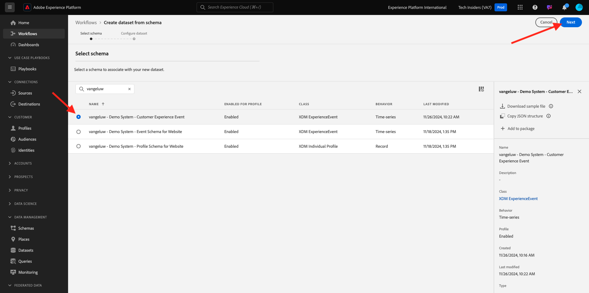
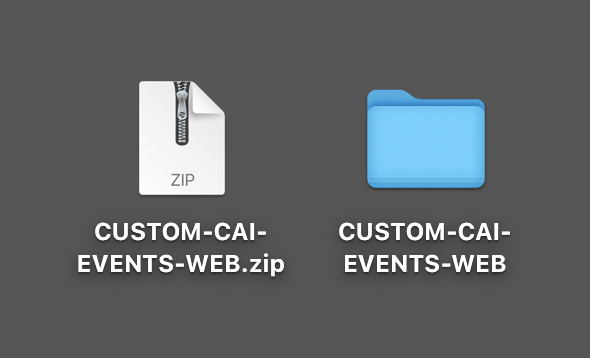
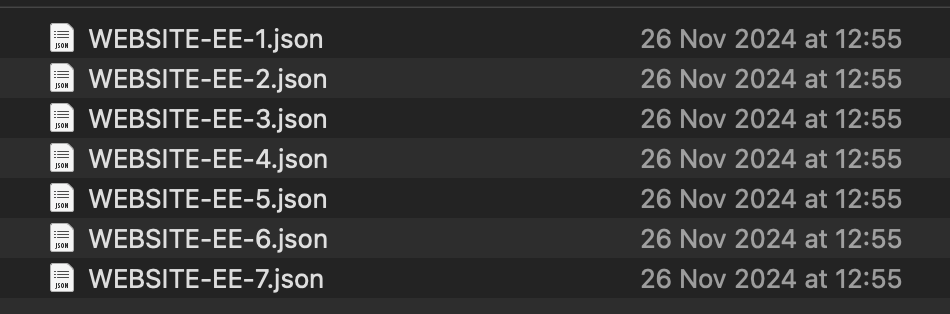
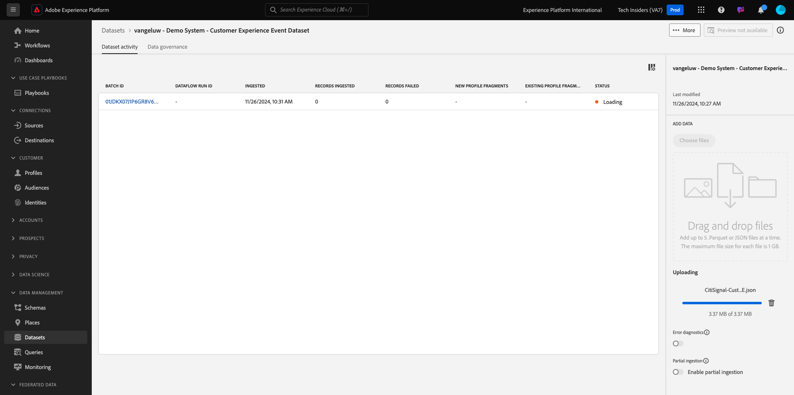

# 2.2.1 顧客 AI - データ準備（取り込み）

インテリジェントサービスでマーケティングイベントデータからインサイトを発見するには、データを意味的にエンリッチメントし、標準構造で維持する必要があります。 インテリジェントサービスでは、Adobeの Experience Data Model （XDM）スキーマを活用してこれを実現します。
特に、インテリジェントサービスで使用されるすべてのデータセットは、**コンシューマーエクスペリエンスイベント** XDM スキーマに準拠する必要があります。

## スキーマを作成

この演習では、**顧客 AI** インテリジェントサービスに必要な **コンシューマーエクスペリエンスイベント Mixin** を含むスキーマを作成します。

URL:[https://experience.adobe.com/platform](https://experience.adobe.com/platform) に移動して、Adobe Experience Platformにログインします。

ログインすると、Adobe Experience Platformのホームページが表示されます。

続行する前に、**サンドボックス** を選択する必要があります。 選択するサンドボックスの名前は ``--aepSandboxName--`` です。 適切なサンドボックスを選択すると、画面が変更され、専用のサンドボックスが表示されます。

左側のメニューから **スキーマ** をクリックし、**参照** に移動します。 **スキーマを作成** をクリックします。

ポップアップで「**手動**」を選択し、「**選択** をクリックします。

次に、「**エクスペリエンスイベント**」を選択し、「**次へ**」をクリックします。

ここでスキーマの名前を指定する必要があります。 スキーマの名前として、`--aepUserLdap-- - Demo System - Customer Experience Event` を使用し、「終了 **をクリックし** す。

その後、これが表示されます。 フィールドグループの下の「**+追加**」をクリックします。

次の **フィールドグループ** を検索して選択し、このスキーマに追加します。

- コンシューマーエクスペリエンスイベント

- identityMap

「**フィールドグループを追加**」をクリックします。

その後、これが表示されます。 次に、スキーマの名前を選択します。 これで、「プロファイル **切り替えをクリックして、** プロファイル **のスキーマを有効に** ます。

その後、これが表示されます。 **このスキーマのデータには、identityMap フィールドにプライマリ ID が含まれます。**。**有効にする** をクリックします。

これで、このが得られます。 「**保存**」をクリックしてスキーマを保存します。

## データセットを作成

左側のメニューで **データセット** をクリックし、**参照** に移動します。 **データセットを作成** をクリックします。

「**スキーマからデータセットを作成**」をクリックします。

次の画面では、前の演習で作成したデータセット（「**[!UICONTROL ldap - Demo System - Customer Experience Event]**」という名前）を選択します。 「**次へ**」をクリックします。

データセットの名前として、`--aepUserLdap-- - Demo System - Customer Experience Event Dataset` を使用します。 「**完了**」をクリックします。

これで、データセットが作成されました。 **プロファイル** 切り替えを有効にします。

**有効にする** をクリックします。

これで、次のようになります。

これで、消費者エクスペリエンスイベントデータの取り込みを開始し、顧客 AI サービスの使用を開始する準備が整いました。

## エクスペリエンスイベントテストデータのダウンロード

**スキーマ** と **データセット** を設定したら、エクスペリエンスイベントデータを取り込む準備が整います。 顧客 AI には特定のデータ要件があるので、外部で準備されたデータを取り込む必要があります。

この演習のエクスペリエンスイベント用に準備するデータは、[ 消費者エクスペリエンスイベント XDM フィールドグループ ](https://github.com/adobe/xdm/blob/797cf4930d5a80799a095256302675b1362c9a15/docs/reference/context/experienceevent-consumer.schema.md) の要件とスキーマに準拠している必要があります。

デモデータが入った zip ファイルを [https://tech-insiders.s3.us-west-2.amazonaws.com/CUSTOM-CAI-EVENTS-WEB.zip](https://tech-insiders.s3.us-west-2.amazonaws.com/CUSTOM-CAI-EVENTS-WEB.zip) からダウンロードしてください。

これで、**CUSTOM-CAI-EVENTS-WEB.zip** という名前のファイルをダウンロードしました。 ファイルをコンピューターのデスクトップに配置し、展開すると、**CUSTOM-CAI-EVENTS-WEB** という名前のフォルダーが表示されます。

このフォルダーには、複数のシーケンス付き JSON ファイルがあり、次の演習でこれらをすべて取り込む必要があります。

## エクスペリエンスイベントテストデータの取り込み

Adobe Experience Platformで、**データセット** に移動し、データセットを開きます。名前は **[!UICONTROL ldap - Demo System - Customer Experience Event Dataset]** です。

データセットで、「**ファイルを選択**」をクリックしてデータを追加します。

ポップアップで、「**WEBSITE-EE-5.json**」までのファイル **WEBSITE-EE-1.json** を選択し、「**開く**」をクリックします。

ファイル **WEBSITE-EE-6.json** と **WEBSITE-EE-7.json** に対して、この取り込みプロセスを繰り返します。

その後、データが読み込まれ、新しいバッチが **読み込み中** 状態で作成されます。 ファイルがアップロードされるまで、このページから移動しないでください。

ファイルがアップロードされると、バッチステータスが **読み込み中** から **処理中** に変更されます。

データの取り込みと処理には、10～20 分かかる場合があります。

データの取り込みに成功すると、様々なアップロードのバッチステータスが **成功** に変わります。

次の手順：[2.2.2 顧客 AI – 新しいインスタンスの作成（設定） ](./ex2.md)

[モジュール 2.2 に戻る](./intelligent-services.md)

[すべてのモジュールに戻る](./../../../overview.md)
