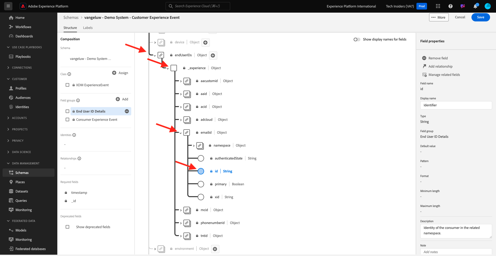
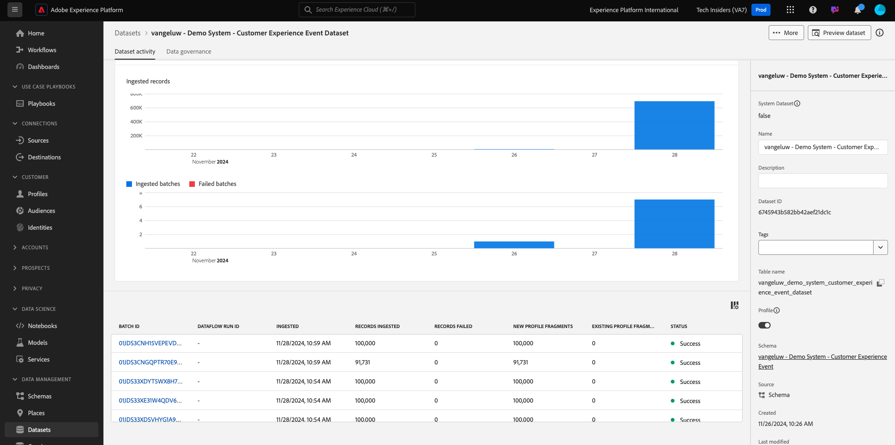

# 2.2.1 顧客 AI - データ準備（取り込み）

インテリジェントサービスでマーケティングイベントデータからインサイトを発見するには、データを意味的にエンリッチメントし、標準構造で維持する必要があります。 インテリジェントサービスでは、Adobeの Experience Data Model （XDM）スキーマを活用してこれを実現します。
特に、インテリジェントサービスで使用されるすべてのデータセットは、**コンシューマーエクスペリエンスイベント** XDM スキーマに準拠する必要があります。

## スキーマを作成

この演習では、**顧客 AI** インテリジェントサービスに必要な **コンシューマーエクスペリエンスイベント Mixin** を含むスキーマを作成します。

URL:[https://experience.adobe.com/platform](https://experience.adobe.com/platform) に移動して、Adobe Experience Platformにログインします。

ログインすると、Adobe Experience Platformのホームページが表示されます。

続行する前に、**サンドボックス** を選択する必要があります。 選択するサンドボックスの名前は ``--aepSandboxName--`` です。 適切なサンドボックスを選択すると、画面が変更され、専用のサンドボックスが表示されます。

左側のメニューから **スキーマ** をクリックし、**参照** に移動します。 **スキーマを作成** をクリックします。

ポップアップで「**手動**」を選択し、「**選択** をクリックします。

次に、「**エクスペリエンスイベント**」を選択し、「**次へ**」をクリックします。

ここでスキーマの名前を指定する必要があります。 スキーマの名前として、`--aepUserLdap-- - Demo System - Customer Experience Event` を使用し、「終了 **をクリックし** す。

その後、これが表示されます。 フィールドグループの下の「**+追加**」をクリックします。

次の **フィールドグループ** を検索して選択し、このスキーマに追加します。

- コンシューマーエクスペリエンスイベント
- エンドユーザー ID の詳細

「**フィールドグループを追加**」をクリックします。

その後、これが表示されます。 フィールドグループ **エンドユーザー ID 詳細** をクリックします。

フィールド **endUserIDs に移動します。_experience.emailid.id**.

**endUserIDs フィールドの右側のメニューで以下を行います。_experience.emailid.id**、下にスクロールして **ID** のチェックボックスをオンにし、**プライマリ ID** のチェックボックスをオンにして、「**メール** の **ID 名前空間** をオンにします。 「**適用**」をクリックします。

フィールド **endUserIDs に移動します。_experience.mcid.id**. 「**ID**」のチェックボックスをオンにして、「**ECID**」の「**ID 名前空間**」を選択します。 「**適用**」をクリックします。

これで完了です。 次に、スキーマの名前を選択します。 これで、「プロファイル **切り替えをクリックして、** プロファイル **のスキーマを有効に** ます。

その後、これが表示されます。 **有効にする** をクリックします。

これで、このが得られます。 「**保存**」をクリックしてスキーマを保存します。

## データセットを作成

左側のメニューで **データセット** をクリックし、**参照** に移動します。 **データセットを作成** をクリックします。

「**スキーマからデータセットを作成**」をクリックします。

次の画面では、前の演習で作成したデータセット（「**[!UICONTROL ldap - Demo System - Customer Experience Event]**」という名前）を選択します。 「**次へ**」をクリックします。

データセットの名前として、`--aepUserLdap-- - Demo System - Customer Experience Event Dataset` を使用します。 「**完了**」をクリックします。

これで、データセットが作成されました。 **プロファイル** 切り替えを有効にします。

**有効にする** をクリックします。

これで、次のようになります。

これで、消費者エクスペリエンスイベントデータの取り込みを開始し、顧客 AI サービスの使用を開始する準備が整いました。

## エクスペリエンスイベントテストデータのダウンロード

**スキーマ** と **データセット** を設定したら、エクスペリエンスイベントデータを取り込む準備が整います。 顧客 AI には少なくとも **** 2 四半期にわたるデータが必要なので、外部で準備されたデータを取り込む必要があります。

エクスペリエンスイベント用に作成するデータは、[ コンシューマーエクスペリエンスイベント XDM Mixin](https://github.com/adobe/xdm/blob/797cf4930d5a80799a095256302675b1362c9a15/docs/reference/context/experienceevent-consumer.schema.md) の要件とスキーマに準拠している必要があります。

サンプルデータを含んだファイルを次の場所からダウンロードしてください：[https://dashboard.adobedemo.com/data](https://dashboard.adobedemo.com/data)。 「**ダウンロード**」ボタンをクリックします。

または、上記のリンクにアクセスできない場合は、次の場所からもファイルをダウンロードできます：[https://aepmodule10.s3-us-west-2.amazonaws.com/retail-v1-dec2020-xl.json.zip](https://aepmodule10.s3-us-west-2.amazonaws.com/retail-v1-dec2020-xl.json.zip)。

これで、**retail-v1-dec2020-xl.json.zip** という名前のファイルをダウンロードしました。 ファイルをコンピューターのデスクトップに配置し、展開すると、**retail-v1.json** という名前のファイルが表示されます。 このファイルは、次の演習で必要になります。

## エクスペリエンスイベントテストデータの取り込み

Adobe Experience Platformで、**データセット** に移動し、データセットを開きます。名前は **[!UICONTROL ldap - Demo System - Customer Experience Event Dataset]** です。

データセットで、「**ファイルを選択**」をクリックしてデータを追加します。

ポップアップでファイル **retail-v1.json** を選択し、「**開く**」をクリックします。

その後、データが読み込まれ、新しいバッチが **読み込み中** 状態で作成されます。 ファイルがアップロードされるまで、このページから移動しないでください。

ファイルがアップロードされると、バッチステータスが **読み込み中** から **処理中** に変更されます。

データの取り込みと処理には、10～20 分かかる場合があります。

データの取り込みに成功すると、バッチステータスが **成功** に変わります。

次の手順：[2.2.2 顧客 AI – 新しいインスタンスの作成（設定） ](./ex2.md)

[モジュール 2.2 に戻る](./intelligent-services.md)

[すべてのモジュールに戻る](./../../../overview.md)
