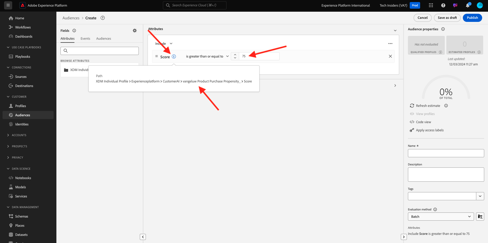

# 2.2.3 顧客 AI - スコアリングダッシュボードおよびセグメント化（予測と実行アクション）

顧客 AI インスタンスがモデルの実行を完了すると、今後 30 日間に購入を行う顧客を予測するために評価される傾向スコアを視覚化できます。

>[!NOTE]
>
>ステータスが **成功** の顧客 AI インスタンスのみが、サービスのインサイトをプレビューできます。

## 2.2.3.1 傾向予測

次に、顧客 AI インスタンスモデルによって生成される予測された傾向を確認しましょう。 インスタンス名をクリックしてダッシュボードを表示します。

顧客 AI ダッシュボードには、スコア、母集団の分布および評価するモデルに影響を与えた要因に関する概要が表示されます。

影響を及ぼす要因にポインタを合わせると、データ配分のさらなる分類が表示されます。

## 2.2.3.2 ビジネス上の行動

### 2.2.3.2.1 顧客のセグメント化

顧客 AI ダッシュボードでは、1 回のクリックでセグメントを定義できます。 傾向カードの **セグメントを作成** ボタンをクリックします。

セグメント定義が自動的に作成されていることがわかります。

次の命名規則に従って、セグメントに名前を付けます：`--aepUserLdap-- - Customer AI High Propensity`。 「**保存**」をクリックします。

これで、例えば Real-time CDP、Journey Orchestration、Adobe Targetを使用したターゲティングに、このセグメントを使用できます。

### 2.2.3.2.2 プロファイルの概要

顧客 AI の傾向スコアはリアルタイム顧客プロファイルの一部になるので、個々の顧客のスコアを表示できます。

Adobe Experience Platformで、左側のメニューの **プロファイル** に移動し、「**参照** を選択します。

取り込んだ JSON ファイルで使用可能な識別子（例：**EMAIL hbirkenshawa@businessweek.com**）を使用してプロファイルを検索します。 **プロファイル ID** をクリックしてプロファイルを開きます。

次の画面が表示されます。

顧客 AI モデルからの出力を含む **属性** に移動します。

下にスクロールして、顧客 AI モデルによって計算された傾向スコアを確認します。

次の手順：[ 概要とメリット ](./summary.md)

[モジュール 2.2 に戻る](./intelligent-services.md)

[すべてのモジュールに戻る](./../../../overview.md)
