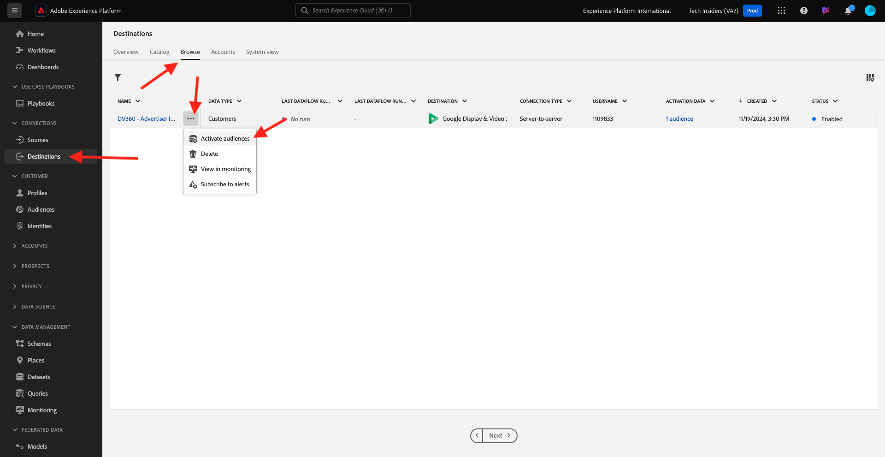
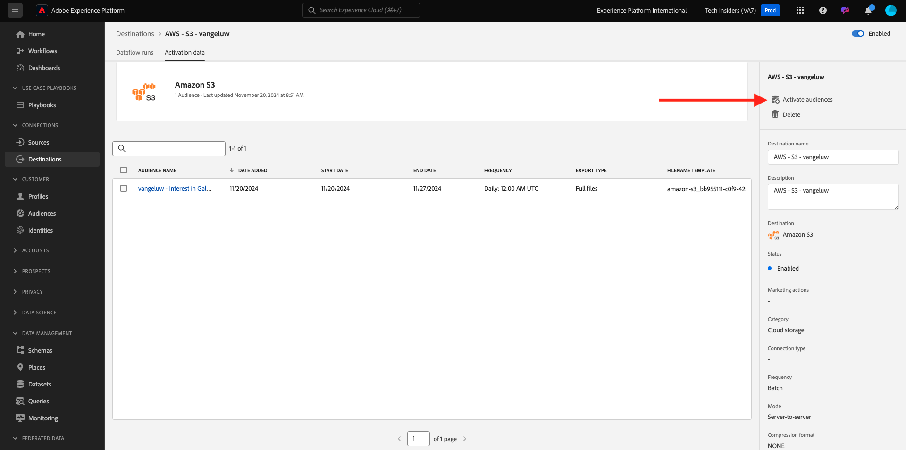

# 2.3.4 アクションの実行：セグメントを S3 の宛先に送信します

また、Adobe Experience Platformは、Salesforce Marketing Cloud、Oracle Eloqua、Oracle Responsys、Adobe Campaignなどのメールマーケティングの宛先に対してオーディエンスを共有できます。

これらの各メールマーケティングの宛先専用の宛先の一部として FTP または SFTP を使用できます。または、AWS S3 を使用して、Adobe Experience Platformとメールマーケティングの宛先の間で顧客のリストをやり取りできます。

このモジュールでは、AWS S3 バケットを使用して、このような宛先を設定します。

## 2.3.4.1 S3 バケットの作成

[https://console.aws.amazon.com](https://console.aws.amazon.com) に移動し、以前に作成したAmazon アカウントでログインします。

ログインすると、**AWS Management Console** にリダイレクトされます。

**サービスを検索** メニューで、**s3** を検索します。 最初の検索結果「**S3 - Scalable Storage in the Cloud**」をクリックします。

**Amazon S3** ホームページが表示されます。 **バケットを作成** をクリックします。

**バケットを作成** 画面では、次の 2 つを設定する必要があります。

- 名前：名前 `aepmodulertcdp--aepUserLdap--` を使用します。 例えば、この演習では、バケット名は **aepmodulertcdpvangeluw** です。
- 地域：地域 **EU （フランクフルト） eu-central-1** を使用します

他のすべてのデフォルト設定はそのままにしておきます。 下にスクロールして、**バケットを作成** をクリックします。

その後、バケットが作成され、Amazon S3 のホームページにリダイレクトされます。

## 2.3.4.2 S3 バケットにアクセスする権限の設定

次の手順では、S3 バケットへのアクセスを設定します。

その場合は、[https://console.aws.amazon.com/iam/home](https://console.aws.amazon.com/iam/home) にアクセスしてください。

AWS リソースへのアクセスは、Amazon Identity and Access Management （IAM）によって制御されます。

このページが表示されます。

左側のメニューで、「**ユーザー**」をクリックします。 その後、**ユーザー** 画面が表示されます。 「**ユーザーを追加**」をクリックします。

次に、ユーザーを設定します。

- ユーザー名：`s3_--aepUserLdap--_rtcdp` を名前として使用します。この例では、名前は `s3_vangeluw_rtcdp` です。
- AWSのアクセスタイプ：「**アクセスキー – プログラムによるアクセス**」を選択します。

**次へ：権限** をクリックします。

その後、この権限画面が表示されます。 「**既存のポリシーを直接添付**」をクリックします。

検索語句 **s3** を入力すると、関連するすべての S3 ポリシーが表示されます。 ポリシー **AmazonS3FullAccess** を選択します。 **次へ：タグ** をクリックします。

**タグ** 画面では、何も設定する必要はありません。 「**次へ：レビュー**」をクリックします。

設定を確認します。 **ユーザーを作成** をクリックします。

これでユーザーが作成され、S3 環境にアクセスするための資格情報が表示されます。 資格情報は今回のみ表示されますので、書き留めてください。

「**表示**」をクリックして、秘密アクセスキーを表示します。

>[!IMPORTANT]
>
>コンピューターのテキストファイルに資格情報を保存します。
>
> - アクセスキー ID : ...
> - 秘密アクセスキー：...
>
> **閉じる** をクリックすると、資格情報が再び表示されることはありません。

「**閉じる**」をクリックします。

これで、AWS S3 バケットが正常に作成され、このバケットにアクセスする権限を持つユーザーが作成されました。

## 2.3.4.3 Adobe Experience Platformでの出力先の設定

[Adobe Experience Platform](https://experience.adobe.com/platform) に移動します。 ログインすると、Adobe Experience Platformのホームページが表示されます。

続行する前に、**サンドボックス** を選択する必要があります。 選択するサンドボックスの名前は ``--aepSandboxName--`` です。 これを行うには、画面上部の青い線のテキスト **[!UICONTROL 実稼動製品]** をクリックします。 適切な [!UICONTROL  サンドボックス ] を選択すると、画面が変更され、専用の [!UICONTROL  サンドボックス ] が表示されます。

左側のメニューで **宛先** に移動し、**カタログ** に移動します。 **宛先カタログ** が表示されます。

**クラウドストレージ** をクリックし、**Amazon S3** カードの **設定** ボタン（または、お使いの環境に応じて **セグメントのアクティブ化** をクリックします。

環境によっては、「**+新しい宛先を設定」をクリックして** 宛先の作成を開始する必要があります。

アカウントタイプとして **新規アカウント** を選択します。 前の手順で付与された S3 資格情報を使用してください。

| アクセスキー ID | シークレットアクセスキー |
|:-----------------------:| :-----------------------:|
| アキア… | Cm5Ln..... |

**宛先に接続** をクリックします。

その後、この宛先が接続されたことを示す視覚的な確認が表示されます。

Adobe Experience Platformが S3 バケットに接続できるように、名前とフォルダーを指定する必要があります。

命名規則として、次を使用してください。

| アクセスキー ID | シークレットアクセスキー |
|:-----------------------:| :-----------------------:|
| 名前 | `AWS - S3 - --aepUserLdap--` |
| 説明 | `AWS - S3 - --aepUserLdap--` |
| バケット名 | `aepmodulertcdp--aepUserLdap--` |
| フォルダーパス | / |

「**次へ**」をクリックします。

オプションで、新しい宛先にデータガバナンスポリシーを添付できるようになりました。 「**次へ**」をクリックします。

セグメントのリストで、演習 1 で作成したセグメントを検索して選択します。 「**次へ**」をクリックします。

その後、これが表示されます。 必要に応じて、**鉛筆** アイコンをクリックしてスケジュールを編集できます。 **スケジュールを作成**.

選択したスケジュールを定義します。 「**増分ファイルのエクスポート**」を選択し、頻度を **1 時間ごと****3 時間ごと** に設定します。 「**作成**」をクリックします。

これで完了です。 「**次へ**」をクリックします。

AWS S3 に書き出す属性を選択できるようになりました。 「**新しいフィールドを追加**」をクリックし、フィールド `--aepTenantId--.identification.core.ecid` が追加され、**重複排除キー** としてマークされていることを確認します。

オプションで、他のフィールドを必要な数だけ追加できます。

すべてのフィールドを追加したら、「**次へ**」をクリックします。

設定を確認します。 「**終了**」をクリックして、設定を終了します。

その後、宛先のアクティベーション画面に戻り、この宛先に追加されたセグメントが表示されます。

セグメントの書き出しをさらに追加する場合は、「**セグメントをアクティブ化**」をクリックしてプロセスを再開し、さらにセグメントを追加します。

次の手順：[2.3.5 対策を講じる：セグメントをAdobe Targetに送信し ](./ex5.md) す。

[モジュール 2.3 に戻る](./real-time-cdp-build-a-segment-take-action.md)

[すべてのモジュールに戻る](../../../overview.md)
