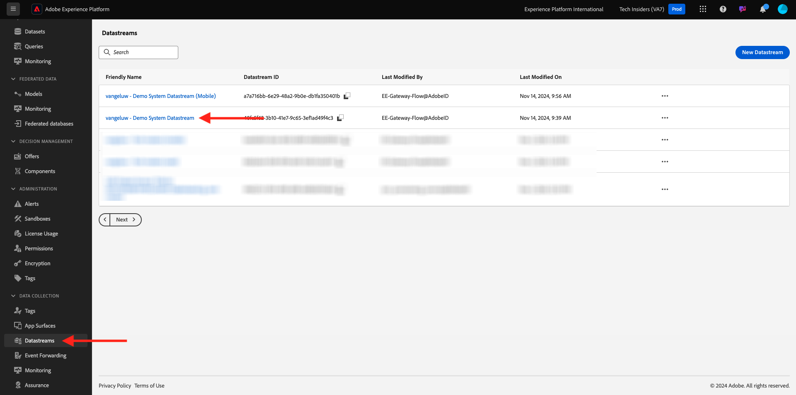
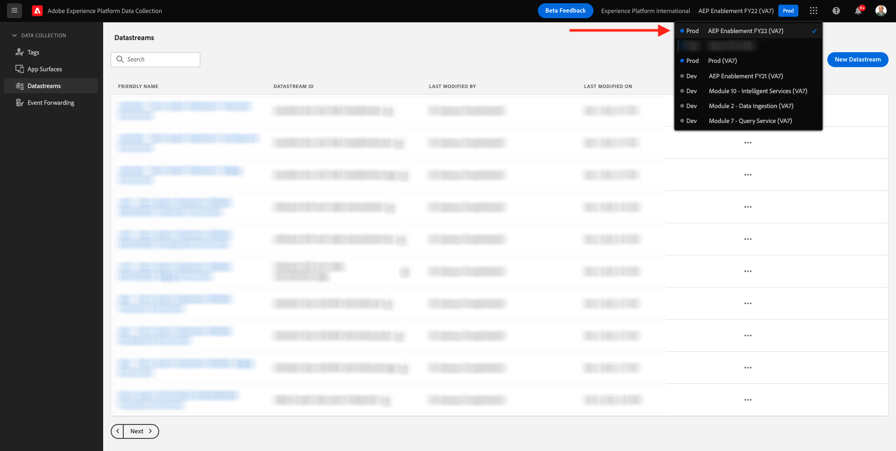
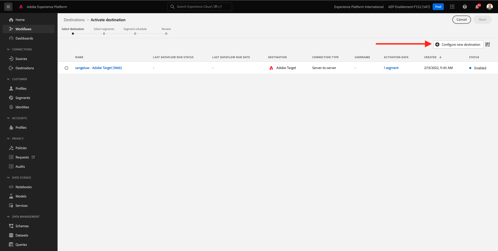
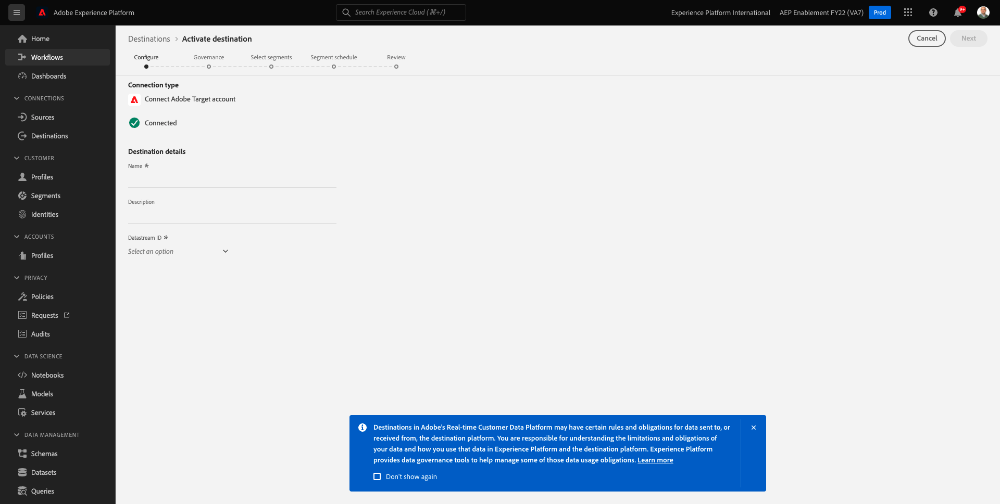
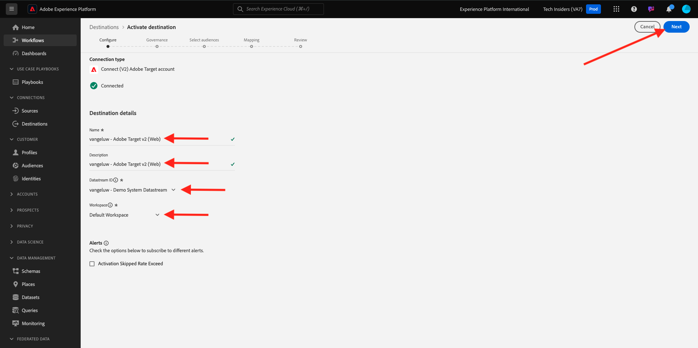
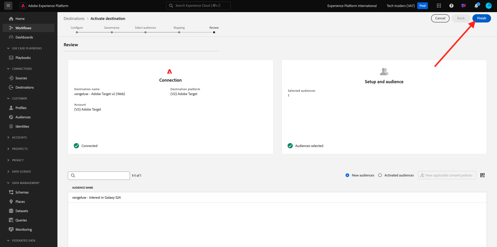
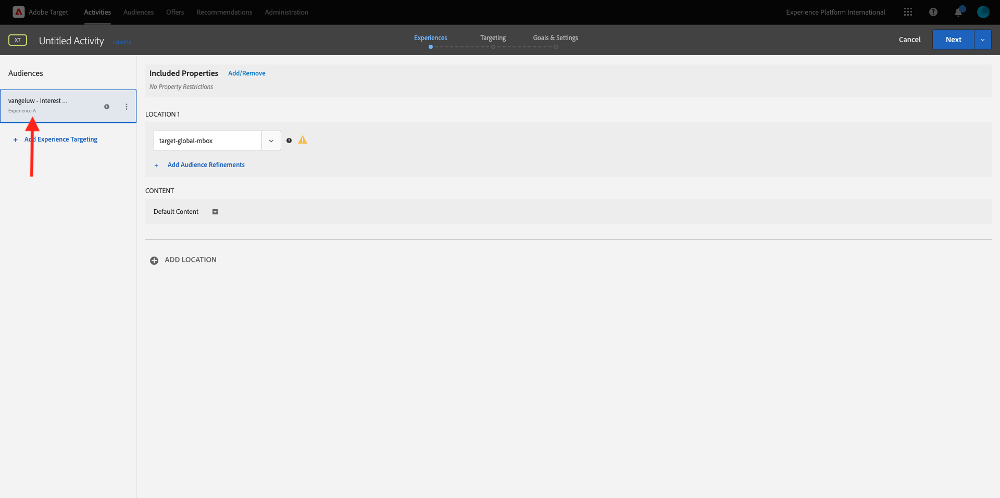
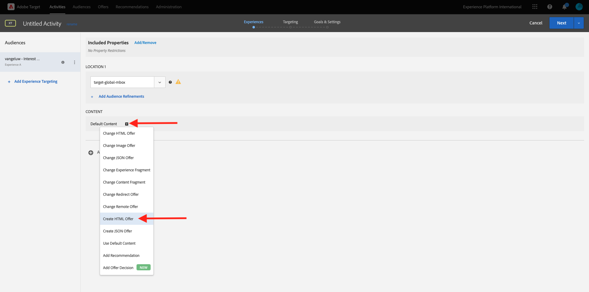

# 2.3.5 アクションの実行：セグメントをAdobe Targetに送信します

[Adobe Experience Platform](https://experience.adobe.com/platform) に移動します。 ログインすると、Adobe Experience Platformのホームページが表示されます。


続行する前に、**サンドボックス** を選択する必要があります。 選択するサンドボックスの名前は ``--aepSandboxId--`` です。 これを行うには、画面上部の青い線のテキスト **[!UICONTROL 実稼動製品]** をクリックします。 適切な [!UICONTROL  サンドボックス ] を選択すると、画面が変更され、専用の [!UICONTROL  サンドボックス ] が表示されます。


## 2.3.5.1 データストリームの検証

Real-Time CDPのAdobe Targetの宛先は、AdobeEdge Network へのデータの取り込みに使用されるデータストリームに接続されています。 Adobe Targetの宛先を設定する場合、まず、データストリームが既にAdobe Targetで有効になっているかどうかを確認する必要があります。 データストリームは、[ 演習 0.2 データストリームの作成 ](./../../../modules/gettingstarted/gettingstarted/ex2.md) で設定し、`--demoProfileLdap-- - Demo System Datastream` という名前を付けました。

[https://experience.adobe.com/#/data-collection/](https://experience.adobe.com/#/data-collection/) に移動し、「**データストリーム**」または「**データストリーム （Beta）**」をクリックします。



画面の右上隅にあるサンドボックス名を選択します（`--aepSandboxId--` にする必要があります）。



データストリームで、`--demoProfileLdap-- - Demo System Datastream` という名前のデータストリームを検索します。 データストリームをクリックして開きます。


表示されたら、「**Adobe Experience Platform」の横にある「**...**」をクリックし** 「**編集**」をクリックします。


**Personalization セグメント化** と **2}Edgeの両方の宛先** チェックボックスをオンにします。 「**保存**」をクリックします。


次に、「**+ サービスを追加**」をクリックします。


サービス **Adobe Target** を選択します。 「**保存**」をクリックします。


これで、データストリームがAdobe Target用に設定されました。


## 2.3.5.2 Adobe Targetの宛先の設定

Adobe Targetは、Real-Time CDPから入手できます。 Adobe Target統合を設定するには、**Destinations**/**Catalog** に移動します。


**カテゴリ** メニューの **Personalization** をクリックします。 **Adobe Target** の宛先カードが表示されます。 **セグメントのアクティブ化** （または環境に応じて **設定**）をクリックします。


環境によっては、「**+新しい宛先を設定」をクリックして** 宛先の作成を開始する必要があります。



その後、これが表示されます。



**新しい宛先の設定** 画面では、次の 2 つを設定する必要があります。

- 名前：`--demoProfileLdap-- - Adobe Target (Web)` という名前を使用します。これは、**vangeluw - Adobe Target（Web）** のようになります。
- データストリーム ID:[ 演習 0.2 データストリームの作成 ](./../../../modules/gettingstarted/gettingstarted/ex2.md) で設定したデータストリームを選択する必要があります。 データストリームの名前は、`--demoProfileLdap-- - Demo System Datastream` にする必要があります。

「**次へ**」をクリックします。



次の画面で、オプションでガバナンスポリシーを選択できます。 この場合、選択する必要はないので、「**作成**」をクリックします。


これで宛先が作成され、リストに表示されます。 宛先を選択し、「**次へ**」をクリックして、宛先へのセグメントの送信を開始します。


使用可能なセグメントのリストで、「[ 演習 6.1 セグメントの作成 ](./ex1.md)」で作成したセグメント（「`--demoProfileLdap-- - Interest in PROTEUS FITNESS JACKSHIRT`」という名前）を選択します。 次に、「**次へ**」をクリックします。


次のページで、「**次へ**」をクリックします。


「**完了**」をクリックします。



これで、Adobe Targetに対してセグメントがアクティブ化されました。


>[!IMPORTANT]
>
>Adobe Targetの宛先をReal-Time CDPで作成した後、宛先が有効になるまで最大 1 時間かかる場合があります。 バックエンド設定が原因で、これは 1 回限りの待機時間です。 最初の 1 時間の待ち時間とバックエンド設定が完了すると、Adobe Targetの宛先に送信される新しく追加されたエッジセグメントを、リアルタイムでターゲティングできるようになります。

## 2.3.5.3 Adobe Target フォームベースのアクティビティの設定

Real-Time CDP セグメントがAdobe Targetに送信されるように設定されたので、Adobe Targetでエクスペリエンスのターゲット設定アクティビティを設定できます。 この演習では、フォームベースのアクティビティを設定します。

[https://experiencecloud.adobe.com/](https://experiencecloud.adobe.com/) にアクセスして、Adobe Experience Cloud ホームページに移動します。 **Target** をクリックして開きます。


**Adobe Target** のホームページには、既存のすべてのアクティビティが表示されます。


「**+ アクティビティを作成**」をクリックして、新しいアクティビティを作成します。


**エクスペリエンスのターゲット設定** を選択します。


**フォーム** を選択し、「**プロパティ制限なし**」を選択します。 「**次へ**」をクリックします。


これで、フォームベースのアクティビティコンポーザーが表示されます。


フィールド **LOCATION 1** で **target-global-mbox** を選択します。


デフォルトオーディエンスは、現在 **すべての訪問者** です。 **すべての訪問者** の横にある **3 ドットをクリックし****オーディエンスを変更** をクリックします。


これで、使用可能なオーディエンスのリストが表示され、以前に作成してAdobe Targetに送信したAdobe Experience Platform セグメントが、このリストの一部になりました。 以前にAdobe Experience Platformで作成したセグメントを選択します。 **オーディエンスを割り当て** をクリックします。


Adobe Experience Platform セグメントは、この「エクスペリエンスのターゲット設定」アクティビティに含まれるようになります。



次に、web サイトのホームページでヒーロー画像を変更します。 「**デフォルトコンテンツ**」の横のドロップダウンリストをクリックして開き、「**HTMLオファーを作成**」をクリックします。



次のコードを貼り付けます。 次に、「**次へ**」をクリックします。

```javascript
<script>document.querySelector("#home > div > div > div > div > div.banner_img.d-none.d-lg-block > img").src="https://parsefiles.back4app.com/hgJBdVOS2eff03JCn6qXXOxT5jJFzialLAHJixD9/ff92fdc3885972c0090ad5419e0ef4d4_Luma - Product - Proteus - Hero Banner.png"; document.querySelector(".banner_text > *").remove()</script>
```


選択したオーディエンスに対して、新しい画像付きの新しいエクスペリエンスが表示されます。


左上隅のアクティビティのタイトルをクリックして、名前を変更します。


名前には、次を使用してください。

- `--demoProfileLdap-- - RTCDP - XT (Form)`


「**次へ**」をクリックします。


**目標と設定** - ページで、**目標指標** に移動します。


プライマリ目標を **エンゲージメント** - **オンサイト滞在時間** に設定します。


**保存して閉じる** をクリックします。


**アクティビティの概要** ページが表示されます。 アクティビティをアクティベートする必要があります。


フィールド **非アクティブ** をクリックし、「**アクティブ化**」を選択します。


その後、アクティビティがライブになったことを示す視覚的な確認が表示されます。


アクティビティが実稼働し、デモ Web サイトでテストできます。

>[!IMPORTANT]
>
>Adobe Targetの宛先をReal-Time CDPで作成した後、宛先が有効になるまで最大 1 時間かかる場合があります。 バックエンド設定が原因で、これは 1 回限りの待機時間です。 最初の 1 時間の待ち時間とバックエンド設定が完了すると、Adobe Targetの宛先に送信される新しく追加されたエッジセグメントを、リアルタイムでターゲティングできるようになります。

デモ Web サイトに戻って PROTEUS FITNESS JACKSHIRT の商品ページにアクセスすると、作成したセグメントにすぐに適合し、ホームページにAdobe Target アクティビティがリアルタイムで表示されます。


次の手順：[2.3.6 外部オーディエンス ](./ex6.md)

[モジュール 2.3 に戻る](./real-time-cdp-build-a-segment-take-action.md)

[すべてのモジュールに戻る](../../../overview.md)
