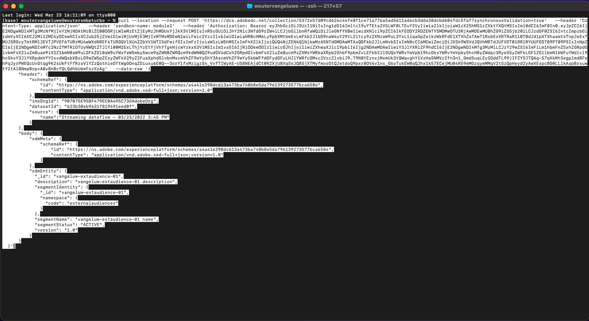
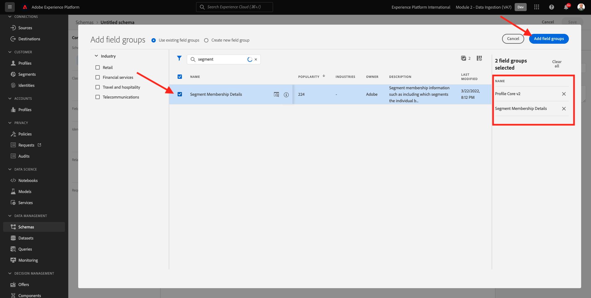
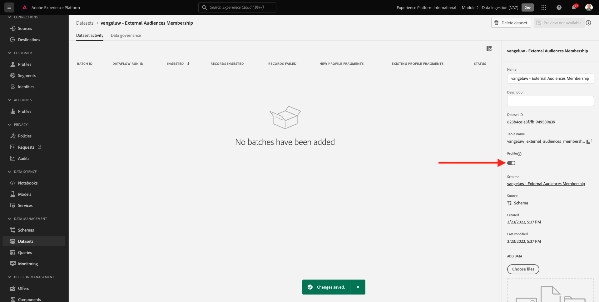
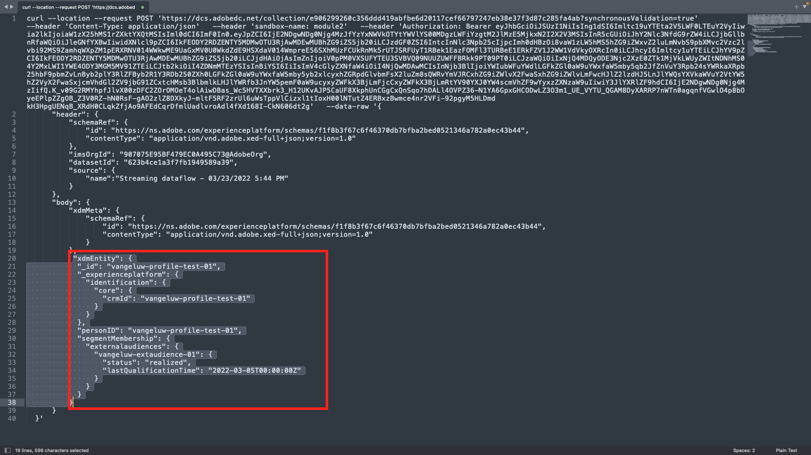
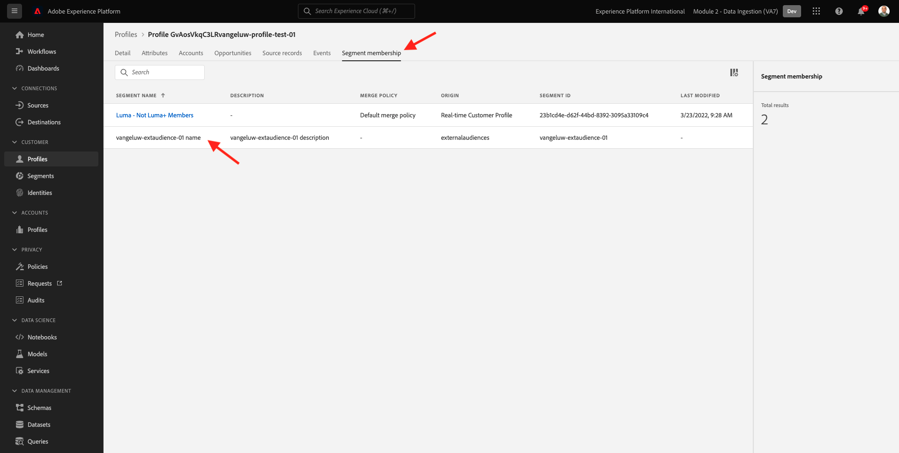

# 2.3.6 外部オーディエンス

多くの場合、会社は、他のアプリケーションの既存のオーディエンスを使用して、Adobe Experience Platformの顧客プロファイルを強化することができます。
これらの外部オーディエンスは、データサイエンスモデルに基づいて、または外部データプラットフォームを使用して定義されている場合があります。

Adobe Experience Platformの外部オーディエンス機能を使用すると、対応するオーディエンス定義をAdobe Experience Platformで詳しく再定義しなくても、外部オーディエンスの取り込みとアクティベーションに集中できます。

プロセス全体は、次の 3 つの主な手順に分かれています。

- 外部オーディエンスメタデータの読み込み：この手順は、オーディエンス名などの外部オーディエンスメタデータをAdobe Experience Platformに取り込みます。
- 外部オーディエンスメンバーシップを顧客プロファイルに割り当てる：この手順は、外部オーディエンスメンバーシップ属性を使用して顧客プロファイルを強化することを目的としています。
- Adobe Experience Platformでオーディエンスを作成：この手順は、外部オーディエンスメンバーシップに基づいて実用的なオーディエンスを作成することを目的としています。

## メタデータ

[Adobe Experience Platform](https://experience.adobe.com/platform) に移動します。 ログインすると、Adobe Experience Platformのホームページが表示されます。


>[!IMPORTANT]
>
>この演習に使用するサンドボックスは ``--aepSandboxName--`` です。

続行する前に、**サンドボックス** を選択する必要があります。 選択するサンドボックスの名前は ``--aepSandboxName--`` です。 適切な [!UICONTROL  サンドボックス ] を選択すると、画面が変更され、専用の [!UICONTROL  サンドボックス ] が表示されます。


オーディエンスデータは、プロファイルがオーディエンスの一部となる条件を定義するのに対して、オーディエンスメタデータは、オーディエンスの名前、説明、ステータスなど、オーディエンスに関する情報です。 外部オーディエンスのメタデータはAdobe Experience Platformに保存されるので、ID 名前空間を使用してAdobe Experience Platformでメタデータを取り込む必要があります。

## 2.3.6.1.1 外部オーディエンスの ID 名前空間

ID 名前空間は、**外部オーディエンス** で使用するために既に作成されています。
作成済みの ID を表示するには、**ID** に移動して **外部** を検索します。 「外部オーディエンス」項目をクリックします。

注意：

- 次の手順では、ID 記号 **externalaudiences** を使用して、外部オーディエンス ID を参照します。
- この名前空間は顧客プロファイルではなくオーディエンスを識別するためのものなので、**人物以外の識別子** タイプがこの ID 名前空間に使用されます。


## 2.3.6.1.2 外部オーディエンスのメタデータスキーマの作成

外部オーディエンスのメタデータは、**オーディエンス定義スキーマ** に基づいています。 詳しくは、[XDM Github リポジトリ ](https://github.com/adobe/xdm/blob/master/docs/reference/classes/segmentdefinition.schema.md) を参照してください。

左のメニューで、「スキーマ」に移動します。 「**+ スキーマを作成**」をクリックし、「**参照**」をクリックします。


クラスを割り当てるには、**オーディエンス定義** を検索します。 **オーディエンス定義** クラスを選択し、「**クラスを割り当て** をクリックします。


その後、これが表示されます。 **キャンセル** をクリックします。


その後、これが表示されます。 フィールド **_id** を選択します。 右側のメニューで、下にスクロールし、「{ID **」チェックボックスと** 2}プライマリ ID **チェックボックスを有効にします。****外部オーディエンス** ID 名前空間を選択します。 「**適用**」をクリックします。


次に、スキーマ名 **名称未設定スキーマ** を選択します。 名前を `--aepUserLdap-- - External Audiences Metadata` に変更します。


**プロファイル** 切り替えを有効にして確認します。 最後に、「**保存** をクリックします。


## 2.3.6.1.3 外部オーディエンスメタデータデータセットの作成

**スキーマ** で、**参照** に移動します。 前の手順で作成した `--aepUserLdap-- - External Audiences Metadata` スキーマを検索してクリックします。 次に、「**スキーマからデータセットを作成**」をクリックします。


「**名前**」フィールドに「`--aepUserLdap-- - External Audience Metadata`」と入力します。 **データセットを作成** をクリックします。


その後、これが表示されます。 **プロファイル** 切り替えスイッチを必ず有効にしてください。


## 2.3.6.1.4 HTTP API Source接続の作成

次に、メタデータをデータセットに取り込むために使用する HTTP API Source コネクタを設定する必要があります。

**ソース** に移動します。 検索フィールドに「**HTTP**」と入力します。 **データを追加** をクリックします。


次の情報を入力します。

- **アカウントタイプ**: **新規アカウント** を選択します
- **アカウント名**:`--aepUserLdap-- - External Audience Metadata` を入力します
- 「**XDM 互換ボックス**」チェックボックスをオンにします。

次に、「**ソースに接続**」をクリックします。


その後、これが表示されます。 「**次へ**」をクリックします。


**既存のデータセット** を選択し、ドロップダウンメニューでデータセット `--aepUserLdap-- - External Audience Metadata` を検索して選択します。

**データフローの詳細** を確認し、「**次へ**」をクリックします。


その後、これが表示されます。

ウィザードの **マッピング** 手順は、XDM 準拠のペイロードを HTTP API Source コネクタに取り込むので、空なので、マッピングは必要ありません。 「**次へ**」をクリックします。


**レビュー** 手順では、オプションで接続とマッピングの詳細をレビューできます。 「**完了**」をクリックします。


その後、これが表示されます。


## 2.3.6.1.5 外部オーディエンスメタデータの取り込み

Source Connector の「概要」タブで、「**...** をクリックし、「**スキーマペイロードをコピー**」をクリックします。


コンピューターでテキストエディターアプリケーションを開き、コピーしたペイロードを貼り付けます。次のようになります。 次に、このペイロードで **xdmEntity** オブジェクトを更新する必要があります。


オブジェクト **xdmEntity** は、以下のコードに置き換える必要があります。 以下のコードをコピーし、テキストエディターで **xdmEntity** オブジェクトを置き換えて、テキストファイルに貼り付けます。

```
"xdmEntity": {
    "_id": "--aepUserLdap---extaudience-01",
    "description": "--aepUserLdap---extaudience-01 description",
    "segmentIdentity": {
      "_id": "--aepUserLdap---extaudience-01",
      "namespace": {
        "code": "externalaudiences"
      }
    },
    "segmentName": "--aepUserLdap---extaudience-01 name",
    "segmentStatus": "ACTIVE",
    "version": "1.0"
  }
```

次の情報が表示されます。


次に、新しい **ターミナル** ウィンドウを開きます。 テキストエディター内のすべてのテキストをコピーして、ターミナルウィンドウに貼り付けます。



次に、**Enter** キーを押します。

その後、ターミナルウィンドウにデータ取り込みの確認が表示されます。


HTTP API Source コネクタ画面を更新すると、データが処理されていることがわかります。


## 2.3.6.1.6 外部オーディエンスのメタデータ取り込みの検証

処理が完了したら、クエリサービスを使用してデータセット内のデータの可用性を確認できます。

右側のメニューで **データセット** に移動し、前に作成した `--aepUserLdap-- - External Audience Metadata` データセットを選択します。


右側のメニューで「クエリ」に移動し、「**クエリを作成**」をクリックします。


次のコードを入力して、**Shift + Enter** キーを押します。

```
select * from --aepUserLdap--_external_audience_metadata
```

クエリ結果には、取り込んだ外部オーディエンスのメタデータが表示されます。


## オーディエンスメンバーシップ

外部オーディエンスメタデータを使用して、特定の顧客プロファイルのオーディエンスメンバーシップを取り込めるようになりました。

次に、オーディエンスメンバーシップスキーマに対して強化されたプロファイルデータセットを準備する必要があります。 詳しくは、[XDM Github リポジトリ ](https://github.com/adobe/xdm/blob/master/docs/reference/datatypes/segmentmembership.schema.md) を参照してください。

### 外部オーディエンスメンバーシップスキーマの作成

右側のメニューで **スキーマ** に移動します。 「**スキーマを作成**」をクリックし、「**XDM 個人プロファイル**」をクリックします。


**フィールドグループを追加** ポップアップで **Profile Core** を検索します。 **Profile Core v2** フィールドグループを選択します。


次に、「**フィールドグループを追加**」ポップアップで **セグメントメンバーシップ** を検索します。 **セグメントメンバーシップの詳細** フィールドグループを選択します。 次に、「**フィールドグループを追加**」をクリックします。



その後、これが表示されます。 フィールド `--aepTenantId--.identification.core` に移動します。 **crmId** フィールドをクリックします。 右側のメニューで、下にスクロールし、「{ID **」チェックボックスと** 2}プライマリ ID **チェックボックスをオンにします。****ID 名前空間** に **デモシステム - CRMID** を選択します。

「**適用**」をクリックします。


次に、スキーマ名 **名称未設定スキーマ** を選択します。 表示名フィールドに「`--aepUserLdap-- - External Audiences Membership`」と入力します。


次に、「**プロファイル**」切替スイッチを有効にして確認します。 「**保存**」をクリックします。


### 外部オーディエンスメンバーシップデータセットの作成

**スキーマ** で、**参照** に移動します。 前の手順で作成した `--aepUserLdap-- - External Audiences Membership` スキーマを検索してクリックします。 次に、「**スキーマからデータセットを作成**」をクリックします。


「**名前**」フィールドに「`--aepUserLdap-- - External Audiences Membership`」と入力します。 **データセットを作成** をクリックします。


その後、これが表示されます。 **プロファイル** 切り替えスイッチを必ず有効にしてください。



### HTTP API Source接続の作成


次に、メタデータをデータセットに取り込むために使用する HTTP API Source コネクタを設定する必要があります。

**ソース** に移動します。 検索フィールドに「**HTTP**」と入力します。 **データを追加** をクリックします。


次の情報を入力します。

- **アカウントタイプ**: **新規アカウント** を選択します
- **アカウント名**:`--aepUserLdap-- - External Audience Membership` を入力します
- 「**XDM 互換ボックス**」チェックボックスをオンにします。

次に、「**ソースに接続**」をクリックします。


その後、これが表示されます。 「**次へ**」をクリックします。


**既存のデータセット** を選択し、ドロップダウンメニューでデータセット `--aepUserLdap-- - External Audiences Membership` を検索して選択します。

**データフローの詳細** を確認し、「**次へ**」をクリックします。


その後、これが表示されます。

ウィザードの **マッピング** 手順は、XDM 準拠のペイロードを HTTP API Source コネクタに取り込むので、空なので、マッピングは必要ありません。 「**次へ**」をクリックします。


**レビュー** 手順では、オプションで接続とマッピングの詳細をレビューできます。 「**完了**」をクリックします。


その後、これが表示されます。


### 外部オーディエンスメンバーシップデータの取り込み

Source Connector の「概要」タブで、「**...** をクリックし、「**スキーマペイロードをコピー**」をクリックします。


コンピューターでテキストエディターアプリケーションを開き、コピーしたペイロードを貼り付けます。次のようになります。 次に、このペイロードで **xdmEntity** オブジェクトを更新する必要があります。


オブジェクト **xdmEntity** は、以下のコードに置き換える必要があります。 以下のコードをコピーし、テキストエディターで **xdmEntity** オブジェクトを置き換えて、テキストファイルに貼り付けます。

```
  "xdmEntity": {
    "_id": "--aepUserLdap---profile-test-01",
    "_experienceplatform": {
      "identification": {
        "core": {
          "crmId": "--aepUserLdap---profile-test-01"
        }
      }
    },
    "personID": "--aepUserLdap---profile-test-01",
    "segmentMembership": {
      "externalaudiences": {
        "--aepUserLdap---extaudience-01": {
          "status": "realized",
          "lastQualificationTime": "2022-03-05T00:00:00Z"
        }
      }
    }
  }
```

次の情報が表示されます。



次に、新しい **ターミナル** ウィンドウを開きます。 テキストエディター内のすべてのテキストをコピーして、ターミナルウィンドウに貼り付けます。


次に、**Enter** キーを押します。

その後、ターミナルウィンドウにデータ取り込みの確認が表示されます。


HTTP API Source コネクタ画面を更新します。数分後、データが処理されていることがわかります。


### 外部オーディエンスメンバーシップの取り込みを検証

処理が完了したら、クエリサービスを使用してデータセット内のデータの可用性を確認できます。

右側のメニューで **データセット** に移動し、前に作成した `--aepUserLdap-- - External Audiences Membership ` データセットを選択します。


右側のメニューで「クエリ」に移動し、「**クエリを作成**」をクリックします。


次のコードを入力して、**Shift + Enter** キーを押します。

```
select * from --aepUserLdap--_external_audiences_membership
```

クエリ結果には、取り込んだ外部オーディエンスのメタデータが表示されます。


## セグメントの作成

これで、外部オーディエンスに対してアクションを実行する準備が整いました。
Adobe Experience Platformでは、セグメントを作成し、それぞれのオーディエンスを入力して、それらのオーディエンスを宛先に共有することで、アクションを実行します。
次に、作成した外部オーディエンスを使用してセグメントを作成します。

左側のメニューで、**セグメント** に移動し、「**セグメントを作成**」をクリックします。


**オーディエンス** に移動します。 その後、これが表示されます。 **外部オーディエンス** をクリックします。


前に作成した外部オーディエンス（`--aepUserLdap---extaudience-01` という名前）を選択します。 オーディエンスをキャンバスにドラッグ&amp;ドロップします。


セグメントに名前を付け、`--aepUserLdap-- - extaudience-01` を使用します。 **保存して閉じる** をクリックします。


その後、これが表示されます。 また、セグメントメンバーシップを取り込んだプロファイルが **サンプルプロファイル** のリストに表示されていることに注意してください。


セグメントの準備が整ったら、アクティベーション用に宛先に送信できます。

## 顧客プロファイルの視覚化

顧客プロファイルでセグメントの選定も視覚化できるようになりました。 **プロファイル** に移動し、ID 名前空間 **デモシステム - CRMID** を使用して、演習 6.6.2.4 の一部で使用した ID `--aepUserLdap---profile-test-01` を指定し、「**表示**」をクリックします。 次に、「**プロファイル ID** をクリックしてプロファイルを開きます。


**セグメントメンバーシップ** に移動すると、外部オーディエンスが表示されます。



次の手順：[2.3.7 宛先 SDK](./ex7.md)

[モジュール 2.3 に戻る](./real-time-cdp-build-a-segment-take-action.md)

[すべてのモジュールに戻る](../../../overview.md)
