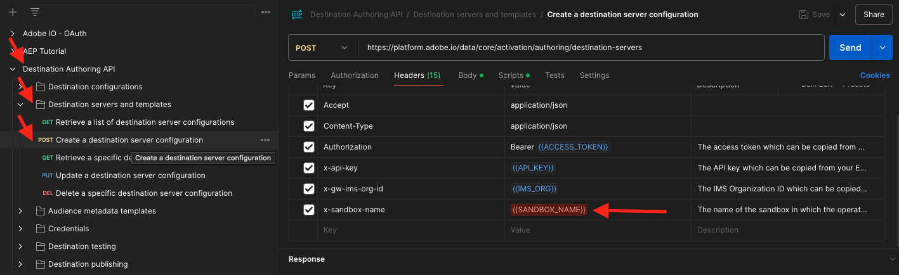
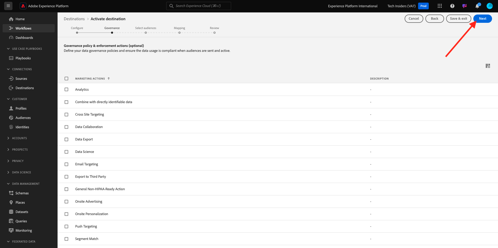

# 2.3.7 宛先 SDK

## 2.3.7.1Adobe I/Oプロジェクトの設定

>[!IMPORTANT]
>
>2021 年 12 月以降にAdobe I/Oプロジェクトを作成した場合は、そのプロジェクトを再利用して、この演習をスキップし、すぐに演習 6.7.2 に進むことができます。
>
>2021 年 12 月より前にAdobe I/Oプロジェクトを作成した場合は、新しいプロジェクトを作成して、Destinations Authoring API と互換性があることを確認してください。

この演習では、Adobe I/Oを非常に集中的に使用して、Platform の API に対してクエリを実行します。 以下の手順に従って、Adobe I/Oを設定してください。

[https://developer.adobe.com/console/home](https://developer.adobe.com/console/home) に移動します


画面の右上隅で正しいAdobe Experience Platform インスタンスを選択していることを確認してください。 インスタンスは `--envName--` です。


**新規プロジェクトを作成** をクリックします。

 または


「**+ プロジェクトに追加**」を選択し、「**API**」を選択します。


次の画面が表示されます。


**0}Adobe Experience Platform} アイコンをクリックします。**


**Experience PlatformAPI** をクリックします。


「**次へ**」をクリックします。


Adobe I/Oでセキュリティキーペアを生成するか、既存のキーペアをアップロードするかを選択できるようになりました。

**オプション 1 - キーペアを生成** を選択します。


**キーペアを生成** をクリックします。


約 30 秒間、スピナーが表示されます。


これが表示され、生成されたキーペアが zip ファイル **config.zip** としてダウンロードされます。

ファイル **config.zip** をデスクトップに解凍すると、2 つのファイルが含まれていることがわかります。


- **certificate_pub.crt** は公開鍵証明書です。 セキュリティの観点から見ると、これはオンラインアプリケーションとの統合を設定するために自由に使用される証明書です。
- **private.key** はあなたの秘密鍵です。 これは決して誰とも共有してはいけません。 秘密鍵は、API 実装への認証に使用するもので、秘密鍵であることが前提です。 秘密鍵を他のユーザーと共有すると、そのユーザーは実装にアクセスし、API を悪用して悪意のあるデータを Platform に取り込み、Platform に存在するすべてのデータを抽出することができます。


次の手順や、今後のAdobe I/OおよびAdobe Experience Platform API へのアクセスに必要になるので、**config.zip** ファイルは必ず安全な場所に保存してください。

「**次へ**」をクリックします。


次に、統合のために **製品プロファイル** を選択する必要があります。

必要な製品プロファイルを選択します。

**参考**：お使いのAdobe Experience Platform インスタンスでは、製品プロファイルの名前が異なります。 適切なアクセス権を持つ製品プロファイルを 1 つ以上選択する必要があります。このプロファイルは、Adobe Admin Consoleで設定します。


**設定済み API を保存** をクリックします。


数秒間スピナーが表示されます。


次に、統合が表示されます。


**Postman用にダウンロード** ボタンをクリックし、**サービスアカウント（JWT）** をクリックして、Postman環境をダウンロードします（環境がダウンロードされるまで待ちます。これには数秒かかる場合があります）。


**サービスアカウント（JWT）** が表示されるまで下にスクロールします。このアカウントでは、Adobe Experience Platformとの統合の設定に使用されるすべての統合詳細を確認できます。


IO プロジェクトには現在、汎用名があります。 統合にはわかりやすい名前を付ける必要があります。 示されているように、**プロジェクト 1** （または類似の名前）をクリックします。


**プロジェクトを編集** をクリックします。


統合の名前と説明を入力します。 命名規則として、`AEP API --demoProfileLdap--` を使用します。 ldap を自分の ldap に置き換えます。
例えば、ldap が vangeluw の場合、統合の名前と説明は AEP API vangeluw になります。

**プロジェクトタイトル** として `AEP API --demoProfileLdap--` と入力します。 「**保存**」をクリックします。


これで、Adobe I/Oの統合が完了しました。


## 2.3.7.2 Adobe I/OへのPostman認証

[https://www.getpostman.com/](https://www.getpostman.com/) に移動します。

**開始** をクリックします。


次に、Postmanをダウンロードしてインストールします。


Postmanをインストールしたら、アプリケーションを起動します。

Postmanには、環境とコレクションという 2 つのコンセプトがあります。

- 環境には、多かれ少なかれ一貫性のあるすべての環境変数が含まれています。 環境には、秘密鍵などのセキュリティ認証情報と共に、Platform 環境の IMSOrg などがあります。 環境ファイルは、前の演習でのAdobe I/O設定時にダウンロードしたファイルで、名前は **service.postman_environment.json** のようになります。

- コレクションには、使用可能な多数の API リクエストが含まれています。 2 つのコレクションを使用します
   - AdobeI/0 に対する認証用の 1 つのコレクション
   - このモジュールの演習の 1 つのコレクション
   - 宛先オーサリング用の、Real-Time CDP モジュールの演習用の 1 つのコレクション

[postman.zip](./../../../assets/postman/postman_profile.zip) ファイルをローカルデスクトップにダウンロードしてください。

この **postman.zip** ファイルには、次のファイルがあります。

- `_Adobe I-O - Token.postman_collection.json`
- `_Adobe Experience Platform Enablement.postman_collection.json`
- `Destination_Authoring_API.json`

**postman.zip** ファイルを解凍し、これらの 3 つのファイルをAdobe I/OからダウンロードしたPostmanと共に、デスクトップ上のフォルダーに保存します。そのフォルダーには、次の 4 つのファイルが必要です。


Postmanに戻ります。 **インポート** をクリックします。


**ファイルをアップロード** をクリックします。


ダウンロードした 4 つのファイルを抽出したデスクトップ上のフォルダーに移動します。 これらの 4 つのファイルを同時に選択し、「開く **をクリックし** す。


**開く** をクリックすると、Postmanに読み込む環境とコレクションの概要が表示されます。 **インポート** をクリックします。


これで、API を使用してPostmanとの対話を開始するためにAdobe Experience Platformで必要なすべてが揃いました。

まず最初にすべきことは、正しく認証されていることを確認することです。 認証を受けるには、アクセストークンをリクエストする必要があります。

リクエストを実行する前に、適切な環境が選択されていることを確認します。 右上隅の「環境」ドロップダウンリストを確認すると、現在選択されている環境を確認できます。

選択した環境の名前は次のようになります。


**目** アイコン、「編集 **の順にクリックして** 環境ファイルの秘密鍵を更新します。


その後、これが表示されます。 **PRIVATE_KEY** フィールドを除く、すべてのフィールドは事前入力されます。


秘密鍵は、Adobe I/Oプロジェクトを作成したときに生成されています。 **config.zip** という名前の zip ファイルとしてダウンロードされました。 その zip ファイルをデスクトップに抽出します。


フォルダー **config** を開き、ファイル **private.key** を任意のテキストエディターで開きます。


次に、これに似たものが表示され、すべてのテキストをクリップボードにコピーします。


Postmanに戻り、変数 **PRIVATE_KEY** の横のフィールド（列 **INITIAL VALUE** と **CURRENT VALUE** の両方）に秘密鍵を貼り付けます。 「**保存**」をクリックします。


これで、Postman環境とコレクションが設定され、機能するようになりました。 PostmanからAdobe I/Oに対して認証できるようになりました。

これを行うには、通信の暗号化と復号化を処理する外部ライブラリを読み込む必要があります。 このライブラリを読み込むには、**INIT: Load Crypto Library for RS256** という名前でリクエストを実行する必要があります。 **_Collection - トークンAdobe I/Oでこのリクエストを選択すると** 画面の中央に表示されます。


青い **送信** ボタンをクリックします。 数秒後、Postmanの **Body** セクションに応答が表示されます。


これで、暗号ライブラリが読み込まれ、Adobe I/Oに対して認証を行うことができます。

「**\_Generate - Token collection**」で、「**IMS: JWT Generate + Auth**」という名前のリクエストをAdobe I/Oします。 もう一度、リクエストの詳細が画面の中央に表示されます。


青い **送信** ボタンをクリックします。 数秒後、Postmanの **Body** セクションに応答が表示されます。


設定が成功すると、次の情報を含む同様の応答が表示されます。

| キー | 値 |
|:-------------:| :---------------:| 
| token_type | **ベアラー** |
| access_token | **eyJ4NXUiOiJpbXNfbmEx..QT7mqZkumN1tdsPEioOEl4087Dg** |
| expires_in | **86399973** |

Adobe I/Oから、特定の値 **この非常に長い access_token）と有効期限のウィンドウを持つ** bearer） – token が提供されました。

受信したトークンは 24 時間有効になりました。 つまり、24 時間後にPostmanを使用してAdobe I/Oへの認証を行う場合は、このリクエストを再度実行して新しいトークンを生成する必要があります。

## 2.3.7.3 エンドポイントと形式の定義

この演習では、セグメントが選定されたときに選定イベントをそのエンドポイントにストリーミングできるように、を設定するエンドポイントが必要です。 この演習では、[https://webhook.site/](https://webhook.site/) を使用してサンプルエンドポイントを使用します。 [https://webhook.site/](https://webhook.site/) に移動すると、これに類似したものが表示されます。 **クリップボードにコピー** をクリックして、URL をコピーします。 次の演習では、この URL を指定する必要があります。 この例の URL は `https://webhook.site/e0eb530c-15b4-4a29-8b50-e40877d5490a` です。


形式については、セグメントの選定または選定解除と共に顧客識別子などのメタデータをストリーミングする標準テンプレートを使用します。 テンプレートは特定のエンドポイントの想定に合わせてカスタマイズできますが、この演習では標準テンプレートを再利用します。これにより、次のようなペイロードがエンドポイントにストリーミングされます。

```json
{
  "profiles": [
    {
      "identities": [
        {
          "type": "ecid",
          "id": "64626768309422151580190219823409897678"
        }
      ],
      "AdobeExperiencePlatformSegments": {
        "add": [
          "f58c723c-f1e5-40dd-8c79-7bb4ab47f041"
        ],
        "remove": []
      }
    }
  ]
}
```

## 2.3.7.4 サーバーとテンプレートの設定の作成

Adobe Experience Platformで独自の宛先を作成する最初の手順は、サーバーとテンプレートの設定を作成することです。

これを行うには、**Destination Authoring API** の **Destination server and templates** に移動し、クリックしてリクエスト **設定 – 宛先サーバーPOSTを作成** を開きます。 その後、これが表示されます。 **ヘッダー** の下で、キー **x-sandbox-name** の値を手動で更新し、`--aepSandboxId--` に設定する必要があります。 値 **{{SANDBOX_NAME}}** を選択します。



`--aepSandboxId--` で置き換えます。


次に、**本文** に移動します。 プレースホルダー **{{body}}** を選択します。


ここで、プレースホルダー **{{body}}** を以下のコードで置き換える必要があります。

```json
{
    "name": "Custom HTTP Destination",
    "destinationServerType": "URL_BASED",
    "urlBasedDestination": {
        "url": {
            "templatingStrategy": "PEBBLE_V1",
            "value": "yourURL"
        }
    },
    "httpTemplate": {
        "httpMethod": "POST",
        "requestBody": {
            "templatingStrategy": "PEBBLE_V1",
            "value": "{\n    \"profiles\": [\n    \n        {\n            \"identities\": [\n            \n            \n                \n                {\n                    \"type\": \"{{ namespace }}\",\n                    \"id\": \"{{ identity.id }}\"\n                },\n                ,\n            \n            ],\n            \"AdobeExperiencePlatformSegments\": {\n                \"add\": [\n                \n                    \"{{ segment.key }}\",\n                \n                ],\n                \"remove\": [\n                {#- Alternative syntax for filtering segments by status: -#}\n                \n                    \"{{ segment.key }}\",\n                \n                ]\n            }\n        },\n    \n    ]\n}"
        },
        "contentType": "application/json"
    }
}
```

上記のコードを貼り付けた後、フィールド **urlBasedDestination.url.value** を手動で更新し、前の手順で作成した Webhook の URL （この例で `https://webhook.site/e0eb530c-15b4-4a29-8b50-e40877d5490a` 成）に設定する必要があります。


フィールド **urlBasedDestimention.url.value** を更新すると、次のようになります。 「**送信**」をクリックします。


「**送信**」をクリックすると、サーバーテンプレートが作成され、応答の一部として **instanceId** という名前のフィールドが表示されます。 次の手順で必要になるので、書き留めてください。 この例では、**instanceId** は
`eb0f436f-dcf5-4993-a82d-0fcc09a6b36c`。


## 2.3.7.5 宛先設定の作成

Postmanの **Destination Authoring API** で、**Destination configurations}** に移動し、クリックしてリクエスト **設定 – 宛先POSTを作成** を開きます。 その後、これが表示されます。 **ヘッダー** の下で、キー **x-sandbox-name** の値を手動で更新し、`--aepSandboxId--` に設定する必要があります。 値 **{{SANDBOX_NAME}}** を選択します。


`--aepSandboxId--` で置き換えます。


次に、**本文** に移動します。 プレースホルダー **{{body}}** を選択します。


ここで、プレースホルダー **{{body}}** を以下のコードで置き換える必要があります。

```json
{
    "name": "--demoProfileLdap-- - Webhook",
    "description": "Exports segment qualifications and identities to a custom webhook via Destination SDK.",
    "status": "TEST",
    "customerAuthenticationConfigurations": [
        {
            "authType": "BEARER"
        }
    ],
    "customerDataFields": [
        {
            "name": "endpointsInstance",
            "type": "string",
            "title": "Select Endpoint",
            "description": "We could manage several instances across the globe for REST endpoints that our customers are provisioned for. Select your endpoint in the dropdown list.",
            "isRequired": true,
            "enum": [
                "US",
                "EU",
                "APAC",
                "NZ"
            ]
        }
    ],
    "uiAttributes": {
        "documentationLink": "https://experienceleague.adobe.com/docs/experience-platform/destinations/home.html?lang=en",
        "category": "streaming",
        "connectionType": "Server-to-server",
        "frequency": "Streaming"
    },
    "identityNamespaces": {
        "ecid": {
            "acceptsAttributes": true,
            "acceptsCustomNamespaces": false
        }
    },
    "segmentMappingConfig": {
        "mapExperiencePlatformSegmentName": true,
        "mapExperiencePlatformSegmentId": true,
        "mapUserInput": false
    },
    "aggregation": {
        "aggregationType": "BEST_EFFORT",
        "bestEffortAggregation": {
            "maxUsersPerRequest": "1000",
            "splitUserById": false
        }
    },
    "schemaConfig": {
        "profileRequired": false,
        "segmentRequired": true,
        "identityRequired": true
    },
    "destinationDelivery": [
        {
            "authenticationRule": "NONE",
            "destinationServerId": "yourTemplateInstanceID"
        }
    ]
}
```


上記のコードを貼り付けた後、フィールド **destinationDelivery を手動で更新する必要があります。 destinationServerId**。この例で `eb0f436f-dcf5-4993-a82d-0fcc09a6b36c` 成した、前の手順で作成した宛先サーバーテンプレートの **instanceId** に設定する必要があります。 次に、「**送信** をクリックします。


この応答が表示されます。


これで、宛先がAdobe Experience Platformに作成されました。 そこへ行って、それを調べてみよう。

[Adobe Experience Platform](https://experience.adobe.com/platform) に移動します。 ログインすると、Adobe Experience Platformのホームページが表示されます。


続行する前に、**サンドボックス** を選択する必要があります。 選択するサンドボックスの名前は ``--aepSandboxId--`` です。 これを行うには、画面上部の青い線のテキスト **[!UICONTROL 実稼動製品]** をクリックします。 適切な [!UICONTROL  サンドボックス ] を選択すると、画面が変更され、専用の [!UICONTROL  サンドボックス ] が表示されます。


左側のメニューで、**宛先** に移動し、「**カタログ** をクリックして、カテゴリ **ストリーミング** まで下にスクロールします。 今すぐそこに利用可能な宛先が表示されます。


## 2.3.7.6 セグメントを宛先にリンクする

**宛先**/**カタログ** で、宛先の **設定** をクリックして、新しい宛先へのセグメントの追加を開始します。


**1234** などのダミーのベアラートークンを入力します。 **宛先に接続** をクリックします。


その後、これが表示されます。 宛先の名前として、`--demoProfileLdap-- - Webhook` を使用します。 任意のエンドポイント（この例では **EU**）を選択します。 「**次へ**」をクリックします。


オプションで、データガバナンスポリシーを選択できます。 「**次へ**」をクリックします。



先ほど作成した `--demoProfileLdap-- - Interest in PROTEUS FITNESS JACKSHIRT` という名前のセグメントを選択します。 「**次へ**」をクリックします。


その後、これが表示されます。 必ず **SOURCE FIELD** `--aepTenantId--.identification.core.ecid` をフィールド `Identity: ecid` にマッピングしてください。 「**次へ**」をクリックします。


「**完了**」をクリックします。


宛先がライブになりました。新しいセグメント選定は、カスタム Webhook に今すぐストリーミングされます。


## 2.3.7.7 セグメントのアクティベーションのテスト

[https://builder.adobedemo.com/projects](https://builder.adobedemo.com/projects) に移動します。 Adobe IDでログインすると、このが表示されます。 Web サイトプロジェクトをクリックして開きます。


次のフローに従って、web サイトにアクセスできるようになりました。 **統合** をクリックします。


**統合** ページでは、演習 0.1 で作成したデータ収集プロパティを選択する必要があります。


その後、デモ Web サイトが開きます。 URL を選択してクリップボードにコピーします。


新しい匿名ブラウザーウィンドウを開きます。


前の手順でコピーしたデモ Web サイトの URL を貼り付けます。 その後、Adobe IDを使用してログインするように求められます。


アカウントタイプを選択し、ログインプロセスを完了します。


次に、匿名ブラウザーウィンドウに web サイトが読み込まれます。 デモごとに、新しい匿名ブラウザーウィンドウを使用して、デモ Web サイトの URL を読み込む必要があります。


**Luma** のホームページで **Men** に移動し、製品 **PROTEUS FITNESS JACKSHIRT** をクリックします。


これで、**PROTEUS FITNESS JACKSHIRT** の製品ページにアクセスしました。つまり、この演習で以前に作成したセグメントの資格が得られます。


プロファイルビューアを開き、**セグメント** に移動すると、セグメントが選定されていることがわかります。


次に、[https://webhook.site/](https://webhook.site/) で開いている Webhook に戻ると、Adobe Experience Platformから送信され、セグメントの選定イベントを含む、新しい受信リクエストが表示されます。


次の手順：[ 概要とメリット ](./summary.md)

[モジュール 2.3 に戻る](./real-time-cdp-build-a-segment-take-action.md)

[すべてのモジュールに戻る](../../../overview.md)
