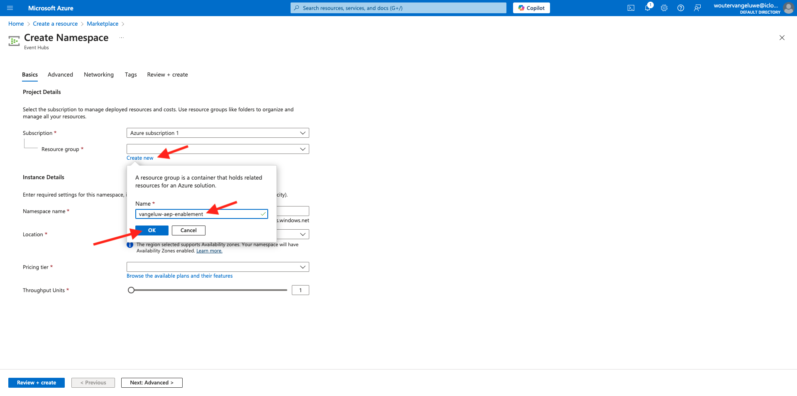

# 2.4.2 Microsoft Azure EventHub 環境の設定

Azure Event Hubs は、1 秒あたり数百万のイベントを取り込んで複数のアプリケーションにストリーミングできる、拡張性の高いパブリッシュ/サブスクライブ サービスです。 これにより、接続されたデバイスやアプリケーションによって生成された膨大な量のデータを処理および分析できます。

## Azure Event Hubs とは

Azure Event Hubs は、ビッグデータストリーミングプラットフォームとイベント取り込みサービスです。 1 秒あたり数百万のイベントを受信し、処理できます。 イベントハブに送信されたデータは、任意のリアルタイム分析プロバイダーまたはバッチ/ストレージアダプターを使用して変換および保存できます。

Event Hubs は、イベントパイプラインの **フロントドア** を表し、多くの場合、ソリューションアーキテクチャではイベント取り込みツールと呼ばれます。 イベント取得ツールは、イベントパブリッシャー（Adobe Experience Platform RTCDP など）とイベントコンシューマーの間に位置するコンポーネントまたはサービスで、イベントストリームの生成とそのイベントの利用を切り離すものです。 Event Hubs は、時間保持バッファーを備えた統合ストリーミングプラットフォームを提供し、イベントプロデューサーをイベントコンシューマーから分離します。

## Event Hubs 名前空間の作成

[https://portal.azure.com/#home](https://portal.azure.com/#home) に移動し、「**リソースを作成** を選択します。

リソース画面で、検索バーに **イベント** と入力します。 **Event Hubs** カードを見つけ、[ 作成 **] をクリックし**&lbrack;**Event Hubs**..

Azure で初めてリソースを作成する場合は、新しい **リソースグループ** を作成する必要があります。 既にリソースグループがある場合は、そのリソースグループを選択（または新しいリソースグループを作成）できます。

「**新規作成**」をクリックし、グループに `--aepUserLdap---aep-enablement` という名前を付け、「**OK**」をクリックします。

指示に従って、残りのフィールドに入力します。

- 名前空間：名前空間を定義します。名前空間は一意である必要があります。次のパターンを使用します `--aepUserLdap---aep-enablement`
- 場所：任意の場所を選択します。
- 価格レベル：**基本**
- スループット単位：**1**

**レビューして作成** をクリックします。

「**作成**」をクリックします。

リソースグループのデプロイメントには 1～2 分かかる場合があります。成功すると、次の画面が表示されます。

## Azure でのイベントハブの設定

[https://portal.azure.com/#home](https://portal.azure.com/#home) に移動し、「**すべてのリソース**」を選択します。

リソースリストで、`--aepUserLdap---aep-enablement` の Event Hubs 名前空間をクリックします。

詳細画面 `--aepUserLdap---aep-enablement`**エンティティ** に移動し、「**Event Hubs**」をクリックします。

**+ Event Hub** をクリックします。

`--aepUserLdap---aep-enablement-event-hub` を名前として使用し、「レビューと作成 **をクリックし** す。

「**作成**」をクリックします。

**Event Hubs** の Event Hub 名前空間に、**Event Hub** が表示されます。

## Azure ストレージアカウントの設定

後の演習で Azure Event Hub 機能をデバッグするには、Visual Studio Code プロジェクト設定の一部として Azure ストレージアカウントを指定する必要があります。 次に、その Azure ストレージアカウントを作成します。

[https://portal.azure.com/#home](https://portal.azure.com/#home) に移動し、「**リソースを作成** を選択します。

検索内で **ストレージアカウント** を入力し、**ストレージアカウント** のカードを見つけて **ストレージアカウント**..

（この演習の最初に作成した **リソース グループ** を指定し、`--aepUserLdap--aepstorage` をストレージ アカウント名として使用して、**ローカル冗長ストレージ （LRS）** を選択してから、**確認+作成** をクリックします。

「**作成**」をクリックします。

ストレージアカウントの作成には数秒かかります。

完了すると、画面に **リソースに移動** ボタンが表示されます。

**ホーム** をクリックします。

ストレージアカウントが **最近のリソース** の下に表示されるようになりました。

次の手順：[2.4.3 Adobe Experience Platformで Azure Event Hub の宛先を設定する ](./ex3.md)

[モジュール 2.4 に戻る](./segment-activation-microsoft-azure-eventhub.md)

[すべてのモジュールに戻る](./../../../overview.md)
