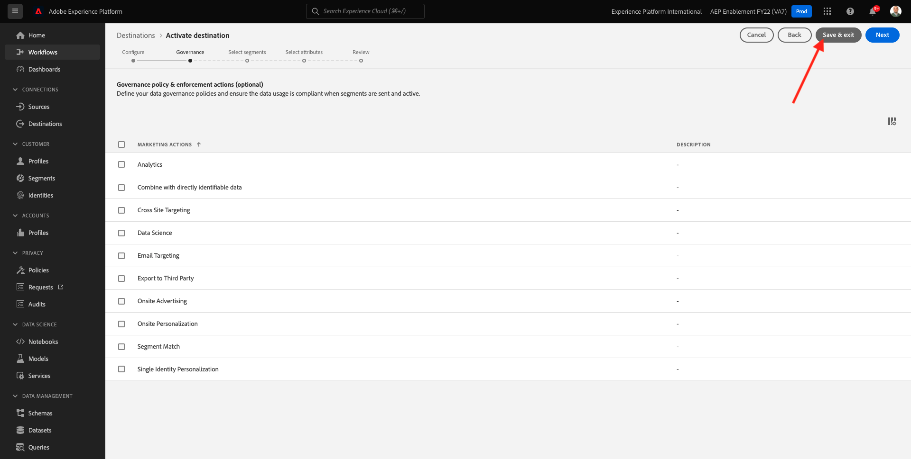

# 2.4.2 Adobe Experience Platformでの Azure Event Hub の宛先の設定

## 2.4.2.1 必要な Azure 接続パラメーターの特定

Adobe Experience Platformでイベントハブの宛先を定義するには、以下が必要です。

- Event Hubs 名前空間
- イベントハブ
- Azure SAS キー名
- Azure SAS キー

Event Hub と EventHub 名前空間は、前の演習 [ 演習 1 - Azure での Event Hub のセットアップ ](./ex1.md) で定義しました。

### Event Hubs 名前空間

Azure Portal で上記の情報を参照するには、[https://portal.azure.com/#home](https://portal.azure.com/#home) に移動します。 正しい Azure アカウントを使用していることを確認します。

Azure Portal で **すべてのリソース** を選択します。

### イベントハブ

前の演習で使用した命名規則に従って Event Hubs 名前空間を使用する場合は、リソースタイプ **Event Hubs 名前空間** のリソースを探し `--aepUserLdap---aep-enablement` す。 それをメモしてください、あなたは次の演習でそれを必要とするでしょう。

Event Hubs の名前空間名をクリックすると、詳細が表示されます。

**Event Hubs** を選択して、Event Hubs 名前空間で定義されている Event Hubs のリストを取得します。前の演習で使用した命名規則に従っている場合は、`--aepUserLdap---aep-enablement-event-hub` という名前の Event Hub があります。 それをメモしてください、あなたは次の演習でそれを必要とするでしょう。

### SAS キー名

**Event Hubs 名前空間** の **共有アクセスポリシー** を選択します

共有アクセスポリシーのリストが表示されます。 探している SAS キーは **RootManageSharedAccessKey** です。 これは SAS キー名です。 書き留めておきなさい。

### SAS キー値

**RootManageSharedAccessKey** をクリックして、SAS キー値を取得します。 **クリップボードにコピー** アイコンを押して、**プライマリキーをコピーします**:

### 宛先値の概要

この時点で、Adobe Experience Platform Real-time CDP で Azure Event Hub の宛先を定義するために必要なすべての値が特定されています。

| 宛先属性名 | 宛先属性値 | 値の例 |
|---|---|---|
| sasKeyName | SAS キー名 | RootManageSharedAccessKey |
| sasKey | SAS キー値 | srREx9ShJG1Rv7f/.. |
| 名前空間 | Event Hubs 名前空間 | `--aepUserLdap---aep-enablement` |
| eventHubName | イベントハブ | `--aepUserLdap---aep-enablement-event-hub` |

## 2.4.2.2 Adobe Experience Platformでの Azure Event Hub の宛先の作成

URL:[https://experience.adobe.com/platform](https://experience.adobe.com/platform) に移動して、Adobe Experience Platformにログインします。

ログインすると、Adobe Experience Platformのホームページが表示されます。

続行する前に、**サンドボックス** を選択する必要があります。 選択するサンドボックスの名前は ``--aepSandboxName--`` です。 これを行うには、画面上部の青い線のテキスト **[!UICONTROL 実稼動製品]** をクリックします。 適切なサンドボックスを選択すると、画面が変更され、専用のサンドボックスが表示されます。

**宛先** に移動し、**カタログ** に移動します。

**クラウドストレージ** を選択し、**Azure Event Hubs** に移動して、**設定** または **設定** をクリックします。

前の演習で収集した宛先の値を入力します。 次に、「**宛先に接続**」をクリックします。

資格情報が正しければ、「**接続済み** という確認が表示されます。

ここで、書式 `--aepUserLdap---aep-enablement` に名前と説明を入力する必要があります。 **eventHubName** を入力し（前の演習を参照：`--aepUserLdap---aep-enablement-event-hub`）、「**次へ**」をクリックします。

**保存して終了** をクリックします。

これで、宛先が作成され、Adobe Experience Platformで使用できるようになりました。

次の手順：[2.4.3 セグメントの作成 ](./ex3.md)

[モジュール 2.4 に戻る](./segment-activation-microsoft-azure-eventhub.md)

[すべてのモジュールに戻る](./../../../overview.md)
