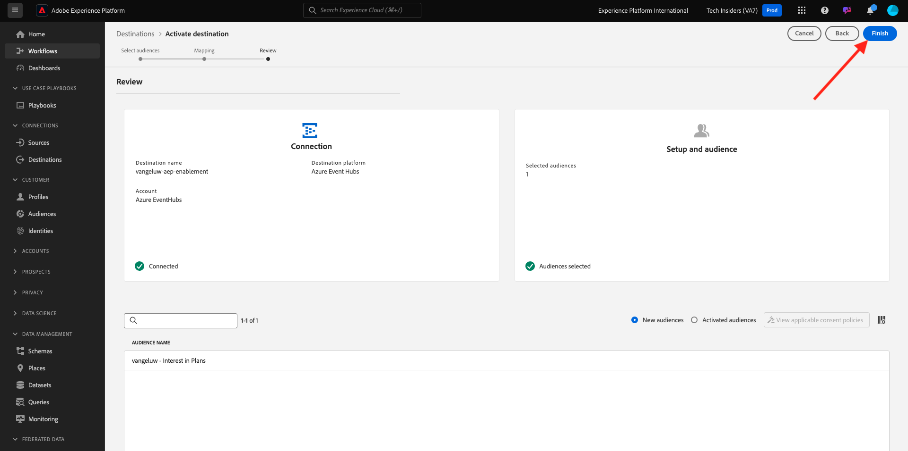

# 2.4.5 オーディエンスのアクティブ化

## Azure Event Hub の宛先へのオーディエンスの追加

この演習では、オーディエンス `--aepUserLdap-- - Interest in Equipment` を `--aepUserLdap---aep-enablement` Azure Event Hub の宛先に追加します。

URL:[https://experience.adobe.com/platform](https://experience.adobe.com/platform) に移動して、Adobe Experience Platformにログインします。

ログインすると、Adobe Experience Platformのホームページが表示されます。

続行する前に、**サンドボックス** を選択する必要があります。 選択するサンドボックスの名前は ``--aepSandboxName--`` です。 適切なサンドボックスを選択すると、画面が変更され、専用のサンドボックスが表示されます。

**宛先** に移動し、「参照 **をクリック** ます。 使用可能なすべての宛先が表示されます。 宛先を見つけて、以下に示す 3 つのドット**...**をクリックし、「**オーディエンスをアクティブ化**」をクリックします。

その後、これが表示されます。 LDAP を使用してオーディエンスを検索し、オーディエンスのリストから `--aepUserLdap-- - Interest in Plans` を選択します。

「**次へ**」をクリックします。

「**新しいフィールドを追加**」をクリックし、「スキーマを参照」をクリックして、フィールド `--aepTenantId--identification.core.ecid` を選択します（自動的に表示されるその他のフィールドがあれば削除します）。

「**次へ**」をクリックします。

「**完了**」をクリックします。

これで、オーディエンスがMicrosoft Event Hub の宛先に対してアクティブ化されました。

次の手順：[2.4.6 Microsoft Azure プロジェクトを作成する ](./ex6.md)

[モジュール 2.4 に戻る](./segment-activation-microsoft-azure-eventhub.md)

[すべてのモジュールに戻る](./../../../overview.md)
