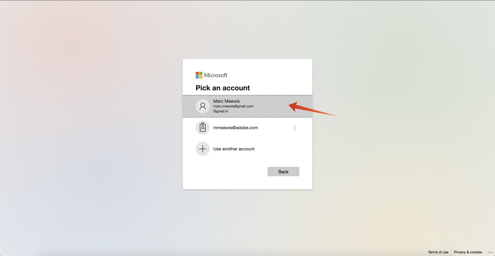
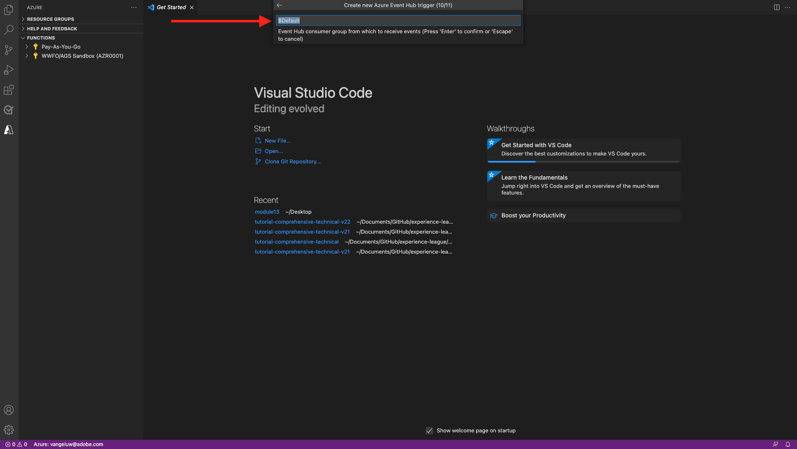

# 2.4.5 Microsoft Azure プロジェクトの作成

## 2.4.5.1 Azure Event Hub 関数の理解

Azure Functions を使用すると、アプリケーションインフラストラクチャを気にすることなく、小さなコード（**functions** と呼ばれます）を実行できます。 Azure Functions を使用すると、クラウドインフラストラクチャは、アプリケーションを大規模に実行するために必要な最新のサーバーをすべて提供します。

関数は、特定のタイプのイベントによって **トリガー** されます。 サポートされるトリガーには、データの変化への対応、メッセージ（Event Hubs など）への対応、スケジュールに従った実行、または HTTP リクエストの結果としての応答が含まれます。

Azure Functions は、インフラストラクチャを明示的にプロビジョニングまたは管理することなく、イベントトリガーコードを実行できる、サーバーレスの計算サービスです。

Azure Event Hubs は、サーバーレス アーキテクチャのために Azure Functions と統合されています。

## 2.4.5.2 Visual Studio Code を開き、Azure にログオンします

Visual Studio Code を使用すると、次のことが簡単になります。

- azure 関数の定義と Event Hubs へのバインド
- ローカルでテスト
- azure にデプロイ
- リモートログ関数の実行

### Visual Studio Code を開きます。

Visual Studio Code を開くには、オペレーティングシステムの検索で **visual** と入力します（OSX でのスポットライト検索、Window のタスクバーで検索）。 見つからない場合は、[ 演習 0 – 前提条件 ](./ex0.md) で説明されている手順を繰り返す必要があります。


### Azure へのログオン

[ 演習 0 – 前提条件 ](./ex0.md) で登録した Azure アカウントでログオンすると、Visual Studio Code ですべての Event Hub リソースを検索してバインドできます。

Visual Studio Code で「**Azure**」アイコンをクリックします。 そのオプションがない場合、必要な拡張機能のインストールで問題が発生した可能性があります。

次に、「**Azure にログイン**」を選択します。


ログインするには、ブラウザーにリダイレクトされます。 登録に使用した Azure アカウントを忘れずに選択してください。



ブラウザーに次の画面が表示されたら、Visual Code Studio にログインしています。


Visual Code Studio に戻ります（例：**Azure サブスクリプション 1**）。


## 2.4.5.3 Azure プロジェクトの作成

**Azure サブスクリプション 1** の上にマウスポインターを置くと、セクションの上にメニューが表示されるので、「**新規プロジェクトを作成…**」を選択します。


プロジェクトを保存するローカルフォルダーを選択し、「**選択**」をクリックします。


プロジェクト作成ウィザードに入ります。 プロジェクトの言語として **Javascript** を選択します。


プロジェクトの最初の関数トリガーとして **Azure Event Hub テンプレート** を選択します。


関数の名前を入力し、次の書式 `--demoProfileLdap---aep-event-hub-trigger` を使用して Enter キーを押します。


**新しいローカルアプリ設定を作成** を選択します。


イベントハブ名前空間を選択すると、**演習 2** で定義したイベントハブが表示されます。 この例では、イベントハブの名前空間は **vangeluw-aep-enablement** です。


イベントハブを選択すると、**演習 2** で定義したイベントハブが表示されます。 ここでは、**vangeluw-aep-enablement-event-hub** です。


イベントハブポリシーとして **RootManageSharedAccessKey** を選択します。


入力して **$Default** を使用：



プロジェクトを開く方法については、**ワークスペースに追加** を選択してください。


プロジェクトが作成されたら、「**index.js**」をクリックして、エディターでファイルを開きます。


Adobe Experience Platformからイベントハブに送信されるペイロードには、次のセグメント ID が含まれます。

```json
[{
"segmentMembership": {
"ups": {
"ca114007-4122-4ef6-a730-4d98e56dce45": {
"lastQualificationTime": "2020-08-31T10:59:43Z",
"status": "realized"
},
"be2df7e3-a6e3-4eb4-ab12-943a4be90837": {
"lastQualificationTime": "2020-08-31T10:59:56Z",
"status": "realized"
},
"39f0feef-a8f2-48c6-8ebe-3293bc49aaef": {
"lastQualificationTime": "2020-08-31T10:59:56Z",
"status": "realized"
}
}
},
"identityMap": {
"ecid": [{
"id": "08130494355355215032117568021714632048"
}]
}
}]
```

Visual Studio Code の index.js のコードを以下のコードに置き換えます。 このコードは、Real-time CDP がセグメント選定をイベントハブ宛先に送信するたびに実行されます。 この例では、コードは受信したペイロードの表示と強化に過ぎません。 ただし、セグメントの選定をリアルタイムで処理するあらゆる種類の機能を想像できます。

```javascript
// Marc Meewis - Solution Consultant Adobe - 2020
// Adobe Experience Platform Enablement - Module 13

// Main function
// -------------
// This azure function is fired for each segment activated to the Adobe Exeperience Platform Real-time CDP Azure 
// Eventhub destination
// This function enriched the received segment payload with the name fo the segment. 
// You can replace this function with any logic that is require to process and deliver
// Adobe Experience Platform segments in real-time to any application or platform that 
// would need to act upon an AEP segment qualiification.
// 

module.exports = async function (context, eventHubMessages) {

    return new Promise (function (resolve, reject) {

        context.log('Message : ' + JSON.stringify(eventHubMessages, null, 2));

        resolve();

    });    

};
```

結果は次のようになります。


## 2.4.5.4 Azure プロジェクトの実行

次に、プロジェクトを実行します。 この段階では、プロジェクトを Azure にデプロイしません。 デバッグモードでローカルに実行します。 [ ファイル名を指定して実行 ] アイコンを選択し、緑色の矢印をクリックします。


初めてデバッグモードでプロジェクトを実行する際は、Azure ストレージアカウントを添付し、「**ストレージアカウントを選択**」をクリックする必要があります。


ストレージアカウントのリストから、[13.1.4 Azure ストレージアカウントの設定 ](./ex1.md) の一部として作成したものを選択します。 ストレージアカウントの名前は `--demoProfileLdap--aepstorage` です（例：**mmeewisaepstorage**）。


これで、プロジェクトが起動および実行され、イベントハブにイベントがリストされるようになりました。 次の演習では、Luma デモ web サイトで行動を実演し、これらのセグメントの資格を得ることができます。 その結果、Event Hub トリガー関数のターミナルにセグメントの選定ペイロードが届きます。


## 2.4.5.5 Azure プロジェクトを停止

プロジェクトを停止するには、「**ターミナル**」タブを選択し、ターミナルウィンドウ内をクリックして、OSX の場合は **CMD-C**、Windows の場合は **CTRL-C** を押します。


次の手順：[2.4.6 エンドツーエンドのシナリオ ](./ex6.md)

[モジュール 2.4 に戻る](./segment-activation-microsoft-azure-eventhub.md)

[すべてのモジュールに戻る](./../../../overview.md)
