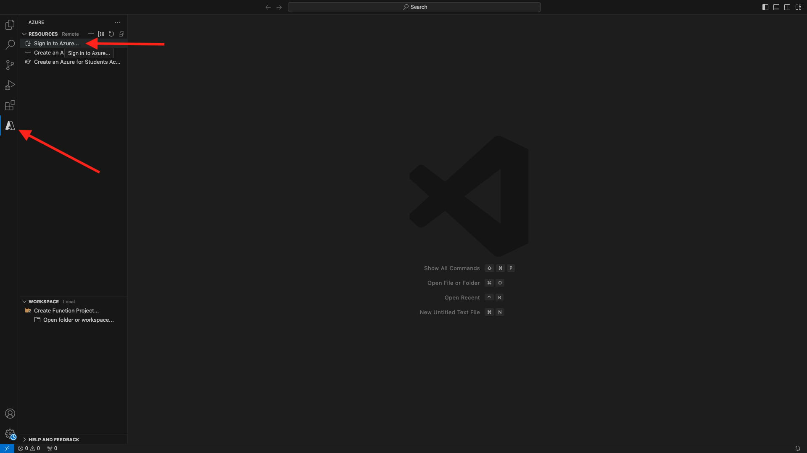
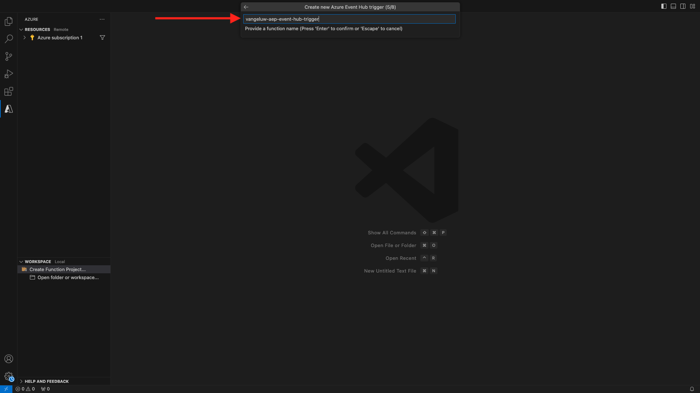

# 2.4.6 Microsoft Azure プロジェクトの作成

## Azure Event Hub 関数の理解

Azure 関数を使用すると、アプリケーションインフラストラクチャを気にすることなく、小さなコード（**functions** と呼ばれます）を実行できます。 Azure Functions を使用すると、クラウドインフラストラクチャは、アプリケーションを大規模に実行するために必要な最新のサーバーをすべて提供します。

関数は、特定のタイプのイベントによって **トリガー** されます。 サポートされるトリガーには、データの変化への対応、メッセージ（Event Hubs など）への対応、スケジュールに従った実行、または HTTP リクエストの結果としての応答が含まれます。

Azure Functions は、インフラストラクチャを明示的にプロビジョニングまたは管理することなく、イベントトリガーコードを実行できる、サーバーレスの計算サービスです。

Azure Event Hubs は、サーバーレス アーキテクチャのために Azure Functions と統合されています。

## Visual Studio Code を開き、Azure にログオンします

Visual Studio Code を使用すると、次のことが簡単になります。

- azure 関数の定義と Event Hubs へのバインド
- ローカルでテスト
- azure にデプロイ
- リモートログ関数の実行

### Visual Studio Code を開きます。

### Azure へのログオン

前の演習で登録に使用した Azure アカウントでログオンすると、Visual Studio Code ですべての Event Hub リソースを検索してバインドできます。

Visual Studio Code を開き、「**Azure**」アイコンをクリックします。

次に、「**Azure にログイン**」を選択します。



ログインするには、ブラウザーにリダイレクトされます。 登録に使用した Azure アカウントを忘れずに選択してください。

ブラウザーに次の画面が表示されたら、Visual Code Studio にログインしています。


Visual Code Studio に戻ります（例：**Azure サブスクリプション 1**）。


## Azure プロジェクトの作成

「**関数プロジェクトを作成…**」をクリックします。


プロジェクトを保存するローカルフォルダーを選択し、「**選択**」をクリックします。


プロジェクト作成ウィザードに入ります。 プロジェクトの言語として **Javascript** をクリックします。


次に、「**モデル v4**」を選択します。


プロジェクトの最初の関数トリガーとして **Azure Event Hub テンプレート** を選択します。


関数の名前を入力し、次の書式 `--aepUserLdap---aep-event-hub-trigger` を使用して Enter キーを押します。



**新しいローカルアプリ設定を作成** を選択します。


クリックして、前の手順で作成した `--aepUserLdap---aep-enablement` という名前のイベント ハブ名前空間を選択します。


次に、前の手順で作成した `--aepUserLdap---aep-enablement-event-hub` という名前のイベント ハブをクリックして選択します。


イベントハブポリシーとして **RootManageSharedAccessKey** をクリックして選択します。


プロジェクトを開く方法については、**ワークスペースに追加** を選択してください。


次のようなメッセージが表示される場合があります。 その場合は、「はい、作成者を信頼します **をクリックし** す。


プロジェクトが作成されたら、「**index.js**」をクリックして、エディターでファイルを開きます。


Adobe Experience Platformからイベントハブに送信されるペイロードには、オーディエンス ID が含まれます。

```json
[{
"segmentMembership": {
"ups": {
"ca114007-4122-4ef6-a730-4d98e56dce45": {
"lastQualificationTime": "2020-08-31T10:59:43Z",
"status": "realized"
},
"be2df7e3-a6e3-4eb4-ab12-943a4be90837": {
"lastQualificationTime": "2020-08-31T10:59:56Z",
"status": "realized"
},
"39f0feef-a8f2-48c6-8ebe-3293bc49aaef": {
"lastQualificationTime": "2020-08-31T10:59:56Z",
"status": "realized"
}
}
},
"identityMap": {
"ecid": [{
"id": "08130494355355215032117568021714632048"
}]
}
}]
```

Visual Studio Code の index.js のコードを以下のコードに置き換えます。 このコードは、Real-time CDP がイベントハブ宛先にオーディエンス選定を送信するたびに実行されます。 この例では、コードは受信したペイロードの表示と強化に過ぎません。 しかし、オーディエンスの選定をリアルタイムで処理するあらゆる種類の機能を想像できます。

```javascript
// Marc Meewis - Solution Consultant Adobe - 2020
// Adobe Experience Platform Enablement - Module 2.4

// Main function
// -------------
// This azure function is fired for each audience activated to the Adobe Exeperience Platform Real-time CDP Azure 
// Eventhub destination
// This function enriched the received audience payload with the name of the audience. 
// You can replace this function with any logic that is require to process and deliver
// Adobe Experience Platform audiences in real-time to any application or platform that 
// would need to act upon an AEP audience qualification.
// 

module.exports = async function (context, eventHubMessages) {

    return new Promise (function (resolve, reject) {

        context.log('Message : ' + JSON.stringify(eventHubMessages, null, 2));

        resolve();

    });    

};
```

結果は次のようになります。


## Azure プロジェクトの実行

次に、プロジェクトを実行します。 この段階では、プロジェクトを Azure にデプロイしません。 デバッグモードでローカルに実行します。 [ ファイル名を指定して実行 ] アイコンを選択し、緑色の矢印をクリックします。


プロジェクトをデバッグモードで初めて実行するときは、Azure ストレージアカウントを添付し、「**ストレージアカウントを選択**」をクリックしてから、以前に作成した `--aepUserLdap--aepstorage` という名前のストレージアカウントを選択する必要があります。

これで、プロジェクトが起動および実行され、イベントハブにイベントがリストされるようになりました。 次の演習では、オーディエンスの資格を得る CitiSignal デモ web サイトで動作を実演します。 その結果、Event Hub トリガー関数のターミナルにオーディエンスの選定ペイロードが届きます。


## Azure プロジェクトを停止

プロジェクトを停止するには、VSC の lenu **コールスタック** に移動し、実行中のプロジェクトの矢印をクリックして **停止** をクリックします。


次の手順：[2.4.7 エンドツーエンドのシナリオ ](./ex7.md)

[モジュール 2.4 に戻る](./segment-activation-microsoft-azure-eventhub.md)

[すべてのモジュールに戻る](./../../../overview.md)
