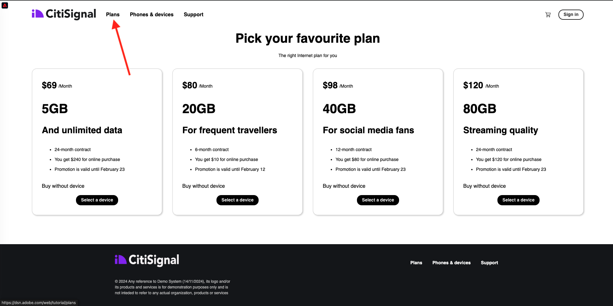

# 2.4.7 エンドツーエンドのシナリオ

## Azure Event Hubトリガーの開始

オーディエンスの認定時にAdobe Experience Platform Real-time CDP から Azure Event Hub に送信されたペイロードを表示するには、シンプルな Azure Event Hubトリガー機能を開始する必要があります。 この関数は、Visual Studio Code のコンソールにペイロードを単純に「ダンプ」します。 ただし、この関数は、専用の API とプロトコルを使用して、あらゆる種類の環境とインターフェイスするように拡張できます。

### Visual Studio Code の起動とプロジェクトの開始

Visual Studio Code プロジェクトを開いて実行していることを確認します

Visual Studio Code で Azure 関数を開始/停止/再起動するには、前の演習を参照してください。

Visual Studio Code の **ターミナル** には、次のような記述が必要です。

```code
[2024-11-20T20:07:12.316Z] Debugger listening on ws://127.0.0.1:9229/86c8e251-8e2f-4c65-a063-cda77edbf2ca
[2024-11-20T20:07:12.318Z] For help, see: https://nodejs.org/en/docs/inspector
[2024-11-20T20:07:12.343Z] Worker process started and initialized.
[2024-11-20T20:07:12.359Z] Debugger attached.

Functions:

        vangeluw-aep-event-hub-trigger: eventHubTrigger

For detailed output, run func with --verbose flag.
[2024-11-20T20:07:18.150Z] Host lock lease acquired by instance ID '000000000000000000000000000C19D8'.
```

## Citi Signal web サイトを読み込みます

[https://dsn.adobe.com](https://dsn.adobe.com) に移動します。 Adobe IDでログインすると、このが表示されます。 Web サイトプロジェクトで「。..**」** いう 3 つのドットをクリックし、「**実行**」をクリックして開きます。


その後、デモ Web サイトが開きます。 URL を選択してクリップボードにコピーします。


新しい匿名ブラウザーウィンドウを開きます。


前の手順でコピーしたデモ Web サイトの URL を貼り付けます。 その後、Adobe IDを使用してログインするように求められます。


アカウントタイプを選択し、ログインプロセスを完了します。


次に、匿名ブラウザーウィンドウに web サイトが読み込まれます。 演習ごとに、新しい匿名ブラウザーウィンドウを使用して、デモ Web サイトの URL を読み込む必要があります。


## オーディエンスの選定

**プラン** ページに移動します。 このアクションにより、`--aepUserLdap-- - Interest in Plans` オーディエンスの条件を満たすことができます。



確認するには、プロファイルビューアパネルを開きます。 `--aepUserLdap-- - Interest in Plans` のメンバーになりました。 プロファイルビューアパネルでオーディエンスメンバーシップがまだ更新されていない場合は、「再読み込み」ボタンをクリックします。


Visual Studio Code に戻り、「**TERMINAL**」タブを見ると、特定の **ECID** のオーディエンスのリストが表示されます。 このアクティベーションペイロードは、`--aepUserLdap-- - Interest in Plans` オーディエンスに適合するとすぐにイベントハブに配信されます。


オーディエンスペイロードを詳しく見ると、`--aepUserLdap-- - Interest in Plans` のステータスが **実現済み** であることがわかります。

```json
{
  "identityMap": {
    "ecid": [
      {
        "id": "36281682065771928820739672071812090802"
      }
    ]
  },
  "segmentMembership": {
    "ups": {
      "94db5aed-b90e-478d-9637-9b0fad5bba11": {
        "createdAt": 1732129904025,
        "lastQualificationTime": "2024-11-21T07:33:52Z",
        "mappingCreatedAt": 1732130611000,
        "mappingUpdatedAt": 1732130611000,
        "name": "vangeluw - Interest in Plans",
        "status": "realized",
        "updatedAt": 1732129904025
      }
    }
  }
}
```

オーディエンスステータスが **実現済み** の場合は、プロファイルがオーディエンスの一部であることを意味し、**離脱** ステータスの場合は、プロファイルがオーディエンスから削除されたことを意味します。

次の手順：[ 概要とメリット ](./summary.md)

[モジュール 2.4 に戻る](./segment-activation-microsoft-azure-eventhub.md)

[すべてのモジュールに戻る](./../../../overview.md)
