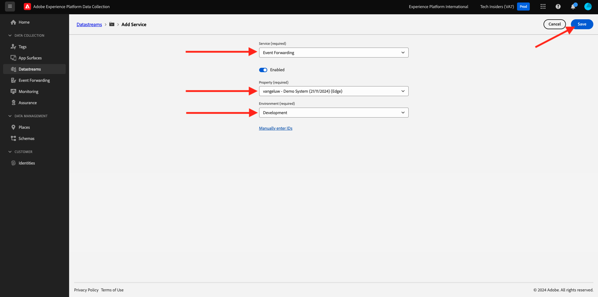

# 2.5.2 Adobe Experience Platform Data Collection Server プロパティでデータを使用できるように、データストリームを更新します。

## 2.5.2.1 データストリームの更新

[ 演習 0.2](./../../gettingstarted/gettingstarted/ex2.md) で、独自の **[!UICONTROL データストリーム]** を作成しました。 その後、`--demoProfileLdap-- - Demo System Datastream` という名前を使用しました。

この演習では、**[!DNL Data Collection Server property]** を使用できるように **[!UICONTROL データストリーム]** を設定する必要があります。

その場合は、[https://experience.adobe.com/#/data-collection/](https://experience.adobe.com/#/data-collection/) にアクセスしてください。 その後、これが表示されます。 左側のメニューで、「**[!UICONTROL データストリーム]**」をクリックします。

画面の右上隅にあるサンドボックス名を選択します（`--aepSandboxId--` にする必要があります）。

**[!UICONTROL Datastream]** を検索します。名前は `--demoProfileLdap-- - Demo System Datastream` です。 **[!UICONTROL データストリーム]** をクリックして開きます。

その後、これが表示されます。 「**[!UICONTROL + サービスを追加]**」をクリックします。

サービス **イベント転送** を選択します。 これにより、2 つの追加設定が表示されます。 前の演習で作成し、`--demoProfileLdap-- - Demo System (DD/MM/YYYY) (Edge)` という名前のイベント転送プロパティを選択します。 次に、「環境 **の下の** 開発 **を選択し** す。 「**保存**」をクリックします。

これでデータストリームが更新され、使用する準備が整いました。

これで、データストリームが **[!DNL Event Forwarding property]** で動作する準備ができました。

次の手順：[2.5.3 カスタム Webhook を作成して設定する ](./ex3.md)

[モジュール 2.5 に戻る](./aep-data-collection-ssf.md)

[すべてのモジュールに戻る](./../../../overview.md)
