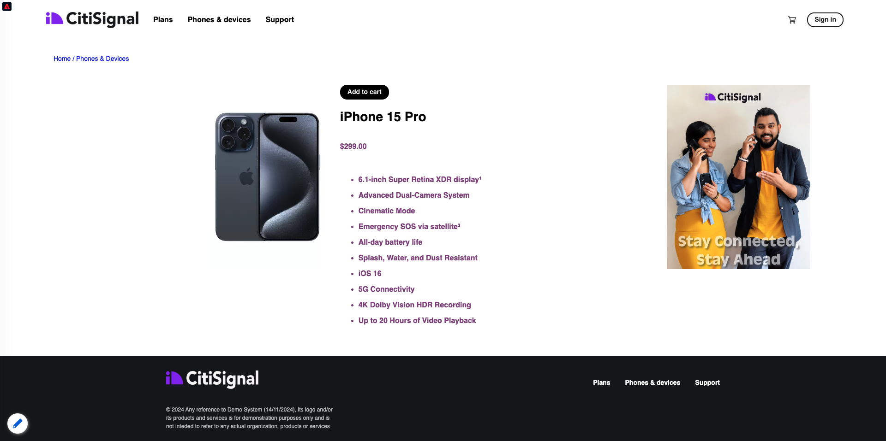

# 2.5.4 Google Cloud 関数の作成と設定

## 2.5.4.1 Google Cloud 関数の作成

[https://console.cloud.google.com/](https://console.cloud.google.com/) に移動します。 **クラウド関数** に移動します。


その後、これが表示されます。 **関数を作成** をクリックします。


その後、これが表示されます。


次の選択を行います。

- **関数名**: `--aepUserLdap---event-forwarding`
- **地域**：任意の地域を選択します。
- **トリガーの種類**: **HTTP** を選択
- **認証**:「未認証の呼び出しを許可 **を選択します**

これで、このが得られます。 **保存** をクリックします。


**次へ** をクリックします。


次の画面が表示されます。


次の選択を行います。

- **ランタイム**: **Node.js 16** （またはそれ以降）を選択します。
- **エントリポイント**:**helloAEP** と入力します

**API を有効にする** をクリックして **Cloud Build API** を有効にします。 その後、新しいウィンドウが表示されます。 新しいウィンドウで、もう一度 **ENABLE** をクリックします。


その後、これが表示されます。 **有効にする** をクリックします。


**Cloud Build API** を有効にすると、このページが表示されます。


**クラウド関数** に戻ります。
クラウド関数インラインエディターで、次のコードがあることを確認します。

```javascript
/**
 * Responds to any HTTP request.
 *
 * @param {!express:Request} req HTTP request context.
 * @param {!express:Response} res HTTP response context.
 */
exports.helloAEP = (req, res) => {
  let message = req.query.message || req.body.message || 'Hello World!';
  res.status(200).send(message);
};
```

次に、「**デプロイ**」をクリックします。


その後、これが表示されます。 クラウド関数が作成されました。 これには数分かかることがあります。


関数を作成して実行すると、これが表示されます。 関数名をクリックして開きます。


その後、これが表示されます。 **トリガー** に移動します。 **エンドポイント URL が表示されます。これは** Launch Server Side でトリガーを定義するために使用するものです。


次のようにトリガー URL をコピーします：**https://europe-west1-dazzling-pillar-273812.cloudfunctions.net/vangeluw-event-forwarding**。

次の手順では、**ページビュー** に関する特定の情報をAdobe Experience Platform Cloud 関数にストリーミングするようにGoogle Data Collection Server を設定します。 ペイロード全体をそのまま転送するのではなく、**ECID**、**timestamp**、**ページ名** などをGoogle Cloud 関数にのみ送信します。

上記の変数を除外するために解析する必要があるペイロードの例を次に示します。

```json
{
  "events": [
    {
      "xdm": {
        "eventType": "web.webpagedetails.pageViews",
        "web": {
          "webPageDetails": {
            "URL": "https://builder.adobedemo.com/run/vangeluw-OCUC",
            "name": "vangeluw-OCUC",
            "viewName": "vangeluw-OCUC",
            "pageViews": {
              "value": 1
            }
          },
          "webReferrer": {
            "URL": "https://builder.adobedemo.com/run/vangeluw-OCUC/equipment"
          }
        },
        "device": {
          "screenHeight": 1080,
          "screenWidth": 1920,
          "screenOrientation": "landscape"
        },
        "environment": {
          "type": "browser",
          "browserDetails": {
            "viewportWidth": 1920,
            "viewportHeight": 451
          }
        },
        "placeContext": {
          "localTime": "2022-02-23T06:51:07.140+01:00",
          "localTimezoneOffset": -60
        },
        "timestamp": "2022-02-23T05:51:07.140Z",
        "implementationDetails": {
          "name": "https://ns.adobe.com/experience/alloy/reactor",
          "version": "2.8.0+2.9.0",
          "environment": "browser"
        },
        "_experienceplatform": {
          "identification": {
            "core": {
              "ecid": "08346969856929444850590365495949561249"
            }
          },
          "demoEnvironment": {
            "brandName": "vangeluw-OCUC"
          },
          "interactionDetails": {
            "core": {
              "channel": "web"
            }
          }
        }
      },
      "query": {
        "personalization": {
          "schemas": [
            "https://ns.adobe.com/personalization/html-content-item",
            "https://ns.adobe.com/personalization/json-content-item",
            "https://ns.adobe.com/personalization/redirect-item",
            "https://ns.adobe.com/personalization/dom-action"
          ],
          "decisionScopes": [
            "eyJ4ZG06YWN0aXZpdHlJZCI6Inhjb3JlOm9mZmVyLWFjdGl2aXR5OjE0YzA1MjM4MmUxYjY1MDUiLCJ4ZG06cGxhY2VtZW50SWQiOiJ4Y29yZTpvZmZlci1wbGFjZW1lbnQ6MTRiZjA5ZGM0MTkwZWJiYSJ9",
            "__view__"
          ]
        }
      }
    }
  ],
  "query": {
    "identity": {
      "fetch": [
        "ECID"
      ]
    }
  },
  "meta": {
    "state": {
      "domain": "adobedemo.com",
      "cookiesEnabled": true,
      "entries": [
        {
          "key": "kndctr_907075E95BF479EC0A495C73_AdobeOrg_identity",
          "value": "CiYwODM0Njk2OTg1NjkyOTQ0NDg1MDU5MDM2NTQ5NTk0OTU2MTI0OVIPCPn66KfyLxgBKgRJUkwx8AH5-uin8i8="
        },
        {
          "key": "kndctr_907075E95BF479EC0A495C73_AdobeOrg_consent_check",
          "value": "1"
        },
        {
          "key": "kndctr_907075E95BF479EC0A495C73_AdobeOrg_consent",
          "value": "general=in"
        }
      ]
    }
  }
}
```

解析する必要がある情報を含むフィールドは次のとおりです。

- ECID:**events.xdm。_experienceplatform.identification.core.ecid**
- timestamp: **timestamp**
- ページ名：**events.xdm.web.webPageDetails.name**

次に、Adobe Experience Platform Data Collection Server に移動して、データ要素を設定し、可能にしましょう。

## 2.5.4.2 イベント転送プロパティの更新：データ要素

[https://experience.adobe.com/#/data-collection/](https://experience.adobe.com/#/data-collection/) に移動し、**イベント転送** に移動します。 イベント転送プロパティを検索し、クリックして開きます。


左側のメニューで、**データ要素** に移動します。 「**データ要素を追加**」をクリックします。


その後、設定する新しいデータ要素が表示されます。


次の選択を行います。

- 「**名前**」に「**customerECID**」と入力します。
- **拡張機能** として、「**コア**」を選択します。
- **データ要素タイプ** として、「**パス**」を選択します。
- **パス** として、`arc.event.xdm.--aepTenantId--.identification.core.ecid` と入力します。 このパスを入力すると、web サイトやモバイルアプリからAdobe Edgeに送信されるイベントペイロードからフィールド **ecid** がフィルタリングされます。

>[!NOTE]
>
>上記と下記のパスでは、**arc** への参照が行われます。 **arc** はAdobeリソースコンテキストを表し、**arc** は常にサーバーサイドコンテキストで使用可能な最も高いオブジェクトを表します。 Adobe Experience Platform Data Collection Server の関数を使用して、その **arc** オブジェクトにエンリッチメントと変換を追加できます。
>
>上記と以下のパスでは、**event** への参照が行われます。 **event** は一意のイベントを表し、Adobe Experience Platform Data Collection Server は常にすべてのイベントを個別に評価します。 Web SDK クライアントサイドで送信されるペイロードに **events** への参照が表示されることがありますが、Adobe Experience Platform Data Collection Server では、すべてのイベントが個別に評価されます。

これで完了です。 「**保存**」をクリックします。


「**データ要素を追加**」をクリックします。


その後、設定する新しいデータ要素が表示されます。


次の選択を行います。

- **Name** として **eventTimestamp** と入力します。
- **拡張機能** として、「**コア**」を選択します。
- **データ要素タイプ** として、「**パス**」を選択します。
- **パス** として、「**arc.event.xdm.timestamp**」と入力します。 このパスを入力すると、web サイトやモバイルアプリからAdobe Edgeに送信されるイベントペイロードからフィールド **timestamp** がフィルタリングされます。

これで完了です。 「**保存**」をクリックします。


「**データ要素を追加**」をクリックします。


その後、設定する新しいデータ要素が表示されます。


次の選択を行います。

- 「**名前**」に「**pageName**」と入力します。
- **拡張機能** として、「**コア**」を選択します。
- **データ要素タイプ** として、「**パス**」を選択します。
- **パス** として、「**arc.event.xdm.web.webPageDetails.name**」と入力します。 このパスを入力すると、web サイトやモバイルアプリからAdobe Edgeに送信されるイベントペイロードから **名前** フィールドがフィルタリングされます。

これで完了です。 「**保存**」をクリックします。


これで、次のデータ要素が作成されました。


## 2.5.4.3 イベント転送プロパティの更新：ルールを更新する

左側のメニューで、「ルール **に移動** ます。 前の演習では、ルール **すべてのページ** を作成しました。 そのルールをクリックして開きます。


その後、これになります。 **アクション** の下の「**+**」アイコンをクリックして、新しいアクションを追加します。


その後、これが表示されます。


次の選択を行います。

- **拡張機能**:**Adobeクラウドコネクタ** を選択します。
- **アクションタイプ**:**フェッチ呼び出しを実行** を選択します。

これにより、次の **名前** が得られます。**Adobeクラウドコネクタ – フェッチ呼び出しを行う**。 次の情報が表示されます。


次に、以下を設定します。

- リクエストプロトコルをGETから **POST** に変更します
- 前の手順の 1 つで作成したGoogle Cloud 関数の URL を、**https://europe-west1-dazzling-pillar-273812.cloudfunctions.net/vangeluw-event-forwardingのように入力し** す。

これで、このが得られます。 次に、**本文** に移動します。


その後、これが表示されます。 **JSON** のラジオボタンをクリックします。


**Body** を次のように設定します。

| キー | 値 |
|--- |--- |
| customerECID | {{customerECID}} |
| pageName | {{pageName}} |
| eventTimestamp | {{eventTimestamp}} |

その後、これが表示されます。 「**変更を保存**」をクリックします。


その後、これが表示されます。 「**保存**」をクリックします。


これで、Adobe Experience Platform Data Collection Server プロパティ内の既存のルールを更新しました。 **公開フロー** に移動して、変更を公開します。 示すように **編集** をクリックして、開発ライブラリ **メイン** を開きます。


「**変更されたすべてのリソースを追加**」ボタンをクリックすると、ルールとデータ要素がこのライブラリに表示されます。 次に、「開発用に保存してビルド **をクリックします**。 変更をデプロイしています。


数分後、デプロイメントが完了し、テストする準備が整ったことが表示されます。


## 2.5.3.4 設定のテスト

[https://builder.adobedemo.com/projects](https://builder.adobedemo.com/projects) に移動します。 Adobe IDでログインすると、このが表示されます。 Web サイトプロジェクトをクリックして開きます。


次のフローに従って、web サイトにアクセスできるようになりました。 **統合** をクリックします。


**統合** ページでは、演習 0.1 で作成したデータ収集プロパティを選択する必要があります。


その後、デモ Web サイトが開きます。 URL を選択してクリップボードにコピーします。


新しい匿名ブラウザーウィンドウを開きます。


前の手順でコピーしたデモ Web サイトの URL を貼り付けます。 その後、Adobe IDを使用してログインするように求められます。


アカウントタイプを選択し、ログインプロセスを完了します。


次に、匿名ブラウザーウィンドウに web サイトが読み込まれます。 デモごとに、新しい匿名ブラウザーウィンドウを使用して、デモ Web サイトの URL を読み込む必要があります。


ブラウザーの開発者ビューを開くと、次に示すようにネットワークリクエストを調べることができます。 フィルター **interact** を使用すると、Adobe Experience Platform データ収集クライアントからAdobe Edgeに送信されるネットワークリクエストが表示されます。


Google Cloud 関数にビューを切り替え、**LOGS** に移動します。 これで、これに類似したビューが表示され、多数のログエントリが表示されます。 **関数の実行が開始された** と表示されるたびに、受信トラフィックがGoogle Cloud 関数で受信されたことを意味します。


受信データを操作し、Adobe Experience Platform Data Collection Server から受信した情報を表示するように、関数を少し更新しましょう。 **SOURCE** に移動し、「**編集**」をクリックします。


次の画面で、「**次へ**」をクリックします。


次のようにコードを更新します。

```javascript
/**
 * Responds to any HTTP request.
 *
 * @param {!express:Request} req HTTP request context.
 * @param {!express:Response} res HTTP response context.
 */
exports.helloAEP = (req, res) => {
  console.log('>>>>> Function has started. The following information was received from Event Forwarding:');
  console.log(req.body);

  let message = req.query.message || req.body.message || 'Hello World!';
  res.status(200).send(message);
};
```

これで完了です。 **デプロイ** をクリックします。


数分後、関数が再びデプロイされます。 関数名をクリックして開きます。


デモ Web サイトで、製品（「DEIRDRE RELAXED-FIT CAPRI **など** に移動します。



Google Cloud 関数にビューを切り替え、**LOGS** に移動します。 これで、これに類似したビューが表示され、多数のログエントリが表示されます。

デモ Web サイトのすべてのページビューで、Google Cloud Function のログに新しいログエントリがポップアップ表示され、受け取った情報が表示されます。


これで、Adobe Experience Platform Data Collection でリアルタイムに収集されたデータを、Google Cloud Function エンドポイントに正常に送信しました。 その後、そのデータは、BigQuery などの任意のGoogle Cloud Platform アプリケーションでストレージおよびレポート用や機械学習のユースケースに使用できます。

次のステップ：[2.5.5 AWSエコシステムに向けたイベントの転送 ](./ex5.md)

[モジュール 2.5 に戻る](./aep-data-collection-ssf.md)

[すべてのモジュールに戻る](./../../../overview.md)
