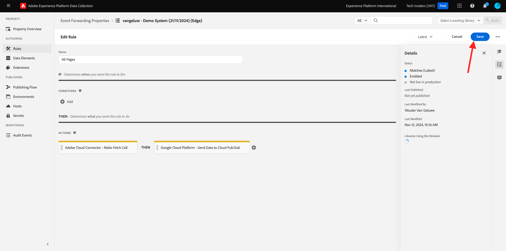

# 2.5.4 GCP Pub/Sub にイベントを転送する

>[!NOTE]
>
>この演習では、Google Cloud Platform 環境にアクセスする必要があります。 まだ GCP へのアクセス権がない場合は、個人のメールアドレスを使用して新しいアカウントを作成します。

## Google Cloud Pub/Sub トピックを作成します

[https://console.cloud.google.com/](https://console.cloud.google.com/) に移動します。 検索バーに「`pub/sub`」と入力します。 検索結果 **Pub/Sub - Global real-time messaging** をクリックします。

その後、これが表示されます。 **トピックを作成** をクリックします。

その後、これが表示されます。 トピック ID には、`--aepUserLdap---event-forwarding` を使用します。 「**作成**」をクリックします。

これで、トピックが作成されました。 トピックの **サブスクリプション ID** をクリックします。

その後、これが表示されます。 **トピック名** をクリップボードにコピーして、次の演習で必要になるので保存します。

今すぐAdobe Experience Platform Data Collection Event Forwarding に移動して、イベント転送プロパティを更新し、Pub/Sub へのイベントの転送を開始しましょう。

## イベント転送プロパティの更新：秘密鍵

イベント転送プロパティの **秘密鍵** は、外部 API に対する認証に使用される資格情報を保存するために使用されます。この例では、Google Cloud Platform OAuth トークンを保存するための秘密鍵を設定する必要があります。このトークンは、Pub/Sub を使用して GCP にデータをストリーミングする際に認証に使用されます。

[https://experience.adobe.com/#/data-collection/](https://experience.adobe.com/#/data-collection/) に移動し、**シークレット** に移動します。 **新しいシークレットの作成** をクリックします。

その後、これが表示されます。 次の手順に従います。

- 名前：use `--aepUserLdap---gcp-secret`
- ターゲット環境：「**開発**」を選択します。
- 型：**Google OAuth 2**
- **Pub/Sub** のチェックボックスをオンにします。

**秘密鍵の作成** をクリックします。

**秘密鍵を作成** をクリックすると、イベント転送プロパティの秘密鍵とGoogleの間の認証を設定するポップアップが表示されます。 **Googleで秘密 `--aepUserLdap---gcp-secret` を作成して認証** をクリックします。

Google アカウントをクリックして選択します。

「**続行**」をクリックします。

>[!NOTE]
>
>ポップアップメッセージは異なる場合があります。 演習を続行するには、要求されたアクセスを許可または許可してください。

認証が成功すると、これが表示されます。

これで、秘密鍵が正常に設定され、データ要素で使用できるようになりました。

## イベント転送プロパティの更新：データ要素

イベント転送プロパティでシークレットを使用するには、シークレットの値を保存するデータ要素を作成する必要があります。

[https://experience.adobe.com/#/data-collection/](https://experience.adobe.com/#/data-collection/) に移動し、**イベント転送** に移動します。 イベント転送プロパティを検索し、クリックして開きます。

左側のメニューで、**データ要素** に移動します。 「**データ要素を追加**」をクリックします。

次のようにデータ要素を設定します。

- 名前：**GCP Secret**
- 拡張機能：**コア**
- データ要素タイプ：**秘密鍵**
- 開発秘密鍵：作成した秘密鍵を選択します。名前は `--aepUserLdap---gcp-secret` です

**保存**&#x200B;をクリックします。

## イベント転送プロパティの更新：拡張機能

秘密鍵とデータ要素が設定されたので、イベント転送プロパティでGoogle Cloud Platform の拡張機能を設定できるようになりました。

[https://experience.adobe.com/#/data-collection/](https://experience.adobe.com/#/data-collection/) に移動し、**イベント転送** に移動して、イベント転送プロパティを開きます。

次に、**拡張機能**、**カタログ** に移動します。 **Google Cloud Platform** 拡張機能をクリックし、「**インストール**」をクリックします。

その後、これが表示されます。 「データ要素」アイコンをクリックします。

前の演習で作成したデータ要素、**GCP シークレット** という名前を選択します。 「**選択**」をクリックします。

その後、これが表示されます。 「**保存**」をクリックします。

## イベント転送プロパティの更新：ルールを更新します

これでGoogle Cloud Platform 拡張機能が設定されたので、Pub/Sub トピックへのイベントデータの転送を開始するルールを定義できます。 それには、前の演習の 1 つで作成した **すべてのページ** ルールを更新する必要があります。

左側のメニューで、「ルール **に移動** ます。 前の演習では、ルール **すべてのページ** を作成しました。 そのルールをクリックして開きます。

その後、これになります。 **アクション** の下の「**+**」アイコンをクリックして、新しいアクションを追加します。

その後、これが表示されます。 次の選択を行います。

- **拡張機能**:**Google Cloud Platform** を選択します。
- **アクションタイプ**:**Cloud Pub/Sub にデータを送信** を選択します。

これにより、次の **名前** が得られます。**Google Cloud Platform - Cloud Pub/Sub にデータを送信**。 次の情報が表示されます。

ここで、前の手順で作成した Pub/Sub トピックを設定する必要があります。

**トピック名** が表示されたら、コピーします。

**トピック名** をルール設定に貼り付けます。 次に、「**データ （必須）** フィールドの横にあるデータ要素アイコンをクリックします。

**XDM イベント** を選択し、「**選択**」をクリックします。

その後、これが表示されます。 「**変更を保存**」をクリックします。

「**保存**」をクリックします。

その後、これが表示されます。

## 変更を公開する

これで設定が完了しました。 **公開フロー** に移動して、変更を公開します。 示すように **編集** をクリックして、開発ライブラリ **メイン** を開きます。

「**変更されたすべてのリソースを追加**」ボタンをクリックすると、ルールとデータ要素がこのライブラリに表示されます。 次に、「開発用に保存してビルド **をクリックします**。 変更をデプロイしています。

数分後、デプロイメントが完了し、テストする準備が整ったことが表示されます。

## 設定のテスト

[https://dsn.adobe.com](https://dsn.adobe.com) に移動します。 Adobe IDでログインすると、このが表示されます。 Web サイトプロジェクトで「。..**」** いう 3 つのドットをクリックし、「**実行**」をクリックして開きます。

その後、デモ Web サイトが開きます。 URL を選択してクリップボードにコピーします。

新しい匿名ブラウザーウィンドウを開きます。

前の手順でコピーしたデモ Web サイトの URL を貼り付けます。 その後、Adobe IDを使用してログインするように求められます。

アカウントタイプを選択し、ログインプロセスを完了します。

次に、匿名ブラウザーウィンドウに web サイトが読み込まれます。 演習ごとに、新しい匿名ブラウザーウィンドウを使用して、デモ Web サイトの URL を読み込む必要があります。

Google Cloud Pub/Sub にビューを切り替え、**MESSAGES** に移動します。 **PULL** をクリックすると、数秒後にリストにメッセージが表示されます。 メッセージをクリックして、そのコンテンツを視覚化します。

Google Pub/Sub でイベントの XDM ペイロードを確認できるようになりました。 これで、Adobe Experience Platform Data Collection でリアルタイムに収集されたデータを、Google Cloud Pub/Sub エンドポイントに正常に送信しました。 その後、そのデータは、BigQuery などの任意のGoogle Cloud Platform アプリケーションでストレージおよびレポート用や機械学習のユースケースに使用できます。

次の手順：[2.5.5 AWS KinesisおよびAWS S3 へのイベントの転送 &#x200B;](./ex5.md)

[モジュール 2.5 に戻る](./aep-data-collection-ssf.md)

[すべてのモジュールに戻る](./../../../overview.md)

