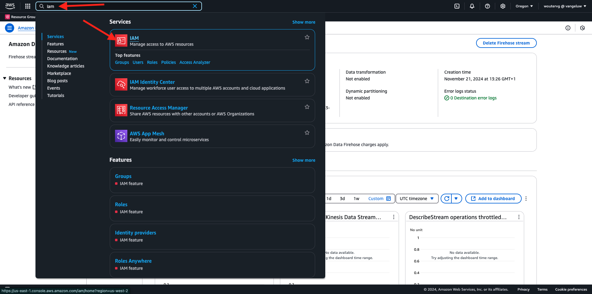
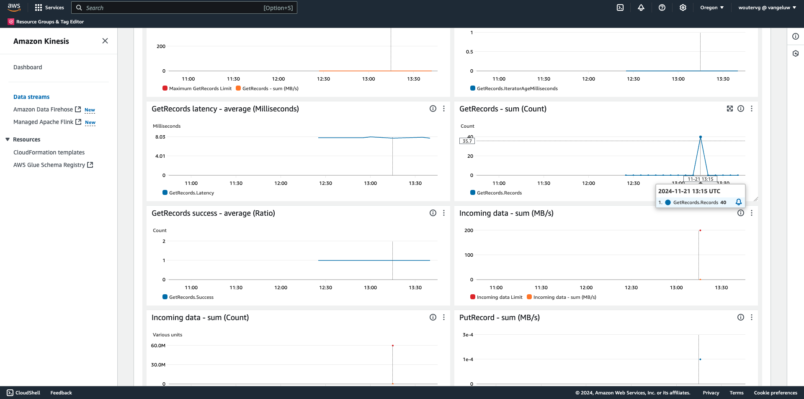

# 2.5.5 AWSエコシステムに向けたフォワードイベント

>[!IMPORTANT]
>
>この演習の実施は任意で、AWS Kinesisを使用するためのコストがかかります。 AWSには無料階層アカウントがあり、コストをかけずに多くのサービスをテストおよび設定できますが、AWS Kinesisは無料階層アカウントに含まれていません。 この演習を実装およびテストするために、AWS Kinesisを使用するためのコストがかかります。

## 知っておいて良い

Adobe Experience Platformは、様々なAmazon サービスを宛先としてサポートしています。
Kinesisと S3 は、どちらも [ プロファイル書き出し先 ](https://experienceleague.adobe.com/docs/experience-platform/destinations/destination-types.html?lang=en) であり、Adobe Experience Platform Real-Time CDPの一部として使用できます。
価値の高いセグメントイベントや関連するプロファイル属性を、選択したシステムに簡単にフィードできます。

このメモでは、Adobe Experience Platform Edge エコシステムから得られたイベントデータをAmazon S3 などのクラウドストレージの宛先にストリーミングするために、独自のAmazon Kinesis ストリームを設定する方法について説明します。 これは、web およびモバイルプロパティからエクスペリエンスイベントを収集し、分析と運用レポートのためにデータレイクにプッシュする場合に便利です。 データレイクは通常、大規模な毎日のファイルインポートでバッチ方式でデータを取り込み、イベント転送と組み合わせて使用できるパブリック http エンドポイントを公開しません。

上記の使用例をサポートするには、ストリーミングデータをファイルに書き込む前にバッファリングまたはキューに配置する必要があります。 複数のプロセスにまたがる書き込みアクセスでは、ファイルを開かないように注意する必要があります。 このタスクを専用システムに委任することは、優れたレベルのサービスを提供しながら適切に拡張するのに最適です。ここでKinesisが役に立ちます。

Amazon Kinesisのデータストリームは、データストリームの取り込みと保存に重点を置いています。 Kinesis Data Firehose は、S3 バケットなど、特定の宛先へのデータストリームの配信に重点を置いています。

この演習の一部として、次の操作を行います。

- Kinesis データストリームの基本設定を行う
- Firehose 配信ストリームを作成し、S3 バケットを宛先として使用
- Amazon API ゲートウェイを REST API エンドポイントとして設定して、イベントデータを受け取ります
- AdobeのEdgeからKinesis ストリームに生のイベントデータを転送する

## 2.5.5.1 AWS S3 バケットの設定

[https://console.aws.amazon.com](https://console.aws.amazon.com) に移動し、以前に作成したAmazon アカウントでログインします。


ログインすると、**AWS Management Console** にリダイレクトされます。


**サービスを検索** メニューで、**s3** を検索します。 最初の検索結果「**S3 - Scalable Storage in the Cloud**」をクリックします。


**Amazon S3** ホームページが表示されます。 **バケットを作成** をクリックします。


**バケットを作成** 画面では、次の 2 つを設定する必要があります。

- 名前：名前 `eventforwarding---aepUserLdap--` を使用します。 例えば、この演習では、バケット名は **aepmodulertcdpvangeluw** です。
- 地域：地域 **EU （フランクフルト） eu-central-1** を使用します


他のすべてのデフォルト設定はそのままにしておきます。 下にスクロールして、**バケットを作成** をクリックします。


その後、バケットが作成され、Amazon S3 のホームページにリダイレクトされます。


## 2.5.5.2 AWS Kinesis データストリームの設定

**サービスを検索** メニューで **kinesis** を検索します。 最初の検索結果 **Kinesis - リアルタイムストリーミングデータの操作** をクリックします。


「**Kinesis データストリーム**」を選択します。 **データストリームを作成** をクリックします。


**データストリーム名** には、`--aepUserLdap---datastream` を使用します。


その他の設定を変更する必要はありません。 下にスクロールして、「**データストリームを作成**」をクリックします。


その後、これが表示されます。 データストリームが正常に作成されたら、次の演習に進むことができます。


## 2.5.5.3 AWS Firehose デリバリストリームの設定

**サービスを検索** メニューで **kinesis** を検索します。 「**Kinesis Data Firehose**」をクリックします。


**配信ストリームを作成** をクリックします。


**Source} の場合は** 2}Amazon Kinesisのデータストリーム **を選択します。****宛先** については、**Amazon S3** を選択します。 **参照** をクリックして、データストリームを選択します。


データストリームを選択します。 **選択** をクリックします。


その後、これが表示されます。 **配信ストリーム名** は後で必要になるので覚えておいてください。


**宛先設定** が表示されるまで下にスクロールします。 **参照** をクリックして、S3 バケットを選択します。


S3 バケットを選択して、「**選択**」をクリックします。


次のようなメッセージが表示されます。 次の設定を更新します。

- 動的パーティション化：を **有効** に設定
- 複数レコードの非集計化：に設定 **無効**
- 新しい行区切り：を **有効** に設定
- JSON のインライン解析：に設定 **有効**


少し下にスクロールすると、これが表示されます。 次の設定を更新します。

- 動的パーティションキー
   - キー名：**dynamicPartitioningKey**
   - JQ 式：**.dynamicPartitioningKey**
- S3 バケットのプレフィックス：次のコードを追加します。

```bash
!{partitionKeyFromQuery:dynamicPartitioningKey}/!{timestamp:yyyy}/!{timestamp:MM}/!{timestamp:dd}/!{timestamp:HH}/}
```

- S3 バケットのエラー出力プレフィックス：**error** に設定します


最後に、もう少し下にスクロールして、「**配信ストリームを作成**」をクリックします


数分後に配信ストリームが作成されず、**アクティブ** になります。


## 2.5.5.4 AWS IAM の役割の設定

**サービスを検索** メニューで **iam** を検索します。 **API Gateway** をクリックします。



**役割** をクリックします。


**KinesisFirehose** の役割を検索します。 クリックして開きます。


権限ポリシー名をクリックして開きます。


開いた新しい画面で、「**ポリシーを編集**」をクリックします。


「**Kinesis** - **アクション**」で、「**PutRecord** に対する **書き込み** 権限が有効になっていることを確認します。 **レビューポリシー** をクリックします。


「**変更を保存**」をクリックします。


その後、ここに戻ります。 **役割** をクリックします。


**KinesisFirehose** の役割を検索します。 クリックして開きます。


**信頼関係** に移動し、「**信頼ポリシーの編集** をクリックします。


既存のコードを置き換えるには、次のコードを貼り付けて現在の信頼ポリシーを上書きします：

```json
{
	"Version": "2012-10-17",
	"Statement": [
		{
			"Effect": "Allow",
			"Principal": {
				"Service": [
                    "firehose.amazonaws.com",
                    "kinesis.amazonaws.com",
                    "apigateway.amazonaws.com"
                ]
			},
			"Action": "sts:AssumeRole"
		}
	]
}
```

「**ポリシーを更新**」をクリックします


その後、これが表示されます。 次の手順で、この役割に **ARN** を指定する必要があります。


## 2.5.5.5 AWS API Gateway の設定

Amazon API Gateway は、REST、HTTP、WebSocket の API を大規模に作成、公開、メンテナンス、モニタリング、保護するためのAWS サービスです。 API 開発者は、AWSやその他の web サービスおよびAWS Cloud に保存されたデータにアクセスする API を作成できます。

HTTPS エンドポイントを介してKinesis データストリームをインターネットに公開し、イベント転送などのAdobe サービスで直接利用できるようになりました。

**サービスを検索** メニューで **api ゲートウェイ** を検索します。 **API Gateway** をクリックします。


次のようなメッセージが表示されます。 **API を作成** をクリックします。


**REST API** カードの **ビルド** をクリックします。


その後、これが表示されます。 次のように設定を入力します。

- プロトコルの選択：**REST** を選択します。
- 新しい API を作成：「**新しい API**」を選択します
- 設定：
   - API 名：use `--aepUserLdap---eventforwarding`
   - エンドポイントタイプ：**地域** を選択します

**API を作成** をクリックします。


その後、これが表示されます。 **アクション** をクリックしてから、「**リソースを作成**」をクリックします。


その後、これが表示されます。 **リソース名** を **stream** に設定します。 **リソースを作成** をクリックします。


その後、これが表示されます。 **アクション** をクリックしてから、**メソッドを作成** をクリックします。


ドロップダウンで「**POST」を選択し** 「**v**」ボタンをクリックします。


その後、これが表示されます。 次のように設定を入力します。

- 統合の種類：**AWS サービス**
- AWS リージョン：Kinesis データストリームで使用されるリージョン（この場合は **us-west-2** を選択します。
- AWS サービス：**Kinesis** を選択します
- AWS サブドメイン：空のままにします
- HTTP メソッド：**POST** を選択
- アクションタイプ：選択 **アクション名を使用**
- アクション：**PutRecord** を入力します
- 実行ロール：前の演習で説明したように、Kinesis Data Firehose で使用する実行ロールの **ARN** を貼り付けます
- コンテンツの処理：選択 **パススルー**
- デフォルトのタイムアウトを使用：チェックボックスを有効にします

「**保存**」をクリックします。


その後、これが表示されます。 **統合リクエスト** をクリックします。


**HTTP ヘッダー** をクリックします。


少し下にスクロールして、「ヘッダーを追加 **をクリックし** す。


**Name** を **Content-Type** に設定し、**Mapped from** を `'application/x-amz-json-1.1'` に設定します。 **v** アイコンをクリックして、変更を保存します。


その後、これが表示されます。 **リクエスト本文のパススルー** については、「**テンプレートが定義されていない場合（推奨）** を選択します。 次に、「**マッピングテンプレートを追加**」をクリックします。


**Content-Type** の下で、**application/json** と入力します。 **v** アイコンをクリックして、変更を保存します。


下にスクロールして、コードエディターウィンドウを探します。 次のコードをそこに貼り付けます。

```json
{
  "StreamName": "$input.path('StreamName')",
  "Data": "$util.base64Encode($input.json('$.Data'))",
  "PartitionKey": "$input.path('$.PartitionKey')"
}
```

「**保存**」をクリックします。


次に、上にスクロールし、**&lt;- メソッドの実行** をクリックして戻ります。


**テスト** をクリックします。


下にスクロールして、このコードを **リクエスト本文** の下に貼り付けます。 **テスト** をクリックします。

```json
{
  "Data": {
    "message": "Hello World",
    "dynamicPartitioningKey": "v2"
  },
  "PartitionKey": "1",
  "StreamName": "--aepUserLdap---datastream"
}
```


その後、同様の結果が表示されます。


その後、これが表示されます。 **アクション**/**API をデプロイ** をクリックします。


**デプロイメントステージ** の場合は、「**新しいステージ**」を選択します。 **ステージ名** として、「**prod**」と入力します。 **デプロイ** をクリックします。


その後、これが表示されます。 「**変更を保存**」をクリックします。 ヒント：この画像の URL は、データの送信先となる URL です（この例では、https://vv1i5vwg2k.execute-api.us-west-2.amazonaws.com/prod）。


以下の cURL リクエストを使用して設定をテストできます。必要な操作は、以下の URL を自分の URL に置き換えることだけです（この例では `https://vv1i5vwg2k.execute-api.us-west-2.amazonaws.com/prod`）。次に、URL の最後に `/stream` を追加します。

```json
curl --location --request POST 'https://vv1i5vwg2k.execute-api.us-west-2.amazonaws.com/prod/stream' \
--header 'Content-Type: application/json' \
--data-raw '{
    "Data": {
        "userid": "--aepUserLdap--@adobe.com",
        "firstName":"--aepUserLdap--",
        "offerName":"10% off on outdoor gears",
        "offerCode": "10OFF-SPRING",
        "dynamicPartitioningKey": "campaign"
    },
    "PartitionKey": "1",
    "StreamName": "--aepUserLdap---datastream"
}'
```

上記の更新されたコードをターミナルウィンドウに貼り付け、Enter キーを押します。 この応答は、上記のテスト時に表示される応答と同様です。


## 2.5.5.6 イベント転送プロパティの更新

AWS API Gateway を通じて、AWS Kinesis データストリームに対してアクティブ化できるようになりました。これにより、生のエクスペリエンスイベントをAWS エコシステムに送信できるようになります。 Real-Time CDP Connections とイベント転送を使用すると、新しく作成したAWS API Gateway エンドポイントへのイベント転送を簡単に有効にできるようになりました。

### 2.5.5.6.1 イベント転送プロパティの更新：データ要素の作成

[https://experience.adobe.com/#/data-collection/](https://experience.adobe.com/#/data-collection/) に移動し、**イベント転送** に移動します。 イベント転送プロパティを検索し、クリックして開きます。


左側のメニューで、**データ要素** に移動します。 「**データ要素を追加**」をクリックします。


その後、設定する新しいデータ要素が表示されます。


次の選択を行います。

- 「**名前**」に「**awsDataObject**」と入力します。
- **拡張機能** として、「**コア**」を選択します。
- **データ要素タイプ** として、「**カスタムコード**」を選択します。

これで完了です。 [&lt;/> 編集 **開く**] をクリックします。


エディターで、次のコードを 3 行目に貼り付けます。 「**保存**」をクリックします。

```javascript
const newObj = {...arc.event.xdm, dynamicPartitioningKey: "event_forwarding"}
return JSON.stringify(newObj);
```


>[!NOTE]
>
>上記のパスでは、**arc** への参照が作成されます。 **arc** はAdobeリソースコンテキストを表し、**arc** は常にサーバーサイドコンテキストで使用可能な最も高いオブジェクトを表します。 Adobe Experience Platform Data Collection Server の関数を使用して、その **arc** オブジェクトにエンリッチメントと変換を追加できます。
>
>上記のパスでは、**event** への参照が作成されます。 **event** は一意のイベントを表し、Adobe Experience Platform Data Collection Server は常にすべてのイベントを個別に評価します。 Web SDK クライアントサイドで送信されるペイロードに **events** への参照が表示される場合がありますが、Adobe Experience Platform Data Collection Event Forwarding では、すべてのイベントが個別に評価されます。

その後、ここに戻ります。 **保存** または **ライブラリに保存** をクリックします。


### 2.5.5.6.2 Adobe Experience Platform Data Collection Server プロパティを更新する：ルールを更新する

左側のメニューで、「ルール **に移動** ます。 クリックして、前の演習の 1 つで作成したルール **すべてのページ** を開きます。


その後、これが表示されます。 **+** アイコンをクリックして、新しいアクションを追加します。


その後、これが表示されます。 次の選択を行います。

- **拡張機能**:**Adobeクラウドコネクタ** を選択します。
- **アクションタイプ**:**フェッチ呼び出しを実行** を選択します。

これにより、次の **名前** が得られます。**Adobeクラウドコネクタ – フェッチ呼び出しを行う**。 次の情報が表示されます。


次に、以下を設定します。

- リクエストメソッドをGETから **POSTに変更します**
- 前の手順の 1 つで作成したAWS API Gateway エンドポイントの URL を、次のように入力します。`https://vv1i5vwg2k.execute-api.us-west-2.amazonaws.com/prod/stream`

これで、このが得られます。 次に、**ヘッダー** に移動します。


ヘッダーの下に、キー **Content-Type** と値 **application/json** を持つ新しいヘッダーを追加します。 次に、**本文** に移動します。


その後、これが表示されます。 次のコードを「**本文（Raw）**」フィールドに貼り付けます。 「**変更を保存**」をクリックします。

```json
{
    "Data":{{awsDataObject}},
    "PartitionKey": "1",
    "StreamName": "--aepUserLdap---datastream"
}
```


その後、ここに戻ります。 **保存** または **ライブラリに保存** をクリックします。


これで、イベント転送プロパティの最初のルールが設定されました。 **公開フロー** に移動して、変更を公開します。
**メイン** をクリックして、開発ライブラリを開きます。


「**変更されたすべてのリソースを追加**」ボタンをクリックすると、ルールとデータ要素の変更がこのライブラリに表示されます。 次に、「開発用に保存してビルド **をクリックします**。 変更をデプロイしています。


数分後、デプロイメントが完了し、テストする準備が整ったことが表示されます。


## 2.5.5.7 設定のテスト

[https://builder.adobedemo.com/projects](https://builder.adobedemo.com/projects) に移動します。 Adobe IDでログインすると、このが表示されます。 Web サイトプロジェクトをクリックして開きます。


次のフローに従って、web サイトにアクセスできるようになりました。 **統合** をクリックします。


**統合** ページでは、演習 0.1 で作成したデータ収集プロパティを選択する必要があります。


その後、デモ Web サイトが開きます。 URL を選択してクリップボードにコピーします。


新しい匿名ブラウザーウィンドウを開きます。


前の手順でコピーしたデモ Web サイトの URL を貼り付けます。 その後、Adobe IDを使用してログインするように求められます。


アカウントタイプを選択し、ログインプロセスを完了します。


次に、匿名ブラウザーウィンドウに web サイトが読み込まれます。 デモごとに、新しい匿名ブラウザーウィンドウを使用して、デモ Web サイトの URL を読み込む必要があります。


ブラウザーの開発者ビューを開くと、次に示すようにネットワークリクエストを調べることができます。 フィルター **interact** を使用すると、Adobe Experience Platform データ収集クライアントからAdobe Edgeに送信されるネットワークリクエストが表示されます。


生のペイロードを選択した場合は、[https://jsonformatter.org/json-pretty-print](https://jsonformatter.org/json-pretty-print) に移動して、ペイロードを貼り付けます。 **Make Pretty** をクリックします。 次に、JSON ペイロード、**events** オブジェクト、および **xdm** オブジェクトが表示されます。 前の手順の 1 つで、データ要素を定義したとき、参照 **arc.event.xdm** を使用しました。これにより、このペイロードの **xdm** オブジェクトが解析されます。


ビューを **AWS** に切り替えます。 データストリームを開いて「**監視**」タブに移動すると、受信トラフィックが表示されます。



配信ストリームを開いて「**監視**」タブに移動すると、受信トラフィックも表示されます。


最後に、S3 バケットを見ると、データ取り込みの結果として、そこにファイルが作成されていることがわかります。


そのようなファイルをダウンロードし、テキストエディターを使用して開くと、転送されたイベントの XDM ペイロードが含まれていることがわかります。


次の手順：[ 概要とメリット ](./summary.md)

[モジュール 2.5 に戻る](./aep-data-collection-ssf.md)

[すべてのモジュールに戻る](./../../../overview.md)
