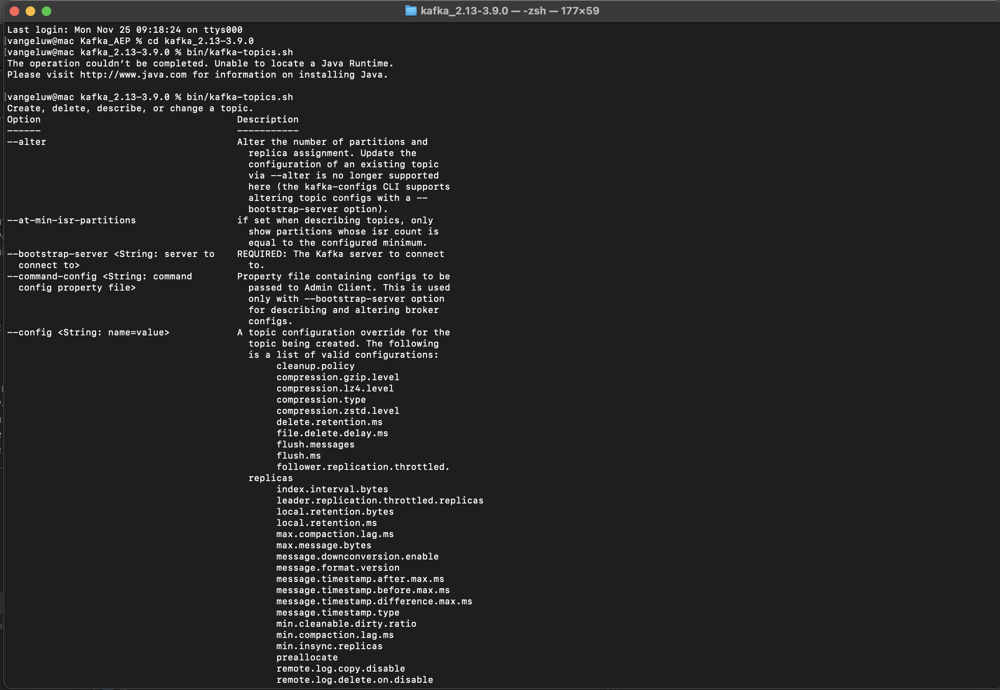
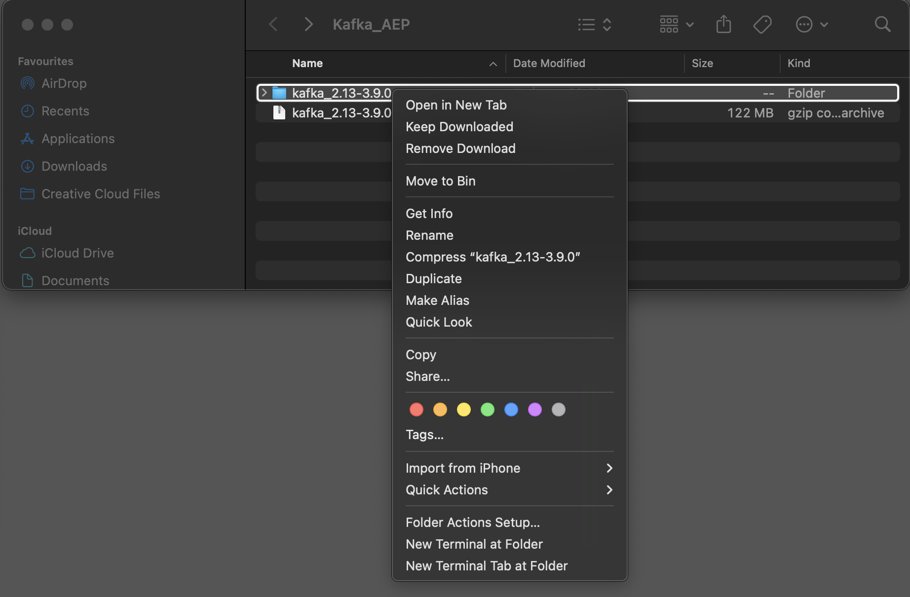
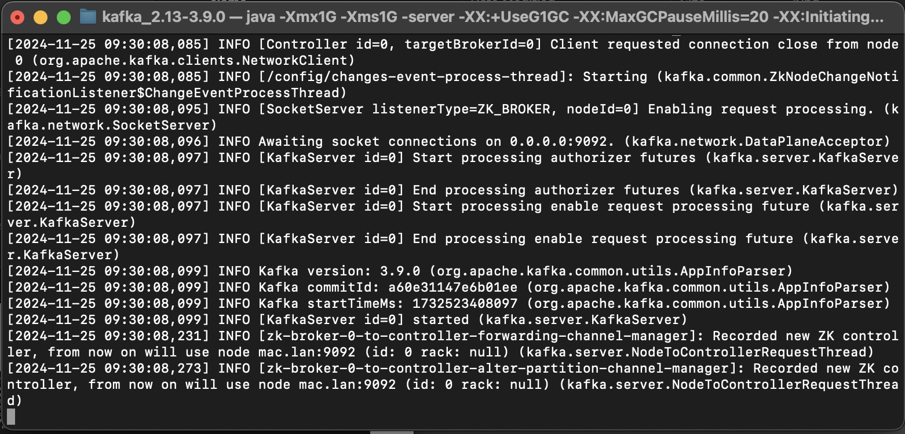
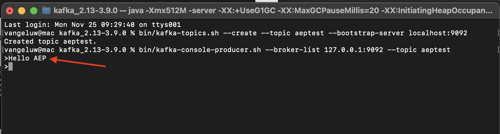

# 2.6.2 Kafka クラスターのインストールと設定

## Apache Kafka をダウンロードします

[https://kafka.apache.org/downloads](https://kafka.apache.org/downloads) に移動して、最新のリリース版をダウンロードします。 最新のバイナリリリース（この場合は **3.9.0**）を選択します。 ダウンロードが開始されます。

デスクトップに **Kafka_AEP** という名前のフォルダーを作成し、ダウンロードしたファイルをそのディレクトリに配置します。

フォルダを右クリックして [**新しい端子**] をクリックし、[**端子**] ウィンドウを開きます。

ターミナルウィンドウで次のコマンドを実行し、ダウンロードしたファイルを解凍します。

`tar -xvf kafka_2.13-3.9.0.tgz`

>[!NOTE]
>
>上記のコマンドがダウンロードしたファイルのバージョンと一致することを確認してください。 お使いのバージョンが新しい場合は、上記のコマンドを更新してそのバージョンに合わせる必要があります。

次の画面が表示されます。

そのファイルを解凍すると、次のようなディレクトリになります。

このディレクトリには、次のサブディレクトリが表示されます。

ターミナルウィンドウに戻ります。 次のコマンドを入力します。

`cd kafka_2.13-3.9.0`

>[!NOTE]
>
>上記のコマンドがダウンロードしたファイルのバージョンと一致することを確認してください。 お使いのバージョンが新しい場合は、上記のコマンドを更新してそのバージョンに合わせる必要があります。

次に、コマンド `bin/kafka-topics.sh` を入力します。

この応答が表示されます。 これは、Kafka が正しくインストールされ、Java が正常に動作していることを意味します。 （注意：この機能には Java 23 JDK がインストールされている必要があります。 コマンド `java -version` を使用すると、インストールした Java のバージョンを確認できます）。

## Kafka を起動

Kafka を起動するには、この順序で Kafka Zookeeper と Kafka を起動する必要があります。

**kafka_2.13-3.9.0** フォルダーを右クリックし、**フォルダーに新しいターミナル** をクリックして **ターミナル** ウィンドウを開きます。

次のコマンドを入力します。

`bin/zookeeper-server-start.sh config/zookeeper.properties`

次の画面が表示されます。

これらの演習を行っている間、このウィンドウを開いたままにしてください。

フォルダ **kafka_2.13-3.9.0** を右クリックし、「**フォルダに新しいターミナル**」をクリックして、別の新しい **ターミナル** ウィンドウを開きます。

次のコマンドを入力します。

`bin/kafka-server-start.sh config/server.properties`

次の画面が表示されます。

これらの演習を行っている間、このウィンドウを開いたままにしてください。

## Kafka トピックの作成

**kafka_2.13-3.9.0** フォルダーを右クリックし、**フォルダーに新しいターミナル** をクリックして **ターミナル** ウィンドウを開きます。

次のコマンドを入力して、**aeptest** という名前で新しい Kafka トピックを作成します。 このトピックは、この演習でのテストに使用します。

`bin/kafka-topics.sh --create --topic aeptest --bootstrap-server localhost:9092`

確認メッセージが表示されます。

次のコマンドを入力して、**aep** という名前で新しい Kafka トピックを作成します。 このトピックは、次の演習で設定するAdobe Experience Platform シンク コネクタで使用されます。

`bin/kafka-topics.sh --create --topic aep --bootstrap-server localhost:9092`

その後、同様の確認が表示されます。

## イベントの作成

最初の Kafka トピックを作成したターミナルウィンドウに戻り、次のコマンドを入力します。

`bin/kafka-console-producer.sh --broker-list 127.0.0.1:9092 --topic aeptest`

その後、これが表示されます。 改行してから Enter ボタンを押すと、新しいメッセージがトピック **aeptest** に送信されます。

`Hello AEP` と入力し、Enter キーを押します。 これで、最初のイベントがローカルの Kafka インスタンスのトピック **aeptest** に送信されました。

`Hello AEP again.` と入力し、Enter キーを押します。

`AEP Data Collection is the best.` と入力し、Enter キーを押します。

これで、トピック **aeptest** に 3 つのイベントを作成しました。 これらのイベントは、そのデータを必要とする可能性のあるアプリケーションで使用できるようになりました。

キーボードで `Control` と `C` を同時にクリックして、プロデューサーを閉じます。

## イベントの使用

イベントの生成に使用したのと同じターミナルウィンドウで、次のコマンドを入力します。

`bin/kafka-console-consumer.sh --bootstrap-server 127.0.0.1:9092 --topic aeptest --from-beginning`

その後、トピックの前の演習で生成されたすべてのメッセージ **aeptest** が消費者に表示されます。 これが Apache Kafka の仕組みです。プロデューサーがパイプラインにイベントを作成し、消費者がそれらのイベントを使用します。

キーボードで `Control` と `C` を同時にクリックして、プロデューサーを閉じます。

この演習では、ローカル Kafka クラスターの設定、Kafka トピックの作成、イベントの生成、イベントの使用に関する、すべての基本を確認しました。

このモジュールの目的は、実際の組織が既に Apache Kafka クラスターを実装していて、Kafka クラスターからAdobe Experience Platformにデータをストリーミングしたい場合に何が起こるかをシミュレートすることです。

このような実装を容易にするために、Adobe Experience Platform シンクコネクタが作成され、Kafka Connect を使用して実装できます。 そのAdobe Experience Platform シンクコネクタのドキュメントについては、[https://github.com/adobe/experience-platform-streaming-connect](https://github.com/adobe/experience-platform-streaming-connect) を参照してください。

次の演習では、独自のローカル Kafka クラスター内から、そのAdobe Experience Platform シンクコネクタを使用するために必要なすべてを実装します。

ターミナルウィンドウを閉じます。

この演習は完了しました。

次の手順：[2.6.3 Adobe Experience Platformで HTTP API エンドポイントを設定する &#x200B;](./ex3.md)

[モジュール 2.6 に戻る](./aep-apache-kafka.md)

[すべてのモジュールに戻る](../../../overview.md)
