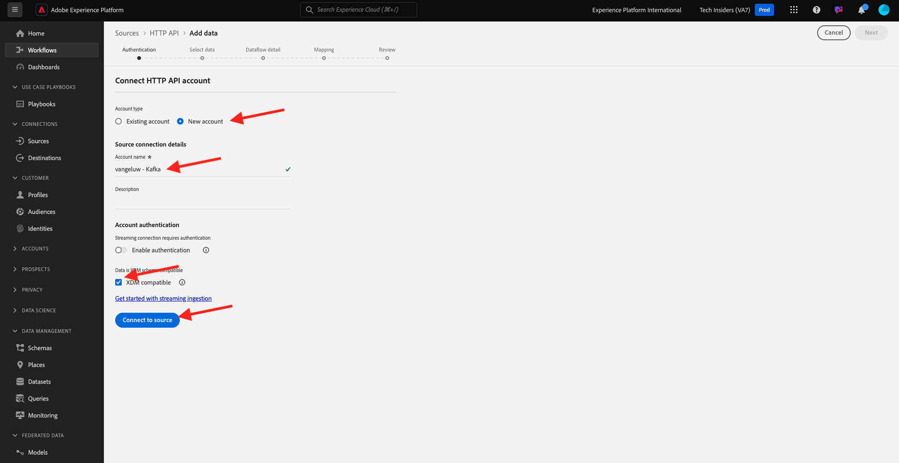

# 2.6.3 Adobe Experience Platformで HTTP API ストリーミングエンドポイントを設定する

Kafka にAdobe Experience Platform シンクコネクタを設定する前に、Adobe Experience Platformで HTTP API Source コネクタを作成する必要があります。 Adobe Experience Platform シンクコネクタを設定するには、HTTP API ストリーミングエンドポイント URL が必要です。

HTTP API Source コネクタを作成するには、次の URL に移動して、Adobe Experience Platformにログインします：[https://experience.adobe.com/platform](https://experience.adobe.com/platform)。

ログインすると、Adobe Experience Platformのホームページが表示されます。

続行する前に、**サンドボックス** を選択する必要があります。 選択するサンドボックスの名前は ``--aepSandboxName--`` です。 これを行うには、画面上部の青い線のテキスト **[!UICONTROL 実稼動製品]** をクリックします。 適切なサンドボックスを選択すると、画面が変更され、専用のサンドボックスが表示されます。

左側のメニューで、**ソース** に移動し、**ソースカタログ** を下にスクロールして **HTTP API** を表示します。 「**データを追加**」をクリックします。

**新規アカウント** をクリックします。 HTTP API 接続の名前として、`--aepUserLdap-- - Kafka` を使用します。この場合は **vangeluw - Kafka**。 **XDM 互換** のチェックボックスを有効にします。 **ソースに接続** をクリックします。

これが表示されたら、「**次へ**」をクリックします。

**既存のデータセット** を選択し、ドロップダウンメニューを開きます。 データセット **デモシステム – コールセンター（グローバル v1.1）のイベントデータセット** を検索して選択します。

「**次へ**」をクリックします。

「**次へ**」をクリックします。

「**完了**」をクリックします。

次に、作成した HTTP API Source コネクタの概要が表示されます。

次の演習で必要になるので、以下に示すように **ストリーミングエンドポイント** URL をコピーする必要があります。

`https://dcs.adobedc.net/collection/d282bbfc8a540321341576275a8d052e9dc4ea80625dd9a5fe5b02397cfd80dc`

この演習は完了しました。

次のステップ：[2.6.4 Kafka Connect とAdobe Experience Platformシンクコネクタをインストールして設定する ](./ex4.md)

[モジュール 2.6 に戻る](./aep-apache-kafka.md)

[すべてのモジュールに戻る](../../../overview.md)
