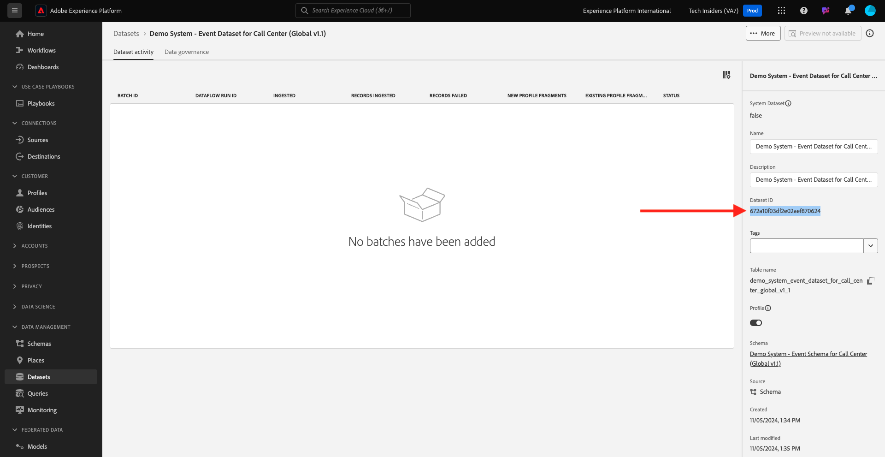

# 2.6.4 Kafka Connect とAdobe Experience Platformシンクコネクタのインストールと設定

## Adobe Experience Platform シンクコネクタのダウンロード

[https://github.com/adobe/experience-platform-streaming-connect/releases](https://github.com/adobe/experience-platform-streaming-connect/releases) にアクセスし、Adobe Experience Platform シンクコネクタの最新の公式リリースをダウンロードします。


ファイル **streaming-connect-sink-0.0.27-java-11.jar** をダウンロードします。


ダウンロードファイル **streaming-connect-sink-0.0.27-java-11.jar** をデスクトップに配置します。


## Kafka 接続の設定

デスクトップ上の **Kafka_AEP** という名前のフォルダーに移動して、フォルダー `kafka_2.13-3.9.0/config` に移動します。
そのフォルダで、任意のテキスト エディタを使用してファイル **connect-distributed.properties** を開きます。


テキストエディターで、34 行目と 35 行目に移動し、フィールド `key.converter.schemas.enable` と `value.converter.schemas.enable` を必ず `false` に設定します

```json
key.converter.schemas.enable=false
value.converter.schemas.enable=false
```

変更をこのファイルに保存します。


次に、フォルダー `kafka_2.13-3.1.0` に戻り、新しいフォルダーを手動で作成し、`connectors` という名前を付けます。


新しいフォルダを右クリックし、[**フォルダに新しい端子**] をクリックします。


その後、これが表示されます。 コマンド `pwd` を入力して、そのフォルダーのフルパスを取得します。 フルパスを選択し、クリップボードにコピーします。


テキスト エディタに戻り、ファイル **connect-distributed.properties** に移動し、最後の行（スクリーンショットの 89 行目）までスクロール ダウンします。 `# plugin.path=` で始まる行のコメントを解除（`#` を削除）して、`connectors` という名前のフォルダーへの完全なパスを貼り付ける必要があります。 結果は次のようになります。

`plugin.path=/Users/woutervangeluwe/Desktop/Kafka_AEP/kafka_2.13-3.9.0/connectors`

ファイル **connect-distributed.properties** への変更を保存し、テキスト エディタを閉じます。


次に、ダウンロードしたAdobe Experience Platform シンクコネクタの最新の公式リリースを、`connectors` という名前のフォルダーにコピーします。 前にダウンロードしたファイルの名前は **streaming-connect-sink-0.0.27-java-11.jar** で、`connectors` フォルダーに移動するだけです。


次に、**kafka_2.13-3.9.0** フォルダーのレベルで新しいターミナルウィンドウを開きます。 そのフォルダを右クリックして、[**フォルダに新しい端子**] をクリックします。

[ ターミナル ] ウィンドウで、次のコマンドを貼り付けます：`bin/connect-distributed.sh config/connect-distributed.properties` そして **Enter** をクリックします。 このコマンドは Kafka Connect を起動し、Adobe Experience Platformシンクコネクタのライブラリをロードします。


数秒後、次のようなメッセージが表示されます。


## Postmanを使用してAdobe Experience Platform シンクコネクタを作成します

Postmanを使用して Kafka Connect とやり取りできるようになりました。 それには、[&#x200B; このPostman Collection](./../../../assets/postman/postman_kafka.zip) をダウンロードし、デスクトップ上のローカルコンピューターに解凍します。 その後、`Kafka_AEP.postman_collection.json` というファイルが得られます。


このファイルをPostmanに読み込む必要があります。 これを行うには、Postmanを開き、「**読み込み**」をクリックし、ファイル `Kafka_AEP.postman_collection.json` をポップアップにドラッグ&amp;ドロップして、「**読み込み**」をクリックします。


このコレクションは、Postmanの左側のメニューにあります。 最初のリクエスト、**GET利用可能な Kafka Connect コネクタ** をクリックして開きます。


その後、これが表示されます。 青い **送信** ボタンをクリックすると、空の応答 `[]` ーが表示されます。 空の応答は、現在 Kafka Connect コネクタが定義されていないことが原因です。


コネクタを作成するには、をクリックして Kafka コレクションの 2 番目のリクエスト（**POSTAEP シンクコネクタを作成** を開き、**本文** に移動します。 その後、これが表示されます。 11 行目に **&quot;aep.endpoint&quot;: &quot;&quot;** と表示されている場合は、前の演習の最後に受け取った HTTP API ストリーミングエンドポイント URL を貼り付ける必要があります。 HTTP API ストリーミングエンドポイント URL は次のようになります。`https://dcs.adobedc.net/collection/63751d0f299eeb7aa48a2f22acb284ed64de575f8640986d8e5a935741be9067`


貼り付けた後、リクエストの本文は次のようになります。 青い **送信** ボタンをクリックして、コネクタを作成します。 コネクタの作成についてすぐに応答を受け取ります。


最初のリクエスト、**GET利用可能な Kafka Connect コネクタ** をクリックして再度開き、青い **送信** ボタンを再度クリックします。 これで、Kafka Connect コネクタが存在することがわかります。


次に、Kafka コレクションの 3 番目のリクエスト、**GETチェック Kafka Connect Connector Status** を開きます。 青い **送信** ボタンをクリックすると、次のような応答が表示され、コネクタが実行中であることを示します。


## エクスペリエンスイベントの作成

フォルダ **kafka_2.13-3.9.0** を右クリックし、**フォルダに新しいターミナル** をクリックして、新しい **ターミナル** ウィンドウを開きます。


次のコマンドを入力します。

`bin/kafka-console-producer.sh --broker-list 127.0.0.1:9092 --topic aep`

その後、これが表示されます。 改行してから Enter ボタンを押すと、新しいメッセージがトピック **aep** に送信されます。


メッセージを送信すると、Adobe Experience Platform シンクコネクタによって使用され、リアルタイムでAdobe Experience Platformに取り込まれます。

以下のエクスペリエンスイベントペイロードのサンプルを取得し、テキストエディターにコピーします。

```json
{
  "header": {
    "datasetId": "61fe23fd242870194a6d779c",
    "imsOrgId": "--aepImsOrgID--",
    "source": {
      "name": "Launch"
    },
    "schemaRef": {
      "id": "https://ns.adobe.com/experienceplatform/schemas/b0190276c6e1e1e99cf56c99f4c07a6e517bf02091dcec90",
      "contentType": "application/vnd.adobe.xed-full+json;version=1"
    }
  },
  "body": {
    "xdmMeta": {
      "schemaRef": {
        "id": "https://ns.adobe.com/experienceplatform/schemas/b0190276c6e1e1e99cf56c99f4c07a6e517bf02091dcec90",
        "contentType": "application/vnd.adobe.xed-full+json;version=1"
      }
    },
    "xdmEntity": {
      "eventType": "callCenterInteractionKafka",
      "_id": "",
      "timestamp": "2024-11-25T09:54:12.232Z",
      "_experienceplatform": {
        "identification": {
          "core": {
            "phoneNumber": ""
          }
        },
        "interactionDetails": {
          "core": {
            "callCenterAgent": {
              "callID": "Support Contact - 3767767",
              "callTopic": "contract",
              "callFeeling": "negative"
            }
          }
        }
      }
    }
  }
}
```

その後、これが表示されます。 2 つのフィールドを手動で更新する必要があります。

- **_id**: `--aepUserLdap--1234` のように、ランダムな id に設定してください
- **timestamp**：タイムスタンプを現在の日時に更新します
- **phoneNumber**：デモ web サイトで以前に作成したアカウントの phoneNumber を入力します。 これは、プロファイルビューアパネルの **ID** の下にあります。

また、次のフィールドを確認して更新する必要もあります。

- **datasetId**：データセット Demo System - Call Center 用イベントデータセット（グローバル v1.1）のデータセット ID をコピーする必要があります



- **imsOrgID**:IMS 組織 ID は `--aepImsOrgId--` です

>[!NOTE]
>
>フィールド **_id** は、データ取り込みごとに一意である必要があります。 複数のイベントを生成する場合は、フィールド **_id** を新しい一意の値に毎回更新するようにしてください。

すると、次のようになります。


次に、エクスペリエンスイベント全体をクリップボードにコピーします。 JSON ペイロードの空白を削除する必要があります。それには、オンラインツールを使用します。 [http://jsonviewer.stack.hu/](http://jsonviewer.stack.hu/) に移動して実行してください。

エクスペリエンスイベントをエディターに貼り付け、「**空白を削除**」をクリックします。


次に、出力テキストをすべて選択し、クリップボードにコピーします。


ターミナルウィンドウに戻ります。


空白を含まない新しいペイロードをターミナルウィンドウに貼り付け、**Enter** をクリックします。


次に、デモ Web サイトに戻り、ページを更新します。 これで、以下のように、プロファイルの **エクスペリエンスイベント** の下にエクスペリエンスイベントが表示されます。


>[!NOTE]
>
>コールセンターインタラクションをプロファイルビューアパネルに表示する場合は、[https://dsn.adobe.com](https://dsn.adobe.com) で、タブ **プロファイルビューア** に移動し、**イベント** の下に次の変数を含む新しい行を追加して、プロジェクトに以下のラベルとフィルターを追加する必要があります。
>- **イベントタイプラベル**：コールセンターインタラクション
>- **イベントタイプフィルター**:callCenterInteractionKafka
>- **タイトル**: `--aepTenantId--.interactionDetails.core.callCenterAgent.callID`


この演習は完了しました。

次の手順：[&#x200B; 概要とメリット &#x200B;](./summary.md)

[モジュール 2.6 に戻る](./aep-apache-kafka.md)

[すべてのモジュールに戻る](../../../overview.md)
