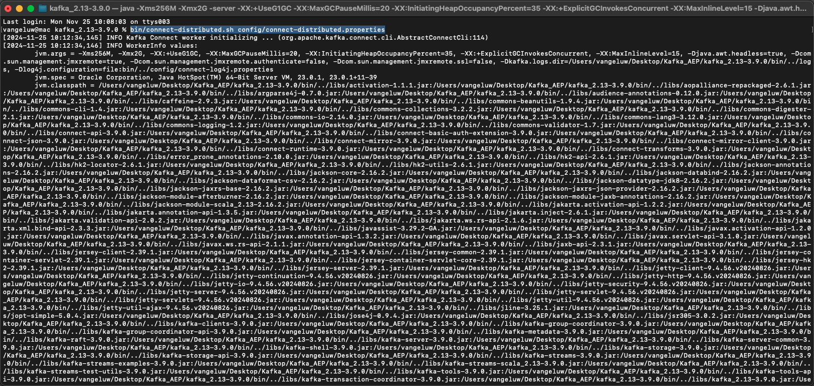
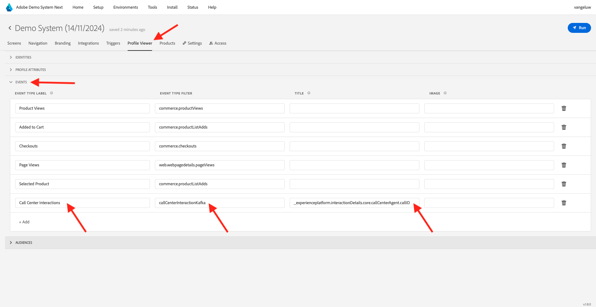

# 2.6.4 Kafka Connect とAdobe Experience Platformシンクコネクタのインストールと設定

## 2.6.4.1 Adobe Experience Platform シンクコネクタのダウンロード

[https://github.com/adobe/experience-platform-streaming-connect/releases](https://github.com/adobe/experience-platform-streaming-connect/releases) にアクセスし、Adobe Experience Platform シンクコネクタの最新の公式リリースをダウンロードします。


ダウンロードファイル **streaming-connect-sink-0.0.14-java-11.jar** をデスクトップに配置します。


## 2.6.4.2 Kafka 接続の設定

デスクトップ上の **Kafka_AEP** という名前のフォルダーに移動して、フォルダー `kafka_2.13-3.1.0/config` に移動します。
そのフォルダで、任意のテキスト エディタを使用してファイル **connect-distributed.properties** を開きます。


テキストエディターで、34 行目と 35 行目に移動し、フィールド `key.converter.schemas.enable` と `value.converter.schemas.enable` を必ず `false` に設定します

```json
key.converter.schemas.enable=false
value.converter.schemas.enable=false
```

変更をこのファイルに保存します。


次に、フォルダー `kafka_2.13-3.1.0` に戻り、新しいフォルダーを手動で作成し、`connectors` という名前を付けます。


フォルダを右クリックし、[**フォルダに新しい端子**] をクリックします。


その後、これが表示されます。 コマンド `pwd` を入力して、そのフォルダーのフルパスを取得します。 フルパスを選択し、クリップボードにコピーします。


テキスト エディタに戻り、ファイル **connect-distributed.properties** に移動し、最後の行（スクリーンショットの 86 行目）までスクロール ダウンします。 `# plugin.path=` で始まる行のコメントを解除して、`connectors` という名前のフォルダーへのフルパスを貼り付ける必要があります。 結果は次のようになります。

`plugin.path=/Users/woutervangeluwe/Desktop/Kafka_AEP/kafka_2.13-3.1.0/connectors`

ファイル **connect-distributed.properties** への変更を保存し、テキスト エディタを閉じます。


次に、ダウンロードしたAdobe Experience Platform シンクコネクタの最新の公式リリースを、`connectors` という名前のフォルダーにコピーします。 前にダウンロードしたファイルの名前は **streaming-connect-sink-0.0.14-java-11.jar** です。このファイルを `connectors` フォルダーに移動するだけです。


次に、**kafka_2.13-3.1.0** フォルダーのレベルで新しいターミナルウィンドウを開きます。 そのフォルダを右クリックして、[**フォルダに新しい端子**] をクリックします。

[ ターミナル ] ウィンドウで、次のコマンドを貼り付けます：`bin/connect-distributed.sh config/connect-distributed.properties` そして **Enter** をクリックします。 このコマンドは Kafka Connect を起動し、Adobe Experience Platformシンクコネクタのライブラリをロードします。



数秒後、次のようなメッセージが表示されます。


## 2.6.4.3 Postmanを使用して、Adobe Experience Platform シンクコネクタを作成する

Postmanを使用して Kafka Connect とやり取りできるようになりました。 それには、[ このPostman Collection](./../../../assets/postman/postman_kafka.zip) をダウンロードし、デスクトップ上のローカルコンピューターに解凍します。 その後、`Kafka_AEP.postman_collection.json` というファイルが得られます。


このファイルをPostmanに読み込む必要があります。 これを行うには、Postmanを開き、「**読み込み**」をクリックし、ファイル `Kafka_AEP.postman_collection.json` をポップアップにドラッグ&amp;ドロップして、「**読み込み**」をクリックします。


このコレクションは、Postmanの左側のメニューにあります。 最初のリクエスト、**GET利用可能な Kafka Connect コネクタ** をクリックして開きます。


その後、これが表示されます。 青い **送信** ボタンをクリックすると、空の応答 `[]` ーが表示されます。 空の応答は、現在 Kafka Connect コネクタが定義されていないことが原因です。


コネクタを作成するには、をクリックして、Kafka コレクションの 2 番目のリクエスト（**POSTAEP シンクコネクタの作成** を開きます。 その後、これが表示されます。 11 行目に **&quot;aep.endpoint&quot;: &quot;&quot;** と表示されている場合は、演習 [15.3](./ex3.md) の最後に受け取った HTTP API ストリーミングエンドポイント URL を貼り付ける必要があります。 HTTP API ストリーミングエンドポイント URL は次のようになります。`https://dcs.adobedc.net/collection/d282bbfc8a540321341576275a8d052e9dc4ea80625dd9a5fe5b02397cfd80dc`


貼り付けた後、リクエストの本文は次のようになります。 青い **送信** ボタンをクリックして、コネクタを作成します。 コネクタの作成についてすぐに応答を受け取ります。


最初のリクエスト、**GET利用可能な Kafka Connect コネクタ** をクリックして再度開き、青い **送信** ボタンを再度クリックします。 これで、Kafka Connect コネクタが作成されたことがわかります。


次に、Kafka コレクションの 3 番目のリクエスト、**GETチェック Kafka Connect Connector Status** を開きます。 青い **送信** ボタンをクリックすると、次のような応答が表示され、コネクタが実行中であることを示します。


## 2.6.4.4 エクスペリエンスイベントの作成

フォルダ **kafka_2.13-3.1.0** を右クリックし、**フォルダに新しいターミナル** をクリックして、新しい **ターミナル** ウィンドウを開きます。


次のコマンドを入力します。

`bin/kafka-console-producer.sh --broker-list 127.0.0.1:9092 --topic aep`


その後、これが表示されます。 改行してから Enter ボタンを押すと、新しいメッセージがトピック **aep** に送信されます。


メッセージを送信すると、Adobe Experience Platform シンクコネクタによって使用され、リアルタイムでAdobe Experience Platformに取り込まれます。

これをテストするために少しデモをしましょう。

[https://builder.adobedemo.com/projects](https://builder.adobedemo.com/projects) に移動します。 Adobe IDでログインすると、このが表示されます。 Web サイトプロジェクトをクリックして開きます。


**Screens** ページで、「**実行** をクリックします。


その後、デモ Web サイトが開きます。 URL を選択してクリップボードにコピーします。


新しい匿名ブラウザーウィンドウを開きます。


前の手順でコピーしたデモ Web サイトの URL を貼り付けます。 その後、Adobe IDを使用してログインするように求められます。


アカウントタイプを選択し、ログインプロセスを完了します。


次に、匿名ブラウザーウィンドウに web サイトが読み込まれます。 デモごとに、新しい匿名ブラウザーウィンドウを使用して、デモ Web サイトの URL を読み込む必要があります。


画面の左上隅にあるAdobeロゴアイコンをクリックして、プロファイルビューアを開きます。


現在は不明なこの顧客のプライマリ ID として **0} ユーザー ID} を持つプロファイルビューアパネルとリアルタイムExperience Cloudプロファイルをご覧ください。**


登録/ログインページに移動します。 **アカウントを作成** をクリックします。


詳細を入力して **登録** をクリックすると、前のページにリダイレクトされます。


プロファイルビューアパネルを開き、リアルタイム顧客プロファイルに移動します。 プロファイルビューアパネルには、新しく追加されたメール識別子や電話識別子など、すべての個人データが表示されます。


過去のアクティビティに基づいたエクスペリエンスイベントがいくつか表示される場合があります。


これを変更し、Callcenter のエクスペリエンスイベントを Kafka からAdobe Experience Platformに送りましょう。

以下のエクスペリエンスイベントペイロードのサンプルを取得し、テキストエディターにコピーします。

```json
{
  "header": {
    "datasetId": "61fe23fd242870194a6d779c",
    "imsOrgId": "--aepImsOrgID--",
    "source": {
      "name": "Launch"
    },
    "schemaRef": {
      "id": "https://ns.adobe.com/experienceplatform/schemas/b0190276c6e1e1e99cf56c99f4c07a6e517bf02091dcec90",
      "contentType": "application/vnd.adobe.xed-full+json;version=1"
    }
  },
  "body": {
    "xdmMeta": {
      "schemaRef": {
        "id": "https://ns.adobe.com/experienceplatform/schemas/b0190276c6e1e1e99cf56c99f4c07a6e517bf02091dcec90",
        "contentType": "application/vnd.adobe.xed-full+json;version=1"
      }
    },
    "xdmEntity": {
      "eventType": "callCenterInteractionKafka",
      "_id": "",
      "timestamp": "2022-02-23T09:54:12.232Z",
      "_experienceplatform": {
        "identification": {
          "core": {
            "phoneNumber": ""
          }
        },
        "interactionDetails": {
          "core": {
            "callCenterAgent": {
              "callID": "Support Contact - 3767767",
              "callTopic": "contract",
              "callFeeling": "negative"
            }
          }
        }
      }
    }
  }
}
```

その後、これが表示されます。 2 つのフィールドを手動で更新する必要があります。

- **_id**: `--aepUserLdap--1234` のように、ランダムな id に設定してください
- **timestamp**：タイムスタンプを現在の日時に更新します
- **phoneNumber**：デモ web サイトで作成したばかりのアカウントの phoneNumber を入力します。 これは、プロファイルビューアパネルの **ID** の下にあります。

また、次のフィールドを確認して更新する必要もあります。
- **datasetId**：データセット Demo System - Call Center 用イベントデータセット（グローバル v1.1）のデータセット ID をコピーする必要があります
- **imsOrgID**:IMS 組織 ID は `--aepImsOrgId--` です

>[!NOTE]
>
>フィールド **_id** は、データ取り込みごとに一意である必要があります。 複数のイベントを生成する場合は、フィールド **_id** を新しい一意の値に毎回更新するようにしてください。


すると、次のようになります。


次に、エクスペリエンスイベント全体をクリップボードにコピーします。 JSON ペイロードの空白を削除する必要があります。それには、オンラインツールを使用します。 [http://jsonviewer.stack.hu/](http://jsonviewer.stack.hu/) に移動して実行してください。


エクスペリエンスイベントをエディターに貼り付け、「**空白を削除**」をクリックします。


次に、出力テキストをすべて選択し、クリップボードにコピーします。


ターミナルウィンドウに戻ります。


空白を含まない新しいペイロードをターミナルウィンドウに貼り付け、**Enter** をクリックします。


次に、デモ Web サイトに戻り、ページを更新します。 これで、以下のように、プロファイルの **その他のイベント** にエクスペリエンスイベントが表示されます。


>[!NOTE]
>
>コールセンターインタラクションをプロファイルビューアパネルに表示する場合は、**プロファイルビューア** タブに移動して、[https://builder.adobedemo.com/projects](https://builder.adobedemo.com/projects) で以下のラベルとフィルターをプロジェクトに追加する必要があります。



この演習は完了しました。

次の手順：[ 概要とメリット ](./summary.md)

[モジュール 2.6 に戻る](./aep-apache-kafka.md)

[すべてのモジュールに戻る](../../../overview.md)
