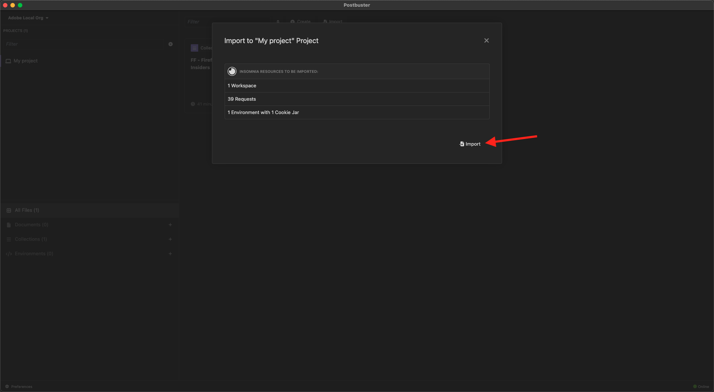

# PostBuster

>[!IMPORTANT]
>
>以下の手順は、Adobeの従業員のみを対象としています。

>[!IMPORTANT]
>
>以下の手順に従うと、これらの演習で使用する必要なすべての API コレクションが既に利用可能になります。
>
>- [2.1.3 独自のリアルタイム顧客プロファイルの視覚化 – API](./modules/rtcdp-b2c/module2.1/ex3.md)
>- [2.3.6 宛先SDK](./modules/rtcdp-b2c/module2.3/ex6.md)
>- [3.3.6 API を使用して決定をテストする ](./modules/ajo-b2c/module3.3/ex6.md)
>- [5.1.8 クエリサービス API](./modules/datadistiller/module5.1/ex8.md)

## PostBuster のインストール

[https://adobe.service-now.com/esc?id=adb_esc_kb_article&amp;sysparm_article=KB0020542](https://adobe.service-now.com/esc?id=adb_esc_kb_article&amp;sysparm_article=KB0020542) に移動します。

**PostBuster** の最新リリースをダウンロードします。


お使いの OS に適したバージョンをダウンロードします。


ダウンロードが完了し、インストールしたら、PostBuster を開きます。 この画像が表示されます。 **インポート** をクリックします。


[postbuster.json.zip](./assets/postman/postbuster.json.zip) をダウンロードし、デスクトップに抽出します。


**ファイルを選択** をクリックします。


ファイル **aep_tutorial.json** を選択します。 「**開く**」をクリックします。


この画像が表示されます。 **スキャン** をクリックします。


**インポート** をクリックします。



この画像が表示されます。 クリックして、読み込んだコレクションを開きます。


これで、コレクションが表示されます。 環境変数を保持するには、引き続き環境を設定する必要があります。


**ベース環境** をクリックしてから、**編集** アイコンをクリックします。


この画像が表示されます。


以下の環境プレースホルダーをコピーして、**ベース環境** に貼り付けます。

```json
{
	"CLIENT_SECRET": "",
	"API_KEY": "",
	"ACCESS_TOKEN": "",
	"SCOPES": [
		"openid",
		"AdobeID",
		"read_organizations",
		"additional_info.projectedProductContext",
		"session",
		"ff_apis",
		"firefly_api"
	],
	"TECHNICAL_ACCOUNT_ID": "",
	"IMS": "ims-na1.adobelogin.com",
	"IMS_ORG": "",
	"access_token": "",
	"IMS_TOKEN": "",
	"QS_QUERY_ID": "",
	"SANDBOX_NAME": ""
}
```

これで完了です。


Adobe IO プロジェクトを作成すると、環境は次のようになります。 これは後で対処されるため、今すぐ行う必要はありません。


>[!NOTE]
>
>{width="50px" align="left"}
>
>ご不明な点がある場合は、have suggestions on future content の一般的なフィードバックをお知らせください。**techinsiders@adobe.com** に電子メールを送信して、技術インサイダーに直接問い合わせてください。

[すべてのモジュールに戻る](./overview.md)
