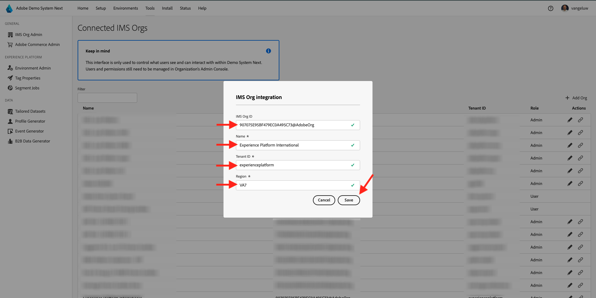
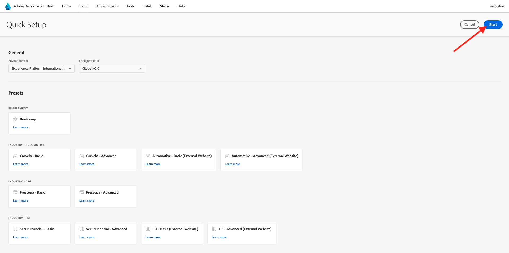

# Adobe Experience Platform インスタンスの設定

>[!IMPORTANT]
>
>このページは、システム管理者の役割のみを対象としています。 次の手順に従うには、特定のインスタンスのシステム管理者アクセス権が必要です。 Adobe Experience Cloud組織のシステム管理者でない場合は、以下の手順に進む前に、システム管理者に連絡して承認や支援を求めてください。

## 概要

これらのチュートリアルをすべて実践的に行うには、IMS 組織で次のAdobe Experience Cloud アプリケーションをプロビジョニングする必要があります。

- Adobeリアルタイム CDP
- Adobe Experience Platform のデータ収集
- Adobe Journey Optimizer
- Customer Journey Analytics
- Data Distiller
- 連合オーディエンス構成

特定のアプリケーションサービスが IMS 組織用にプロビジョニングされていない場合、その特定の演習を実践的に行うことはできません。

## サンドボックスの作成

独自のAdobe Experience Platform インスタンスでチュートリアルを進めるには、まず新しい開発用サンドボックスを設定することをお勧めします。 新しいサンドボックスを作成するには、[https://experience.adobe.com/platform](https://experience.adobe.com/platform) に移動し、「サンドボックス」に移動してから、「参照 **をクリックし** す。 **サンドボックスを作成** をクリックします。

次のようにサンドボックスを作成します。

- タイプ：**開発**
- 名前：**aep-tutorial**
- タイトル：**Adobe Experience Platform チュートリアル**

「**作成**」をクリックします。

これで、サンドボックスが作成されます。 数分後、これが表示されます。

## 権限の設定

**権限** に移動し、**役割** に移動します。

クリックすると、このチュートリアルを進める学習者が使用する特定の **役割** が開きます。 **役割を作成** をクリックします。

あなたの役割に **Adobe Experience Platform チュートリアル** のような名前を付け、「**確認**」をクリックします。

**サンドボックス** ドロップダウンメニューで、作成したばかりのサンドボックスを選択し、他のサンドボックスも削除します（「**Prod**」も削除します）。

様々なリソースを追加し、権限を設定します。 **サンドボックス管理** の権限を追加しないようにしてください。

指示に従ってさらにリソースを追加し、権限を設定します。

指示に従ってさらにリソースを追加し、権限を設定します。 「**保存**」をクリックします。次に、「**閉じる** をクリックします。

## Adobe I/Oの設定

に移動
[https://developer.adobe.com/console/integrations](https://developer.adobe.com/console/integrations)。 正しいインスタンスに属していることを確認します。 **新規プロジェクトを作成** をクリックします。

**プロジェクトに追加** をクリックしてから、**API** をクリックしてください。

**Adobe Experience Platform** をクリックし、**Experience PlatformAPI** を有効にします。 「**次へ**」をクリックします。

**資格情報名** には、**DSN AEP チュートリアル** を使用します。 「**次へ**」をクリックします。

使用可能な製品プロファイルの 1 つを選択します。 このAdobe I/Oプロファイルでは、この製品プロジェクトのアクセス許可を特定できません。これは、次の手順で行います。 **設定済み API を保存** をクリックします。

**プロジェクトに追加** をクリックしてから、もう一度 **API** をクリックしてください。

**Adobe Experience Platform** をクリックし、**Experience Platform LaunchAPI** を有効にします。 「**次へ**」をクリックします。

「**次へ**」をクリックします。

データ収集プロパティを作成および管理できるようにする製品プロファイルを選択します。 **設定済み API を保存** をクリックします。

その後、これが表示されます。 現在の **Project XXX** の名前をクリックします。

**プロジェクトを編集** をクリックします。

**DSN Adobe Experience Platform Tutorial** など、新しい **プロジェクトタイトル** を入力します。 「**保存**」をクリックします。

これで、Adobe I/Oプロジェクトの準備が整いました。

## 役割にAdobe I/Oプロジェクトをリンク

**権限**/ **役割** に移動し、前に作成した新しい役割をクリックします。

**API 資格情報** に移動します。 「**+ API 資格情報を追加**」をクリックします。

次に、前の手順で作成したAdobe I/O資格情報が表示されます。 プリセットを選択して、「**保存** をクリックします。

これで、Adobe Experience Platform API へのアクセスに必要な権限を持つAdobe I/Oプロジェクトが設定されました。

>[!IMPORTANT]
>
>デモシステムの次の手順に進むには、10 分以上待つ必要があります。

## 次に、デモシステムで環境を設定します

[https://dsn.adobe.com/tools/org-admin](https://dsn.adobe.com/tools/org-admin) に移動します。 「**+組織を追加**」をクリックします。

必須フィールドに入力します。

- IMS Org ID
- 名前
- テナント ID （アンダースコア **は使用しません**
- 領域

これらのフィールドの値については、システム管理者に相談してください。

「**保存**」をクリックします。

環境がリストに含まれるようになります。 リストで目的のリンクを見つけて、「**link**」アイコンをクリックします。

ここで、Adobe I/Oプロジェクトの資格情報の一部として作成した値を入力する必要があります。 **クライアント ID**、**クライアントシークレット** および **スコープ** については、次を参照してください。

**テクニカルアカウント ID**:

これらをコピーして、ここに貼り付け、**保存** をクリックします。

これで、DSN 環境が正しく設定されました。

## DSN 環境へのアクセスのセットアップ

[https://dsn.adobe.com/tools/environment-admin](https://dsn.adobe.com/tools/environment-admin) に移動します。 作成した IMS 組織を選択し、ユーザーを選択して、「**サンドボックス** の **+割り当て** をクリックします。

上記の最初の手順で定義した **サンドボックス名** を入力します。 次のようになります。

- 名前：**aep-tutorial**

「**確認**」をクリックします。

これで、選択したユーザーがサンドボックスを使用できるようになりました。

## DSN のクイックセットアップ

[https://dsn.adobe.com/quick-setup](https://dsn.adobe.com/quick-setup) に移動します。 **環境** ドロップダウンメニューを開き、IMS 組織/ サンドボックスを選択します。

**Configuration** については、「**Global v2.0**」を選択します。

**Industry - Telco** までスクロールし、「**Citi Signal - Advanced**」を選択します。

上にスクロールして、「開始 **をクリックし** す。

**タイトル** を入力し、「**開始**」をクリックします。

>[!NOTE]
>
>サンドボックスでデフォルトの結合ポリシーが作成されていない場合、エラーが発生することがあります。 その場合は、結合ポリシーが自動的に作成されるまでもう少し待つか、手動でAdobe Experience Platformのプロファイル /結合ポリシーに移動し、新しいデフォルトの結合ポリシーを作成します。

その後、進行中のインストールの進行状況が表示されます。これには数分かかります。

すべてが正常に完了すると、Adobe Experience Platform インスタンスが正常に設定され、学習者がチュートリアルを受講する準備が整います。

>[!NOTE]
>
>データの読み込み手順はチュートリアルでは使用しないので、この手順が失敗した場合でも、心配する必要はありません。続行してください。

[https://experience.adobe.com/platform](https://experience.adobe.com/platform) に移動し、**データセット** に移動します。 データセットの同様のリストが表示されます。これらはすべて DSN Quick Setup によって作成されたものです。

>[!NOTE]
>
>Adobe Experience Platformとそのアプリケーションについて知るのに時間を費やしていただき、ありがとうございます。 ご不明な点がある場合は、have suggestions on future content の一般的なフィードバックをお知らせください。**techinsiders@adobe.com** に電子メールを送信して、技術インサイダーに直接問い合わせてください。

{width="50px" align="left"}

>[!NOTE]
>
>ご不明な点がある場合は、have suggestions on future content の一般的なフィードバックをお知らせください。**techinsiders@adobe.com** に電子メールを送信して、技術インサイダーに直接問い合わせてください。

[すべてのモジュールに戻る](./overview.md)
