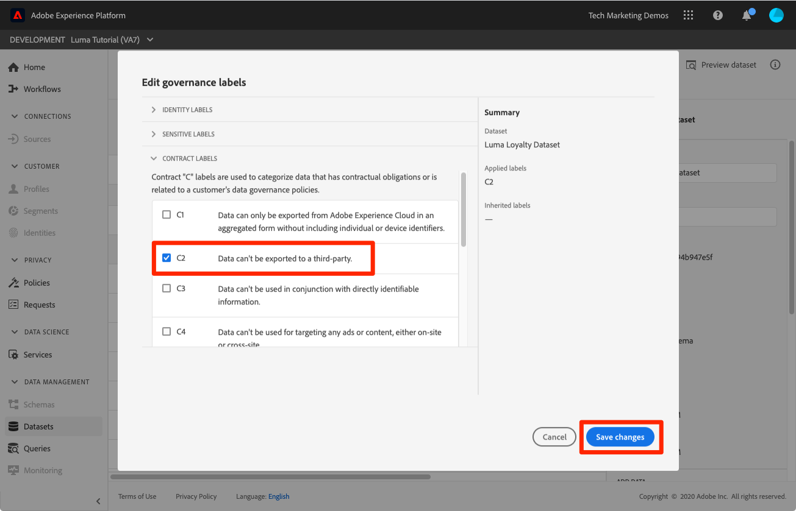

# データガバナンスフレームワークの適用

<!--15min-->

このレッスンでは、サンドボックスに取り込んだデータにデータガバナンスフレームワークを適用します。

Adobe Experience Platform データガバナンスを使用すると、顧客データを管理し、データの使用に適用される規制、制限、ポリシーへのコンプライアンスを確保できます。データの使用制御など、様々なレベルでExperience Platform内で重要な役割を果たします。

この演習を始める前に、データガバナンスに関する以下の短いビデオをご覧ください。
>[!VIDEO](https://video.tv.adobe.com/v/36653?quality=12&learn=on)

>[!VIDEO](https://video.tv.adobe.com/v/29708?quality=12&learn=on)

<!--
## Permissions required

In the [Configure Permissions](configure-permissions.md) lesson, you set up all the access controls required to complete this lesson, specifically:

* Permission items **[!UICONTROL Data Governance]** > **[!UICONTROL Manage Usage Labels]**, **[!UICONTROL Manage Data Usage Policies]** and **[!UICONTROL View Data Usage Policies]**
* Permission items **[!UICONTROL Data Management]** > **[!UICONTROL View Datasets]** and **[!UICONTROL Manage Datasets]**
* Permission item **[!UICONTROL Sandboxes]** > `Luma Tutorial`
* User-role access to the `Luma Tutorial Platform` Product Profile
-->

## ビジネスシナリオ

Luma は、ロイヤルティデータをサードパーティと共有しないという約束を、ロイヤリティプログラムのメンバーに対して行います。 このシナリオは、レッスンの残りの部分で実装します。

## データガバナンスラベルの適用

データガバナンスプロセスの最初の手順は、データにガバナンスラベルを適用することです。 その前に、使用可能なラベルについて簡単に説明します。

1. Platform ユーザーインターフェイスで、「 **[!UICONTROL ポリシー]** 左のナビゲーション
1. 次に移動： **[!UICONTROL ラベル]** タブをクリックして、アカウントのすべてのラベルを表示します。

すぐに使用できるラベルは多数ありますが、 [!UICONTROL ラベルを作成] 」ボタンをクリックします。 主に次の 3 つのタイプがあります。 [!UICONTROL 契約ラベル], [!UICONTROL ID ラベル]、および [!UICONTROL 機密ラベル] 一般的な原因データに対応するデータが制限される場合があります。 各ラベルには [!UICONTROL わかりやすい名前] 短い [!UICONTROL 名前] これはタイプと数字の略語に過ぎません。 例えば、 [!DNL C1] ラベルは、ロイヤリティポリシーに必要な「サードパーティの書き出しなし」のものです。

次に、使用を制限するデータにラベルを付けます。

1. Platform ユーザーインターフェイスで、「 **[!UICONTROL データセット]** 左のナビゲーション
1. `Luma Loyalty Dataset` を開きます
1. 次に移動： **[!UICONTROL データガバナンス]** タブ
1. ラベルを個々のフィールドに適用するか、データセット全体に適用できます。 データセット全体にラベルを適用します。 鉛筆アイコンをクリックします。 このアイコンが表示されない場合は、ブラウザーを広げるか、中央のパネルを右にスクロールしてみてください。
   
1. モーダルで、を展開します。 **[!UICONTROL 契約ラベル]** セクションで、 **[!UICONTROL C2]** ラベル
1. を選択します。 **[!UICONTROL 変更を保存]** ボタン
   
1. メインに戻る [!UICONTROL データガバナンス] 画面、 **[!UICONTROL 継承されたラベルを表示]** オンにすると、データセット内のすべてのフィールドにラベルがどのように適用されたかを確認できます。
   

<!--adding extra, unnecessary fields from field groups makes it harder to see which fields really need labels-->
<!--Are there any best practices for applying governance labels-->

## データガバナンスポリシーの作成

データにラベルが付いたので、ポリシーを作成できます。

1. Platform ユーザーインターフェイスで、「 **[!UICONTROL ポリシー]** 左のナビゲーション
1. 「参照」タブには、C2 ラベルをマーケティングアクションに関連付ける、「サードパーティの書き出し制限」と呼ばれる既製のポリシーが既に存在します [!UICONTROL サードパーティに書き出し] — まさに必要なものを！
1. ポリシーを選択し、 **[!UICONTROL ポリシーのステータス]** 切り替え
   

独自のポリシーを作成するには、 **[!UICONTROL ポリシーを作成]** 」ボタンをクリックします。 ウィザードが開き、複数のラベルとマーケティングアクションの制限を組み合わせることができます。

## ガバナンスポリシーの実施

ガバナンスポリシーの実施は、明らかにフレームワークの主要な要素です。 強制は、データがアクティブ化され、Platform( 特にReal-time Customer Data Platform) から送信されると、ダウンストリームで発生します。ライセンスを供与している場合とそうでない場合があります。 どちらにしても、このチュートリアルの範囲外です。 しかし、あなたは絞首状態のままではなく、このビデオでポリシーがどのように適用されるかについての詳細を学ぶことができます。 また、ポリシーに違反した場合の動作も示されます。

>[!VIDEO](https://video.tv.adobe.com/v/33631/?t=151&quality=12&learn=on)

## その他のリソース

* [データガバナンスに関するドキュメント](https://experienceleague.adobe.com/docs/experience-platform/data-governance/home.html?lang=ja)
* [データセットサービス API リファレンス](https://www.adobe.io/experience-platform-apis/references/dataset-service/)
* [ガバナンスポリシーサービス API リファレンス](https://www.adobe.io/experience-platform-apis/references/policy-service/)

次に、に進みます。 [クエリサービス](run-queries.md).
