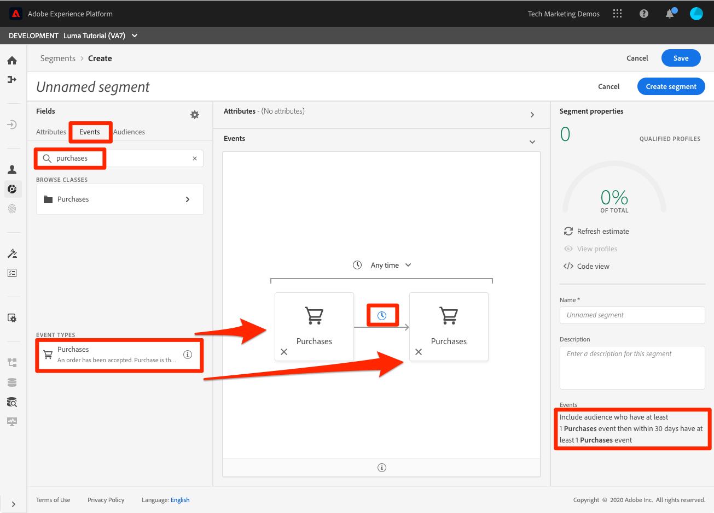

# セグメントの作成

<!-- 30 min-->
このレッスンでは、前のレッスンで取り込んだプロファイルデータに基づいて、一部のセグメントを作成します。

リアルタイムの顧客プロファイルを取得したら、類似した特性を共有し、マーケティング戦略に同様の応答をする個人のセグメントを作成できます。 これらのセグメントの構成要素は、前に作成した XDM フィールドです。

**データアーキテクト** では、このチュートリアル以外でセグメントを作成し、同僚に対してこのタスクを実行するようサポートする必要があります。

演習を開始する前に、次の短いビデオを見て、セグメントの作成の詳細を確認してください。
>[!VIDEO](https://video.tv.adobe.com/v/27254?quality=12&learn=on)

## 必要な権限

内 [権限の設定](configure-permissions.md) レッスンでは、このレッスンを完了するために必要なすべてのアクセス制御を設定します。具体的には、次の設定を行います。

* 権限項目 **[!UICONTROL プロファイル管理]** > **[!UICONTROL セグメントの管理]**, **[!UICONTROL セグメントを表示]**、および **[!UICONTROL オーディエンスセグメントを書き出し]**
* 権限項目 **[!UICONTROL プロファイル管理]** > **[!UICONTROL プロファイルの表示]**、および **[!UICONTROL プロファイルの管理]**
* 権限項目 **[!UICONTROL サンドボックス]** > `Luma Tutorial`
* へのユーザーロールアクセス `Luma Tutorial Platform` 製品プロファイル
* への開発者ロールのアクセス `Luma Tutorial Platform` 製品プロファイル（API 用）

## 基本セグメントの作成

ゴールドまたはプラチナのステータスを持つロイヤルティプログラムの顧客に対するシンプルなセグメントを作成しましょう

1. Platform ユーザーインターフェイスで、に移動します。 **[!UICONTROL セグメント]** 左のナビゲーション
1. を選択します。 **[!UICONTROL セグメントを作成]** ボタン
1. スキーマビルダーの左側に、属性（レコードデータ）、イベント（時系列データ）、オーディエンスの 3 つのタブがあります
1. 歯車アイコンを選択して、セグメントビルダーのデフォルトではデータを含むフィールドのみが表示され、結合ポリシーを変更できることに注意します
1. 「属性」タブで、 **XDM 個人プロファイル/ロイヤルティ** フォルダー（「loyalty」を検索することもできます）
1. ドラッグ&amp;ドロップ、 `Tier` 属性フィールドメニューからセグメントビルダーキャンバスへ
1. 選択 `Tier` 次と等しい `Gold` または `Platinum`
1. 選択 **[!UICONTROL 見積もりを更新]** セグメントに適合するプロファイル数を確認する
1. を **[!UICONTROL 名前]**&#x200B;を入力して、 `Luma customers with level Gold or Above`
1. 選択 **[!UICONTROL 保存]**
   

<!--## Build a sequential segment-->

## 動的セグメントの作成

この演習では、30 日以内に同じ製品を 2 回購入した顧客のセグメントを作成します。 動的セグメントを使用すると、フィールドを変数として使用して、セグメントを拡張できます。

1. に移動します。 **[!UICONTROL セグメント]** 左のナビゲーション
1. を選択します。 **[!UICONTROL セグメントを作成]** ボタン
1. を選択します。 **[!UICONTROL イベント]** タブ
1. リストを次にフィルター： `purchases`
1. 次をドラッグ： **[!UICONTROL 購入]** イベントタイプをキャンバスに _二つの別々の時間_
1. 2 つの間の時計アイコンを選択します。 **[!UICONTROL 購入]** イベントを追加し、「30 日以内」を選択します。
1. この時点でのセグメント定義が次の内容であることを確認します。 **&quot;少なくとも 1 回の購入イベントを持ち、30 日以内に 1 回以上の購入イベントを持つオーディエンスを含める&quot;**

   
1. 次に、イベントフィルターをに変更します。 `sku`
1. 「 SKU 」フィールドを 2 番目の購入イベントにドラッグします
   
1. イベントフィルターをクリアします。
1. は、 **[!UICONTROL 変数を参照]** 「 」セクションには、2 つの購入イベント用のフォルダーがあります。 クリックして参照 **[!UICONTROL 購入 1]**\
   
1. ドリルダウンして **[!UICONTROL 製品リスト項目]** フォルダーで、 **[!UICONTROL SKU]** 」フィールドにドラッグし、 **[!UICONTROL 次と等しい]** オペランド。 領域にカーソルを合わせたら、「追加してオペランドを比較」セクションにドロップします。
1. セグメントに名前を付ける `Bought same product within 30 days`
1. オーディエンス定義が **「少なくとも 1 回の購入イベントを持ち、30 日以内に 1 回以上の購入イベントを持つオーディエンスを含めます。（SKU は Purchases1 SKU に等しい）」**
1. を選択します。 **[!UICONTROL 保存]** ボタン

   

## マルチエンティティセグメントの作成

次の間の関係を作成した方法を覚えておいてください： `Luma Offline Purchase Events Schema` そして `Luma Product Catalog Schema` 以前のレッスンで？ 複数エンティティのセグメント化を使用して、スキーマで関係を使用できるようにしました。

高度なマルチエンティティセグメント化機能を使用すると、複数の XDM クラスを使用してセグメントを作成し、スキーマを拡張できます。 その結果、セグメントビルダーは、プロファイルデータストア本来の方法と同じように、追加のフィールドにアクセスできます

次のセグメントを作成するには、 `Luma Product Catalog Schema` および `Luma Offline Purchase Events Schema`.

1. に移動します。 **[!UICONTROL セグメント]** 左のナビゲーション
1. を選択します。 **[!UICONTROL セグメントを作成]** ボタン
1. を選択します。 **[!UICONTROL イベント]** タブ
1. リストを次にフィルター： `purchases`
1. 次をドラッグ： **[!UICONTROL 購入]** イベントタイプをキャンバスに
1. イベントの上の時計ドロップダウンを選択し、「 」を選択します。 **[!UICONTROL 過去 30 日間]**
1. フィルター **[!UICONTROL イベント]** リスト `category` 次に、 **[!UICONTROL 製品カテゴリ]** ～に乗り込む **[!UICONTROL 購入]**
1. 演算子をに変更します。 **[!UICONTROL 次で始まる]** と入力します。 `men` テキストボックスに
1. を **[!UICONTROL 名前]**&#x200B;を入力して、 `Purchased a Men's product in the last 30 days`
1. オーディエンス定義を確認する `(Include audience who have at least 1 Purchases event where ((Product Category starts with men)) ) and occurs in last 30 day(s)`
1. を選択します。 **[!UICONTROL 保存]** ボタン

   

## バッチおよびストリーミングによるセグメント化

クリック **[!UICONTROL セグメント]** 左側のナビゲーションで、次の 3 つのセグメントを確認します。

* 2 つのセグメントはバッチセグメントで、1 つはストリーミングセグメントです。
* Platform では、可能な限りストリーミングセグメント化がデフォルトでおこなわれ、条件を満たしたらすぐに顧客をセグメント認定します。 セグメント定義がストリーミングに対して複雑すぎる場合、セグメント定義は自動的にバッチに変換されます。 この場合、購入イベントのルックバック期間が 7 日を超えていたので、2 つのセグメントはデフォルトでバッチに設定されました。 ストリーミング制限の完全なリストと現在のリストについては、 [ドキュメント](https://experienceleague.adobe.com/docs/experience-platform/segmentation/ui/streaming-segmentation.html).
* バッチジョブは毎日のスケジュールで実行され、オフに切り替えることができます。

## その他のリソース

* [セグメント化サービスのドキュメント](https://experienceleague.adobe.com/docs/experience-platform/segmentation/home.html?lang=ja)
* [セグメント化サービス API リファレンス](https://www.adobe.io/experience-platform-apis/references/segmentation/)

セグメント化、特にセグメントのアクティブ化には、さらに多くの点があります。 これらのトピックについては、別のチュートリアルで説明します。

演習を終えました！ 次の手順に進んでください： [結論](conclusion.md).
