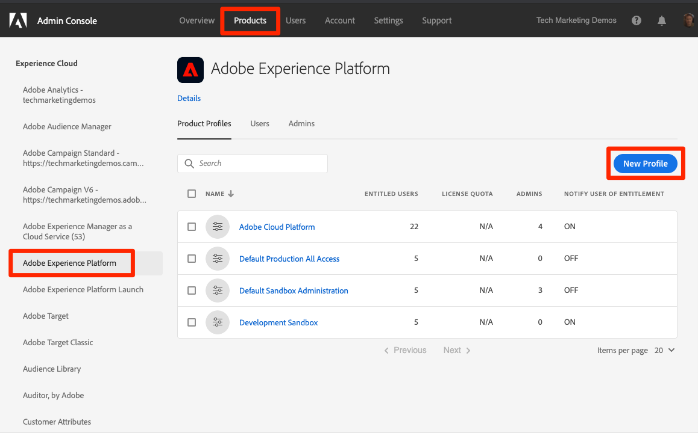
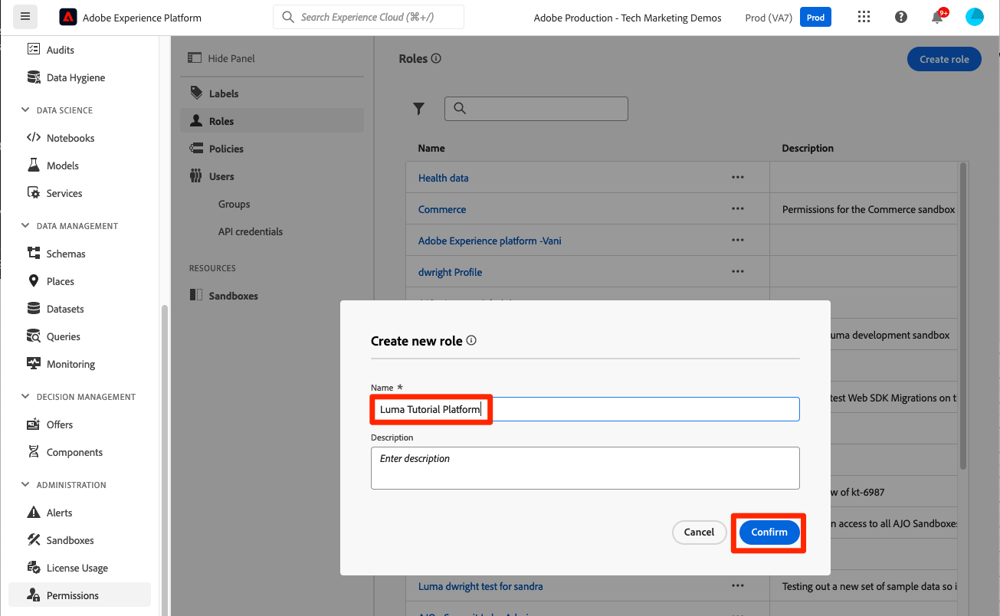

# 権限の設定

<!--30min-->

このレッスンでは、[!DNL Adobe's Admin Console] と Platform インターフェイスの [!UICONTROL &#x200B; 権限 &#x200B;] 画面を使用して、Adobe Experience Platform ユーザー権限を設定します。

アクセス制御は、Experience Platformの重要なプライバシー機能であり、ユーザーが職務を遂行するために必要な最小限の権限に制限することをお勧めします。 詳しくは、[ アクセス制御のドキュメント ](https://experienceleague.adobe.com/docs/experience-platform/access-control/home.html?lang=ja) を参照してください。

データアーキテクトとデータエンジニアはAdobe Experience Platformのパワーユーザーです。このチュートリアルおよび後の日常業務を完了するには、多くの権限が必要になります。 データアーキテクトは、マーケター、アナリスト、データサイエンティストなどの会社における *その他の Platform ユーザー* の管理に関与している可能性が高くなります。 このレッスンを完了する際は、これらの機能を使用して会社の他のユーザーを管理する方法を考えます。

**データアーキテクト** は、多くの場合、このチュートリアル以外の他のユーザーに対して権限を設定します。

>[!IMPORTANT]
>
>Adobe Experience Cloud製品のシステム管理者は、このレッスンの手順の一部を完了する必要があります。この手順は、セクションの見出しで呼び出されます。 システム管理者でない場合は、会社の担当者に連絡して、これらのタスクを完了するように依頼してください。 また、[Developer ConsoleとPostmanの設定 ](set-up-developer-console-and-postman.md) のレッスンで行う必要のあるタスクもあります。

## Admin Console について

[!DNL Admin Console] は、すべてのAdobe Experience Cloud製品へのユーザーアクセスを管理するために使用されるインターフェイスです。 Platform にアクセスするには、ユーザーまたはをAdmin Consoleに追加し、そのすべての詳細な権限項目をAdobe Experience Platformの権限画面で管理する必要があります。

Platform に存在する役割の概要を次に示します。

* 製品プロファイルの **ユーザー** は、製品プロファイルで割り当てられた権限に応じて、Platform のユーザーインターフェイスでタスクを完了できます。
* **開発者** は、API 資格情報とプロジェクトをAdobe Developer Consoleで作成して、Experience PlatformAPI の使用を開始できます
* **製品管理者** は、Platform のAdobe Experience Platform製品にユーザーや開発者を追加できるほか、Adobe Admin Console インターフェイスの権限画面で詳細なユーザーアクセスを管理できます。
* **システム管理者** は、製品管理者を追加し、基本的にすべてのAdobe Experience Cloud製品に対する権限を管理できます。

## `AEP-Default-All-Users` 製品プロファイルにユーザーと開発者を追加します（システム管理者または製品管理者が必要です）

この演習では、システム管理者または製品管理者が、Adobe Admin ConsoleのAdobe Experience Platform製品にユーザーおよび開発者として追加します。

>[!NOTE]
>
>このチュートリアルを受講するチームメンバーをシステム管理者が支援する場合は、チームメンバーをAdobe Experience Platformの *プロダクト管理者* として追加することを検討してください。 製品管理者は、後で自分でこれらの手順を実行して、他のExperience Platformユーザーを管理できるようになります。

チュートリアル参加者を [!UICONTROL &#x200B; ユーザー &#x200B;] および [!UICONTROL &#x200B; 開発者 &#x200B;] として追加するには：

1. [Adobe Admin Console](https://adminconsole.adobe.com) にログインします
1. 上部ナビゲーションの「**[!UICONTROL 製品]**」を選択します。
1. **Adobe Experience Platform** を選択
   
1. Experience Platformインスタンスに複数のプロファイルが既にある場合があります。 `AEP-Default-All-Users` プロファイルを選択します
   

1. 「**[!UICONTROL ユーザー]** タブに移動します。
1. 「**[!UICONTROL ユーザーを追加]**」ボタンを選択します
   
1. ワークフローを完了して、チュートリアル参加者をユーザーとして製品プロファイルに追加します

1. **[!UICONTROL 開発者]** タブに移動します。
1. 「**[!UICONTROL 開発者を追加]**」ボタンを選択します
   
1. ワークフローを完了して、チュートリアル参加者を開発者として製品プロファイルに追加します

## Adobe Experience Platformでの役割の追加（システム管理者または製品管理者が必要）

Experience Platformに対する詳細な権限は、Platform インターフェイスの権限画面で管理されます。 システム管理者と製品管理者のみがこの画面にアクセスできるので、管理者権限がない場合は、管理者権限のあるユーザーの支援が必要になります。

権限は役割で管理されます。 チュートリアルの役割を作成します。

1. [Adobe Experience Platform](https://platform.adobe.com) にログインします
1. 左側のナビゲーションで **[!UICONTROL 権限]** を選択すると [!UICONTROL &#x200B; 役割 &#x200B;] 画面に移動します
1. 「**[!UICONTROL 役割を作成]**」を選択します。

   
1. 役割 `Luma Tutorial Platform` に名前を付け（会社の複数のユーザーがこのチュートリアルを受講する場合は、最後にチュートリアル参加者の名前を追加します）、「確認 **[!UICONTROL 」を選択します]**

   

1. **[!UICONTROL +]** と **[!UICONTROL すべて追加]** を使用して、次のリソースのすべての権限項目を追加します。

   1. データモデリング
   1. データ管理
   1. プロファイル管理
   1. Identity Management
   1. サンドボックス管理
   1. クエリサービス
   1. データ収集
   1. データガバナンス
   1. ダッシュボード
   1. アラート

      

1. データ取り込みで、ソースの管理およびソースの表示権限項目を追加します。

1. すべての権限項目を追加したら、必ず「保存」ボタンを選択します
   

[ サンドボックスの作成 ](create-a-sandbox.md) および [Developer ConsoleとPostmanの設定 ](set-up-developer-console-and-postman.md) のレッスン後、この役割にいくつかの小さな更新を加えます。

## データ収集製品プロファイルの作成（システム管理者または製品管理者が必要）

この演習では、あなたまたは会社のシステム管理者がデータ収集用の製品プロファイル（旧称：Adobe Experience Platform Launch）を作成し、製品プロファイル管理者として追加します。

>[!NOTE]
>
>このチュートリアルで同僚を支援するシステム管理者は、それらをデータ収集の *製品管理者* として追加することを検討してください。 製品管理者は、今後、これらの手順を自分で完了し、データ収集の他のユーザーを管理できるようになります。

製品プロファイルを作成するには：

1. [!DNL Adobe Admin Console] でAdobe Experience Platform Data Collection 商品に移動します。
1. `Luma Tutorial Data Collection` という名前の新しいプロファイルを追加します（会社の複数のユーザーがこのチュートリアルを受ける場合は、最後にチュートリアル参加者の名前を追加します）。
1. **[!UICONTROL プロパティ]**/**[!UICONTROL 自動インクルード]** 設定をオフにします
1. この時点では、プロパティや権限を割り当てません
1. チュートリアル参加者をこのプロファイルの管理者として追加します

これらの手順を完了すると、`Luma Tutorial Data Collection` プロファイルが 1 人の管理者で設定されていることがわかります。

## データ収集製品プロファイルの設定

`Luma Tutorial Data Collection` 製品プロファイルの管理者になったので、チュートリアルを完了するために必要な権限と役割を設定できます。

### 権限の追加

次に、個々の権限項目をプロファイルに追加します。

1. [Adobe Admin Console](https://adminconsole.adobe.com) で、**[!UICONTROL 製品]**/**[!UICONTROL データ収集]** に移動します
1. `Luma Tutorial Data Collection` プロファイルを開きます。
1. 「**[!UICONTROL 権限]** タブに移動します。
1. **[!UICONTROL プラットフォーム]** を開きます。
1. 使用可能なすべてのプラットフォームが選択されていることを確認します（ライセンスによってオプションが異なる場合があります）。
1. 変更があれば **[!UICONTROL 保存]** します
   
1. **[!UICONTROL プロパティ]** を開きます。
1. **[!UICONTROL 自動インクルード]** の切り替えがオフになっていることを確認して、どのプロパティにもアクセスできないようにします（後で追加します）。
1. 変更があれば **[!UICONTROL 保存]** します
   
1. **[!UICONTROL プロパティ権限]** を開きます。
1. **[!UICONTROL すべて追加]** を選択して、すべてのプロパティ権限を追加します
1. **[!UICONTROL 保存]**
   
1. オープン **[!UICONTROL 会社権限]**
1. 追加 **[!UICONTROL プロパティの管理]**
1. 「**[!UICONTROL 保存]**」を選択します
   

### ユーザーとしての自分の追加

次に、データ収集プロファイルに自分自身をユーザーとして追加します。

1. 「**[!UICONTROL ユーザー]** タブに移動します。
1. 「**[!UICONTROL ユーザーを追加]**」ボタンを選択します
   
1. 製品プロファイルに自分自身をユーザーとして追加するには、ワークフローを完了します

データ収集の開発者として自分自身を追加する必要はありません。

これで、チュートリアルを完了するために必要な権限のほとんどが揃いました。 サンドボックス内には、さらに 2 つの調整があり、1 つは [!DNL Adobe Admin Console] ンドボックスを作成 [ した後に行われ ](create-a-sandbox.md) す。
