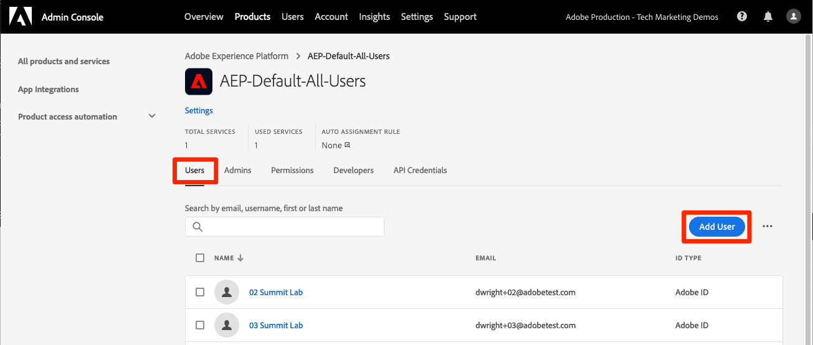
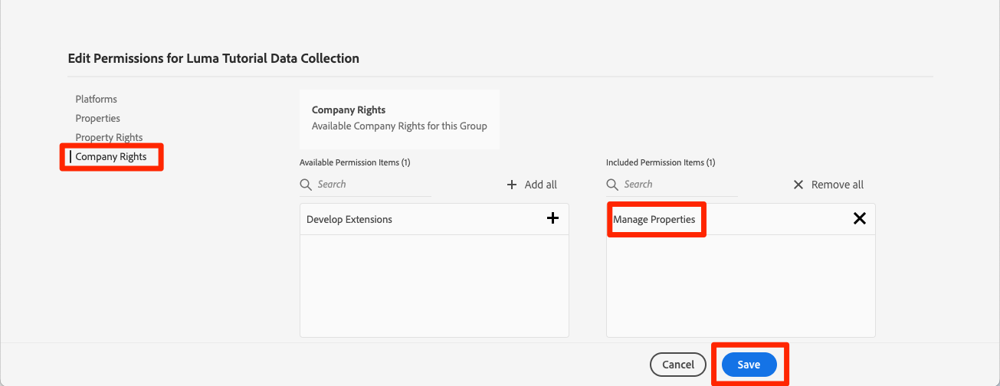

# 権限の設定

<!--30min-->

このレッスンでは、次を使用してAdobe Experience Platformのユーザー権限を設定します。 [!DNL Adobe's Admin Console] そして [!UICONTROL 権限] 画面を開きます。

アクセス制御は、Experience Platformの主要なプライバシー機能です。ユーザーが職務機能を実行するのに必要な最小限の権限に制限することをお勧めします。 詳しくは、 [アクセス制御に関するドキュメント](https://experienceleague.adobe.com/docs/experience-platform/access-control/home.html?lang=ja) を参照してください。

データアーキテクトとデータエンジニアは、Adobe Experience Platformのパワーユーザーで、このチュートリアルを完了し、後で日常業務を完了するには、多くの権限が必要になります。 データアーキテクトは、 *その他の Platform ユーザー* マーケター、アナリスト、データサイエンティストなどの会社の このレッスンを完了する際に、これらの機能を使用して会社の他のユーザーを管理する方法について考えてみましょう。

**データアーキテクト** 多くの場合、このチュートリアル以外の他のユーザーに対する権限を設定します。

>[!IMPORTANT]
>
>Adobe Experience Cloud製品のシステム管理者は、このレッスンの手順の一部を完了する必要があります。この手順は、セクションの見出しで呼び出されます。 システム管理者でない場合は、会社の担当者に連絡し、これらのタスクの完了を依頼してください。 また、 [開発者コンソールとPostmanの設定](set-up-developer-console-and-postman.md) レッスン。

## Admin Console について

この [!DNL Admin Console] は、すべてのAdobe Experience Cloud製品へのユーザーアクセスを管理するためのインターフェイスです。 Platform にアクセスするには、ユーザーまたはをAdmin Consoleに追加し、その詳細な権限項目をすべてAdobe Experience Platformの権限画面で管理する必要があります。

Platform に存在する役割の概要を次に示します。

* **ユーザー** の製品プロファイルは、製品プロファイルで割り当てられた権限に従って、Platform のユーザーインターフェイスでタスクを完了できます。
* **開発者** は、Experience PlatformAPI の使用を開始するために、Adobe Developerコンソールで API 資格情報とプロジェクトを作成できます
* **製品管理者** では、Adobe Admin ConsoleのAdobe Experience Platform製品にユーザーや開発者を追加したり、Platform インターフェイスの権限画面で詳細なユーザーアクセスを管理したりできます。
* **システム管理者** 製品管理者を追加し、すべてのAdobe Experience Cloud製品の基本的な権限を管理できます。

## ユーザーと開発者を `AEP-Default-All-Users` 製品プロファイル（システム管理者または製品管理者が必要）

この演習では、ユーザーまたはシステム管理者または製品管理者が、Adobe Admin ConsoleのAdobe Experience Platform製品のユーザーおよび開発者として追加します。

>[!NOTE]
>
>このチュートリアルを担当する同僚を支援するシステム管理者の場合は、同僚を *製品管理者* Adobe Experience Platform 製品管理者は、これらの手順を自分で完了し、将来他のExperience Platformユーザーを管理できます。

チュートリアル参加者を [!UICONTROL ユーザー] および [!UICONTROL 開発者]:

1. にログインします。 [Adobe Admin Console](https://adminconsole.adobe.com)
1. 選択 **[!UICONTROL 製品]** 上部ナビゲーションで
1. 選択 **Adobe Experience Platform**
   
1. 既にExperience Platformインスタンスに複数のプロファイルが存在する場合があります。 を選択します。 `AEP-Default-All-Users` profile
   

1. 次に移動： **[!UICONTROL ユーザー]** タブ
1. を選択します。 **[!UICONTROL ユーザーを追加]** ボタン
   
1. ワークフローを完了し、チュートリアル参加者をユーザーとして製品プロファイルに追加します

1. 次に移動： **[!UICONTROL 開発者]** タブ
1. を選択します。 **[!UICONTROL 開発者を追加]** ボタン
   
1. ワークフローを完了し、チュートリアル参加者を開発者として製品プロファイルに追加します

## Adobe Experience Platformでのロールの追加（システム管理者または製品管理者が必要）

Experience Platformに対する詳細な権限は、Platform インターフェイスの権限画面で管理されます。 この画面にアクセスできるのはシステム管理者と製品管理者のみです。管理者権限がない場合は、権限を持つユーザーのサポートが必要になります。

権限は「役割」で管理します。 このチュートリアルのロールを作成します。

1. ログイン [Adobe Experience Platform](https://platform.adobe.com)
1. 選択 **[!UICONTROL 権限]** 左側のナビゲーションで、 [!UICONTROL 役割] screen
1. 選択 **[!UICONTROL ロールを作成]**

   
1. 役割に名前を付ける `Luma Tutorial Platform` （会社の複数の担当者がこのチュートリアルを受け取る場合は、チュートリアル参加者の名前を末尾に追加します）、「 」を選択します。 **[!UICONTROL 確認]**

   

1. 次のリソースに対するすべての権限項目を追加するには、  **[!UICONTROL +]** および **[!UICONTROL すべて追加]**:

   1. データモデリング
   1. データ管理
   1. プロファイル管理
   1. Identity Management
   1. サンドボックス管理
   1. クエリサービス
   1. データ収集
   1. データガバナンス
   1. ダッシュボード
   1. アラート

      

1. 「データ取得」で、「ソースの管理」および「ソースの表示」権限項目を追加します。

1. すべての権限項目を追加したら、必ず「保存」ボタンを選択してください
   

この役割の後に、いくつかの小さな更新を行います [サンドボックスの作成](create-a-sandbox.md) および [開発者コンソールとPostmanの設定](set-up-developer-console-and-postman.md) レッスン。

## データ収集製品プロファイルの作成（システム管理者または製品管理者が必要）

この演習では、ユーザーまたは会社のシステム管理者が、データ収集用の製品プロファイル ( 旧称Adobe Experience Platform Launch) を作成し、製品プロファイル管理者として追加します。

>[!NOTE]
>
>このチュートリアルを同僚の手助けをするシステム管理者の場合は、これらを *製品管理者* データ収集用。 製品管理者は、これらの手順を自分で完了し、将来的にデータ収集の他のユーザーを管理できます。

製品プロファイルを作成するには：

1. 内 [!DNL Adobe Admin Console] Adobe Experience Platform Data Collection 製品に移動します。
1. という名前の新しいプロファイルを追加します。 `Luma Tutorial Data Collection` （会社の複数の担当者がこのチュートリアルを受け取る場合は、チュートリアル参加者の名前を最後に追加します）。
1. をオフにする **[!UICONTROL プロパティ]** > **[!UICONTROL 自動インクルード]** 設定
1. この時点でプロパティや権限を割り当てない
1. チュートリアル参加者をこのプロファイルの管理者として追加

これらの手順を完了すると、 `Luma Tutorial Data Collection` プロファイルは 1 人の管理者で設定されます。

## データ収集製品プロファイルの設定

これで、 `Luma Tutorial Data Collection` 製品プロファイル：チュートリアルの完了に必要な権限と役割を設定できます。

### 権限の追加

次に、個々の権限項目をプロファイルに追加します。

1. 内 [Adobe Admin Console](https://adminconsole.adobe.com)に移動します。 **[!UICONTROL 製品]** > **[!UICONTROL データ収集]**
1. を開きます。 `Luma Tutorial Data Collection` profile
1. 次に移動： **[!UICONTROL 権限]** タブ
1. 開く **[!UICONTROL プラットフォーム]**
1. 利用可能なすべてのプラットフォームが選択されていることを確認します（ライセンスに応じて異なるオプションが表示される場合があります）。
1. **[!UICONTROL 保存]** 変更
   
1. 開く **[!UICONTROL プロパティ]**
1. 次を確認します。 **[!UICONTROL 自動インクルード]** トグルオフにして、どのプロパティにもアクセスできなくします（後で追加します）
1. **[!UICONTROL 保存]** 変更
   
1. 開く **[!UICONTROL プロパティ権限]**
1. 選択 **[!UICONTROL すべて追加]** すべてのプロパティ権限を追加するには
1. **[!UICONTROL 保存します。]**
   
1. 開く **[!UICONTROL 会社権限]**
1. 追加 **[!UICONTROL プロパティを管理]**
1. 「**[!UICONTROL 保存]**」を選択します
   

### 自分をユーザーとして追加する

次に、自分をデータ収集プロファイルに追加します。

1. 次に移動： **[!UICONTROL ユーザー]** タブ
1. を選択します。 **[!UICONTROL ユーザーを追加]** ボタン
   
1. ワークフローを完了し、自分を製品プロファイルにユーザーとして追加する

データ収集の開発者として自分自身を追加する必要はありません。

これで、チュートリアルの完了に必要な権限のほとんどが揃いました。 内部で行うツイークは、さらに 2 つだけです。 [!DNL Adobe Admin Console]次の 1 つを含む [サンドボックスの作成](create-a-sandbox.md)!
