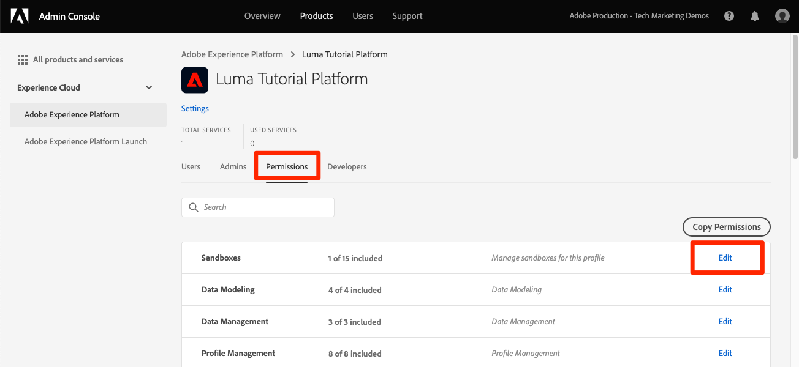

# サンドボックスの作成

<!--25min-->

このレッスンでは、チュートリアルの残りの部分で使用する開発環境サンドボックスを作成します。

サンドボックスは独立した環境を提供し、リソースとデータを実稼動環境に混在させることなく機能を試すことができます。 詳しくは、 [サンドボックスドキュメント](https://experienceleague.adobe.com/docs/experience-platform/sandbox/home.html?lang=ja).

**データアーキテクト** および **データエンジニア** このチュートリアル以外で、サンドボックスを作成する必要があります。

演習を開始する前に、以下の短いビデオを見てサンドボックスの詳細を確認してください。
>[!VIDEO](https://video.tv.adobe.com/v/29838/?quality=12&learn=on)

## 必要な権限

内 [権限の設定](configure-permissions.md) レッスンでは、このレッスンを完了するために必要なすべてのアクセス制御を設定します。

<!--
* Permission items **[!UICONTROL Sandbox Administration]** > **[!UICONTROL View Sandboxes]** and **[!UICONTROL Manage Sandboxes]**
* Permission item **[!UICONTROL Sandboxes]** > **[!UICONTROL Prod]**
* User-role access to the `Luma Tutorial Platform` product profile
* Admin-level access to the `Luma Tutorial Platform` product profile
-->

## サンドボックスの作成

サンドボックスを作成します。

1. にログインします。 [Adobe Experience Platform](https://experience.adobe.com/platform) インターフェイス
1. に移動します。 **[!UICONTROL サンドボックス]** 左のナビゲーション
1. 選択 **[!UICONTROL サンドボックスを作成]** 右上に
   

1. 選択 **[!UICONTROL 開発]** を **[!UICONTROL タイプ]**
1. サンドボックスに名前を付ける `luma-tutorial` （末尾に名前を追加することを検討してください）。
1. チュートリアルにタイトルを付ける `Luma Tutorial` （末尾に名前を追加することを検討してください）。
1. を選択します。 **[!UICONTROL 作成]** ボタン
   
   >[!NOTE]
   >
   >サンドボックス名とタイトルには任意の値を使用できますが、チュートリアル全体でこれらのラベルを参照するので、推奨される値をそのまま使用することをお勧めします。 このチュートリアルを完了している組織の複数のユーザーがいる場合は、サンドボックスのタイトルと名前の末尾に名前を追加することを検討します（例：luma-tutorial-ignatiusjrey）。

サンドボックスの作成には約 30 秒かかり、その間に「[!UICONTROL 作成中]「 」ステータスが表示されます。 サンドボックスが完全に作成されると、「[!UICONTROL アクティブ]&quot;:

サンドボックスが「[!UICONTROL アクティブ]」をクリックしてから、次の演習に進みます。

## 新しいサンドボックスを製品プロファイルに追加する

サンドボックスがアクティブになったら、そのサンドボックスを使用するには、製品プロファイルにサンドボックスを含める必要があります。 製品プロファイルに追加するには、次の手順を実行します。

1. 別のブラウザータブで、 [Admin Console](https://adminconsole.adobe.com)
1. に移動します。 **[!UICONTROL 製品/Adobe Experience Platform]**
1. を開きます。 `Luma Tutorial Platform` profile

   

1. 次に移動： **[!UICONTROL 権限]** タブ

1. の [!UICONTROL サンドボックス] 行、選択 **[!UICONTROL 編集]**

   

1. _削除_ の **[!UICONTROL Prod]** 最初にプロファイルに割り当てたサンドボックス
1. を選択します。 **[!UICONTROL +]** 新しい `Luma Tutorial` 右側の列のサンドボックス
1. 選択 **[!UICONTROL 保存]** 更新した権限を保存するには、以下を実行します。

   

1. 「Experience Platform」タブに戻る
1. ページを再読み込み（または Shift キーを押しながら再読み込み）すると、 `Luma Tutorial` サンドボックスに含めるか、サンドボックスドロップダウンに含める必要があります
1. 次に切り替え： `Luma Tutorial` サンドボックスにまだ存在しない場合は、

   

サンドボックスを作成しました。準備が整いました。 [開発者コンソールとPostmanの設定](set-up-developer-console-and-postman.md)!
