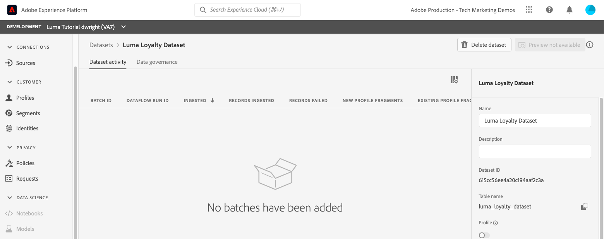

# データセットの作成

<!--15min-->

このレッスンでは、データを受け取るデータセットを作成します。 これがチュートリアルでの最短のレッスンであることを知っていると幸いです。

Adobe Experience Platformに正常に取り込まれたすべてのデータは、データレイクにデータセットとして保持されます。 データセットは、通常、スキーマ（列）とフィールド（行）を含むテーブルであるデータコレクションのストレージと管理をおこなう構成体です。データセットには、保存するデータの様々な側面を記述したメタデータも含まれます。

**データアーキテクト** このチュートリアル以外で、ではデータセットを作成する必要があります。

演習を始める前に、次の短いビデオを見て、データセットの詳細を確認してください。
>[!VIDEO](https://video.tv.adobe.com/v/27269?quality=12&learn=on)

## 必要な権限

内 [権限の設定](configure-permissions.md) レッスンでは、このレッスンを完了するために必要なすべてのアクセス制御を設定します。

<!--
* Permission items **[!UICONTROL Data Management]** > **[!UICONTROL View Datasets]** and **[!UICONTROL Manage Datasets]**
* Permission item **[!UICONTROL Sandboxes]** > `Luma Tutorial`
* User-role access to the `Luma Tutorial Platform` product profile
* Developer-role access to the `Luma Tutorial Platform` product profile (for API)
-->

## UI でのデータセットの作成

この演習では、UI でデータセットを作成します。 次に、ロイヤルティデータから始めます。

1. に移動します。 **[!UICONTROL データセット]** （Platform ユーザーインターフェイスの左側のナビゲーション）
1. を選択します。 **[!UICONTROL データセットを作成]** ボタン
   

1. 次の画面で、「 」を選択します。 **スキーマからデータセットを作成**
1. 次の画面で、 `Luma Loyalty Schema` 次に、 **[!UICONTROL 次へ]** ボタン
   

1. データセットに名前を付ける `Luma Loyalty Dataset` をクリックし、 **[!UICONTROL 完了]** ボタン
   
1. データセットを保存すると、次のような画面が表示されます。
   

これで作業は完了です。早くやるって言ったでしょ。 同じ手順で、これらの他のデータセットを作成します。

1. `Luma Offline Purchase Events Dataset` の `Luma Offline Purchase Events Schema`
1. `Luma Web Events Dataset` の `Luma Web Events Schema`
1. `Luma Product Catalog Dataset` の `Luma Product Catalog Schema`


## API を使用したデータセットの作成

次に、 `Luma CRM Dataset` API を使用している場合にのみ表示されます。

>[!NOTE]
>
>API の演習をスキップし、 `Luma CRM Dataset` に設定されています。 名前を付ける `Luma CRM Dataset` また、 `Luma CRM Schema`.

### データセットで使用するスキーマの ID を取得します

まず、 `$id` の `Luma CRM Schema`:

1. オープン [!DNL Postman]
1. この 24 時間以内にリクエストをおこなっていない場合、認証トークンは有効期限が切れている可能性があります。 リクエストを開く **[!DNL Adobe I/O Access Token Generation > Local Signing (Non-production use-only) > IMS: JWT Generate + Auth via User Token]** を選択し、 **送信** をクリックして、 [!DNL Postman] レッスン。
1. リクエストを開く **[!DNL Schema Registry API > Schemas > Retrieve a list of schemas within the specified container.]**
1. を選択します。 **送信** ボタン
1. 200 件の応答が返されます
1. レスポンスで `Luma CRM Schema` 項目を選択し、 `$id` 値
   

### データセットの作成

次に、データセットを作成できます。

1. ダウンロード [Catalog Service API.postman_collection.json](https://raw.githubusercontent.com/adobe/experience-platform-postman-samples/master/apis/experience-platform/Catalog%20Service%20API.postman_collection.json) を `Luma Tutorial Assets` フォルダー。
1. コレクションの読み込み先 [!DNL Postman]
1. リクエストを選択 **[!DNL Catalog Service API > Datasets > Create a new dataset.]**
1. 以下を **本文** リクエストの ***id 値を独自の値に置き換える***:

   ```json
   {
       "name": "Luma CRM Dataset",
   
       "schemaRef": {
           "id": "REPLACE_WITH_YOUR_OWN_ID",
           "contentType": "application/vnd.adobe.xed-full+json;version=1"
       },
       "fileDescription": {
           "persisted": true,
           "containerFormat": "parquet",
           "format": "parquet"
       }
   }
   ```

1. を選択します。 **送信** ボタン
1. 新しいデータセットの ID を含む 201 Created 応答が返されます。
   

>[!TIP]
>
> このリクエストをおこなう際に発生する一般的な問題と、おそらく次の修正点があります。
>
> * `400: There was a problem retrieving xdm schema`。上記のサンプルの ID を、独自の ID に置き換えていることを確認してください `Luma CRM Schema`
> * 認証トークンがありません：を実行します。 **IMS:JWT 生成+ユーザートークンを介した認証** を呼び出して新しいトークンを生成する
> * `401: Not Authorized to PUT/POST/PATCH/DELETE for this path : /global/schemas/`:を更新します。 **CONTAINER_ID** 次の環境変数： `global` から `tenant`
> * `403: PALM Access Denied. POST access is denied for this resource from access control`:ユーザーの権限をAdmin Console


次に戻ると、 **[!UICONTROL データセット]** 画面を使用して、5 つのデータセットすべてが正常に作成されたことを確認できます。


## その他のリソース

* [データセットドキュメント](https://experienceleague.adobe.com/docs/experience-platform/catalog/datasets/user-guide.html?lang=ja)
* [データセット API（カタログサービスの一部）リファレンス](https://www.adobe.io/experience-platform-apis/references/catalog/#tag/Datasets)

これで、すべてのスキーマ、ID、データセットが整理され、 [リアルタイム顧客プロファイルでの有効化](enable-profiles.md).
