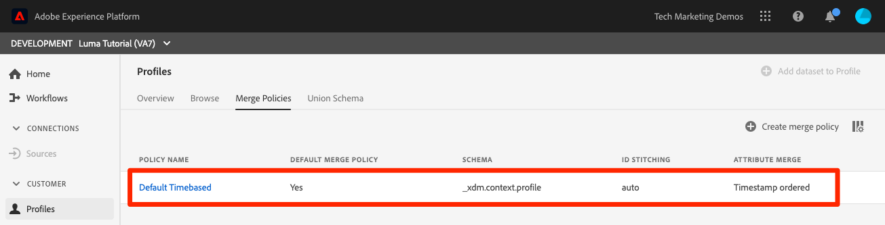
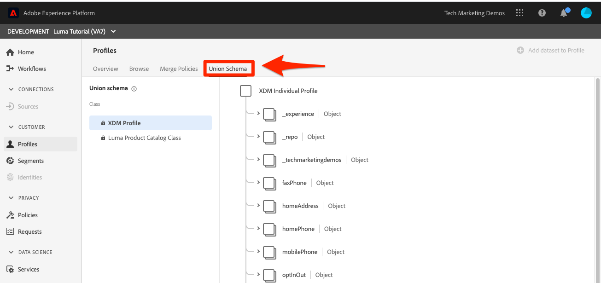
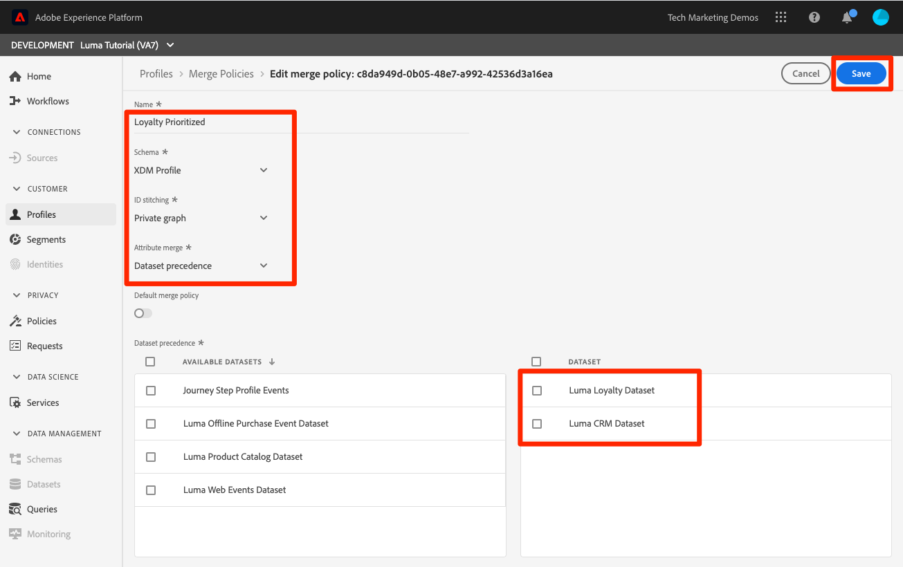
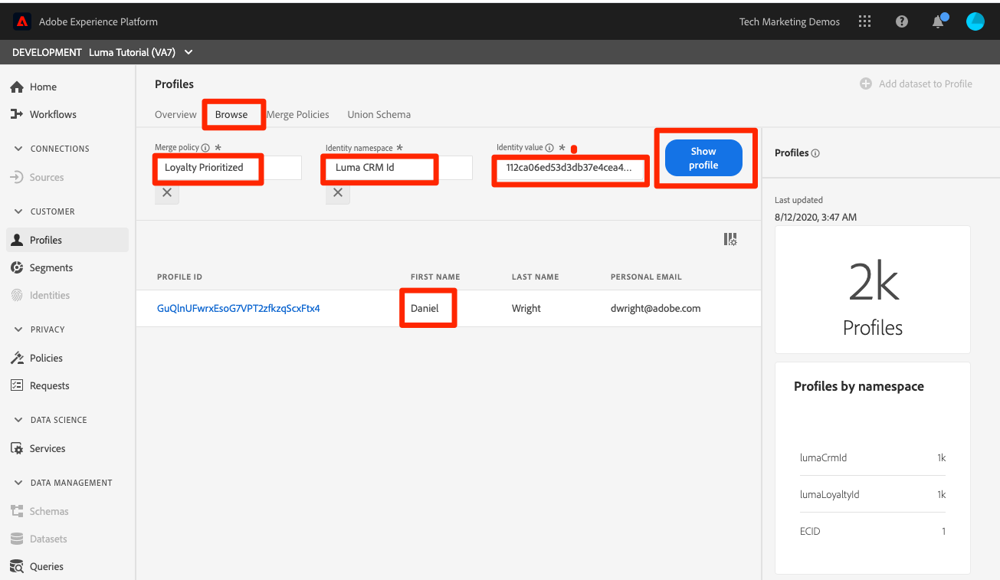
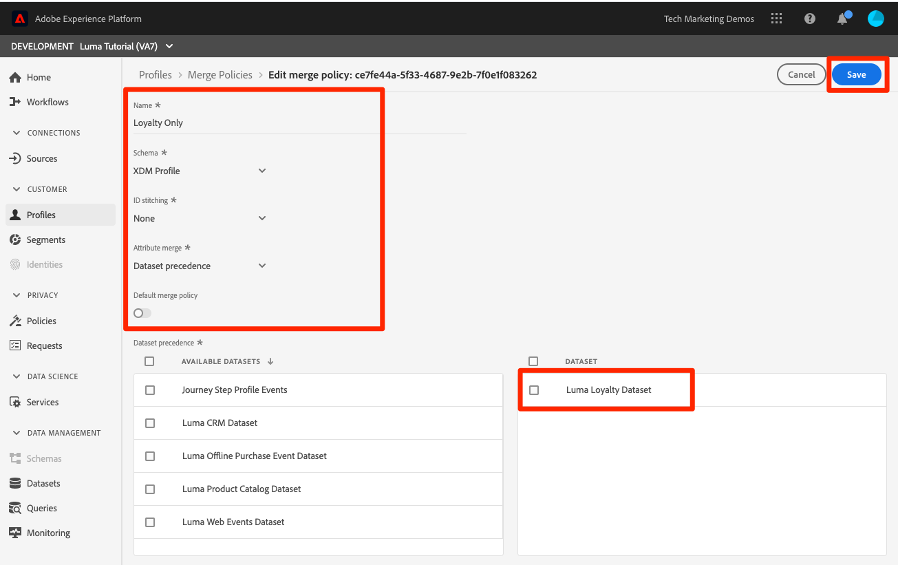
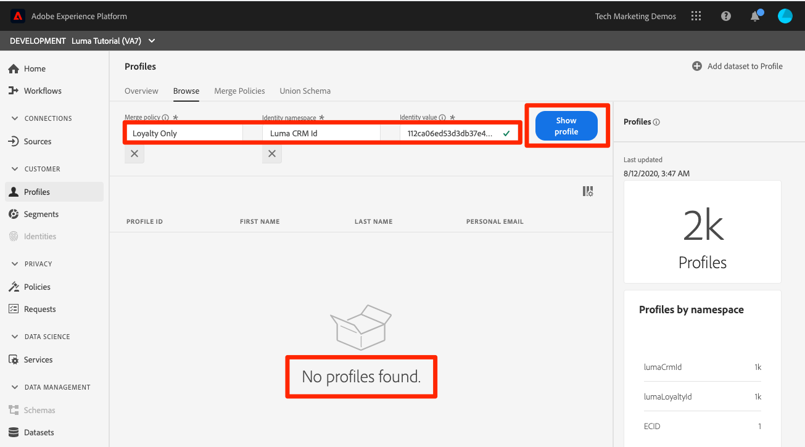
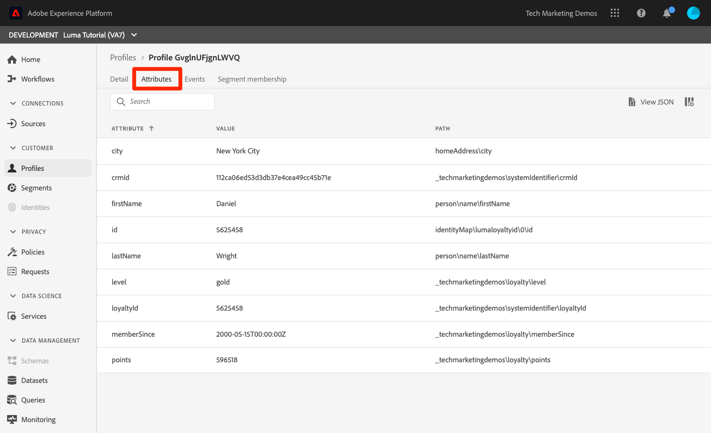
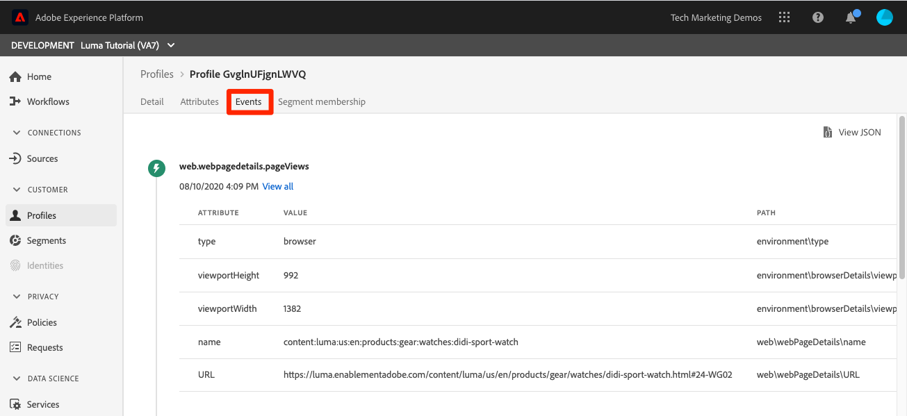
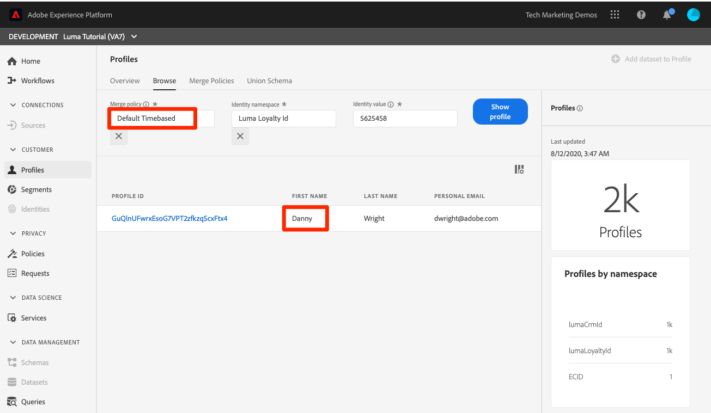

# 結合ポリシーの作成

<!--20 min-->

このレッスンでは、複数のデータソースをプロファイルに結合する方法を優先するように、結合ポリシーを作成します。

Adobe Experience Platformなら、複数の情報源からデータを集め、統合することで、個々の顧客の全体像を把握できます。 このデータを統合する際に、結合ポリシーによって、データの優先順位付け方法と、その統合ビューを作成するためにどのデータを組み合わせるかが決まります。

このレッスンではユーザーインターフェイスを使用しますが、結合ポリシーを作成するためのAPI オプションも存在します。

**データアーキテクト**&#x200B;は、このチュートリアル以外で結合ポリシーを作成する必要があります。

演習を開始する前に、この短いビデオで結合ポリシーの詳細を確認してください。

>[!VIDEO](https://video.tv.adobe.com/v/345078?captions=jpn&learn=on&enablevpops)

## 権限が必要です

[権限の設定](configure-permissions.md) レッスンでは、このレッスンを完了するために必要なすべてのアクセス制御を設定します。

<!--
* Permission items **[!UICONTROL Profile Management]** > **[!UICONTROL View Merge Policies]** and **[!UICONTROL Manage Merge Policies]**
* Permission item **[!UICONTROL Profile Management]** > **[!UICONTROL View Profiles]** and **[!UICONTROL Manage Profiles]**
* Permission item **[!UICONTROL Sandboxes]** > `Luma Tutorial`
* User-role access to the `Luma Tutorial Platform` product profile
-->

## 結合ポリシーと結合スキーマについて

バッチ取り込みのレッスンでは、同じ顧客に対して情報が少し異なる2つのレコードをアップロードしたことを思い出してください。 [!DNL Loyalty] データでは、お客様の名前は`Daniel`で、`New York City`に住んでいましたが、CRM データでは、お客様の名前は`Danny`で、`Portland`に住んでいました。 顧客データは時間の経過とともに変化します。 おそらく彼は`Portland`から`New York City`に移動しました。 電話番号やメールアドレスなど、その他のものも変更されます。 結合ポリシーは、2つのデータソースが同じユーザーに対して異なる情報を提供する場合に、これらのタイプの競合を処理する方法を決定するのに役立ちます。

では、なぜ`Danny`が名を付けたのでしょうか？ では見ていきましょう。

1. Platform ユーザーインターフェイスで、左側のナビゲーションで&#x200B;**[!UICONTROL プロファイル]**&#x200B;を選択します
1. 「**[!UICONTROL 結合ポリシー]**」タブに移動します
1. デフォルトの結合ポリシーは、タイムスタンプの順序です。 ロイヤルティデータの後にCRM データをアップロードしたため、`Danny`はプロファイルの名として獲得されました。

プロファイルに対して複数のスキーマが有効になっている場合、ベースクラスを共有するすべてのプロファイル対応レコードスキーマに対して[!UICONTROL 結合スキーマ &#x200B;]が自動的に作成されます。 [!UICONTROL 結合スキーマ &#x200B;] タブに移動すると、**[!UICONTROL 結合スキーマ]**&#x200B;を表示できます。

ExperienceEvent クラスには結合スキーマがないことに注意してください。 ExperienceEvent データは時系列ベースであるため、依然としてプロファイルに格納されますが、各イベントにはタイムスタンプとIDが含まれ、衝突は問題ではありません。

では、デフォルトの結合ポリシーが気に入らない場合はどうでしょうか？ Lumaが、紛争が発生した場合に、ロイヤルティシステムが真実の情報源であると判断した場合はどうなりますか？ そのために、結合ポリシーを作成します。

## UIでの結合ポリシーの作成

1. 結合ポリシー画面で、右上の「**[!UICONTROL 結合ポリシーを作成]**」ボタンを選択します
1. **[!UICONTROL Name]**&#x200B;として、`Loyalty Prioritized`と入力します
1. **[!UICONTROL スキーマ]**&#x200B;として、**[!UICONTROL XDM プロファイル]**&#x200B;を選択します（カスタムクラスはレコードデータであるため、結合ポリシーでも使用できます）
1. **[!UICONTROL Id ステッチ]**&#x200B;の場合、**[!UICONTROL プライベートグラフ]**&#x200B;を選択します
1. **[!UICONTROL 属性結合]**&#x200B;で、**[!UICONTROL データセットの優先順位]**&#x200B;を選択します
1. `Luma Loyalty Dataset`と`Luma CRM Dataset`を&#x200B;**[!UICONTROL データセット]** パネルにドラッグ&amp;ドロップします。
1. `Luma Loyalty Dataset`の上にドラッグ&amp;ドロップして、`Luma CRM Dataset`が一番上にあることを確認します
1. 「**[!UICONTROL 保存]**」ボタンを選択します
   <!--do i need to explain Private Graph? Is that GA?-->
   

## 結合ポリシーの検証

結合ポリシーが期待どおりに動作しているかどうかを確認します。

1. **[!UICONTROL 参照]** タブに移動します
1. **[!UICONTROL 結合ポリシー]**&#x200B;を新しい`Loyalty Prioritized` ポリシーに変更します
1. **[!UICONTROL ID名前空間]**&#x200B;として、`Luma CRM Id`を使用します
1. **[!UICONTROL ID値]**&#x200B;として`f660ab912ec121d1b1e928a0bb4bc61b`を使用します
1. 「**[!UICONTROL プロファイルを表示]**」ボタンを選択します
1. `Daniel`が戻りました！

## 限られたデータセットで結合ポリシーを作成する

データセットの優先順位を使用して結合ポリシーを作成する場合、右側に含めた同じ基本クラスのデータセットのみがプロファイルに含まれます。 別の結合ポリシーを設定して

1. 結合ポリシー画面で、右上の「**[!UICONTROL 結合ポリシーを作成]**」ボタンを選択します
1. **[!UICONTROL Name]**&#x200B;として、`Loyalty Only`と入力します
1. **[!UICONTROL スキーマ]**&#x200B;として、**[!UICONTROL XDM プロファイル]**&#x200B;を選択します
1. **[!UICONTROL Id ステッチ]**&#x200B;の場合、**[!UICONTROL なし]**&#x200B;を選択します
1. **[!UICONTROL 属性結合]**&#x200B;で、**[!UICONTROL データセットの優先順位]**&#x200B;を選択します
1. 選択したデータセット `Luma Loyalty Dataset` パネルに&#x200B;**[!UICONTROL のみをドラッグ&amp;ドロップします。]**
1. 「**[!UICONTROL 保存]**」ボタンを選択します

## 結合ポリシーの検証

次に、この結合ポリシーで何ができるかを見てみましょう。

1. **[!UICONTROL 参照]** タブに移動します
1. **[!UICONTROL 結合ポリシー]**&#x200B;を新しい`Loyalty Only` ポリシーに変更します
1. **[!UICONTROL ID名前空間]**&#x200B;として、`Luma CRM Id`を使用します
1. **[!UICONTROL ID値]**&#x200B;として`f660ab912ec121d1b1e928a0bb4bc61b`を使用します
1. 「**[!UICONTROL プロファイルを表示]**」ボタンを選択します
1. プロファイルが見つからないことを確認します。
   

CRM IDは`Luma Loyalty Dataset`のID フィールドですが、プロファイルの検索に使用できるのはプライマリ IDのみです。 プライマリ ID `Luma Loyalty Id`&quot;を使用してプロファイルを検索してみましょう

1. **[!UICONTROL ID名前空間]**&#x200B;を`Luma Loyalty Id`に変更します
1. **[!UICONTROL ID値]**&#x200B;として`5625458`を使用します
1. 「**[!UICONTROL プロファイルを表示]**」ボタンを選択します
1. プロファイル IDを選択してプロファイルを開きます
1. **[!UICONTROL 属性]** タブに移動します
1. `Loyalty Only`結合ポリシーにCRM データセットが含まれていないため、CRM データセットの他のプロファイルの詳細（携帯電話番号や電子メールアドレスなど）は使用できません。
   で表示できません
1. 「**[!UICONTROL イベント]**」タブに移動します
1. ExperienceEvent データは、結合ポリシーデータセットに明示的に含めなくても使用できます。
   で表示できます

## 結合ポリシーの詳細

プロファイル検索で、使用していた結合ポリシーを`Default Timebased`に変更し、**[!UICONTROL プロファイルを表示]** ボタンを選択します。 ダニーが帰ってきた！

データの？ プロファイルの結合は1回限りのものではありません。 リアルタイムの顧客プロファイルは、どの結合ポリシーが使用されているかなど、さまざまな要素にもとづいて、即座に組み立てられます。 必要な顧客ビューに応じて、異なるコンテキストで使用する複数の結合ポリシーを作成できます。

結合ポリシーの主なユースケースは、データガバナンスです。 例えば、パーソナライゼーションのユースケースでは使用できないサードパーティデータをPlatformに取り込むが、広告のユースケースでは&#x200B;_can_&#x200B;を使用できるとします。 このサードパーティデータセットを除外する結合ポリシーを作成し、この結合ポリシーを使用して、広告ユースケースのセグメントを構築できます。

## その他のリソース

* [結合ポリシーのドキュメント &#x200B;](https://experienceleague.adobe.com/docs/experience-platform/profile/merge-policies/overview.html?lang=ja)
* [結合ポリシーAPI （Real-Time Customer Profile APIの一部）リファレンス &#x200B;](https://www.adobe.io/experience-platform-apis/references/profile/#tag/Merge-policies)

次に、[&#x200B; データガバナンスフレームワーク &#x200B;](apply-data-governance-framework.md)に進みます。
