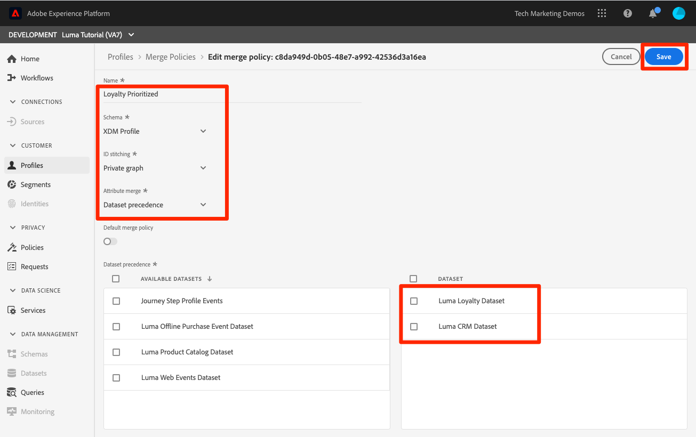

# 結合ポリシーの作成

<!--20 min-->

このレッスンでは、複数のデータソースをプロファイルに結合する方法に優先順位を付ける結合ポリシーを作成します。

Adobe Experience Platformでは、複数のソースからのデータを統合および組み合わせて、個々の顧客の全体像を把握できます。 このようなデータを統合する場合、データの優先順位付け方法と、統合されたビューを作成するためにどのデータを組み合わせるかを結合ポリシーで決定します。

このレッスンではユーザーインターフェイスを使用しますが、結合ポリシーを作成するための API オプションも存在します。

**データアーキテクト** は、このチュートリアル以外で結合ポリシーを作成する必要があります。

演習を開始する前に、この短いビデオを視聴して結合ポリシーの詳細を確認してください。
>[!VIDEO](https://video.tv.adobe.com/v/330433?learn=on&enablevpops)

## 必要な権限

[ 権限の設定 ](configure-permissions.md) レッスンでは、このレッスンを完了するために必要なすべてのアクセス制御を設定します。

<!--* Permission items **[!UICONTROL Profile Management]** > **[!UICONTROL View Merge Policies]** and **[!UICONTROL Manage Merge Policies]**
* Permission item **[!UICONTROL Profile Management]** > **[!UICONTROL View Profiles]** and **[!UICONTROL Manage Profiles]**
* Permission item **[!UICONTROL Sandboxes]** > `Luma Tutorial`
* User-role access to the `Luma Tutorial Platform` product profile
-->

## 結合ポリシーと結合スキーマについて

バッチ取り込みに関するレッスンでは、同じ顧客に対して少し情報が異なる 2 つのレコードをアップロードしました。 [!DNL Loyalty] データでは、顧客の名は `Daniel` で、`New York City` に住んでいましたが、CRM データでは、顧客の名は `Danny` で、`Portland` に住んでいました。 顧客データは時間の経過と共に変化します。 ひょっとしたら彼は `Portland` から `New York City` に引っ越したのかもしれない。 電話番号やメールアドレスなど、その他のものも変更されます。 結合ポリシーは、2 つのデータソースが同じユーザーに対して異なる情報を提供する場合に、これらのタイプの競合を処理する方法を決定するのに役立ちます。

では、なぜ `Danny` がファーストネームで勝ったのでしょうか？ 見てみましょう。

1. Platform ユーザーインターフェイスの左側のナビゲーションで **[!UICONTROL プロファイル]** を選択します
1. 「**[!UICONTROL 結合ポリシー]**」タブに移動します。
1. デフォルトの結合ポリシーは順序付きタイムスタンプです。 ロイヤルティデータの後に CRM データをアップロードしたので、`Danny` はプロファイルの名として獲得できました。

プロファイルに対して複数のスキーマが有効な場合、基本クラスを共有するすべてのプロファイル対応レコードスキーマに対して、[!UICONTROL &#x200B; 結合スキーマ &#x200B;] が自動的に作成されます。 [!UICONTROL &#x200B; 和集合スキーマ &#x200B;] タブに移動すると **[!UICONTROL 和集合スキーマ]** を表示できます。

ExperienceEvent クラスには結合スキーマがないことに注意してください。 ExperienceEvent データは時系列ベースなので、引き続きプロファイルに格納されますが、各イベントにはタイムスタンプと ID が含まれ、競合は問題になりません。

そのデフォルトの結合ポリシーが気に入らない場合はどうすればよいですか？ 競合が発生した場合に Luma がロイヤルティシステムを真実のソースにすべき場合はどうすればよいですか？ そのため、結合ポリシーを作成します。

## UI での結合ポリシーの作成

1. 結合ポリシー画面で、右上の **[!UICONTROL 結合ポリシーを作成]** ボタンを選択します
1. **[!UICONTROL 名前]** として、`Loyalty Prioritized` と入力します
1. **[!UICONTROL スキーマ]** として、「**[!UICONTROL XDM プロファイル]**」を選択します（カスタムクラスは、レコードデータなので、結合ポリシーでも使用できます）
1. **[!UICONTROL Id ステッチ]** の場合は、「**[!UICONTROL プライベートグラフ]**」を選択します
1. 「**[!UICONTROL 属性の結合]**」で、「**[!UICONTROL データセットの優先順位]**」を選択します
1. `Luma Loyalty Dataset` をドラッグ&amp;ドロップし、**[!UICONTROL データセット]** パネルに `Luma CRM Dataset` 動します。
1. `Luma CRM Dataset` の上 `Luma Loyalty Dataset` ドラッグ&amp;ドロップして、手前にあることを確認します
1. 「**[!UICONTROL 保存]** ボタンを選択します
   <!--do i need to explain Private Graph? Is that GA?-->
   

## 結合ポリシーの検証

結合ポリシーが想定どおりに動作しているかどうかを確認します。

1. 「**[!UICONTROL 参照]** タブに移動します。
1. **[!UICONTROL 結合ポリシー]** を新しい `Loyalty Prioritized` 合ポリシーに変更します。
1. **[!UICONTROL ID 名前空間]** として、`Luma CRM Id` を使用します
1. **[!UICONTROL ID 値]** として、`112ca06ed53d3db37e4cea49cc45b71e` を使用します
1. 「**[!UICONTROL プロファイルを表示]**」ボタンを選択します
1. `Daniel` が帰ってきた！

## 制限付きデータセットを使用した結合ポリシーの作成

データセットの優先順位を使用して結合ポリシーを作成する場合、右側に含めるのと同じ基本クラスのデータセットのみがプロファイルに含まれます。 別の結合ポリシーを設定しましょう

1. 結合ポリシー画面で、右上の **[!UICONTROL 結合ポリシーを作成]** ボタンを選択します
1. **[!UICONTROL 名前]** として、`Loyalty Only` と入力します
1. **[!UICONTROL スキーマ]** として、「**[!UICONTROL XDM プロファイル]**」を選択します
1. **[!UICONTROL Id ステッチ]** の場合、「なし **[!UICONTROL を選択します]**
1. 「**[!UICONTROL 属性の結合]**」で、「**[!UICONTROL データセットの優先順位]**」を選択します
1. `Luma Loyalty Dataset` のみを **[!UICONTROL 選択されたデータセット]** パネルにドラッグ&amp;ドロップします。
1. 「**[!UICONTROL 保存]** ボタンを選択します

## 結合ポリシーの検証

次に、この結合ポリシーの機能を見てみましょう。

1. 「**[!UICONTROL 参照]** タブに移動します。
1. **[!UICONTROL 結合ポリシー]** を新しい `Loyalty Only` 合ポリシーに変更します。
1. **[!UICONTROL ID 名前空間]** として、`Luma CRM Id` を使用します
1. **[!UICONTROL ID 値]** として、`112ca06ed53d3db37e4cea49cc45b71e` を使用します
1. 「**[!UICONTROL プロファイルを表示]**」ボタンを選択します
1. プロファイルが見つからないことを確認します。
   

CRM ID は `Luma Loyalty Dataset` の ID フィールドですが、プロファイルの検索に使用できるのはプライマリ ID のみです。 次に、プライマリ ID を使用してプロファイルを検索します。`Luma Loyalty Id`」

1. **[!UICONTROL ID 名前空間]** を `Luma Loyalty Id` に変更します
1. **[!UICONTROL ID 値]** として、`5625458` を使用します
1. 「**[!UICONTROL プロファイルを表示]**」ボタンを選択します
1. プロファイル ID を選択してプロファイルを開きます
1. 「**[!UICONTROL 属性]** タブに移動します。
1. CRM データセットから、携帯電話番号やメールアドレスなどの他のプロファイルの詳細は、のみ使用できるので、使用できません
   
1. **[!UICONTROL イベント]** タブに移動します
1. ExperienceEvent データは、結合ポリシーデータセットに明示的に含まれていなくても使用可能です。
   

## 結合ポリシーの詳細

プロファイル検索で、使用していた結合ポリシーを `Default Timebased` に戻し、「**[!UICONTROL プロファイルを表示]**」ボタンを選択します。 ダニーが戻ってきた！

ここで何が起こっているのですか。 さて、プロファイルの結合は 1 回限りではありません。 リアルタイム顧客プロファイルは、使用する結合ポリシーを含む様々な要因に基づいて、その場で組み立てられます。 顧客の表示に応じて、異なるコンテキストで使用する複数の結合ポリシーを作成できます。

結合ポリシーの主なユースケースは、データガバナンスです。 例えば、パーソナライゼーションのユースケースには使用できないが、広告のユースケースには _使用できる_ サードパーティデータを Platform に取り込んだとします。 このサードパーティのデータセットを除外する結合ポリシーを作成し、この結合ポリシーを使用して、広告のユースケース向けにセグメントを作成できます。

## その他のリソース

* [ 結合ポリシードキュメント ](https://experienceleague.adobe.com/docs/experience-platform/profile/merge-policies/overview.html?lang=ja)
* [ 結合ポリシー API （リアルタイム顧客プロファイル API の一部）リファレンス ](https://www.adobe.io/experience-platform-apis/references/profile/#tag/Merge-policies)

次に、[ データガバナンスフレームワーク ](apply-data-governance-framework.md) に進みます。
