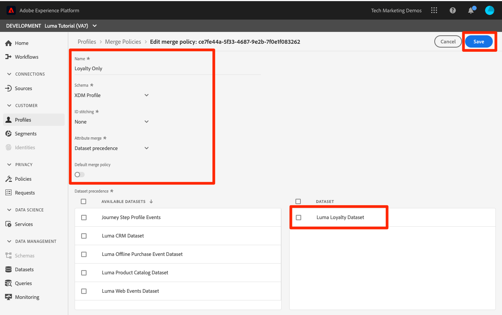

# 結合ポリシーの作成

<!--20 min-->

このレッスンでは、複数のデータソースがプロファイルに結合される方法を優先する結合ポリシーを作成します。

Adobe Experience Platformでは、複数のソースのデータを組み合わせて、各顧客の全体像を把握できます。 このデータを統合する場合、結合ポリシーによって、データの優先順位付け方法と、統合ビューを作成するためにどのデータを組み合わせるかが決まります。

このレッスンのユーザーインターフェイスはそのまま使用しますが、結合ポリシーの作成には API オプションも使用できます。

**データアーキテクト** このチュートリアル以外で、結合ポリシーを作成する必要があります。

演習を始める前に、次の短いビデオを見て結合ポリシーの詳細を確認してください。
>[!VIDEO](https://video.tv.adobe.com/v/330433?quality=12&learn=on)

## 必要な権限

内 [権限の設定](configure-permissions.md) レッスンでは、このレッスンを完了するために必要なすべてのアクセス制御を設定します。

<!--* Permission items **[!UICONTROL Profile Management]** > **[!UICONTROL View Merge Policies]** and **[!UICONTROL Manage Merge Policies]**
* Permission item **[!UICONTROL Profile Management]** > **[!UICONTROL View Profiles]** and **[!UICONTROL Manage Profiles]**
* Permission item **[!UICONTROL Sandboxes]** > `Luma Tutorial`
* User-role access to the `Luma Tutorial Platform` product profile
-->

## 結合ポリシーと和集合スキーマについて

バッチ取り込みに関するレッスンでは、同じ顧客に対して、少し異なる情報を持つ 2 つのレコードをアップロードしたことを思い出すかもしれません。 内 [!DNL Loyalty] データ、顧客の名は `Daniel` そして彼は住んでいた `New York City`が、CRM データでは、顧客の名は `Danny` そして彼は住んでいた `Portland`. 顧客データは時間の経過と共に変化します。 おそらく彼は `Portland` から `New York City`. 電話番号や電子メールアドレスなど、他の変更も加えられます。 結合ポリシーは、2 つのデータソースが同じユーザーに対して異なる情報を提供する場合に、これらのタイプの競合の処理方法を決定するのに役立ちます。

だから、なぜそうしたのか。 `Danny` 名を勝ち取る？ 次を見てみましょう。

1. Platform ユーザーインターフェイスで、「 **[!UICONTROL プロファイル]** 左のナビゲーション
1. 次に移動： **[!UICONTROL ポリシーを結合]** タブ
1. デフォルトの結合ポリシーのタイムスタンプが順序付けられています。 CRM データはロイヤルティデータの後にアップロードされたので、 `Danny` は、プロファイルの名として獲得しました。

プロファイルに対して複数のスキーマが有効な場合、 [!UICONTROL 和集合スキーマ] は、すべてのプロファイルが有効な、基本クラスを共有するレコードスキーマに対して自動的に作成されます。 次の項目を表示すると、 [!UICONTROL スキーマを結合] に移動して、 **[!UICONTROL 和集合スキーマ]** タブをクリックします。

ExperienceEvent クラスには和集合スキーマがないことに注意してください。 時系列ベースなので、ExperienceEvent データは引き続きプロファイルに含まれますが、各イベントにはタイムスタンプと ID が含まれ、競合は問題になりません。

デフォルトの結合ポリシーが気に入らない場合は、どうすればよいですか？ 競合が発生した場合、Luma が CRM システムを真実の源と判断した場合はどうなりますか？ それには、結合ポリシーを作成します。

## UI での結合ポリシーの作成

1. 結合ポリシー画面で、「 **[!UICONTROL 結合ポリシーを作成]** ボタンを右上に
1. を **[!UICONTROL 名前]**&#x200B;を入力して、 `Loyalty Prioritized`
1. を **[!UICONTROL スキーマ]**&#x200B;を選択します。 **[!UICONTROL XDM プロファイル]** （カスタムクラスはレコードデータなので、結合ポリシーでも使用できます）
1. の場合 **[!UICONTROL ID のステッチ]**&#x200B;を選択します。 **[!UICONTROL プライベートグラフ]**
1. の場合 **[!UICONTROL 属性の結合]**&#x200B;を選択します。 **[!UICONTROL データセットの優先順位]**
1. ドラッグ&amp;ドロップ `Luma Loyalty Dataset` および `Luma CRM Dataset` から **[!UICONTROL データセット]** パネル。
1. 確認 `Luma Loyalty Dataset` 上にドラッグ&amp;ドロップして上に表示 `Luma CRM Dataset`
1. を選択します。 **[!UICONTROL 保存]** ボタン
<!--do i need to explain Private Graph? Is that GA?-->

## 結合ポリシーの検証

結合ポリシーが期待どおりに動作しているかどうかを確認します。

1. 次に移動： **[!UICONTROL 参照]** タブ
1. を **[!UICONTROL 結合ポリシー]** 新しい `Loyalty Prioritized` ポリシー
1. を **[!UICONTROL ID 名前空間]**、 `Luma CRM Id`
1. を **[!UICONTROL ID 値]** use `112ca06ed53d3db37e4cea49cc45b71e`
1. を選択します。 **[!UICONTROL プロファイルを表示]** ボタン
1. `Daniel` 戻ってきた！

## 制限されたデータセットを使用した結合ポリシーの作成

データセットの優先順位を使用して結合ポリシーを作成する場合、右側に含む同じ基本クラスのデータセットのみがプロファイルに含まれます。 別の結合ポリシーを設定しましょう

1. 結合ポリシー画面で、「 **[!UICONTROL 結合ポリシーを作成]** ボタンを右上に
1. を **[!UICONTROL 名前]**&#x200B;を入力して、  `Loyalty Only`
1. を **[!UICONTROL スキーマ]**&#x200B;を選択します。 **[!UICONTROL XDM プロファイル]**
1. の場合 **[!UICONTROL ID のステッチ]**&#x200B;を選択します。 **[!UICONTROL なし]**
1. の場合 **[!UICONTROL 属性の結合]**&#x200B;を選択します。 **[!UICONTROL データセットの優先順位]**
1. ドラッグ&amp;ドロップできるのは `Luma Loyalty Dataset` から **[!UICONTROL 選択したデータセット]** パネル。
1. を選択します。 **[!UICONTROL 保存]** ボタン

## 結合ポリシーの検証

次に、この結合ポリシーの機能を見てみましょう。

1. 次に移動： **[!UICONTROL 参照]** タブ
1. を **[!UICONTROL 結合ポリシー]** 新しい `Loyalty Only` ポリシー
1. を **[!UICONTROL ID 名前空間]**、 `Luma CRM Id`
1. を **[!UICONTROL ID 値]** use `112ca06ed53d3db37e4cea49cc45b71e`
1. を選択します。 **[!UICONTROL プロファイルを表示]** ボタン
1. プロファイルが見つからないことを確認します。
   

CRM ID は、 `Luma Loyalty Dataset`プロファイルの検索に使用できるのはプライマリ ID のみです。 では、プライマリ ID を使用してプロファイルを検索してみましょう。 `Luma Loyalty Id`&quot;

1. を **[!UICONTROL ID 名前空間]** から `Luma Loyalty Id`
1. を **[!UICONTROL ID 値]** use `5625458`
1. を選択します。 **[!UICONTROL プロファイルを表示]** ボタン
1. プロファイル ID を選択してプロファイルを開きます
1. 次に移動： **[!UICONTROL 属性]** タブ
1. なお、CRM データセットの他のプロファイルの詳細（携帯電話番号や電子メールアドレスなど）は、
   
1. 次に移動： **[!UICONTROL イベント]** タブ
1. ExperienceEvent データは、結合ポリシーデータセットに明示的に含めていない場合でも、使用できます。
   

## 結合ポリシーの詳細

プロファイル検索で、使用元の結合ポリシーをに変更します。 `Default Timebased` をクリックし、 **[!UICONTROL プロファイルを表示]** 」ボタンをクリックします。 ダニーが戻って来た！

ここで何が起こっているの？ プロファイルの結合は一度のことではありません リアルタイム顧客プロファイルは、使用される結合ポリシーを含む様々な要因に基づいて、その場でアセンブルされます。 複数の結合ポリシーを作成して、必要な顧客のビューに応じて、異なるコンテキストで使用できます。

結合ポリシーの主な使用例は、データガバナンスです。 例えば、パーソナライゼーションの使用例には使用できないが、Platform にサードパーティのデータを取り込むとします。 _can_ 広告の使用例に使用します。 このサードパーティのデータセットを除外する結合ポリシーを作成し、この結合ポリシーを使用して広告ユースケースのセグメントを作成できます。

## その他のリソース

* [結合ポリシーのドキュメント](https://experienceleague.adobe.com/docs/experience-platform/profile/merge-policies/overview.html)
* [結合ポリシー API（リアルタイム顧客プロファイル API の一部）リファレンス](https://www.adobe.io/experience-platform-apis/references/profile/#tag/Merge-policies)

次に、 [データガバナンスフレームワーク](apply-data-governance-framework.md).
