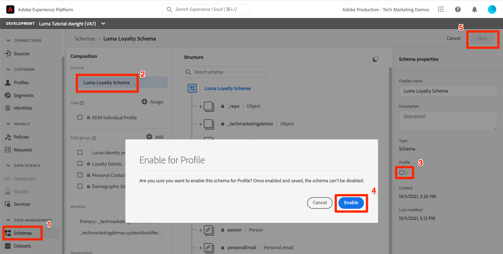
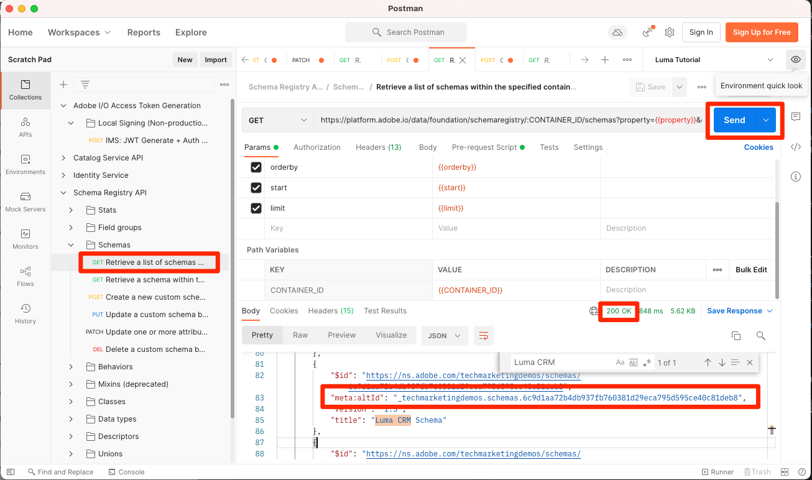
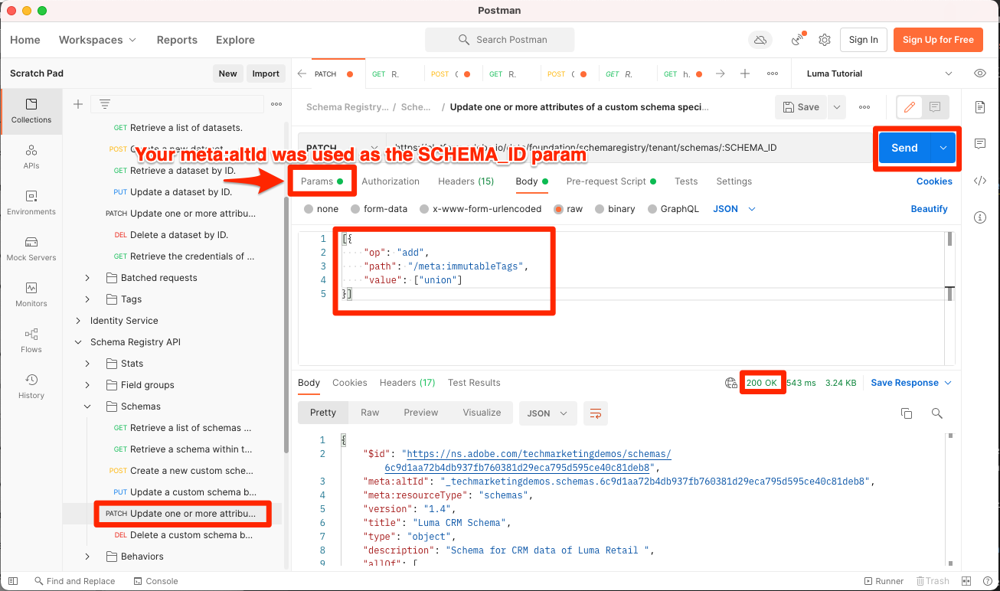
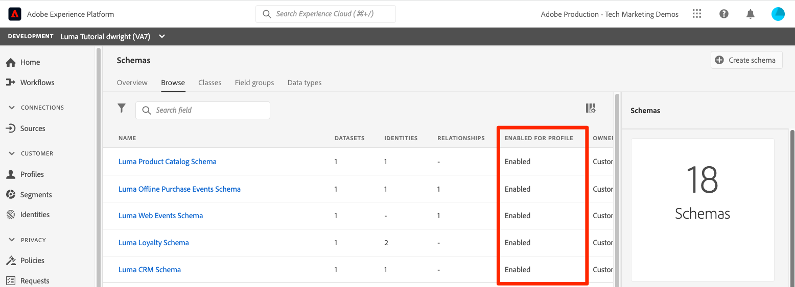
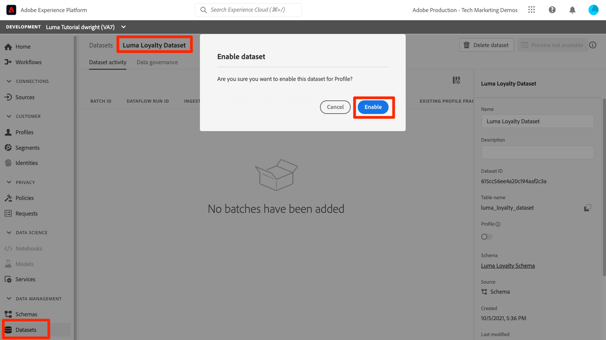
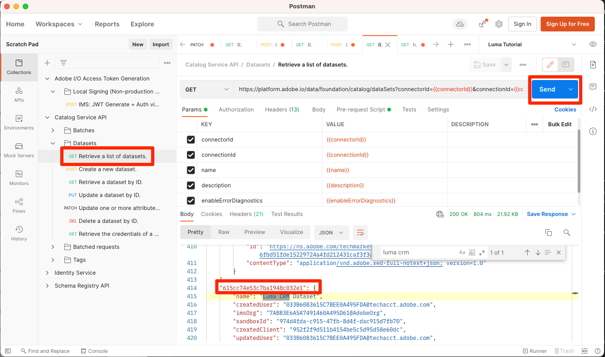
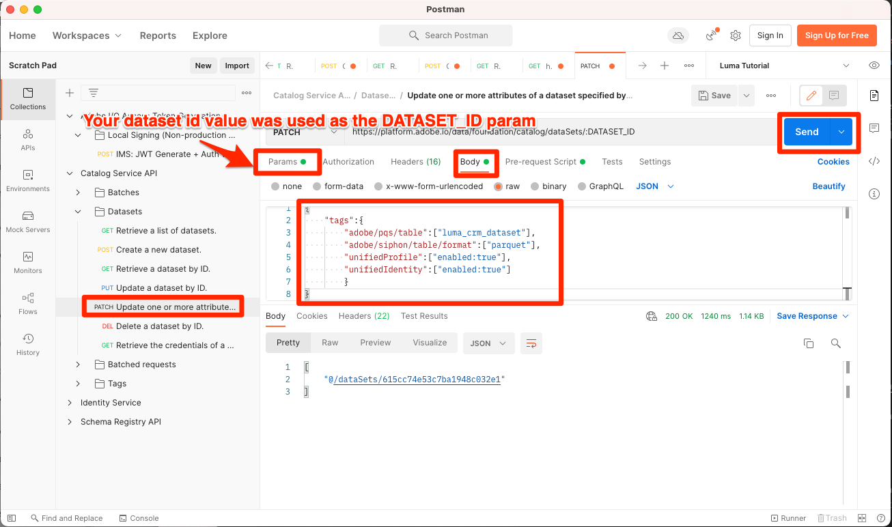
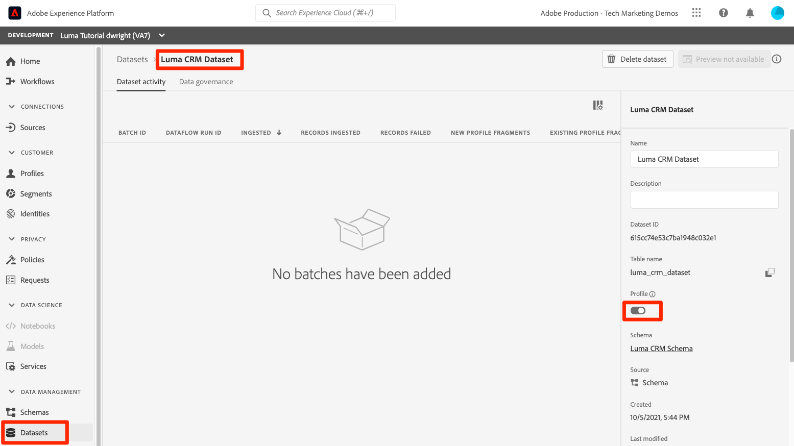

# リアルタイムの顧客プロファイルの実現

<!-- 15min-->
このレッスンでは、リアルタイム顧客プロファイルのスキーマとデータセットを有効にします。

データセットのレッスンがこのチュートリアルで最も短いレッスンであると言ったとき、私は嘘をつきました。これは、さらに少ない時間がかかるはずです！ 文字通り、たくさんのトグルをひっくり返すだけです。 しかし、切り替えスイッチを切り替えると何が起こるかは&#x200B;_本当に_&#x200B;重要なので、ページ全体を切り替えたいと思いました。

リアルタイムの顧客プロファイルを利用すれば、オンライン、オフライン、CRM、サードパーティデータなど、複数のチャネルからのデータを組み合わせた個々の顧客の全体像を把握することができます。 プロファイルを使用すると、個別の顧客データを統合ビューに統合し、顧客のやり取りごとに実用的なタイムスタンプ付きの説明を提供できます。

素晴らしいことに、プロファイル用に&#x200B;*すべてのデータ*&#x200B;をアクティブ化する必要はありません。 実際には、アクティベーションのユースケースに必要なデータのみを有効にする必要があります。 マーケティングのユースケースやコールセンターの統合などで使用するデータを有効にし、堅牢な顧客プロファイルにすばやくアクセスする必要があります。 分析用にのみデータをアップロードする場合は、プロファイルに対してデータを有効にしないでください。

リアルタイム顧客プロファイルデータ [の重要な](https://experienceleague.adobe.com/docs/experience-platform/profile/guardrails.html?lang=ja) ガードレールがあり、プロファイルで有効にする独自のデータを決定する際に確認する必要があります。

<!--is this accurate. Are there other considerations to point out? -->

**データアーキテクト**&#x200B;は、このチュートリアル以外でリアルタイム顧客プロファイルを有効にする必要があります。

この演習を開始する前に、この短いビデオでリアルタイム顧客プロファイルの詳細をご覧ください。
>[!VIDEO](https://video.tv.adobe.com/v/27251?learn=on&enablevpops)

## 権限が必要です

[権限の設定](configure-permissions.md) レッスンでは、このレッスンを完了するために必要なすべてのアクセス制御を設定します。


<!--
* Permission items **[!UICONTROL Data Modeling]** > **[!UICONTROL View Schemas]** and **[!UICONTROL Manage Schemas]**
* Permission items **[!UICONTROL Data Management]** > **[!UICONTROL View Datasets]** and **[!UICONTROL Manage Datasets]**
* Permission item **[!UICONTROL Sandboxes]** > `Luma Tutorial`
* User-role access to the `Luma Tutorial Platform` product profile
* Developer-role access to the `Luma Tutorial Platform` product profile (for API)
-->

## Platform ユーザーインターフェイスを使用したリアルタイム顧客プロファイルのスキーマの有効化

スキーマを有効にする簡単なタスクから始めましょう。

1. Platform ユーザーインターフェイスで、**Luma ロイヤルティスキーマ**&#x200B;を開きます
1. **[!UICONTROL スキーマのプロパティ]**&#x200B;で、**プロファイル** スイッチを切り替えます
1. 確認モーダルで、**[!UICONTROL 有効]** ボタンを押して確認します
1. **[!UICONTROL 保存]** ボタンを選択して変更を保存します

   >[!IMPORTANT]
   >
   >プロファイルに対してスキーマを有効にすると、そのスキーマを無効にしたり削除したりすることはできません。 また、この時点の後にスキーマからフィールドを削除することはできません。 これらの意味は、実稼動環境で独自のデータを使用する際に、後で考慮することが重要です。 このチュートリアルでは、いつでも削除できる開発サンドボックスを使用する必要があります。
   >
   >このチュートリアルの制御された環境では、データを取り込む前に、プロファイルのスキーマとデータセットを&#x200B;_有効にします_。 独自のデータを使用する場合は、次の順序で操作することをお勧めします。
   >
   > 1. まず、データセットにデータを取り込みます。
   > 1. データ取り込みプロセス中に発生する問題（データ検証やマッピングの問題など）に対処します。
   > 1. プロファイルのデータセットとスキーマを有効にする
   > 1. データの再取り込み


   

簡単だろ？ 他のスキーマについて、上記の手順を繰り返します。

1. Luma製品カタログスキーマ
1. Luma オフライン購入イベントスキーマ
1. Luma Web Events Schema （確認モーダルで、「このスキーマのデータにはidentityMap フィールドにプライマリ IDが含まれる」チェックボックスをオンにします）。

## Platform APIを使用したリアルタイム顧客プロファイルのスキーマの有効化

次に、APIで`Luma CRM Schema`を有効にします。 この演習をスキップしてユーザーインターフェイスで有効にする場合は、すぐに進んでください。

### スキーマのメタ :altIdを取得

まず`meta:altId`の`Luma CRM Schema`を取得しましょう：

1. [!DNL Postman]を開
1. アクセストークンがない場合は、リクエスト **[!DNL OAuth: Request Access Token]**&#x200B;を開き、**送信**&#x200B;を選択して新しいアクセストークンをリクエストします（[!DNL Postman] レッスンで行った場合と同様）。
1. リクエスト **[!DNL Schema Registry API > Schemas > Retrieve a list of schemas within the specified container.]**&#x200B;を開きます
1. 「**送信**」ボタンを選択します
1. 200件の回答が必要です
1. `Luma CRM Schema`項目の応答を検索し、`meta:altId`値をコピーします
   

### スキーマを有効にする

これで、スキーマのmeta:altIdができたので、プロファイルに対して有効にできます。

1. リクエスト **[!DNL Schema Registry API > Schemas > Update one or more attributes of a custom schema specified by ID.]**&#x200B;を開きます
1. **パラメーター**&#x200B;に、`meta:altId`値を`SCHEMA_ID` パラメーター値として貼り付けます
1. 「**Body**」タブに、次のコードを貼り付けます

   ```json
   [{
       "op": "add",
       "path": "/meta:immutableTags",
       "value": ["union"]
   }]
   ```

1. 「**送信**」ボタンを選択します
1. 200件の回答が必要です

   として使用して、プロファイルのCRM スキーマを有効にします

ユーザーインターフェイスで、5つのスキーマがすべてプロファイルに対して有効になっていることを確認できます（`Luma CRM Schema`が有効になっていることを確認するには、SHIFT-Reloadが必要な場合があります）。



## Platform ユーザーインターフェイスを使用したリアルタイム顧客プロファイルのデータセットの有効化

プロファイルに対してデータセットも有効にする必要があり、プロセスはさらに簡単です。

1. Platform ユーザーインターフェイスで、`Luma Loyalty Dataset`を開きます
1. **[!UICONTROL プロファイル]**&#x200B;切り替え
1. 確認モーダルで、**[!UICONTROL 有効]** ボタンを押して確認します

   

これらの他のデータセットについて、上記の手順を繰り返します。

1. Luma製品カタログデータセット
1. Luma オフライン購入イベントデータセット
1. Luma Web Events データセット

>[!NOTE]
>
>スキーマとは異なり、プロファイルからデータセットを無効にできますが、以前に取り込んだすべてのデータはプロファイルに残ります。

## Platform APIを使用したリアルタイム顧客プロファイルのデータセットの有効化

次に、APIを使用してプロファイルのデータセットを有効にします。 繰り返しますが、上記の方法を使用してユーザーインターフェイスを介して有効にする場合も、問題ありません。

### データセットのIDを取得します

まず`id`の`Luma CRM Dataset`を取得する必要があります：

1. [!DNL Postman]を開
1. アクセストークンがない場合は、リクエスト **[!DNL OAuth: Request Access Token]**&#x200B;を開き、**送信**&#x200B;を選択して新しいアクセストークンをリクエストします（[!DNL Postman] レッスンで行った場合と同様）。
1. リクエスト **[!DNL Catalog Service API > Datasets > Retrieve a list of datasets.]**&#x200B;を開きます
1. 「**送信**」ボタンを選択します
1. 200件の回答が必要です
1. `Luma CRM Dataset` アイテムの応答を検索し、IDをコピーします。
   

### データセットの有効化

これでデータセットのIDができたので、プロファイルに対して有効にできます。

1. リクエスト **[!DNL Catalog Service API > Datasets > Update one or more attributes of a dataset specified by ID.]**&#x200B;を開きます
1. **パラメーター**&#x200B;で、`DATASET_ID`値を独自の値に更新します
1. 「**Body**」タブに、次のコードを貼り付けます。 最初の2つの値は、前の応答で表示される既存のタグです。 これらは、追加する2つの新しいタグに加えて、本文に含める必要があります。

   ```json
   {
       "tags":{
           "adobe/pqs/table":["luma_crm_dataset"],
           "adobe/siphon/table/format":["parquet"],
           "unifiedProfile":["enabled:true"],
           "unifiedIdentity":["enabled:true"]
           }
   }
   ```

1. 「**送信**」ボタンを選択します
1. 200件の回答が必要です

   として使用してください

ユーザーインターフェイスにデータセットが有効になっていることを確認することもできます。


>[!IMPORTANT]
>
> プロファイルのスキーマとデータセットを有効にする前にデータを取り込む場合は、後でそのデータを再び取り込む必要があります。

## その他のリソース

* [&#x200B; リアルタイム顧客プロファイルのドキュメント &#x200B;](https://experienceleague.adobe.com/docs/experience-platform/profile/home.html?lang=ja)
* [&#x200B; リアルタイム顧客プロファイル API リファレンス &#x200B;](https://www.adobe.io/experience-platform-apis/references/profile/)


**データエンジニア**&#x200B;は、[&#x200B; データ取り込みイベントの登録](subscribe-to-data-ingestion-events.md) レッスンを続行する必要があります。
**データアーキテクト** _は_&#x200B;をスキップして、[&#x200B; バッチ取り込みレッスン &#x200B;](ingest-batch-data.md)に移動できます。
