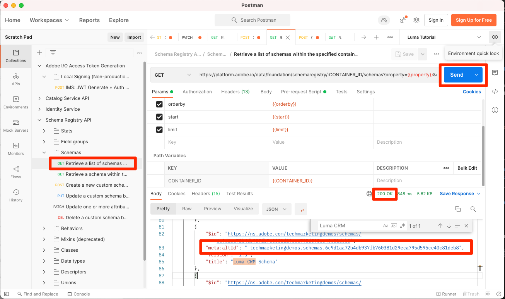

# リアルタイム顧客プロファイルの有効化

<!-- 15min-->
このレッスンでは、リアルタイム顧客プロファイルのスキーマとデータセットを有効にします。

データセットのレッスンはこのチュートリアルの最短のレッスンだと言ったら、嘘をつきました。このレッスンの時間はさらに短いはずです。 文字通りあなたがしようとしているのは、たくさんのトグルをフリップすることです。 しかし、これらの切り替えを反転させるとどうなるかは _本当に_ 重要なので、ページ全体を専用にしたいと思いました。

リアルタイム顧客プロファイルを使用すると、オンライン、オフライン、CRM、サードパーティデータなど、複数のチャネルのデータを組み合わせて、各顧客の全体像を確認できます。 プロファイルを使用すると、個別の顧客データを統合ビューに統合し、顧客のやり取りごとに実用的なタイムスタンプ付きの説明を提供できます。

驚くべきことに、プロファイルに対して *すべてのデータ* をアクティブ化する必要はありません。 実際には、アクティベーションのユースケースに必要なデータのみを有効にしてください。 堅牢な顧客プロファイルにすばやくアクセスする必要があるマーケティングのユースケース、コールセンターの統合などに使用したいデータを有効にします。 分析用のデータのみをアップロードしている場合は、プロファイルに対してデータを有効にしないでください。

リアルタイム顧客プロファイルデータには重要な [ ガードレール ](https://experienceleague.adobe.com/docs/experience-platform/profile/guardrails.html?lang=en) があり、プロファイルに対して有効にする必要がある独自のデータを決定する際に確認する必要があります。

<!--is this accurate. Are there other considerations to point out? -->

**データアーキテクト** は、このチュートリアル以外でリアルタイム顧客プロファイルを有効にする必要があります。

演習を開始する前に、この短いビデオを視聴してリアルタイム顧客プロファイルの詳細を確認してください。
>[!VIDEO](https://video.tv.adobe.com/v/27251?learn=on)

## 必要な権限

[ 権限の設定 ](configure-permissions.md) レッスンでは、このレッスンを完了するために必要なすべてのアクセス制御を設定します。


<!--* Permission items **[!UICONTROL Data Modeling]** > **[!UICONTROL View Schemas]** and **[!UICONTROL Manage Schemas]**
* Permission items **[!UICONTROL Data Management]** > **[!UICONTROL View Datasets]** and **[!UICONTROL Manage Datasets]**
* Permission item **[!UICONTROL Sandboxes]** > `Luma Tutorial`
* User-role access to the `Luma Tutorial Platform` product profile
* Developer-role access to the `Luma Tutorial Platform` product profile (for API)
-->

## Platform ユーザーインターフェイスを使用したリアルタイム顧客プロファイルのスキーマの有効化

まず、スキーマを有効にする簡単なタスクから始めましょう。

1. Platform ユーザーインターフェイスで、**Luma ロイヤルティスキーマ** を開きます。
1. **[!UICONTROL スキーマプロパティ]** で **プロファイル** スイッチを切り替えます
1. 確認モーダルで、「**[!UICONTROL 有効]** ボタンを押して確認します
1. 「**[!UICONTROL 保存]** ボタンを選択して、変更を保存します

   >[!IMPORTANT]
   >
   >プロファイルに対してスキーマを有効にすると、そのスキーマを無効にしたり削除したりできなくなります。 また、この時点より後にフィールドをスキーマから削除することはできません。 これらの影響は、実稼動環境で独自のデータを操作する際に後で留意することが重要です。 このチュートリアルでは開発用サンドボックスを使用する必要がありますが、このサンドボックスはいつでも削除できます。
   >
   >このチュートリアルの制御された環境では、（データを取り込む前に _プロファイルのスキーマとデータセットを有効に_ します。 独自のデータを操作する場合は、次の順序で作業を行うことをお勧めします。
   >
   > 1. まず、データセットにデータを取り込みます。
   > 1. データ取り込みプロセス中に発生した問題（データの検証やマッピングの問題など）に対処します。
   > 1. プロファイル用のデータセットとスキーマの有効化
   > 1. データの取り込み


   

簡単だろ？ その他のスキーマに対して、上記の手順を繰り返します。

1. Luma 製品カタログスキーマ
1. Luma オフライン購入イベントスキーマ
1. Luma web イベントスキーマ（確認モーダルで、「このスキーマのデータには、identityMap フィールドにプライマリ ID が含まれます」チェックボックスをオンにします）。

## Platform API を使用したリアルタイム顧客プロファイルのスキーマの有効化

次に、API を使用して `Luma CRM Schema` を有効にします。 この演習をスキップしてユーザーインターフェイスで有効にするだけの場合は、先に進んでください。

### スキーマの meta:altId の取得

まず、`Luma CRM Schema` の `meta:altId` を取得します。

1. Open [!DNL Postman]
1. アクセストークンがない場合は、[!DNL Postman] のレッスンと同様に、リクエスト **[!DNL OAuth: Request Access Token]** を開き、「**送信**」を選択して新しいアクセストークンをリクエストします。
1. リクエスト **[!DNL Schema Registry API > Schemas > Retrieve a list of schemas within the specified container.]** を開きます。
1. 「**送信** ボタンを選択します
1. 200 の応答が返されます。
1. `Luma CRM Schema` 項目の応答を探し、`meta:altId` の値をコピーします
   

### スキーマの有効化

スキーマの meta:altId を取得したので、これをプロファイルに対して有効にします。

1. リクエスト **[!DNL Schema Registry API > Schemas > Update one or more attributes of a custom schema specified by ID.]** を開きます。
1. **Params** に、`meta:altId` 値を `SCHEMA_ID` のパラメーター値として貼り付けます
1. 「**本文**」タブに、次のコードをペーストします。

   ```json
   [{
       "op": "add",
       "path": "/meta:immutableTags",
       "value": ["union"]
   }]
   ```

1. 「**送信** ボタンを選択します
1. 200 の応答が返されます。

   

ユーザーインターフェイスに、5 つのスキーマすべてがプロファイルに対して有効になっていることを確認できます（`Luma CRM Schema` が有効になっていることを確認するには、SHIFT キーを押しながら再読み込みが必要な場合があります）。


## Platform ユーザーインターフェイスを使用したリアルタイム顧客プロファイルのデータセットの有効化

データセットもプロファイルに対して有効にする必要があり、プロセスはさらに簡単です。

1. Platform ユーザーインターフェイスで、`Luma Loyalty Dataset` を開きます
1. **[!UICONTROL プロファイル]** スイッチを切り替えます
1. 確認モーダルで、「**[!UICONTROL 有効]** ボタンを押して確認します

   

その他のデータセットに対して、上記の手順を繰り返します。

1. Luma 製品カタログデータセット
1. Luma オフライン購入イベントデータセット
1. Luma Web イベントデータセット

>[!NOTE]
>
>スキーマとは異なり、プロファイルからデータセットを無効にすることができますが、以前に取り込んだデータはすべてプロファイルに残ります。

## Platform API を使用したリアルタイム顧客プロファイルのデータセットの有効化

次に、API を使用してプロファイルのデータセットを有効にします。 ここでも、上記の方法を使用してユーザーインターフェイスを介して有効にする場合は、それも問題ありません。

### データセットの ID の取得

まず、`Luma CRM Dataset` の `id` を取得する必要があります。

1. Open [!DNL Postman]
1. アクセストークンがない場合は、[!DNL Postman] のレッスンと同様に、リクエスト **[!DNL OAuth: Request Access Token]** を開き、「**送信**」を選択して新しいアクセストークンをリクエストします。
1. リクエスト **[!DNL Catalog Service API > Datasets > Retrieve a list of datasets.]** を開きます。
1. 「**送信** ボタンを選択します
1. 200 の応答が返されます。
1. `Luma CRM Dataset` の項目の応答を探し、id をコピーします。
   

### データセットの有効化

データセットの ID を取得したので、これをプロファイルに対して有効にします。

1. リクエスト **[!DNL Catalog Service API > Datasets > Update one or more attributes of a dataset specified by ID.]** を開きます。
1. **Params** で `DATASET_ID` の値を独自の値に更新します
1. 「**本文**」タブに、次のコードを貼り付けます。 最初の 2 つの値は、以前の応答に表示される既存のタグです。 追加する 2 つの新しいタグに加えて、本文に含める必要があります。

   ```json
   {
       "tags":{
           "adobe/pqs/table":["luma_crm_dataset"],
           "adobe/siphon/table/format":["parquet"],
           "unifiedProfile":["enabled:true"],
           "unifiedIdentity":["enabled:true"]
           }
   }
   ```

1. 「**送信** ボタンを選択します
1. 200 の応答が返されます。

   

また、ユーザーインターフェイスでデータセットが有効になっていることを確認できます。


>[!IMPORTANT]
>
> プロファイルのスキーマとデータセットを有効にする前にデータを取り込んだ場合は、後でそのデータを再度取り込む必要があります。

## その他のリソース

* [ リアルタイム顧客プロファイルのドキュメント ](https://experienceleague.adobe.com/docs/experience-platform/profile/home.html?lang=ja)
* [ リアルタイム顧客プロファイル API リファレンス ](https://www.adobe.io/experience-platform-apis/references/profile/)


**データエンジニア** は、引き続き [ データ取り込みイベントの購読 ](subscribe-to-data-ingestion-events.md) レッスンに進んでください。
**データアーキテクト**_スキップして先に進み_[ バッチ取り込みレッスン ](ingest-batch-data.md) に進むことができます。
