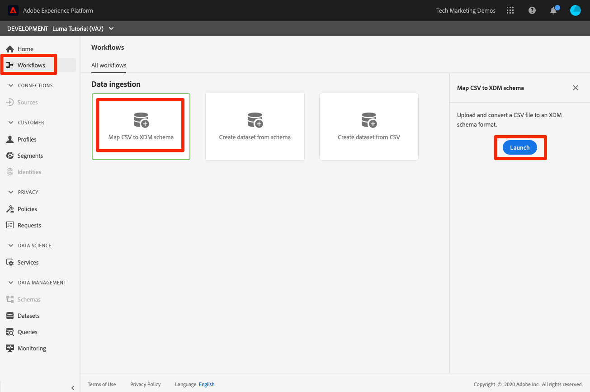

# バッチデータの取得

<!-- 1hr-->
このレッスンでは、様々な方法を使用してバッチデータをExperience Platformに取り込みます。

バッチデータ取り込みを使用すると、大量のデータをAdobe Experience Platformに一度に取り込むことができます。 バッチデータは、Platform のインターフェイス内で 1 回アップロードするか、API を使用して取り込むことができます。 また、ソースコネクタを使用して、クラウドストレージサービスなどのサードパーティのサービスから、定期的にスケジュールされるバッチアップロードを設定することもできます。

**データエンジニア** このチュートリアル以外で、バッチデータを取り込む必要があります。

演習を始める前に、次の短いビデオを見て、データ取り込みの詳細を確認してください。
>[!VIDEO](https://video.tv.adobe.com/v/27106?quality=12&learn=on)


## 必要な権限

内 [権限の設定](configure-permissions.md) レッスンでは、このレッスンを完了するために必要なすべてのアクセス制御を設定します。

<!--
* Permission item **[!UICONTROL Data Management]** > **[!UICONTROL View Datasets]**, **[!UICONTROL Manage Datasets]** and **[!UICONTROL Data Monitoring]**
* Permission items **[!UICONTROL Data Ingestion]** > **[!UICONTROL View Sources]** and **[!UICONTROL Manage Sources]**
* Permission item **[!UICONTROL Profile Management]** > **[!UICONTROL View Profiles]**
* Permission item **[!UICONTROL Sandboxes]** > `Luma Tutorial`
* User-role access to the `Luma Tutorial Platform` product profile
* Developer-role access to the `Luma Tutorial Platform` product profile (for API)
-->

ソースに関する演習では、(S)FTP サーバまたはクラウドストレージソリューションにアクセスする必要があります。 回避策がない場合は、次の手順を実行します。

## Platform ユーザーインターフェイスを使用したバッチでのデータ取得

データは、JSON および Parquet 形式でデータセット画面のデータセットに直接アップロードできます。 これは、

### データをダウンロードして準備する

まず、サンプルデータを取得し、テナント用にカスタマイズします。

>[!NOTE]
>
>データ [luma-data.zip](assets/luma-data.zip) ファイルは架空のもので、デモ目的でのみ使用します。

1. ダウンロード [luma-data.zip](assets/luma-data.zip) を **Luma チュートリアルアセット** フォルダー。
1. ファイルを解凍し、という名前のフォルダーを作成します。 `luma-data` このレッスンで使用する 4 つのデータファイルを含む
1. 開く `luma-loyalty.json` テキストエディターで、 `_techmarketingdemos` に、独自のアンダースコアテナント id を設定します。これは、独自のスキーマに表示されます。
   

1. 更新したファイルを保存します。

### データの取り込み

1. Platform ユーザーインターフェイスで、「 **[!UICONTROL データセット]** 左のナビゲーション
1. を開きます。 `Luma Loyalty Dataset`
1. 下にスクロールして、 **[!UICONTROL データを追加]** 右列の「 」セクション
1. をアップロードします。 `luma-loyalty.json` ファイル。
1. ファイルがアップロードされると、バッチの行が表示されます
1. 数分後にページを再読み込みすると、1,000 件のレコードと 1,000 件のプロファイルフラグメントを含むバッチが正常にアップロードされたことがわかります。

   
   <!--do i need to explain error diagnostics and partial ingestion-->

>[!NOTE]
>
>いくつかのオプションがあります。 **[!UICONTROL エラー診断]** および **[!UICONTROL 部分取り込み]**&#x200B;を使用し、このレッスンの様々な画面に表示されます。 これらのオプションについては、このチュートリアルでは説明していません。 クイック情報：
>
>* エラー診断を有効にすると、データの取り込みに関するデータが生成され、その後、データアクセス API を使用して確認できます。 詳しくは、 [ドキュメント](https://experienceleague.adobe.com/docs/experience-platform/data-access/home.html).
>* 部分取り込みを使用すると、エラーを含むデータを、指定可能な特定のしきい値まで取り込むことができます。 詳しくは、 [ドキュメント](https://experienceleague.adobe.com/docs/experience-platform/ingestion/batch/partial.html)

### データの検証

データが正常に取り込まれたことを確認する方法はいくつかあります。

#### Platform ユーザーインターフェイスでの検証

データがデータセットに取り込まれたことを確認するには：

1. データを取り込んだページで、 **[!UICONTROL データセットをプレビュー]** 右上のボタン
1. を選択します。 **プレビュー** ボタンをクリックすると、取り込んだデータの一部が表示されます。

   


データがプロファイルにランディングしたことを確認するには（データが到着するまで数分かかる場合があります）:

1. に移動します。 **[!UICONTROL プロファイル]** 左のナビゲーション
1. の横にあるアイコンを選択します。 **[!UICONTROL ID 名前空間を選択]** モーダルを開くためのフィールド
1. を選択します。 `Luma Loyalty Id` 名前空間
1. 次に、 `loyaltyId` の値をデータセットから取得します。  `5625458`
1. 選択 **[!UICONTROL 表示]**
   

#### データ取り込みイベントを使用した検証

前のレッスンでデータ取得イベントを購読した場合は、一意の webhook.site URL を確認します。 3 つのリクエストが次の順序で表示され、その間に時間が経過すると、以下のように表示されます `eventCode` 値：

1. `ing_load_success` — 取り込まれたバッチ
1. `ig_load_success` — バッチが id グラフに取り込まれました。
1. `ps_load_success` — バッチがプロファイルサービスに取り込まれました


詳しくは、 [ドキュメント](https://experienceleague.adobe.com/docs/experience-platform/ingestion/quality/subscribe-events.html#available-status-notification-events) を参照してください。

## Platform API を使用したバッチでのデータの取得

次に、API を使用してデータをアップロードします。

>[!NOTE]
>
>データアーキテクトは、ユーザーインターフェイスメソッドを使用して CRM データを自由にアップロードできます。

### データをダウンロードして準備する

1. 既にダウンロードおよび解凍されているはずです。 [luma-data.zip](assets/luma-data.zip) を `Luma Tutorial Assets` フォルダー。
2. 開く `luma-crm.json` テキストエディターで、 `_techmarketingdemos` スキーマに表示される、独自のアンダースコアテナント id を使用します。
3. 更新したファイルを保存します。

### データセット ID を取得する

まず、データの取り込み先のデータセットのデータセット ID を取得します。

1. オープン [!DNL Postman]
1. アクセストークンがない場合は、リクエストを開きます。 **[!DNL OAuth: Request Access Token]** を選択し、 **送信** をクリックして、 [!DNL Postman] レッスン。
1. 環境変数を開き、 **CONTAINER_ID** まだ `tenant`
1. リクエストを開く **[!DNL Catalog Service API > Datasets > Retrieve a list of datasets.]** を選択し、 **送信**
1. 以下を受け取る必要があります。 `200 OK` 応答
1. ID を `Luma CRM Dataset` 応答本文から
   

### バッチの作成

次に、データセット内にバッチを作成します。

1. ダウンロード [データ取得 API.postman_collection.json](https://raw.githubusercontent.com/adobe/experience-platform-postman-samples/master/apis/experience-platform/Data%20Ingestion%20API.postman_collection.json) を `Luma Tutorial Assets` フォルダー
1. コレクションの読み込み先 [!DNL Postman]
1. リクエストを選択 **[!DNL Data Ingestion API > Batch Ingestion > Create a new batch in Catalog Service.]**
1. 以下を **本文** リクエストの ***datasetId 値を独自の値に置き換える***:

   ```json
   {
       "datasetId":"REPLACE_WITH_YOUR_OWN_DATASETID",
       "inputFormat": {
           "format": "json"
       }
   }
   ```

1. を選択します。 **送信** ボタン
1. 新しいバッチの ID を含む 201 作成済みの応答が返されます。
1. を `id` 新しいバッチの
   

### データの取り込み

これで、データをバッチにアップロードできます。

1. リクエストを選択 **[!DNL Data Ingestion API > Batch Ingestion > Upload a file to a dataset in a batch.]**
1. 内 **パラメーター** 「 」タブで、データセット id とバッチ id をそれぞれのフィールドに入力します
1. 内 **パラメーター** タブ、入力 `luma-crm.json` を **filePath**
1. 内 **本文** タブで、 **バイナリ** オプション
1. ダウンロードした `luma-crm.json` ローカルから `Luma Tutorial Assets` フォルダー
1. 選択 **送信** 応答本文に「1」が含まれる 200 OK 応答が返されます。

   

この時点で、Platform ユーザーインターフェイスでバッチを確認すると、そのバッチが「[!UICONTROL 読み込み中]&quot;ステータス：


Batch API は多くの場合、複数のファイルのアップロードに使用されるので、バッチが完了したら Platform に通知する必要があります。これは、次の手順でおこないます。

### バッチを完了

バッチを完了するには、次の手順に従います。

1. リクエストを選択 **[!DNL Data Ingestion API > Batch Ingestion > Finish uploading a file to a dataset in a batch.]**
1. 内 **パラメーター** タブ、入力 `COMPLETE` を **アクション**
1. 内 **パラメーター** 「 」タブで、バッチ id を入力します。 データセット ID や filePath が存在する場合は、心配しないでください。
1. POSTの URL が `https://platform.adobe.io/data/foundation/import/batches/:batchId?action=COMPLETE` そして、 `datasetId` または `filePath`
1. 選択 **送信** 応答本文に「1」が含まれる 200 OK 応答が返されます。

   

### データの検証

#### Platform ユーザーインターフェイスでの検証

データが Loyalty データセットと同様に、Platform ユーザーインターフェイスにランディングしたことを検証します。

まず、バッチで、1000 件のレコードが取り込まれたことを確認します。


次に、プレビューデータセットを使用してバッチを確認します。


最後に、 `Luma CRM Id` 名前空間例 `112ca06ed53d3db37e4cea49cc45b71e`


私が指摘したいことが一つ起こったところで面白い事があります。 開ける `Danny Wright` プロファイル。 プロファイルには `Lumacrmid` および `Lumaloyaltyid`. を記憶する `Luma Loyalty Schema` には、Luma ロイヤリティ ID と CRM ID の 2 つの ID フィールドが含まれていました。 両方のデータセットをアップロードし、1 つのプロファイルに結合しました。 ロイヤリティデータには `Daniel` を名、を自宅住所として「New York City」、を CRM データに `Danny` 名として `Portland` を同じ Loyalty Id を持つ顧客の自宅住所として使用します。 名が表示される理由に戻ります `Danny` （結合ポリシーに関するレッスン）

おめでとうございます。プロファイルがマージされました。


#### データ取り込みイベントを使用した検証

前のレッスンでデータ取得イベントを購読した場合は、一意の webhook.site URL を確認します。 次の 3 つのリクエストが、ロイヤルティデータと同様に送信されます。


詳しくは、 [ドキュメント](https://experienceleague.adobe.com/docs/experience-platform/ingestion/quality/subscribe-events.html#available-status-notification-events) を参照してください。

## ワークフローを使用したデータの取り込み

別のデータアップロード方法を見てみましょう。 ワークフロー機能を使用すると、XDM でまだモデル化されていない CSV データを取り込むことができます。

### データをダウンロードして準備する

1. 既にダウンロードおよび解凍されているはずです。 [luma-data.zip](assets/luma-data.zip) を `Luma Tutorial Assets` フォルダー。
1. 次の条件を満たしていることを確認します。`luma-products.csv`

### ワークフローの作成

次に、ワークフローを設定します。

1. に移動します。 **[!UICONTROL ワークフロー]** 左のナビゲーション
1. 選択 **[!UICONTROL CSV を XDM スキーマにマッピング]** をクリックし、 **[!UICONTROL 起動]** ボタン
   
1. を選択します。 `Luma Product Catalog Dataset` をクリックし、 **[!UICONTROL 次へ]** ボタン
   
1. を `luma-products.csv` ダウンロードしたファイルを選択し、 **[!UICONTROL 次へ]** ボタン
   
1. これで、マッパーインターフェイスに入り、ソースデータからフィールドをマッピングできます ( `luma-products.csv` ファイル ) をターゲットスキーマの XDM フィールドに追加します。 この例では、列名は、マッパーで適切なマッピングを自動検出できるスキーマフィールド名に十分近いものです。 マッパーで正しいフィールドが自動検出できなかった場合は、ターゲットフィールドの右側にあるアイコンを選択して、正しい XDM フィールドを選択します。 また、CSV から列の 1 つを取り込まない場合は、マッパーから行を削除できます。 自由に操作して、 `luma-products.csv` を参照してください。
1. を選択します。 **[!UICONTROL 完了]** ボタン
   

### データの検証

バッチがアップロードされたら、データセットをプレビューしてアップロードを検証します。

以降 `Luma Product SKU` は人以外の名前空間で、製品 sku のプロファイルは表示されません。

Webhook に対する 3 つのヒットが表示されます。

## ソースを含むデータの取り込み

よし、君は難しい方法で物事を行った。 さあ、約束の地に移ろう _自動_ バッチ取得！ 「設定して！」と言うと 「忘れろ！」と言うのです 「設定して！」 「忘れろ！」 「設定して！」 「忘れろ！」 冗談だけど、そんなことは絶対にしない！ はい、仕事に戻ります。 もう少しで終わりです。

に移動します。 **[!UICONTROL ソース]** 左側のナビゲーションで、「ソース」カタログを開きます。 ここでは、業界をリードするデータプロバイダーおよびストレージプロバイダーとの、標準搭載された様々な統合について説明します。


ソースコネクタを使用してデータを取り込みましょう。

この練習は、自分の冒険スタイルを選ぶことになります。 FTP ソースコネクタを使用したワークフローを表示します。 会社で使用する別のクラウドストレージソースコネクタを使用することも、ロイヤルティデータと同様に、データセットユーザーインターフェイスを使用して json ファイルをアップロードすることもできます。

多くのソースには同様の設定ワークフローがあり、次のような設定ワークフローがあります。

1. 認証の詳細を入力
1. 取り込むデータを選択
1. 取り込む Platform データセットを選択します。
1. フィールドを XDM スキーマにマッピングします
1. その場所からデータを再取り込みする頻度を選択します

>[!NOTE]
>
>この演習で使用するオフライン購入データには、日時データが含まれています。 日時データは次のいずれかにする必要があります [ISO 8061 形式の文字列](https://www.iso.org/iso-8601-date-and-time-format.html) (&quot;2018-07-10T15:05:59.000～08:00&quot;) または Unix 時間 ( ミリ秒 (1531263959000) で書式設定され、取得時にターゲット XDM タイプに変換されます。 データ変換およびその他の制約について詳しくは、 [バッチ取得 API のドキュメント](https://experienceleague.adobe.com/docs/experience-platform/ingestion/batch/api-overview.html#types).

### データをダウンロード、準備、および目的のクラウドストレージベンダーにアップロード

1. 既にダウンロードおよび解凍されているはずです。 [luma-data.zip](assets/luma-data.zip) を `Luma Tutorial Assets` フォルダー。
1. 開く `luma-offline-purchases.json` テキストエディターで、 `_techmarketingdemos` スキーマに表示される、独自のアンダースコアテナント id を使用します。
1. 過去 1 か月のイベントが発生するように、すべてのタイムスタンプを更新します ( 例： `"timestamp":"2022-06` とを置き換えます )
1. ご希望のクラウドストレージプロバイダーを選択し、 [!UICONTROL ソース] カタログ
1. アップロード `luma-offline-purchases.json` を、お使いのクラウドストレージプロバイダー内の場所に追加します。

### データを目的のクラウドストレージの場所に取り込む

1. Platform ユーザーインターフェイスで、 [!UICONTROL ソース] カタログを次に **[!UICONTROL クラウドストレージ]**
1. なお、 `...`
1. お使いのクラウドストレージベンダーのボックスで、 **[!UICONTROL 設定]** ボタン
   
1. **[!UICONTROL 認証]** が最初のステップです。 アカウントの名前を入力します（例： ）。 `Luma's FTP Account` および認証の詳細。 この手順は、すべてのクラウドストレージソースに対してかなり似ている必要がありますが、フィールドは若干異なる場合があります。 アカウントの認証の詳細を入力した後は、同じアカウント内の他のファイルと異なるスケジュールで異なるデータを送信する他のソース接続で、それらを再利用できます
1. を選択します。 **[!UICONTROL ソースに接続ボタン]**
1. Platform がソースに正常に接続したら、 **[!UICONTROL 次へ]** ボタン
   

1. の **[!UICONTROL データを選択]** 手順を実行すると、ユーザーインターフェイスは資格情報を使用してクラウドストレージソリューション上のフォルダーを開きます
1. 取り込むファイルを選択します（例： ）。 `luma-offline-purchases.json`
1. を **[!UICONTROL データフォーマット]**&#x200B;を選択します。 `XDM JSON`
1. その後、ファイル内の json 構造とサンプルデータをプレビューできます
1. を選択します。 **[!UICONTROL 次へ]** ボタン
   

1. の **[!UICONTROL マッピング]** ステップ、 `Luma Offline Purchase Events Dataset` をクリックし、 **[!UICONTROL 次へ]** 」ボタンをクリックします。 取り込むデータは JSON ファイルなので、ソースフィールドをターゲットフィールドにマッピングするマッピング手順はありません。 JSON データは既に XDM に存在する必要があります。 CSV を取り込むと、この手順で完全マッピングユーザーインターフェイスが表示されます。
   
1. の **[!UICONTROL スケジュール]** 手順では、ソースからデータを再取り込みする頻度を選択します。 しばらく時間をかけて、オプションを確認します。 取り込みは 1 回だけなので、 **[!UICONTROL 頻度]** オン **[!UICONTROL 1 回]** をクリックし、 **[!UICONTROL 次へ]** ボタン：
   
1. の **[!UICONTROL データフローの詳細]** 手順では、データフローの名前を選択し、オプションの説明を入力し、エラー診断をオンにし、部分取り込みをおこなうことができます。 設定をそのままにし、「 **[!UICONTROL 次へ]** ボタン：
   
1. の **[!UICONTROL レビュー]** 手順を実行すると、すべての設定を一緒に確認し、編集するか、 **[!UICONTROL 完了]** ボタン
1. 保存すると、次のような画面が表示されます。
   

### データの検証

バッチがアップロードされたら、データセットをプレビューしてアップロードを検証します。

Webhook に対する 3 つのヒットが表示されます。

値を使用してプロファイルを検索 `5625458` 内 `loyaltyId` 名前空間を再度開き、プロファイルに購入イベントがあるかどうかを確認します。 購入が 1 回表示されます。 購入の詳細を掘り下げるには、 **[!UICONTROL JSON を表示]**:


## ETL ツール

Adobeは、複数の ETL ベンダーと提携し、Experience Platformへのデータ取り込みをサポートします。 様々なサードパーティベンダーのため、ETL についてはこのチュートリアルでは説明しませんが、以下のリソースの一部を確認することをお勧めします。

* [Adobe Experience Platform 用 ETL 統合の開発](https://experienceleague.adobe.com/docs/experience-platform/etl/home.html)
* [Informatica Adobe Experience Platform Connector ページ (AdobeExchange)](https://exchange.adobe.com/experiencecloud.details.101570.informatica-adobe-experience-cloud-connector.html)
* [Adobe Experience Platform Connector の Informatica ドキュメント](https://docs.informatica.com/integration-cloud/cloud-data-integration-connectors/current-version/adobe-experience-platform-connector/preface.html)
* [[!DNL Snaplogic] Adobe Experience Platform Snap Pack](https://www.snaplogic.com/resources/videos/august-2020-aep)

## その他のリソース

* [バッチ取得ドキュメント](https://experienceleague.adobe.com/docs/experience-platform/ingestion/batch/overview.html)
* [バッチ取り込み API リファレンス](https://www.adobe.io/experience-platform-apis/references/data-ingestion/#tag/Batch-Ingestion)

次に、 [Web SDK を使用したデータのストリーミング](ingest-streaming-data.md)
