# ストリーミングデータの取り込み

<!--1hr-->

このレッスンでは、Adobe Experience Platform Web SDKを使用してデータをストリーミングします。

Platformにデータをストリーミングするその他の一般的な方法

>[!WARNING]
>
> このチュートリアルで使用されているLuma web サイトは、2026年2月16日の週に置き換えられる予定です。 このチュートリアルの一部として行われた作業は、新しいweb サイトには適用されない場合があります。

データ収集インターフェイスでは、主に2つのタスクを実行する必要があります。

* Web サイトからExperience Platform Edge ネットワークに訪問者のアクティビティに関するデータを送信するには、Luma Web サイトにWeb SDKを実装する必要があります。 タグを使用した簡単な実装を行います（以前のLaunch）

* データストリームを設定する必要があります。これは、Edge ネットワークにデータの転送先を指示します。 Platform サンドボックスの`Luma Web Events` データセットにデータを送信するように設定します。

**データエンジニア**&#x200B;は、このチュートリアルの外部でストリーミングデータを取り込む必要があります。 Adobe Experience PlatformのWeb SDKまたはMobile SDKを実装する場合、通常、web開発者またはモバイル開発者がデータレイヤーの作成とタグプロパティの設定に関与します。

演習を開始する前に、次の2つの短いビデオを見て、ストリーミングデータの取り込みとWeb SDKについて詳しく説明します。

>[!VIDEO](https://video.tv.adobe.com/v/28425?learn=on&enablevpops)

>[!VIDEO](https://video.tv.adobe.com/v/34141?learn=on&enablevpops)

>[!NOTE]
>
>このチュートリアルでは、Web SDKを使用するweb サイトからのストリーミング取得に焦点を当てていますが、[ モバイル SDK](https://experienceleague.adobe.com/en/docs/platform-learn/implement-mobile-sdk/overview)、[Edge Network Server API](https://experienceleague.adobe.com/en/docs/platform-learn/data-collection/server-api/overview)、[HTTP API](https://experienceleague.adobe.com/en/docs/experience-platform/sources/connectors/streaming/http)を使用してデータをストリーミングすることもできます。

## 権限が必要です

[権限の設定](configure-permissions.md) レッスンでは、このレッスンを完了するために必要なすべてのアクセス制御を設定します。

<!--
* Permission items **[!UICONTROL Launch]** > **[!UICONTROL Property Rights]** > **[!UICONTROL Approve]**, **[!UICONTROL Develop]**, **[!UICONTROL Manage Environments]**, **[!UICONTROL Manage Extensions]**, and **[!UICONTROL Publish]**
* Permission item **[!UICONTROL Launch]** > **[!UICONTROL Company Rights]** > **[!UICONTROL Manage Properties]**
* User-role access to the `Luma Tutorial Launch` product profile
* Admin-role access to the `Luma Tutorial Launch` product profile
* Permission items **[!UICONTROL Platform]** > **[!UICONTROL Data Ingestion]** > **[!UICONTROL View Sources]** and **[!UICONTROL Manage Sources]**
* Permission items **[!UICONTROL Platform]** > **[!UICONTROL Data Management]** > **[!UICONTROL View Datasets]** and **[!UICONTROL Manage Datasets]**
* Permission items **[!UICONTROL Platform]** > **[!UICONTROL Profiles]** > **[!UICONTROL View Profiles]**, **[!UICONTROL Manage Profiles]** and **[!UICONTROL Export Audience Segment]**
* Permission item **[!UICONTROL Platform]** > **[!UICONTROL Sandbox Administration]** > **[!UICONTROL View Sandboxes]**
* Permission item **[!UICONTROL Platform]** > **[!UICONTROL Sandboxes]** > `Luma Tutorial`
* User-role access to the `Luma Tutorial Platform` product profile
-->

<!--
## Create a streaming source

1. Log into the [Experience Platform  user interface](https://experience.adobe.com/platform/)
1. Go to **[!UICONTROL Sources]** in the left navigation
1. Filter the list by selecting **[!UICONTROL Streaming]**
1. In the **[!UICONTROL HTTP API]** section, select the **[!UICONTROL Configure]** button
    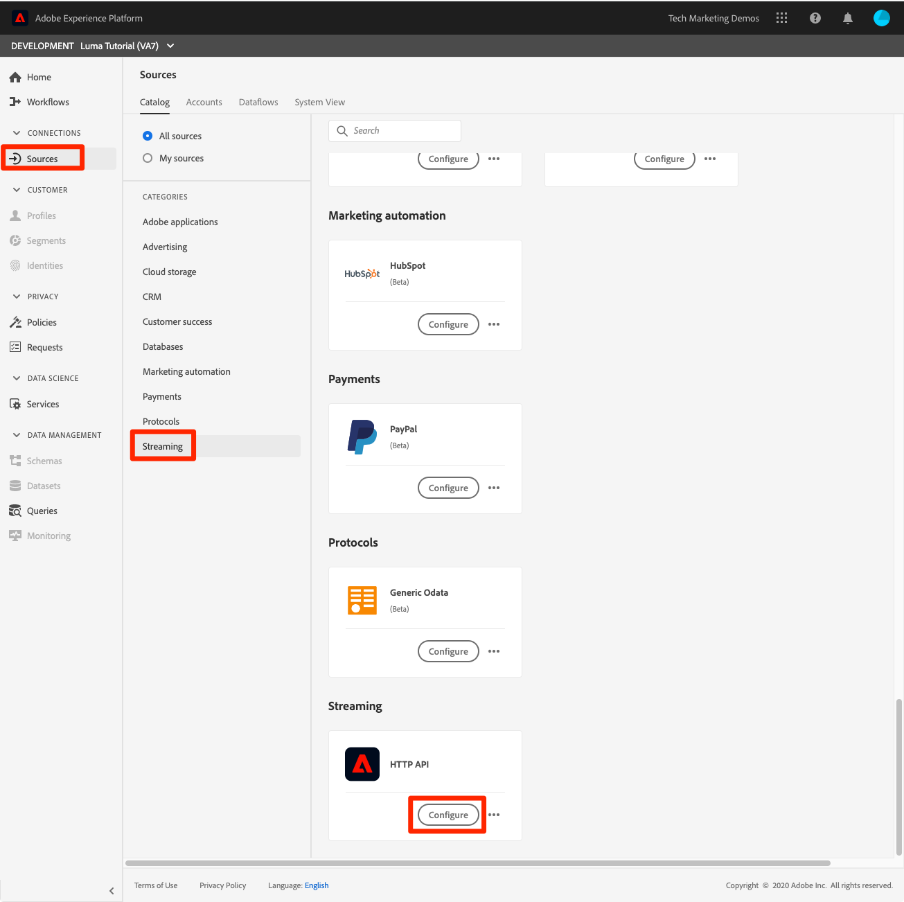
1. On the **[!UICONTROL Authentication]** step, enter `Luma Web Events Source` as the **[!UICONTROL Account name]** and select the **[!UICONTROL Connect to source]** button (we don't need to enable authentication since the data will be originating from website visitors)
    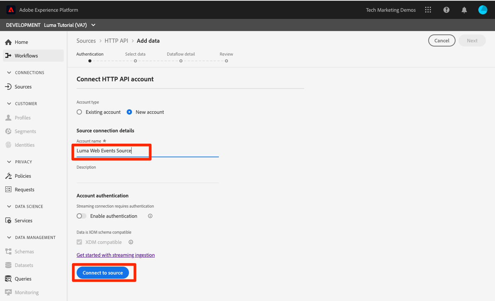
1. Once connected, select the **[!UICONTROL Next]** button to proceed to the next step in the workflow
1. On the **[!UICONTROL Select data]** step, choose **[!UICONTROL Existing Dataset]**, select your `Luma Web Events Dataset`, and then select the **[!UICONTROL Next]** button
    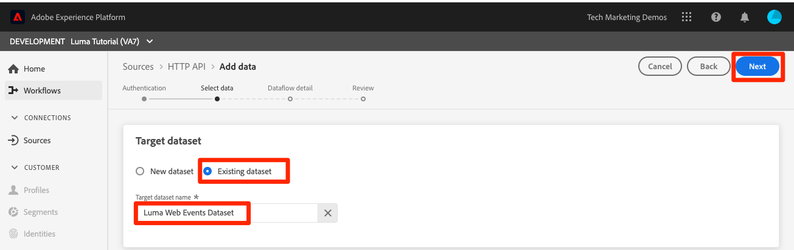
1. On the **[!UICONTROL Dataflow detail]** step, select the **[!UICONTROL Next]** button:
    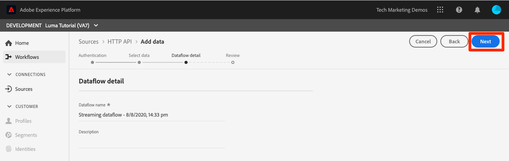
    What is a good practice for naming the data flow vs the source
1. On the **[!UICONTROL Review]** step, review your source details and select the **[!UICONTROL Finish]** button:
    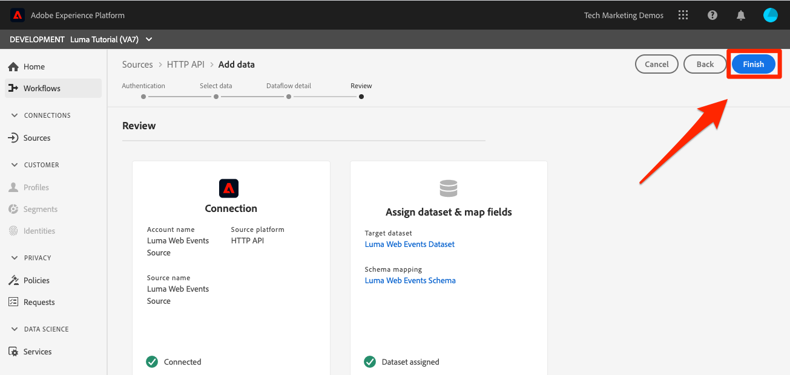
-->

## データストリームの設定

まず、データストリームを設定します。 データストリームは、Web SDK呼び出しからデータを受け取った後、データをどこに送るべきかをExperience Platform Edge Networkに伝えます。 例えば、データをExperience Platform、Adobe Analytics、またはAdobe Targetに送信しますか？ データストリームは、データ収集ユーザーインターフェイス（旧Adobe Experience Platform Launch）で管理され、Web SDKでのデータ収集に不可欠です。

[!UICONTROL  データストリーム ]を作成するには：

1. [Experience Platform Data Collection ユーザーインターフェイス ](https://experience.adobe.com/launch/)にログインします
   <!--when will the edge config go live?-->

1. 左側のナビゲーションで&#x200B;**[!UICONTROL データストリーム]**&#x200B;を選択します
1. 右上隅の「**[!UICONTROL 新規データストリーム]**」ボタンを選択します

   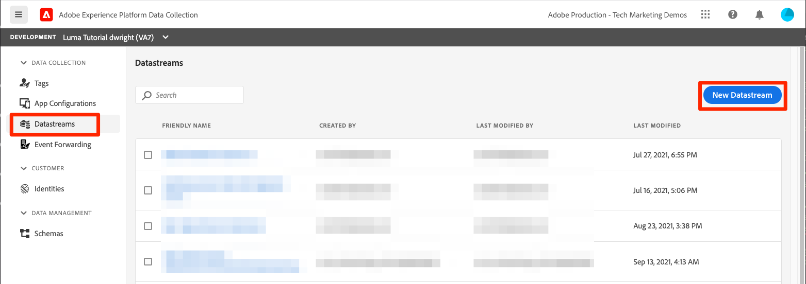

1. **[!UICONTROL フレンドリ名]**&#x200B;に「`Luma Platform Tutorial`」と入力します（会社の複数のユーザーがこのチュートリアルを受講している場合は、名前を最後に追加します）
1. 「**[!UICONTROL 保存]**」ボタンを選択します

   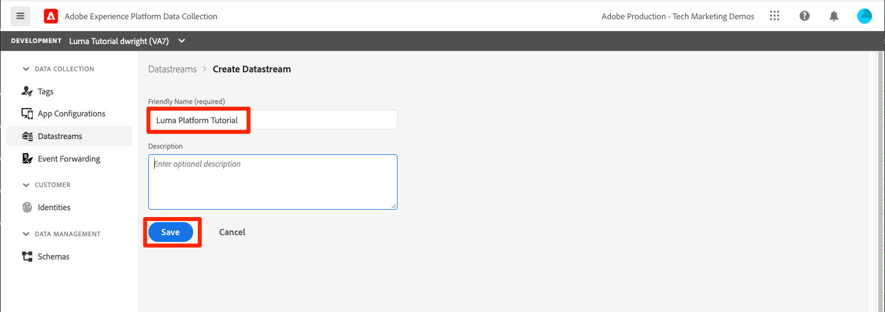

次の画面で、データを送信する場所を指定します。 Experience Platformにデータを送信するには：

1. **[!UICONTROL Adobe Experience Platform]**&#x200B;に切り替えて、追加のフィールドを表示します
1. **[!UICONTROL サンドボックス]**&#x200B;の場合、`Luma Tutorial`を選択します
1. **[!UICONTROL イベントデータセット]**&#x200B;の場合、`Luma Web Events Dataset`を選択します
1. 他のAdobe アプリケーションを使用している場合は、その他のセクションを参照して、これらの他のソリューションのEdge設定で必要な情報を確認してください。 Web SDKは、データをExperience Platformにストリーミングするだけでなく、他のAdobe アプリケーションで使用されている以前のすべてのJavaScript ライブラリを置き換えるために開発されました。 Edge設定は、データを送信する各アプリケーションのアカウントの詳細を指定するために使用されます。
1. **[!UICONTROL 保存]**を選択
   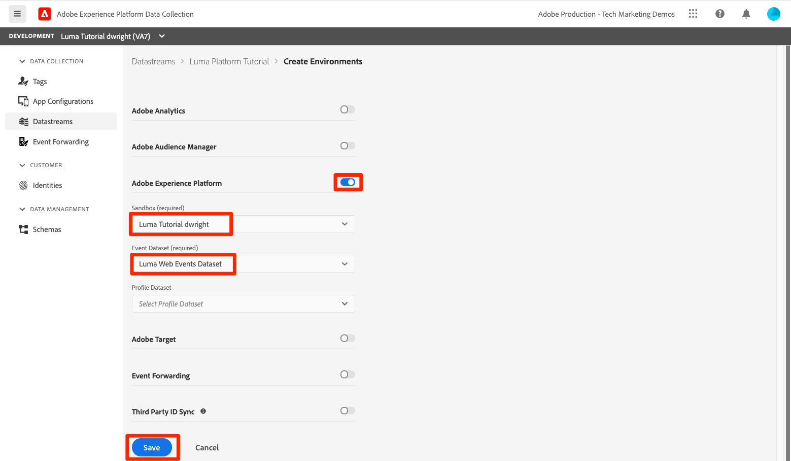

Edge設定が保存されると、結果として表示される画面には、開発、ステージング、実稼動用に3つの環境が作成されています。 追加の開発環境を追加できます。
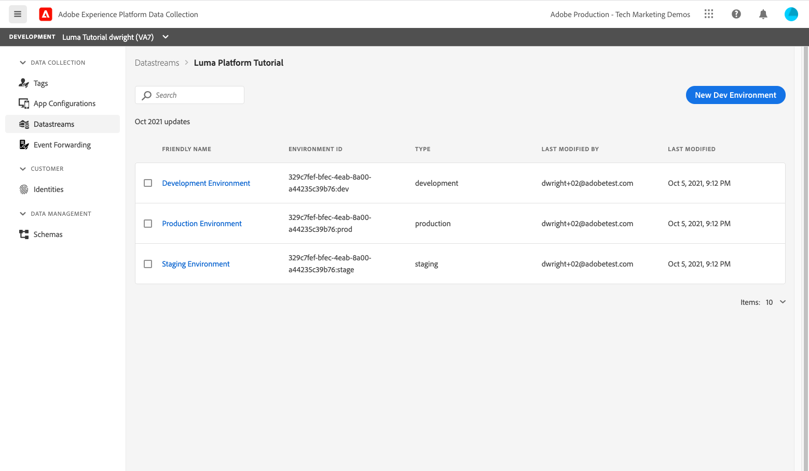
3つの環境すべてには、入力したばかりのプラットフォームの詳細が含まれています。 ただし、これらの詳細は、環境ごとに異なる設定が可能です。 たとえば、各環境から異なるPlatform サンドボックスにデータを送信するように設定できます。 このチュートリアルでは、データストリームに追加のカスタマイズは行いません。

## Web SDK拡張機能のインストール

### プロパティを追加

まず、タグプロパティ（以前はタグプロパティ）を作成する必要があります。 プロパティは、web ページから詳細を収集して様々な場所に送信するために必要なすべてのJavaScript、ルール、およびその他の機能のコンテナです。

プロパティを作成するには：

1. 左側のナビゲーションで&#x200B;**[!UICONTROL プロパティ]**&#x200B;に移動します
1. 「**[!UICONTROL 新規プロパティ]**」ボタンを選択します
   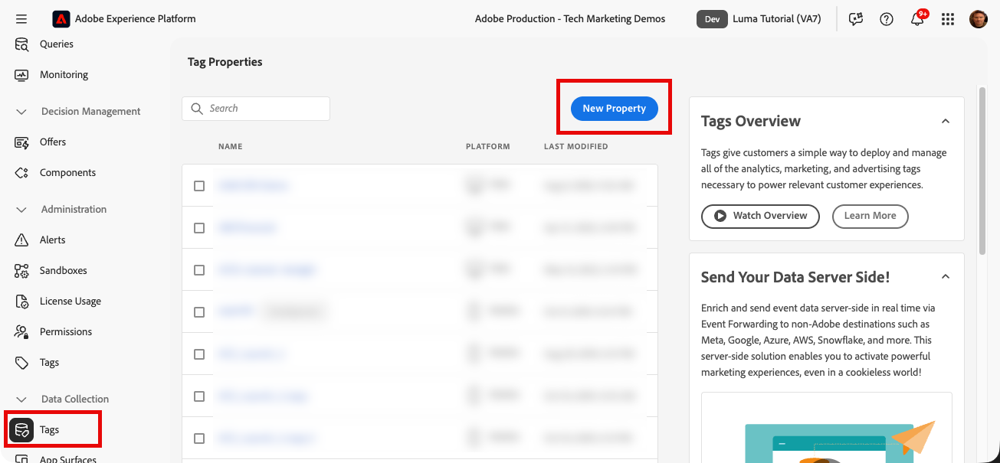
1. **[!UICONTROL 名前]**&#x200B;として、`Luma Platform Tutorial`と入力します（会社の複数のユーザーがこのチュートリアルを受講している場合は、名前を最後に追加します）
1. **[!UICONTROL ドメイン]**&#x200B;として、`enablementadobe.com`と入力します（後で説明します）
1. **[!UICONTROL 保存]**を選択
   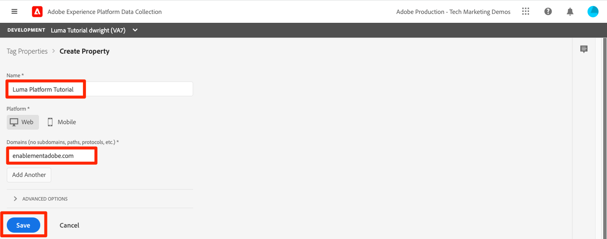

<!--
After saving the property, you might see an error message like the one below. If so, this is because you don't actually have access to the property you just created. To fix this, we need to go to the Admin Console to give yourself access:
    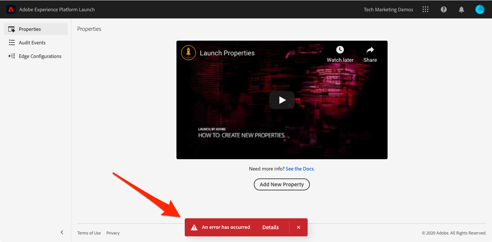

To give yourself access to the property:

1. In a separate browser tab, log into the [Admin Console](https://adminconsole.adobe.com/)
1. Go to **[!UICONTROL Products]** from the top navigation
1. Select **[!UICONTROL Adobe Experience Platform Launch]** on the left navigation
1. Go to your `Luma Tutorial Launch` product profile
1. Go to the **[!UICONTROL Permissions]** tab
1. On the **[!UICONTROL Properties]** row, select **[!UICONTROL Edit]**
    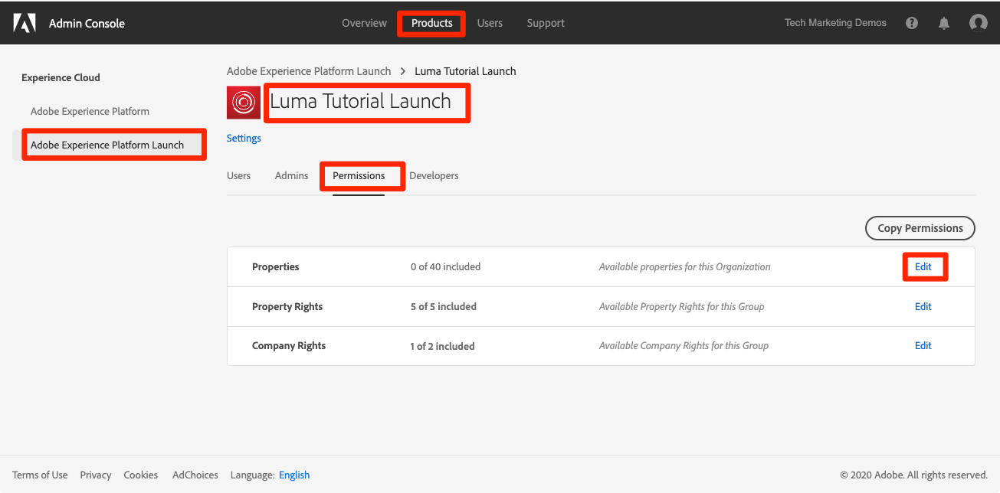
1. Select the "+" icon to move your `Luma Platform Tutorial` property to the right-hand side and select the **[!UICONTROL Save]** button to update the permissions
   
    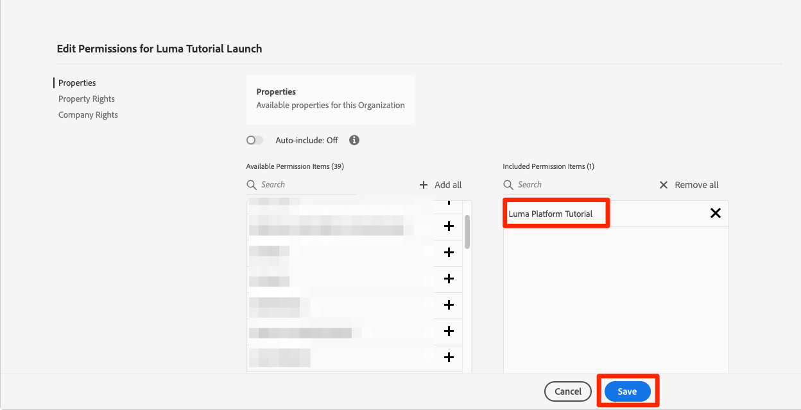

Now switch back to your browser tab with the Data Collection interface still open. Reload the page and the `Luma Platform Tutorial` property should display in the list. Select to open the property:

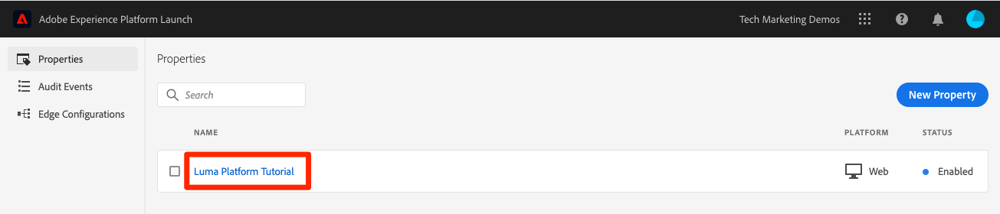
-->

## Web SDK拡張機能の追加

これでプロパティができたので、拡張機能を使用してWeb SDKを追加できます。 拡張機能は、データ収集のインターフェイスと機能を拡張するコードのパッケージです。 拡張機能を追加するには：

1. タグプロパティを開く
1. 左側のナビゲーションで&#x200B;**[!UICONTROL 拡張機能]**&#x200B;に移動します
1. **[!UICONTROL カタログ]** タブに移動します
1. タグに使用できる拡張機能はたくさんあります。 カタログを`Web SDK`という語句でフィルタリングします
1. **[!UICONTROL Adobe Experience Platform Web SDK]**&#x200B;拡張機能で、**[!UICONTROL インストール]** ボタンを選択します
   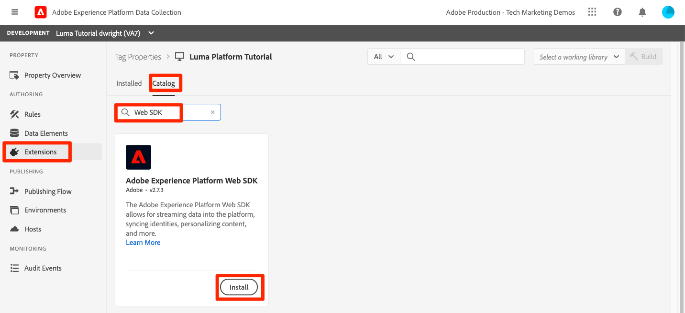
1. Web SDK拡張機能には、いくつかの設定がありますが、このチュートリアル用に設定するのは2つだけです。 **[!UICONTROL Edge ドメイン]**&#x200B;を`data.enablementadobe.com`に更新します。 この設定を使用すると、Web SDKの実装で1st パーティ Cookieを設定できます。これは推奨されます。 このレッスンの後半では、`enablementadobe.com` ドメインのweb サイトをタグプロパティにマッピングします。 `enablementadobe.com`がAdobe サーバーに転送されるように、`data.enablementadobe.com` ドメインのCNAMEは既に設定されています。 Web SDKを独自のWeb サイトに実装する場合は、独自のデータ収集目的でCNAMEを作成する必要があります（例：`data.YOUR_DOMAIN.com`）
1. **[!UICONTROL データストリーム]** ドロップダウンから、`Luma Platform Tutorial` データストリームを選択します。
1. 他の設定オプションを自由に確認し（ただし、変更しないでください）、**[!UICONTROL 保存]**を選択します
   <!--is edge domain required for first party? when will it break?-->
   <!--any other fields that should be highlighted-->
   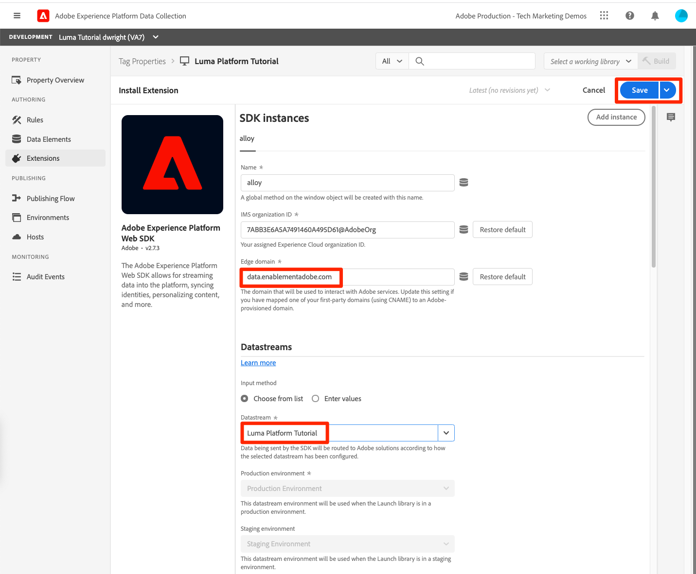

## データを送信するルールの作成

次に、データをPlatformに送信するルールを作成します。 ルールとは、タグに何かをするように指示するイベント、条件、アクションを組み合わせたものです。 ルールを作成するには：

1. 左側のナビゲーションで&#x200B;**[!UICONTROL ルール]**&#x200B;に移動します
1. 「**[!UICONTROL 新しいルールを作成]**」ボタンを選択します
   
1. ルール名を設定します。`All Pages - Library Loaded`
1. **[!UICONTROL イベント]**&#x200B;で、**[!UICONTROL 追加]** ボタンを選択します
   
1. **[!UICONTROL Core]** **[!UICONTROL 拡張機能]**&#x200B;を使用し、**[!UICONTROL イベントタイプ]**&#x200B;として&#x200B;**[!UICONTROL ライブラリ読み込み（ページトップ）]**&#x200B;を選択します。 この設定は、Launch ライブラリがページに読み込まれるたびにルールが実行されることを意味します。
1. 「**[!UICONTROL 変更を保持]**」を選択して、メインルール画面に戻ります
   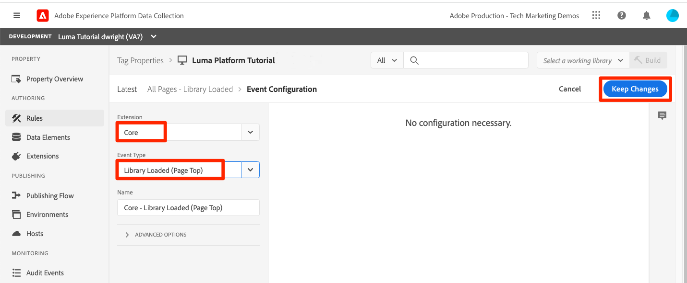
1. **[!UICONTROL 条件]**&#x200B;を空のままにします。このルールを指定した名前に従って、すべてのページに適用します
1. **[!UICONTROL アクション]**&#x200B;で、**[!UICONTROL 追加]** ボタンを選択します
1. **[!UICONTROL Adobe Experience Platform Web SDK]** **[!UICONTROL 拡張機能]**&#x200B;を使用し、**[!UICONTROL アクションタイプ]**&#x200B;として&#x200B;**[!UICONTROL イベントを送信]**&#x200B;を選択します
1. 右側の&#x200B;**[!UICONTROL タイプ]** ドロップダウンから&#x200B;**[!UICONTROL web.webpagedetails.pageViews]**&#x200B;を選択します。 これは`Luma Web Events Schema`のXDM フィールドの1つです
1. 「**[!UICONTROL 変更を保持]**」を選択して、メインルール画面に戻ります
   
1. ルールを保存するには、**[!UICONTROL 保存]**&#x200B;を選択します\
   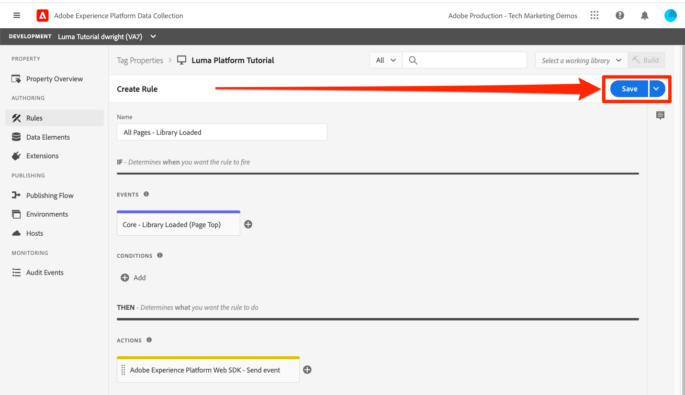

## ライブラリでのルールの公開

次に、ルールを開発環境に公開して、ルールが機能することを確認します。

<!--
There are a few quick steps we must take in the **[!UICONTROL Publishing]** section of Launch.

### Create a host

Launch libraries can be hosted on Adobe's Content Delivery Network (CDN) or on your own servers. In this tutorial, we will use Adobe's CDN since it is faster to set up:

1. Go to **[!UICONTROL Hosts]** in the left navigation
1. Select the **[!UICONTROL Create New Host]** button
    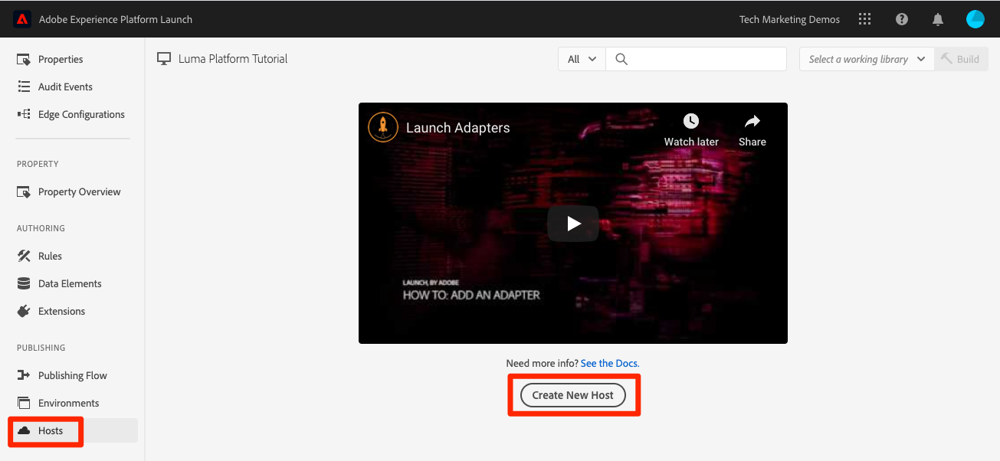   
1. For the **[!UICONTROL Name]**, enter `Adobe CDN`
1. For the **[!UICONTROL Type]**, select **[!UICONTROL Managed by Adobe]**
1. Select the **[!UICONTROL Save]** button to complete the setup of the host
    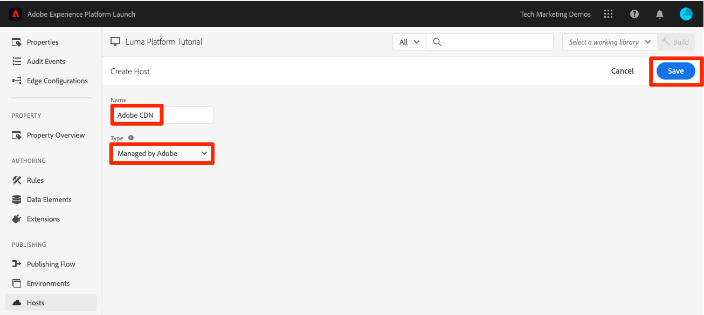   

### Create an environment

Environments allow you to have different versions of a library in different publishing environments to accommodate your publishing workflow. For example, the fully tested version of your library can be published to a Production environment, while new changes are being created in a Development environment. You can also use different hosts for each environment. To create an environment:

1. Go to **[!UICONTROL Environments]** in the left navigation
1. Select the **[!UICONTROL Create New Environment]** button
     
1. Under **[!UICONTROL Development]** select **[!UICONTROL Select]**   
    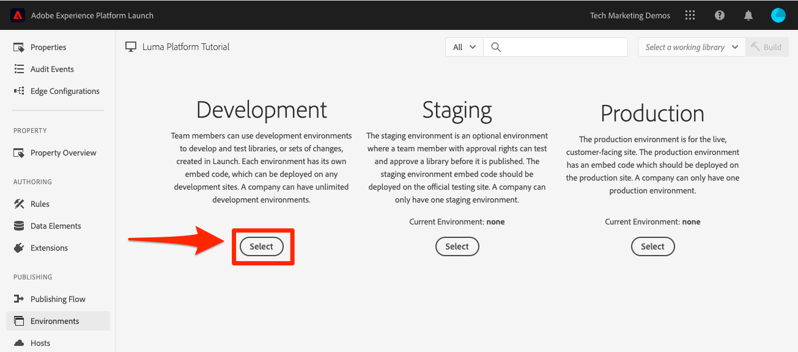 
1. For the **[!UICONTROL Name]**, enter `Development`
1. For the **[!UICONTROL Select Host]** dropdown, select `Adobe CDN`
1. Select the **[!UICONTROL Save]** button to complete the setup of the environment
    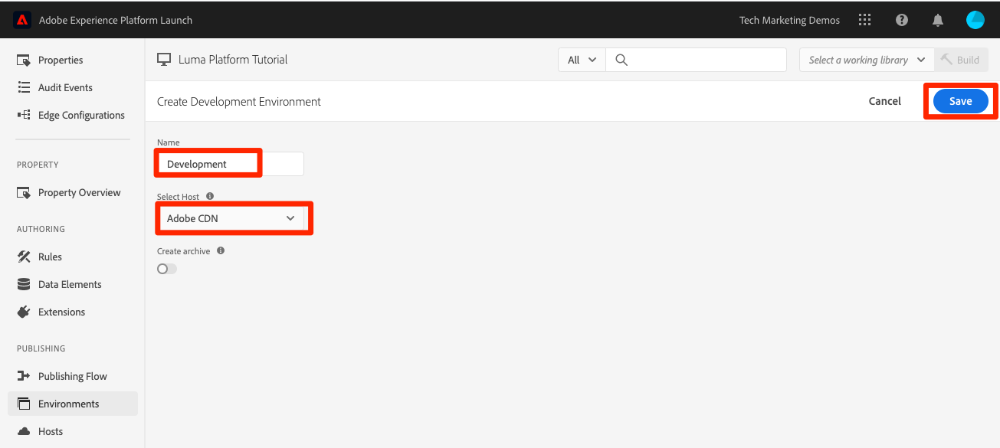
1. You will see a modal with URL and other implementation details of this library. These are critical for a real Launch implementation, but we don't need to worry about them for this tutorial. Select the **[!UICONTROL Close]** button to exit the modal.

### Create and publish the library

Now let's bundle the contents of our property&mdash;currently an extension and a rule&mdash;into a library. 
-->

ライブラリを作成するには：

1. 左側のナビゲーションの&#x200B;**[!UICONTROL 公開フロー]**&#x200B;に移動します
1. 「**[!UICONTROL ライブラリを追加]**」を選択
   
1. **[!UICONTROL Name]**&#x200B;に対して、`Luma Platform Tutorial`と入力します
1. **[!UICONTROL 環境]**&#x200B;で、`Development`を選択します
1. 「**[!UICONTROL 変更されたすべてのリソースを追加]**」ボタンを選択します。 （[!UICONTROL Adobe Experience Platform Web SDK]拡張機能と`All Pages - Library Loaded`規則に加えて、[!UICONTROL Core]拡張機能も追加され、すべてのLaunch web プロパティで必要なベース JavaScriptが含まれています）。
1. 「**[!UICONTROL 開発用に保存してビルド]**」ボタンを選択します
   

ライブラリの構築には数分かかる場合があり、完了すると、ライブラリ名の左側に緑のドットが表示されます。

[!UICONTROL 公開フロー]画面で見ることができるように、このチュートリアルの範囲を超える公開プロセスには、さらに多くのものが含まれています。 開発環境で単一のライブラリを使用するだけです。

## リクエスト内のデータを検証する

### Adobe Experience Platform Debuggerを追加

Experience Platform Debuggerは、Chromeで利用できる拡張機能で、web ページに実装されているAdobe テクノロジを確認するのに役立ちます。 お好みのブラウザーのバージョンをダウンロードします。

* [Chrome拡張機能](https://chrome.google.com/webstore/detail/adobe-experience-platform/bfnnokhpnncpkdmbokanobigaccjkpob)

デバッガーをまだ使用したことがない場合、およびこれが古いAdobe Experience Cloud デバッガーとは異なる場合は、この5分間の概要動画をご覧ください。

>[!VIDEO](https://video.tv.adobe.com/v/32156?learn=on&enablevpops)

### Luma web サイトを開く

このチュートリアルでは、公開されているLuma デモ web サイトを使用します。 開いてブックマークを付けます：

1. 新しいブラウザータブで、[Luma web サイト ](https://newluma.enablementadobe.com)を開きます。
1. チュートリアルの残りの部分で使用するページをブックマークします

このホストされているweb サイトでは、最初のタグプロパティ設定の`enablementadobe.com` ドメイン [!UICONTROL  フィールドに]を使用し、`data.enablementadobe.com`Adobe Experience Platform Web SDK[!UICONTROL 拡張機能で]を1st パーティドメインとして使用した理由を説明します。 やっぱり計画はあったよ！

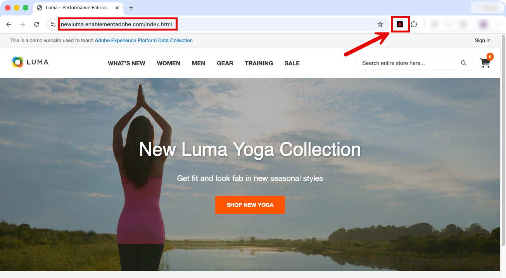

### Experience Platform Debuggerを使用して、タグプロパティにマッピングします

Experience Platform Debuggerには、既存のタグプロパティを別のタグプロパティに置き換えることができる便利な機能があります。 これは検証に役立ち、このチュートリアルの多くの実装ステップをスキップできます。

1. Luma サイトを開いて、Experience Platform Debugger拡張機能アイコンを選択します
1. デバッガーが開き、このチュートリアルとは関係のないハードコードされた実装の詳細が表示されます（デバッガーを開いた後にLuma サイトをリロードする必要がある場合があります）
1. デバッガーが下の図のように「**[!UICONTROL Luma]**&#x200B;に接続されています」であることを確認し、「**[!UICONTROL lock]**」アイコンを選択してデバッガーをLuma サイトにロックします。
1. 右上の「**[!UICONTROL ログイン]**」ボタンを選択して認証します。
1. 左側のナビゲーションの&#x200B;**[!UICONTROL Launch]**&#x200B;に移動します
1. 「設定」タブを選択します
1. 右側に&#x200B;**[!UICONTROL ページ埋め込みコード]**&#x200B;が表示され、**[!UICONTROL アクション]** ドロップダウンを開き、**[!UICONTROL 置換]**を選択します
   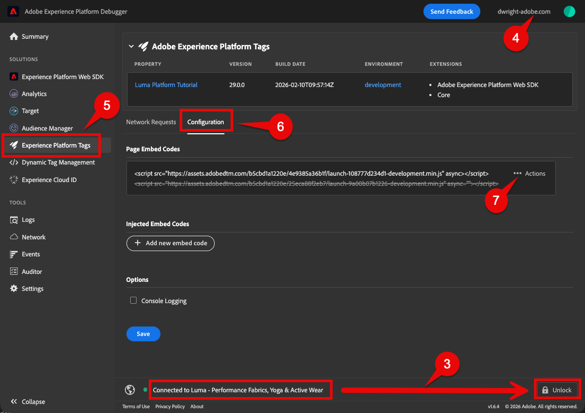
1. 認証が完了すると、デバッガーは利用可能なLaunch プロパティと環境を取り込みます。 `Luma Platform Tutorial` プロパティを選択
1. `Development`環境を選択
1. 「**[!UICONTROL 適用]**」ボタンを選択します
   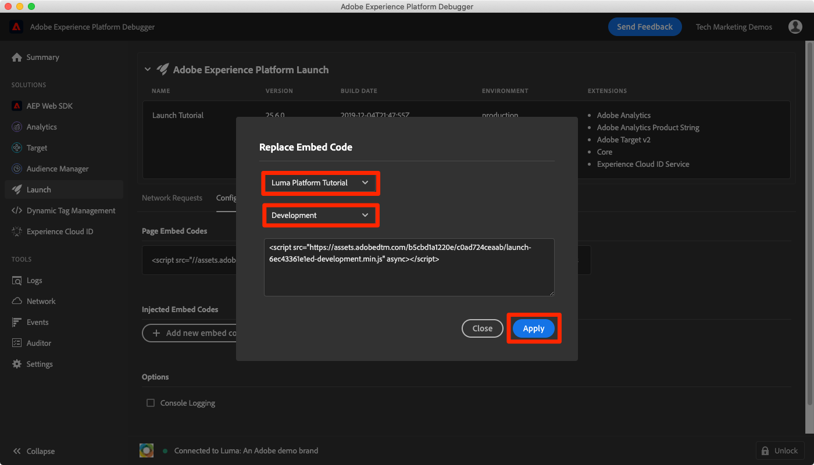
1. Luma web サイトは、タグプロパティ _を使用して_をリロードするようになりました。 助けて、ハッキングされた！ 冗談です。
   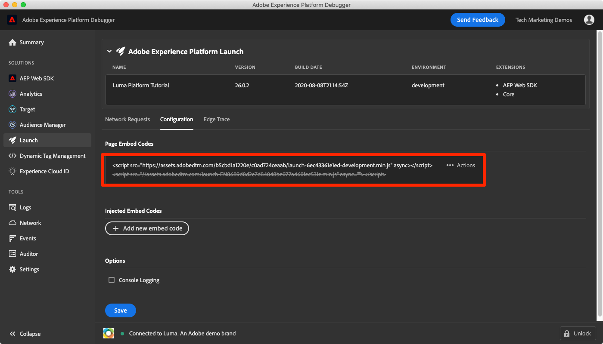
1. 左側のナビゲーションの&#x200B;**[!UICONTROL 概要]**&#x200B;に移動して、[!UICONTROL Launch] プロパティの詳細を確認します
   
1. 次に、左側のナビゲーションの&#x200B;**[!UICONTROL AEP Web SDK]**&#x200B;に移動して、**[!UICONTROL ネットワークリクエスト]**&#x200B;を確認します
1. **[!UICONTROL イベント]**&#x200B;行を開く

   
1. `web.webpagedetails.pageView` イベントを送信[!UICONTROL  アクションで指定した] イベントタイプと、`AEP Web SDK ExperienceEvent Mixin`形式に準拠するその他のすぐに使える変数を確認する方法に注意してください
   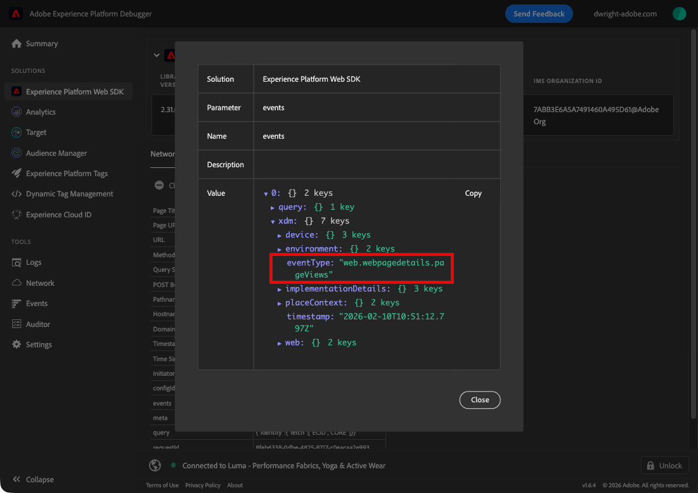
1. これらのタイプのリクエストの詳細は、ブラウザーのweb開発者ツール **ネットワーク** タブにも表示されます。 開いてページをリロードします。 `interact`の呼び出しをフィルタリングして呼び出しを検索し、それを選択して、**ヘッダー** タブ、**ペイロードをリクエスト**領域を検索します。
   
1. 「**応答**」タブに移動し、応答にECID値がどのように含まれているかを確認します。 この値をコピーして、次の演習でプロファイル情報を検証する際に使用します。
   

## Experience Platformでのデータの検証

`Luma Web Events Dataset`に到着するデータのバッチを確認して、データがPlatformに着陸していることを検証できます。 （ストリーミングデータ収集と呼ばれていますが、バッチで取得すると言っています。 リアルタイムでプロファイルにストリーミングされるため、リアルタイムのセグメンテーションやアクティベーションに使用できますが、データレイクには15分ごとに一括送信されます）。

データを検証するには：

1. Platform ユーザーインターフェイスで、左側のナビゲーションの&#x200B;**[!UICONTROL データセット]**&#x200B;に移動します
1. `Luma Web Events Dataset`を開き、バッチが到着したことを確認します。 15分ごとに電子メールが配信されるため、バッチが表示されるのを待つ必要がある場合もあることを忘れないでください。
1. 「**[!UICONTROL データセットをプレビュー]**」ボタンを選択します
   
1. プレビューモーダルで、左側のスキーマの異なるフィールドを選択して、特定のデータポイントをプレビューする方法に注意してください。
   

新しいプロファイルが表示されていることを確認することもできます。

1. Platform ユーザーインターフェイスで、左側のナビゲーションの&#x200B;**[!UICONTROL プロファイル]**&#x200B;に移動します
1. **[!UICONTROL ECID]**&#x200B;名前空間を選択し、ECID値を検索します（応答からコピーします）。 プロファイルには、ECIDとは別に独自のIDがあります。
1. **[!UICONTROL プロファイル ID]**を選択してプロファイルを開きます
   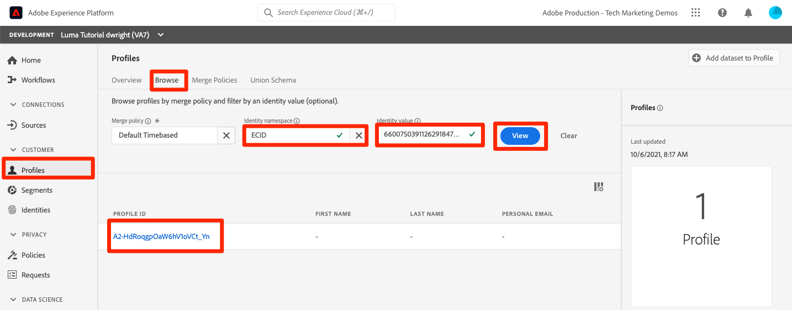
1. **[!UICONTROL イベント]** タブを選択して、表示したページを表示します
   \
   <!--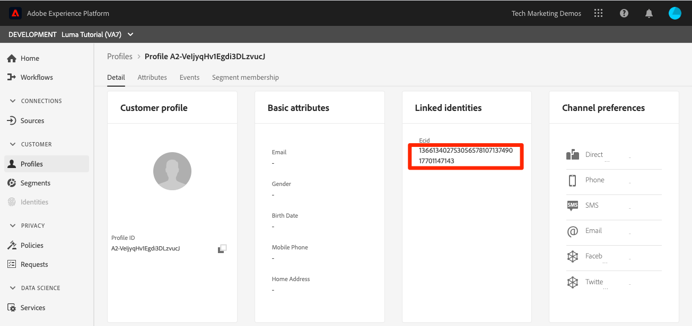-->

## イベントへのカスタムデータの追加

### ページ名のデータ要素の作成

1. データ収集タグのインターフェイスで、`Luma Platform Tutorial` プロパティの右上隅にある「**[!UICONTROL 作業ライブラリを選択]**」ドロップダウンを開き、`Luma Platform Tutorial` ライブラリを選択します。 この設定を使用すると、ライブラリに追加の更新を簡単に公開できます。
1. 左側のナビゲーションで&#x200B;**[!UICONTROL データ要素]**&#x200B;に移動します
1. 「**[!UICONTROL 新しいデータ要素を作成]**」ボタンを選択します

   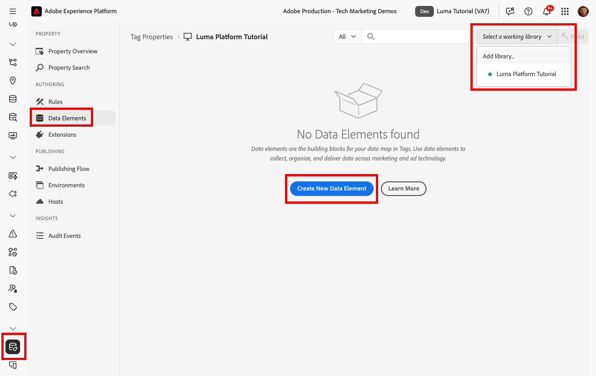
1. **[!UICONTROL Name]**&#x200B;として、`Page Name`と入力します
1. **[!UICONTROL データ要素タイプ]**&#x200B;として、`JavaScript Variable`を選択します
1. **[!UICONTROL JavaScript変数名]**&#x200B;として、`digitalData.page.pageInfo.pageName`と入力します
1. 値の形式を標準化するには、**[!UICONTROL 小文字の値を強制]**&#x200B;および&#x200B;**[!UICONTROL テキストを整理]**&#x200B;のチェックボックスをオンにします
1. `Luma Platform Tutorial`が作業ライブラリとして選択されていることを確認してください
1. **[!UICONTROL ライブラリに保存]**を選択
   のデータ要素を作成

### ページ名をXDM オブジェクトデータ要素にマッピングする

次に、ページ名をWeb SDKにマッピングします。

>[!IMPORTANT]
>
>このタスクを完了するには、ユーザーが最初に製品サンドボックスにアクセスできることを確認する必要があります。 別の製品プロファイルから製品サンドボックスにアクセスできない場合は、すばやく`Luma Tutorial Platform` プロファイルを開き、権限項目&#x200B;**[!UICONTROL サンドボックス]** > **[!UICONTROL 製品]**を追加します。 その後、データ要素ページでSHIFT キーを押しながら再読み込みして、キャッシュをクリアします
>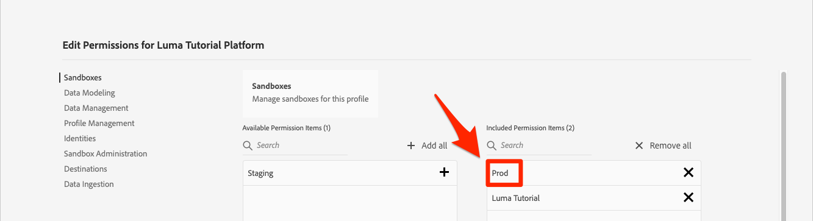

**[!UICONTROL データ要素]** ページ：

1. 新しいデータ要素の作成
1. **[!UICONTROL Name]**&#x200B;として、`XDM Object`と入力します
1. **[!UICONTROL 拡張機能]**&#x200B;として、`Adobe Experience Platform Web SDK`を選択します
1. **[!UICONTROL データ要素タイプ]**&#x200B;として、`XDM object`を選択します
1. **[!UICONTROL サンドボックス]**&#x200B;として、`Luma Tutorial` サンドボックスを選択します
1. **[!UICONTROL スキーマ]**&#x200B;として、`Luma Web Events Schema`を選択します
1. `web.webPageDetails.name` フィールドを選択
1. **[!UICONTROL 値]**&#x200B;として、アイコンを選択してデータ要素の選択モーダルを開き、`Page Name` データ要素を選択します
1. **[!UICONTROL ライブラリに保存]**を選択
   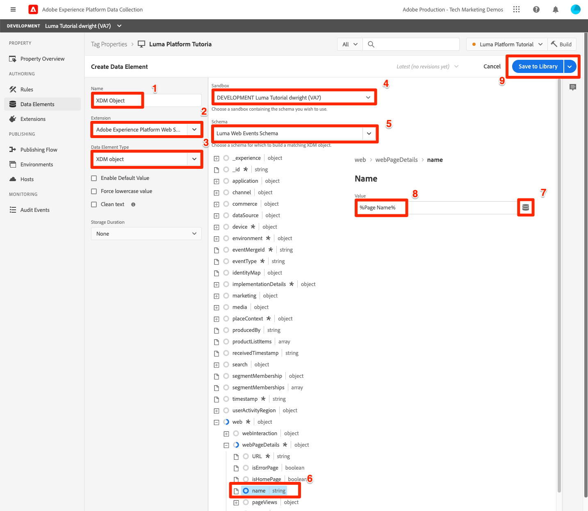

同じプロセスを使用して、web サイト上の追加のカスタムデータをXDM フィールドにマッピングします。

### イベントを送信アクションにXDM データを追加する

XDM フィールドにデータをマッピングしたので、イベントを送信アクションに含めることができます。

1. **[!UICONTROL ルール]**&#x200B;画面に移動
1. `All Pages - Library Loaded` ルールを開きます
1. `Adobe Experience Platform Web SDK - Send Event` アクションを開く
1. **[!UICONTROL XDM データ]**&#x200B;として、アイコンを選択してデータ要素の選択モーダルを開き、`XDM Object` データ要素を選択します
1. 「**[!UICONTROL 変更を保持]**」ボタンを選択します
   
1. これで、最後のいくつかの演習で`Luma Platform Tutorial`を作業用ライブラリとして選択したので、最近の変更はライブラリに直接保存されています。 公開フロー画面で変更を公開する代わりに、青いボタンのドロップダウンを開いて、**[!UICONTROL ライブラリに保存してビルド]**を選択できます
   

先ほどの3つの変更を加えて新しいタグライブラリを構築します。

### XDM データの検証

これで、Luma ホームページをリロードできるようになりました。先ほど説明したように、デバッガーを使用してタグプロパティにマッピングしながら、ページ名フィールドがリクエストに入力されていることを確認してください。
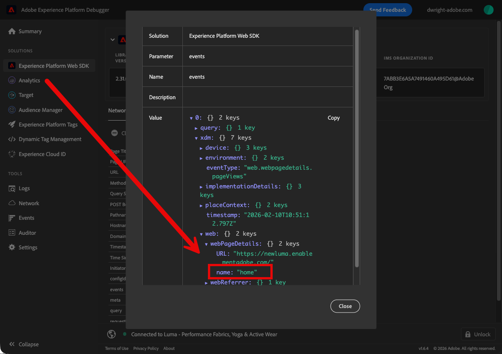

データセットとプロファイルをプレビューすることで、Platformで受信したページ名データを検証することもできます。

## 追加IDを送信

これで、Web SDKの実装で、Experience Cloud ID （ECID）をプライマリ IDとして持つイベントが送信されるようになりました。 ECIDは、Web SDKによって自動的に生成され、デバイスとブラウザーごとに一意です。 1人の顧客が使用しているデバイスとブラウザーに応じて、複数のECIDを持つことができます。 顧客の全体像を把握し、そのオンラインアクティビティをCRM、ロイヤルティ、オフラインの購入データに結び付けるにはどうすればよいでしょうか？ セッション中に追加のIDを収集し、IDをつなぎ合わせてプロファイルを決定的にリンクすることで、これを実現します。

思い出すと、[Map Identities](map-identities.md) レッスンで、ECIDとCRM IDをweb データのIDとして使用すると言いました。 Web SDKでCRM IDを収集しましょう。

### CRM IDのデータ要素の追加

まず、CRM IDをデータ要素に保存します。

1. タグインターフェイスで、`CRM Id`という名前のデータ要素を追加します
1. **[!UICONTROL Data Element Type]**&#x200B;として、**[!UICONTROL JavaScript Variable]**&#x200B;を選択します
1. **[!UICONTROL JavaScript変数名]**&#x200B;として、`digitalData.user.0.profile.0.attributes.username`と入力します
1. 「**[!UICONTROL ライブラリに保存]**」ボタンを選択します（`Luma Platform Tutorial`は作業中のライブラリである必要があります）
   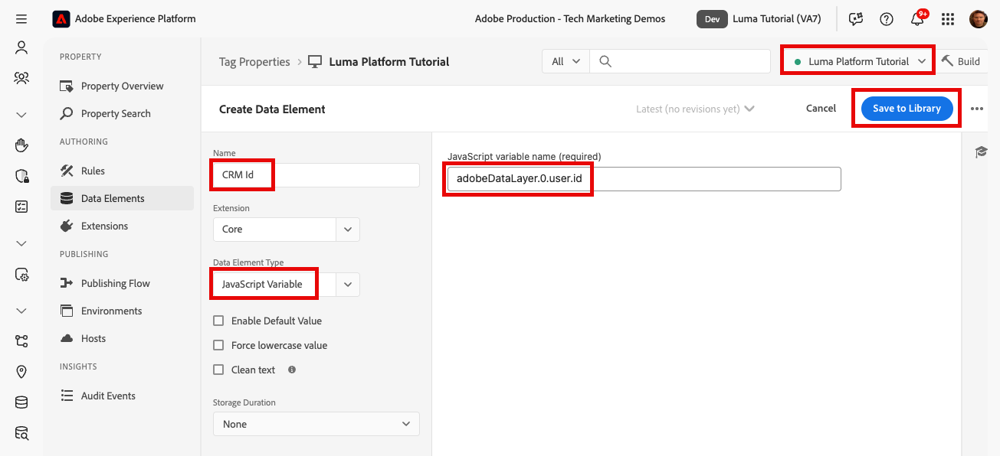

### ID マップ データ要素にCRM IDを追加する

CRM Id値を取得したので、それを[!UICONTROL ID マップ ] データ要素と呼ばれる特殊なデータ要素タイプに関連付ける必要があります。

1. データ要素`Identities`を追加
1. **[!UICONTROL 拡張機能]**&#x200B;として、**[!UICONTROL Adobe Experience Platform Web SDK]**&#x200B;を選択します
1. **[!UICONTROL データ要素タイプ]**&#x200B;として、**[!UICONTROL ID マップ]**&#x200B;を選択します
1. **[!UICONTROL 名前空間]**&#x200B;として、前のレッスンで作成した`Luma CRM Id`名前空間[!UICONTROL である]を入力します

   >[!WARNING]
   >
   >Adobe Experience Platform Web SDK拡張機能バージョン 2.2では、Platform アカウントの実際の値を使用して、事前入力されたドロップダウンから名前空間を選択できます。 残念ながら、この機能はまだ「サンドボックス対応」ではないため、`Luma CRM Id`値がドロップダウンに表示されない場合があります。 これにより、この演習を完了できなくなる可能性があります。 確認したら、回避策を投稿します。

1. **[!UICONTROL ID]**&#x200B;として、アイコンを選択してデータ要素の選択モーダルを開き、`CRM Id` データ要素を選択します
1. **[!UICONTROL 認証状態]**&#x200B;として、**[!UICONTROL 認証済み]**&#x200B;を選択します
1. **[!UICONTROL プライマリ]**&#x200B;を確認

   >[!TIP]
   >
   > Adobeでは、`Luma CRM Id`などの個人を表すIDを[!UICONTROL primary]IDとして送信することをお勧めします。
   >
   > ID マップに人物識別子（例：`Luma CRM Id`）が含まれている場合、その人物識別子は[!UICONTROL  プライマリ ] IDになります。 それ以外の場合、`ECID`は[!UICONTROL  プライマリ ]IDになります。

1. 「**[!UICONTROL ライブラリに保存]**」ボタンを選択します（`Luma Platform Tutorial`は作業中のライブラリである必要があります）
   

>[!NOTE]
>
>[!UICONTROL ID マップ ] データ型を使用して、複数の識別子を渡すことができます。

### XDM オブジェクトへのID マップデータ要素の追加

更新する必要があるデータ要素がもうひとつあります。それが、XDM Object データ要素です。 この1つのIDを渡すために3つのデータ要素を更新する必要があるのは奇妙に思えるかもしれませんが、このプロセスは複数のIDに対して拡張するように設計されています。 心配しないでください、私たちはこのレッスンをほぼ完了しました！

1. XDM オブジェクトデータ要素を開く
1. IdentityMap XDM フィールドを開きます
1. **[!UICONTROL データ要素]**&#x200B;として、アイコンを選択してデータ要素の選択モーダルを開き、`Identities` データ要素を選択します
1. これで、最後のいくつかの演習で`Luma Platform Tutorial`を作業用ライブラリとして選択したので、最近の変更はライブラリに直接保存されています。 公開フロー画面で変更を公開する代わりに、青いボタンのドロップダウンを開き、**[!UICONTROL ライブラリに保存してビルド]**を選択できます
   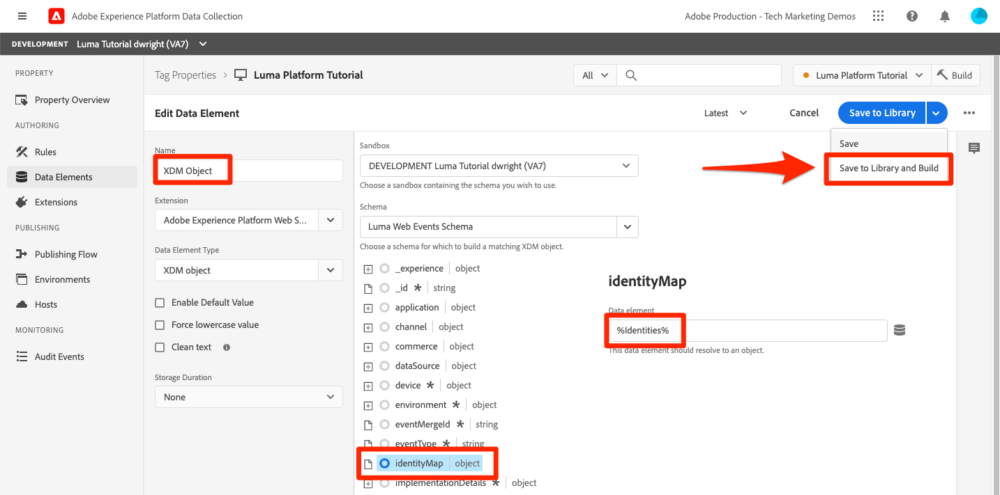

### IDの検証

CRM IDがWeb SDKから送信されていることを検証するには、次の手順を実行します。

1. [Luma web サイトを開く](https://newluma.enablementadobe.com)
1. 前述の手順に従って、デバッガーを使用してタグプロパティにマッピングします
1. Luma web サイトの右上にある&#x200B;**ログイン** リンクを選択します
1. 資格情報`test@test.com`/`test`を使用してログインします
1. 認証が完了したら、デバッガー（**[!UICONTROL Adobe Experience Platform Web SDK]** > **[!UICONTROL Network Requests]** > **[!UICONTROL events]**）でExperience Platform Web SDK呼び出しを調べ、`lumaCrmId`を確認します。
   
1. ECID名前空間と値を使用して、ユーザープロファイルを再度検索します。 プロファイルには、CRM ID、ロイヤルティ ID、名前や電話番号などのプロファイルの詳細も表示されます。 あらゆるIDとデータをつなぎ合わせて、単一のリアルタイム顧客プロファイルを構築しました。
   でIDを検証します

## その他のリソース

* [Web SDK を使用した Adobe Experience Cloud の実装](/help/tutorial-web-sdk/overview.md)
* [ ストリーミング取り込みに関するドキュメント ](https://experienceleague.adobe.com/docs/experience-platform/ingestion/streaming/overview.html?lang=ja)
* [ストリーミング取得 API リファレンス](https://developer.adobe.com/experience-platform-apis/references/streaming-ingestion/)

お疲れ様でした。 Web SDKとAdobe Experience Platform Launchの。 本格的な実装にはさらに多くの要素が関わっていますが、基本は次のとおりです。Platformで開始して結果を確認する際に役立ちます。

>[!NOTE]
>
>ストリーミング取り込みレッスンを完了したので、[!UICONTROL 製品プロファイルから]製品`Luma Tutorial Platform` サンドボックスを削除できます

データエンジニアは、[実行クエリのレッスン ](run-queries.md)にスキップできます。

データアーキテクトは、[結合ポリシー](create-merge-policies.md)に進むことができます。
