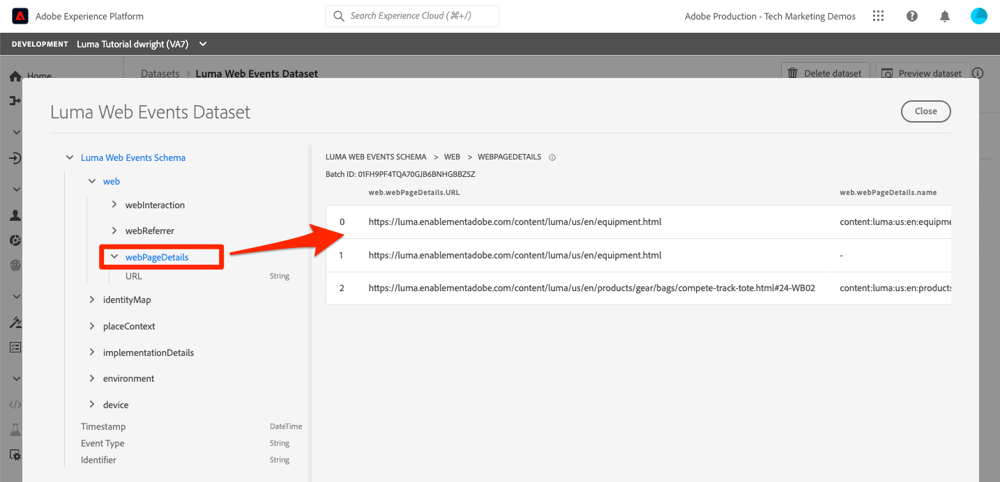
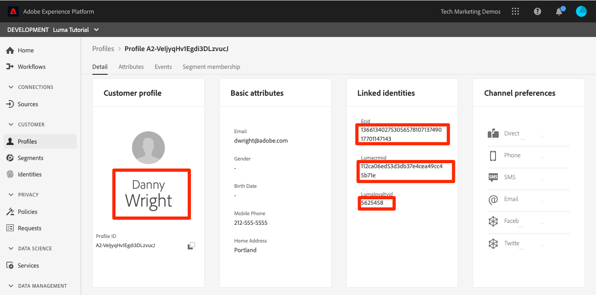

# ストリーミングデータの取り込み

<!--1hr-->

このレッスンでは、Adobe Experience Platform Web SDK を使用してデータをストリーミングします。

データ収集インターフェイスでは、主に次の 2 つの作業を実行する必要があります。

* Web サイトからAdobe Edgeネットワークに訪問者のアクティビティに関するデータを送信するには、Luma Web サイトに Web SDK を実装する必要があります。 タグ（以前の Launch）を使用して、シンプルな実装をおこないます。

* Edge ネットワークにデータを転送する場所を指示するデータストリームを設定する必要があります。 データをアドビの `Luma Web Events` データセットを Platform サンドボックスに含めます。

**データエンジニア** このチュートリアル以外で、ストリーミングデータを取り込む必要があります。 Adobe Experience Platform Web または Mobile SDK を実装する場合、通常、Web またはモバイルの開発者がデータレイヤーの作成とタグプロパティの設定に関与します。

演習を開始する前に、次の 2 つの短いビデオを見て、ストリーミングデータ取り込みと Web SDK の詳細を確認してください。

>[!VIDEO](https://video.tv.adobe.com/v/28425?quality=12&learn=on)

>[!VIDEO](https://video.tv.adobe.com/v/34141?quality=12&learn=on)

>[!NOTE]
>
>このチュートリアルでは、Web SDK を使用した Web サイトからのストリーミング取り込みに焦点を当てていますが、 [Adobeモバイル SDK](https://developer.adobe.com/client-sdks/documentation/), [Apache Kafka Connect](https://github.com/adobe/experience-platform-streaming-connect)などのメカニズムを使用できます。

## 必要な権限

内 [権限の設定](configure-permissions.md) レッスンでは、このレッスンを完了するために必要なすべてのアクセス制御を設定します。

<!--
* Permission items **[!UICONTROL Launch]** > **[!UICONTROL Property Rights]** > **[!UICONTROL Approve]**, **[!UICONTROL Develop]**, **[!UICONTROL Manage Environments]**, **[!UICONTROL Manage Extensions]**, and **[!UICONTROL Publish]**
* Permission item **[!UICONTROL Launch]** > **[!UICONTROL Company Rights]** > **[!UICONTROL Manage Properties]**
* User-role access to the `Luma Tutorial Launch` product profile
* Admin-role access to the `Luma Tutorial Launch` product profile
* Permission items **[!UICONTROL Platform]** > **[!UICONTROL Data Ingestion]** > **[!UICONTROL View Sources]** and **[!UICONTROL Manage Sources]**
* Permission items **[!UICONTROL Platform]** > **[!UICONTROL Data Management]** > **[!UICONTROL View Datasets]** and **[!UICONTROL Manage Datasets]**
* Permission items **[!UICONTROL Platform]** > **[!UICONTROL Profiles]** > **[!UICONTROL View Profiles]**, **[!UICONTROL Manage Profiles]** and **[!UICONTROL Export Audience Segment]**
* Permission item **[!UICONTROL Platform]** > **[!UICONTROL Sandbox Administration]** > **[!UICONTROL View Sandboxes]**
* Permission item **[!UICONTROL Platform]** > **[!UICONTROL Sandboxes]** > `Luma Tutorial`
* User-role access to the `Luma Tutorial Platform` product profile
-->

<!--## Create a streaming source

1. Log into the [Experience Platform  user interface](https://experience.adobe.com/platform/)
1. Go to **[!UICONTROL Sources]** in the left navigation
1. Filter the list by selecting **[!UICONTROL Streaming]**
1. In the **[!UICONTROL HTTP API]** section, select the **[!UICONTROL Configure]** button
    
1. On the **[!UICONTROL Authentication]** step, enter `Luma Web Events Source` as the **[!UICONTROL Account name]** and select the **[!UICONTROL Connect to source]** button (we don't need to enable authentication since the data will be originating from website visitors)
    
1. Once connected, select the **[!UICONTROL Next]** button to proceed to the next step in the workflow
1. On the **[!UICONTROL Select data]** step, choose **[!UICONTROL Existing Dataset]**, select your `Luma Web Events Dataset`, and then select the **[!UICONTROL Next]** button
    
1. On the **[!UICONTROL Dataflow detail]** step, select the **[!UICONTROL Next]** button:
    
    <!--What is a good practice for naming the data flow vs the source-->
<!--
1. On the **[!UICONTROL Review]** step, review your source details and select the **[!UICONTROL Finish]** button:
    
-->

## データストリームの設定

まず、データストリームを設定します。 データストリームは、Web SDK 呼び出しからデータを受け取った後、データをどこに送信するかをAdobe Edgeネットワークに伝えます。 例えば、Experience Platform、Adobe Analytics、Adobe Targetにデータを送信しますか？ データストリームは、データ収集ユーザーインターフェイス（以前の Launch）で管理され、Web SDK を使用したデータ収集にとって重要です。

次の手順で [!UICONTROL datastream]:

1. にログインします。 [Experience Platformデータ収集ユーザーインターフェイス](https://experience.adobe.com/launch/)
   <!--when will the edge config go live?-->

1. 選択 **[!UICONTROL データストリーム]** 左のナビゲーション
1. を選択します。 **[!UICONTROL 新規データストリーム]** ボタンを右上に置く

   

1. の **[!UICONTROL わかりやすい名前]**&#x200B;を入力して、 `Luma Platform Tutorial` （会社の複数の担当者がこのチュートリアルを受け取る場合は、名前を末尾に追加します）
1. を選択します。 **[!UICONTROL 保存]** ボタン

   

次の画面で、データを送信する場所を指定します。 データをExperience Platformに送信するには：

1. オンに切り替え **[!UICONTROL Adobe Experience Platform]** 追加のフィールドを表示します。
1. の場合 **[!UICONTROL サンドボックス]**&#x200B;を選択します。 `Luma Tutorial`
1. の場合 **[!UICONTROL イベントデータセット]**&#x200B;を選択します。 `Luma Web Events Dataset`
1. 他のAdobeアプリケーションを使用する場合は、他のセクションを自由に参照して、これらの他のソリューションの Edge 設定で必要な情報を確認してください。 Web SDK は、データをExperience Platformにストリーミングする目的だけでなく、他のAdobeアプリケーションで使用される以前の JavaScript ライブラリをすべて置き換える目的で開発されました。 Edge 設定は、データの送信先となる各アプリケーションのアカウント詳細を指定するために使用します。
1. 「**[!UICONTROL 保存]**」を選択します
   

エッジ設定が保存されると、開発、ステージング、実稼動用に 3 つの環境が作成されたことを示す画面が表示されます。 その他の開発環境を追加できます。

3 つの環境すべてに、入力した Platform の詳細が含まれます。 ただし、これらの詳細は、環境ごとに異なる設定が可能です。 例えば、各環境で異なる Platform サンドボックスにデータを送信するよう設定できます。 このチュートリアルでは、データストリームをさらにカスタマイズすることはしません。

## Web SDK 拡張機能のインストール

### プロパティを追加する

まず、タグプロパティ（以前のタグプロパティ）を作成する必要があります。 プロパティは、Web ページから詳細を収集して様々な場所に送信するために必要な、すべての JavaScript、ルールおよびその他の機能のコンテナです。

プロパティを作成するには：

1. に移動します。 **[!UICONTROL プロパティ]** 左のナビゲーション
1. を選択します。 **[!UICONTROL 新しいプロパティ]** ボタン
   
1. を **[!UICONTROL 名前]**&#x200B;を入力して、 `Luma Platform Tutorial` （会社の複数の担当者がこのチュートリアルを受け取る場合は、名前を末尾に追加します）
1. を **[!UICONTROL ドメイン]**&#x200B;を入力して、 `enablementadobe.com` （後述）
1. 「**[!UICONTROL 保存]**」を選択します
   

<!--
After saving the property, you might see an error message like the one below. If so, this is because you don't actually have access to the property you just created. To fix this, we need to go to the Admin Console to give yourself access:
    

To give yourself access to the property:

1. In a separate browser tab, log into the [Admin Console](https://adminconsole.adobe.com/)
1. Go to **[!UICONTROL Products]** from the top navigation
1. Select **[!UICONTROL Adobe Experience Platform Launch]** on the left navigation
1. Go to your `Luma Tutorial Launch` product profile
1. Go to the **[!UICONTROL Permissions]** tab
1. On the **[!UICONTROL Properties]** row, select **[!UICONTROL Edit]**
    
1. Select the "+" icon to move your `Luma Platform Tutorial` property to the right-hand side and select the **[!UICONTROL Save]** button to update the permissions
   
    

Now switch back to your browser tab with the Data Collection interface still open. Reload the page and the `Luma Platform Tutorial` property should display in the list. Select to open the property:

-->

## Web SDK 拡張機能の追加

これで、プロパティが作成され、拡張機能を使用して Web SDK を追加できます。 拡張機能は、データ収集インターフェイスと機能を拡張するコードのパッケージです。 拡張機能を追加するには：

1. タグプロパティを開く
1. に移動します。 **[!UICONTROL 拡張機能]** 左のナビゲーション
1. 次に移動： **[!UICONTROL カタログ]** タブ
1. タグには、多くの拡張機能を使用できます。 キーワードでカタログをフィルター `Web SDK`
1. 内 **[!UICONTROL Adobe Experience Platform Web SDK]** 拡張機能の場合は、 **[!UICONTROL インストール]** ボタン
   
1. Web SDK 拡張機能にはいくつかの設定を使用できますが、このチュートリアルで設定するのは 2 つだけです。 を更新します。 **[!UICONTROL Edge ドメイン]** から `data.enablementadobe.com`. この設定を使用すると、Web SDK の実装でファーストパーティ cookie を設定できます（推奨）。 このレッスンの後半では、 `enablementadobe.com` ドメインをタグプロパティに追加します。 の CNAME `enablementadobe.com` ドメインは既に次のように設定されています： `data.enablementadobe.com` がAdobeサーバーに転送されます。 独自の Web サイトに Web SDK を実装する場合、例えば、独自のデータ収集目的（例： ）で CNAME を作成する必要があります。 `data.YOUR_DOMAIN.com`
1. 次の **[!UICONTROL Datastream]** ドロップダウンで、 `Luma Platform Tutorial` データストリーム。
1. その他の設定オプションを自由に確認できます（ただし、変更しないでください）。 次に、 **[!UICONTROL 保存]**
   <!--is edge domain required for first party? when will it break?-->
   <!--any other fields that should be highlighted-->
   

## データを送信するルールを作成する

次に、データを Platform に送信するルールを作成します。 ルールとは、タグに何らかの処理を指示するイベント、条件およびアクションを組み合わせたものです。 ルールを作成するには：

1. に移動します。 **[!UICONTROL ルール]** 左のナビゲーション
1. を選択します。 **[!UICONTROL 新規ルールの作成]** ボタン
   
1. ルール名を設定します。`All Pages - Library Loaded`
1. の下 **[!UICONTROL イベント]**&#x200B;を選択し、 **[!UICONTROL 追加]** ボタン
   
1. 以下を使用： **[!UICONTROL コア]** **[!UICONTROL 拡張]** を選択し、 **[!UICONTROL 読み込まれたライブラリ（ページ上部）]** を **[!UICONTROL イベントタイプ]**. この設定は、Launch ライブラリがページに読み込まれるたびにルールが起動することを意味します。
1. 選択 **[!UICONTROL 変更を保持]** メインのルール画面に戻るには
   
1. 終了 **[!UICONTROL 条件]** 空の場合、このルールを指定した名前に従って、すべてのページで実行する必要があるので、
1. の下 **[!UICONTROL アクション]**&#x200B;を選択し、 **[!UICONTROL 追加]** ボタン
1. 以下を使用： **[!UICONTROL Adobe Experience Platform Web SDK]** **[!UICONTROL 拡張]** を選択し、 **[!UICONTROL イベントの送信]** を **[!UICONTROL アクションタイプ]**
1. 右側で、「 」を選択します。 **[!UICONTROL web.webpagedetails.pageViews]** から **[!UICONTROL タイプ]** ドロップダウン。 これは、 `Luma Web Events Schema`
1. 選択 **[!UICONTROL 変更を保持]** メインのルール画面に戻るには
   
1. 選択 **[!UICONTROL 保存]** ルールを保存するには\
   

## ライブラリでのルールの公開

次に、ルールを開発環境に公開し、動作することを確認できます。

<!--
There are a few quick steps we must take in the **[!UICONTROL Publishing]** section of Launch.

### Create a host

Launch libraries can be hosted on Adobe's Content Delivery Network (CDN) or on your own servers. In this tutorial, we will use Adobe's CDN since it is faster to set up:

1. Go to **[!UICONTROL Hosts]** in the left navigation
1. Select the **[!UICONTROL Create New Host]** button
       
1. For the **[!UICONTROL Name]**, enter `Adobe CDN`
1. For the **[!UICONTROL Type]**, select **[!UICONTROL Managed by Adobe]**
1. Select the **[!UICONTROL Save]** button to complete the setup of the host
       

### Create an environment

Environments allow you to have different versions of a library in different publishing environments to accommodate your publishing workflow. For example, the fully tested version of your library can be published to a Production environment, while new changes are being created in a Development environment. You can also use different hosts for each environment. To create an environment:

1. Go to **[!UICONTROL Environments]** in the left navigation
1. Select the **[!UICONTROL Create New Environment]** button
     
1. Under **[!UICONTROL Development]** select **[!UICONTROL Select]**   
     
1. For the **[!UICONTROL Name]**, enter `Development`
1. For the **[!UICONTROL Select Host]** dropdown, select `Adobe CDN`
1. Select the **[!UICONTROL Save]** button to complete the setup of the environment
    
1. You will see a modal with URL and other implementation details of this library. These are critical for a real Launch implementation, but we don't need to worry about them for this tutorial. Select the **[!UICONTROL Close]** button to exit the modal.

### Create and publish the library

Now let's bundle the contents of our property&mdash;currently an extension and a rule&mdash;into a library. 
-->

ライブラリを作成するには：

1. に移動します。 **[!UICONTROL 公開フロー]** 左のナビゲーション
1. 選択 **[!UICONTROL ライブラリを追加]**
   
1. の **[!UICONTROL 名前]**&#x200B;を入力して、 `Luma Platform Tutorial`
1. の **[!UICONTROL 環境]**&#x200B;を選択します。 `Development`
1. を選択します。 **[!UICONTROL 変更されたリソースをすべて追加]** 」ボタンをクリックします。 ( [!UICONTROL Adobe Experience Platform Web SDK] 拡張機能と `All Pages - Library Loaded` ルールの場合は、 [!UICONTROL コア] 拡張機能が追加されました。この拡張機能には、すべての Launch Web プロパティで必要な基本 JavaScript が含まれています。)
1. を選択します。 **[!UICONTROL 開発用に保存およびビルド]** ボタン
   

ライブラリのビルドには数分かかる場合があり、完了すると、ライブラリ名の左側に緑の点が表示されます。

ご覧のように [!UICONTROL 公開フロー] 画面、公開プロセスには、このチュートリアルの範囲外の多くの点があります。 開発環境で 1 つのライブラリを使用するだけです。

## リクエスト内のデータの検証

### Adobe Experience Platform Debugger の追加

Experience Platformデバッガーは、Web ページに実装されているAdobeテクノロジーを確認するのに役立つ、Chrome および Firefox ブラウザーで使用できる拡張機能です。 使用するブラウザーのバージョンをダウンロードします。

* [Firefox 拡張機能](https://addons.mozilla.org/ja/firefox/addon/adobe-experience-platform-dbg/)
* [Chrome 拡張機能](https://chrome.google.com/webstore/detail/adobe-experience-platform/bfnnokhpnncpkdmbokanobigaccjkpob)

以前に Debugger を使用したことがなく、これが以前のAdobe Experience Cloud Debugger とは異なる場合は、この 5 分間の概要ビデオを視聴できます。

>[!VIDEO](https://video.tv.adobe.com/v/32156?quality=12&learn=on)

### Luma の Web サイトを開きます。

このチュートリアルでは、Luma デモ Web サイトの公開ホストバージョンを使用します。 それを開いて、ブックマークに追加します。

1. 新しいブラウザータブで、 [Luma Web サイト](https://luma.enablementadobe.com/content/luma/us/en.html).
1. このチュートリアルの残りの部分で使用するページをブックマークに追加します。

このホスト Web サイトは、 `enablementadobe.com` 内 [!UICONTROL ドメイン] 最初のタグプロパティ設定のフィールドと、使用理由 `data.enablementadobe.com` を [!UICONTROL Adobe Experience Platform Web SDK] 拡張子。 ほら、計画があったのよ！

### Experience Platformデバッガーを使用してタグプロパティにマッピングする

Experience PlatformDebugger には、既存のタグプロパティを別のタグプロパティに置き換えることができる優れた機能があります。 これは検証に役立ち、このチュートリアルで多くの実装手順をスキップできます。

1. Luma サイトが開いていることを確認し、「デバッガー拡張機能」Experience Platformを選択します。
1. デバッガーが開き、ハードコードされた実装の詳細が表示されます。これは、このチュートリアルとは無関係です（デバッガーを開いた後に Luma サイトをリロードする必要が生じる場合があります）。
1. デバッガーが「**[!UICONTROL Luma に接続済み]**」をクリックし、「**[!UICONTROL ロック]**「 」アイコンを使用して、デバッガーを Luma サイトにロックします。
1. を選択します。 **[!UICONTROL ログイン]** ボタンをクリックして認証します。
1. 次に移動： **[!UICONTROL 起動]** 左のナビゲーション
1. 「設定」タブを選択します。
1. の右側に、 **[!UICONTROL ページ埋め込みコード]**、 **[!UICONTROL アクション]** ドロップダウンと選択 **[!UICONTROL 置換]**
   
1. 認証されているので、デバッガーは使用可能な Launch のプロパティと環境を取り込みます。 を選択します。 `Luma Platform Tutorial` プロパティ
1. を選択します。 `Development` 環境
1. を選択します。 **[!UICONTROL 適用]** ボタン
   
1. Luma Web サイトがリロードされます。 _タグプロパティを使用_. 助けて、私はハッキングされた！ 冗談です。
   
1. に移動します。 **[!UICONTROL 概要]** 左側のナビゲーションで、 [!UICONTROL 起動] プロパティ
   
1. 次に移動： **[!UICONTROL AEP Web SDK]** 左側のナビゲーションで、 **[!UICONTROL ネットワークリクエスト]**
1. を開きます。 **[!UICONTROL イベント]** 行

   
1. 表示方法 `web.webpagedetails.pageView` イベントタイプの [!UICONTROL イベントの送信] アクション、および `AEP Web SDK ExperienceEvent Mixin` 形式
   
1. これらのタイプのリクエストの詳細は、ブラウザーの Web 開発者ツールにも表示されます **ネットワーク** タブをクリックします。 ページを開き、ページをリロードします。 次を含む呼び出しのフィルター `interact` 呼び出しを見つけるには、呼び出しを選択し、 **ヘッダー** タブ、 **リクエストペイロード** 領域
   
1. 次に移動： **応答** 」タブに移動し、ECID 値が応答にどのように含まれるかを確認します。 この値をコピーします。次の演習では、この値を使用して縦断情報を検証します。
   

## データの検証Experience Platform

Platform でデータがランディングされていることを検証するには、 `Luma Web Events Dataset`. ( ストリーミングデータ取り込みと呼ばれていますが、今はバッチで届くと言っています！ リアルタイムでプロファイルにストリーミングされるので、リアルタイムのセグメント化やアクティブ化に使用できますが、15 分ごとにバッチでデータレイクに送信されます。

データを検証するには、次の手順に従います。

1. Platform ユーザーインターフェイスで、に移動します。 **[!UICONTROL データセット]** 左のナビゲーション
1. を開きます。 `Luma Web Events Dataset` バッチが到着したことを確認します。 忘れずに、15 分ごとに送信されるので、バッチが表示されるのを待つ必要が生じる場合があります。
1. を選択します。 **[!UICONTROL データセットをプレビュー]** ボタン
   
1. プレビューモーダルで、左側のスキーマの異なるフィールドを選択して、これらの特定のデータポイントをプレビューする方法に注意してください。
   

また、新しいプロファイルが表示されていることを確認することもできます。

1. Platform ユーザーインターフェイスで、に移動します。 **[!UICONTROL プロファイル]** 左のナビゲーション
1. を選択します。 **[!UICONTROL ECID]** 名前空間を作成し、ECID 値を検索します（応答からコピーします）。 プロファイルには、ECID とは別の独自の ID が含まれます。
1. を選択します。 **[!UICONTROL プロファイル ID]** プロファイルを開くには
   
1. を選択します。 **[!UICONTROL イベント]** タブをクリックして、表示したページを確認します。
   \
   <!---->

## イベントにカスタムデータを追加する

### ページ名のデータ要素の作成

1. データ収集タグインターフェイスで、 `Luma Platform Tutorial` プロパティを開き、 **[!UICONTROL 作業ライブラリを選択]** ドロップダウンと選択 `Luma Platform Tutorial` ライブラリ。 この設定により、ライブラリに追加の更新を簡単に公開できます。
1. 次に移動： **[!UICONTROL データ要素]** 左のナビゲーション
1. を選択します。 **[!UICONTROL 新規データ要素の作成]** ボタン

   
1. を **[!UICONTROL 名前]**&#x200B;を入力して、 `Page Name`
1. を **[!UICONTROL データ要素タイプ]**&#x200B;を選択します。 `JavaScript Variable`
1. を **[!UICONTROL JavaScript 変数名]**&#x200B;を入力して、 `digitalData.page.pageInfo.pageName`
1. 値の形式を標準化するのに役立つように、 **[!UICONTROL 強制的に小文字に変換値]** および **[!UICONTROL クリーンテキスト]**
1. 必ず `Luma Platform Tutorial` が作業ライブラリとして選択されています
1. 選択 **[!UICONTROL ライブラリに保存]**
   

### ページ名を XDM オブジェクトデータ要素にマッピングします

次に、ページ名を Web SDK にマッピングします。

>[!IMPORTANT]
>
>このタスクを完了するには、ユーザーが最初に Prod サンドボックスにアクセスできることを確認する必要があります。 別の製品プロファイルから Prod Sandbox へのアクセス権をまだ持っていない場合は、すばやく `Luma Tutorial Platform` プロファイルを作成し、権限項目を追加する **[!UICONTROL サンドボックス]** > **[!UICONTROL Prod]**. その後、データ要素ページで Shift キーを押しながらリロードして、キャッシュをクリアします。
>

の **[!UICONTROL データ要素]** ページ：

1. 新しいデータ要素を作成する
1. を **[!UICONTROL 名前]**&#x200B;を入力して、 `XDM Object`
1. を **[!UICONTROL 拡張]**&#x200B;を選択します。 `Adobe Experience Platform Web SDK`
1. を **[!UICONTROL データ要素タイプ]**&#x200B;を選択します。 `XDM object`
1. を **[!UICONTROL サンドボックス]**&#x200B;を選択し、 `Luma Tutorial` サンドボックス
1. を **[!UICONTROL スキーマ]**&#x200B;を選択し、 `Luma Web Events Schema`
1. を選択します。 `web.webPageDetails.name` フィールド
1. を **[!UICONTROL 値]**、アイコンを選択してデータ要素選択モーダルを開き、 `Page Name` データ要素
1. 選択 **[!UICONTROL ライブラリに保存]**
   

同じ手順を使用して、Web サイト上の追加のカスタムデータを XDM フィールドにマッピングします。

### 「Send Event」アクションに XDM データを追加する

これで、データが XDM フィールドにマッピングされ、「イベントを送信」アクションに含めることができます。

1. 次に移動： **[!UICONTROL ルール]** screen
1. を開きます。 `All Pages - Library Loaded` ルール
1. を開きます。 `Adobe Experience Platform Web SDK - Send Event` アクション
1. を **[!UICONTROL XDM データ]**、アイコンを選択してデータ要素選択モーダルを開き、 `XDM Object` データ要素
1. を選択します。 **[!UICONTROL 変更を保持]** ボタン
   
1. さて、君は `Luma Platform Tutorial` 最後のいくつかの演習の作業用ライブラリとして選択されたので、最近の変更はライブラリに直接保存されました。 公開フロー画面で変更を公開する代わりに、青いボタンのドロップダウンを開いて「 」を選択するだけで済みます。 **[!UICONTROL ライブラリに保存してビルド]**
   

これにより、先ほど 3 つの変更を加えた新しいタグライブラリの構築が開始されます。

### XDM データの検証

これで、前述のようにデバッガーを使用してタグプロパティにマッピングした状態で、Luma ホームページを再読み込みし、ページ名フィールドがリクエストに入力されることを確認できます。

また、データセットとプロファイルをプレビューして、Platform で受け取ったページ名データを検証することもできます。

## 追加 ID の送信

Web SDK 実装では、Experience CloudID(ECID) を主識別子として持つイベントが送信されます。 ECID は Web SDK によって自動的に生成され、デバイスおよびブラウザーごとに一意です。 1 人の顧客が使用しているデバイスとブラウザーに応じて、複数の ECID を持つことができます。 では、この顧客の全体像を把握し、その顧客のオンラインアクティビティを CRM、ロイヤリティ、オフライン購入の各データにリンクさせるにはどうすればよいですか？ それには、セッション中に追加の ID を収集し、ID ステッチを通じてプロファイルを決定的にリンクします。

ECID と CRM ID を、 [ID をマッピング](map-identities.md) レッスン。 Web SDK を使用して CRM ID を収集しましょう。

### CRM ID にデータ要素を追加

まず、データ要素に CRM ID を格納します。

1. タグインターフェイスで、という名前のデータ要素を追加します。 `CRM Id`
1. を **[!UICONTROL データ要素タイプ]**&#x200B;を選択します。 **[!UICONTROL JavaScript 変数]**
1. を **[!UICONTROL JavaScript 変数名]**&#x200B;を入力して、 `digitalData.user.0.profile.0.attributes.username`
1. を選択します。 **[!UICONTROL ライブラリに保存]** ボタン (`Luma Platform Tutorial` は、作業ライブラリである必要があります )
   

### CRM ID を ID マップデータ要素に追加する

CRM ID 値を取り込んだので、この値を、 [!UICONTROL ID マップ] データ要素：

1. という名前のデータ要素を追加します。 `Identities`
1. を **[!UICONTROL 拡張]**&#x200B;を選択します。 **[!UICONTROL Adobe Experience Platform Web SDK]**
1. を **[!UICONTROL データ要素タイプ]**&#x200B;を選択します。 **[!UICONTROL ID マップ]**
1. を **[!UICONTROL 名前空間]**&#x200B;を入力して、 `Luma CRM Id`( これは [!UICONTROL 名前空間] 前のレッスンで作成した

   >[!WARNING]
   >
   >Adobe Experience Platform Web SDK 拡張機能バージョン 2.2 では、Platform アカウント内の実際の値を使用して、事前入力されたドロップダウンから「 Namespace 」を選択できます。 残念ながら、この機能はまだ「サンドボックス対応」ではないので、 `Luma CRM Id` の値がドロップダウンに表示されない場合があります。 これにより、この演習を完了できなくなる場合があります。 確認後、回避策を投稿します。

1. を **[!UICONTROL ID]**、アイコンを選択してデータ要素選択モーダルを開き、 `CRM Id` データ要素
1. を **[!UICONTROL 認証状態]**&#x200B;を選択します。 **[!UICONTROL 認証済み]**
1. 終了 **[!UICONTROL プライマリ]** _オフ_. Luma Web サイトのほとんどの訪問者には CRM ID が存在しないので、きっと _ECID をプライマリ識別子として上書きしない_. ECID 以外のものをプライマリ識別子として使用するのは、まれなケースです。 通常、これらの手順のデフォルトの設定は言及しませんが、後で独自の実装で頭痛を避けるために、この設定を呼び出しています。
1. を選択します。 **[!UICONTROL ライブラリに保存]** ボタン (`Luma Platform Tutorial` は、作業ライブラリである必要があります )
   

>[!NOTE]
>
>複数の識別子を渡すには、 [!UICONTROL ID マップ] データタイプ。

### XDM オブジェクトへの ID マップデータ要素の追加

更新が必要なデータ要素として、XDM オブジェクトデータ要素が 1 つ以上あります。 この 1 つの ID を渡すために 3 つの異なるデータ要素を更新する必要があるとは奇妙に思えるかもしれませんが、このプロセスは複数の ID に対して拡大・縮小するように設計されています。 このレッスンはもう少しで終わりです！

1. XDM オブジェクトデータ要素を開きます。
1. IdentityMap XDM フィールドを開きます。
1. を **[!UICONTROL データ要素]**、アイコンを選択してデータ要素選択モーダルを開き、 `Identities` データ要素
1. さて、君は `Luma Platform Tutorial` 最後のいくつかの演習の作業用ライブラリとして選択されたので、最近の変更はライブラリに直接保存されました。 公開フロー画面で変更を公開する代わりに、青いボタンのドロップダウンを開いて、「 」を選択することもできます。 **[!UICONTROL ライブラリに保存してビルド]**
   

### ID の検証

Web SDK が CRM ID を送信していることを検証するには：

1. を開きます。 [Luma Web サイト](https://luma.enablementadobe.com/content/luma/us/en.html)
1. 前述の手順に従って、デバッガーを使用してタグプロパティにマッピングします。
1. を選択します。 **ログイン** Luma Web サイトの右上にあるリンク
1. 資格情報を使用してログイン `test@adobe.com`/`test`
1. 認証が完了したら、 Debugger (**[!UICONTROL Adobe Experience Platform Web SDK]** > **[!UICONTROL ネットワークリクエスト]** > **[!UICONTROL イベント]** を参照 )、 `lumaCrmId`:
   
1. ECID 名前空間と値を使用してユーザープロファイルを再度検索します。 プロファイルには、CRM ID とロイヤリティ ID、および名前や電話番号などのプロファイルの詳細が表示されます。 すべての ID とデータが単一のリアルタイム顧客プロファイルに結び付けられました。
   

## その他のリソース

* [Web SDK を使用した Adobe Experience Cloud の実装](/help/tutorial-web-sdk/overview.md)
* [ストリーミング取得ドキュメント](https://experienceleague.adobe.com/docs/experience-platform/ingestion/streaming/overview.html?lang=ja)
* [ストリーミング取得 API リファレンス](https://developer.adobe.com/experience-platform-apis/references/streaming-ingestion/)

お疲れ様でした。これは、Web SDK および Launch に関する多くの情報でした。 本格的な実装にはさらに関わりがありますが、これらは、Platform での作業を開始し、結果を確認するのに役立つ基本です。

>[!NOTE]
>
>これで、「ストリーミング取得」レッスンが完了したので、 [!UICONTROL Prod] から `Luma Tutorial Platform` 製品プロファイル

データエンジニア ( 必要に応じて、 [クエリ実行レッスン](run-queries.md).

データアーキテクトは、以下に進むことができます。 [結合ポリシー](create-merge-policies.md)!
