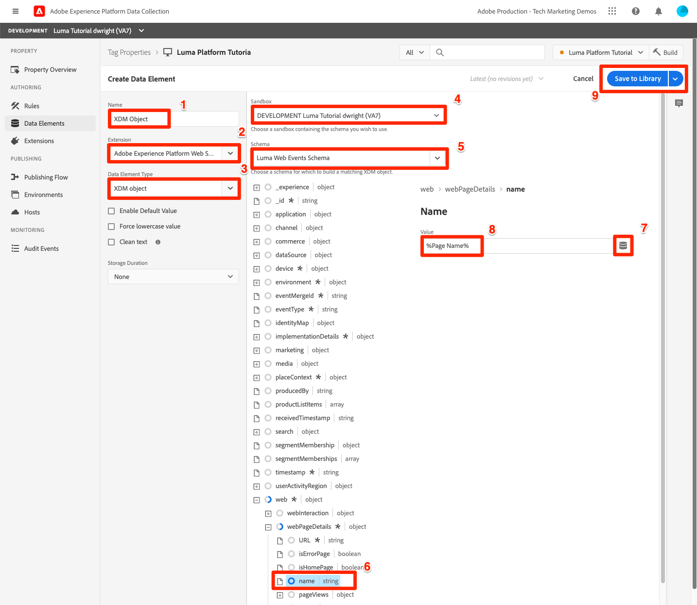
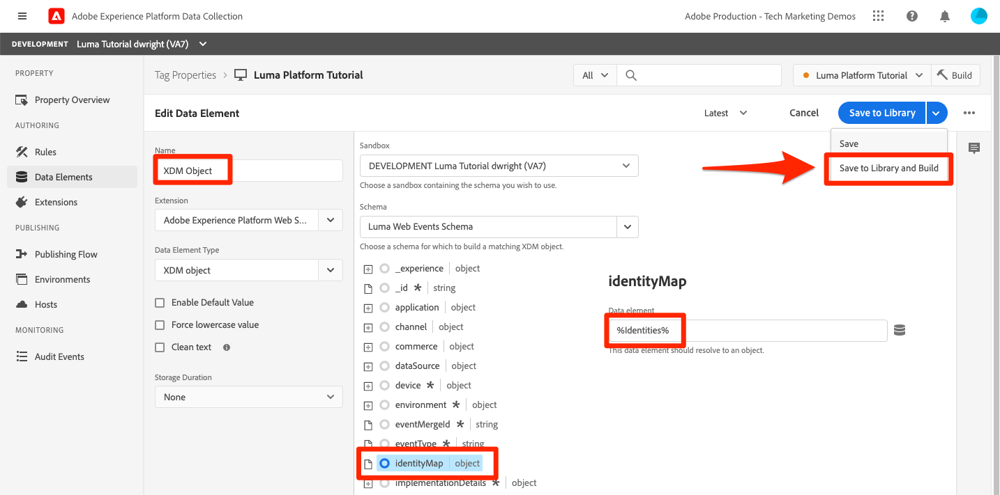

# ストリーミングデータの取り込み

<!--1hr-->

このレッスンでは、Adobe Experience Platform web SDKを使用してデータをストリーミングします。

データ収集インターフェイスで完了する必要がある主なタスクは 2 つあります。

* Luma web サイトに Web SDKを実装して、訪問者のアクティビティに関するデータを web サイトから Adobe Edge Network に送信する必要があります。 タグ（旧称 Launch）を使用して簡単な実装をおこないます

* データストリームを設定する必要があります。これは、データの転送先をEdge ネットワークに指示するものです。 Platform サンドボックスの `Luma Web Events` データセットにデータを送信するように設定します。

**データエンジニア** は、このチュートリアル以外でストリーミングデータを取り込む必要があります。 Web SDK または Mobile SDK をAdobe Experience Platformしてを実装する場合、通常、web またはモバイル開発者がデータレイヤーの作成とタグプロパティの設定に関与します。

演習を開始する前に、次の 2 つの短いビデオを視聴して、ストリーミングデータ取得と web SDKについて詳しく学びます。

>[!VIDEO](https://video.tv.adobe.com/v/31657?captions=jpn&learn=on&enablevpops)

>[!VIDEO](https://video.tv.adobe.com/v/37263?captions=jpn&learn=on&enablevpops)

>[!NOTE]
>
>このチュートリアルでは、Web SDKを使用して web サイトからストリーミングでデータを取り込む方法に重点を置いていますが、[Adobe モバイルSDK](https://developer.adobe.com/client-sdks/documentation/)、[Apache Kafka Connect](https://github.com/adobe/experience-platform-streaming-connect) などの仕組みを使用してデータをストリーミングすることもできます。

## 権限が必要です

[&#x200B; 権限の設定 &#x200B;](configure-permissions.md) レッスンでは、このレッスンを完了するために必要なすべてのアクセス制御を設定します。

<!--
* Permission items **[!UICONTROL Launch]** > **[!UICONTROL Property Rights]** > **[!UICONTROL Approve]**, **[!UICONTROL Develop]**, **[!UICONTROL Manage Environments]**, **[!UICONTROL Manage Extensions]**, and **[!UICONTROL Publish]**
* Permission item **[!UICONTROL Launch]** > **[!UICONTROL Company Rights]** > **[!UICONTROL Manage Properties]**
* User-role access to the `Luma Tutorial Launch` product profile
* Admin-role access to the `Luma Tutorial Launch` product profile
* Permission items **[!UICONTROL Platform]** > **[!UICONTROL Data Ingestion]** > **[!UICONTROL View Sources]** and **[!UICONTROL Manage Sources]**
* Permission items **[!UICONTROL Platform]** > **[!UICONTROL Data Management]** > **[!UICONTROL View Datasets]** and **[!UICONTROL Manage Datasets]**
* Permission items **[!UICONTROL Platform]** > **[!UICONTROL Profiles]** > **[!UICONTROL View Profiles]**, **[!UICONTROL Manage Profiles]** and **[!UICONTROL Export Audience Segment]**
* Permission item **[!UICONTROL Platform]** > **[!UICONTROL Sandbox Administration]** > **[!UICONTROL View Sandboxes]**
* Permission item **[!UICONTROL Platform]** > **[!UICONTROL Sandboxes]** > `Luma Tutorial`
* User-role access to the `Luma Tutorial Platform` product profile
-->

<!--## Create a streaming source

1. Log into the [Experience Platform  user interface](https://experience.adobe.com/platform/)
1. Go to **[!UICONTROL Sources]** in the left navigation
1. Filter the list by selecting **[!UICONTROL Streaming]**
1. In the **[!UICONTROL HTTP API]** section, select the **[!UICONTROL Configure]** button
    
1. On the **[!UICONTROL Authentication]** step, enter `Luma Web Events Source` as the **[!UICONTROL Account name]** and select the **[!UICONTROL Connect to source]** button (we don't need to enable authentication since the data will be originating from website visitors)
    
1. Once connected, select the **[!UICONTROL Next]** button to proceed to the next step in the workflow
1. On the **[!UICONTROL Select data]** step, choose **[!UICONTROL Existing Dataset]**, select your `Luma Web Events Dataset`, and then select the **[!UICONTROL Next]** button
    
1. On the **[!UICONTROL Dataflow detail]** step, select the **[!UICONTROL Next]** button:
    
    <!--What is a good practice for naming the data flow vs the source-->
<!--
1. On the **[!UICONTROL Review]** step, review your source details and select the **[!UICONTROL Finish]** button:
    
-->

## データストリームの設定

まず、データストリームを設定します。 データストリームは、Web SDK呼び出しからデータを受信した後にデータを送信する場所を Adobe Edge ネットワークに指示します。 例えば、データをExperience Platform、Adobe AnalyticsまたはAdobe Targetに送信しますか？ データストリームは、データ収集ユーザーインターフェイス（旧称 Launch）で管理され、web SDKでのデータ収集にとって重要です。

[!UICONTROL &#x200B; データストリーム &#x200B;] を作成するには：

1. [Experience Platform Data Collection ユーザーインターフェイスにログインします &#x200B;](https://experience.adobe.com/launch/)
   <!--when will the edge config go live?-->

1. 左側のナビゲーションで **[!UICONTROL データストリーム]** を選択します
1. 右上隅の **[!UICONTROL 新しいデータストリーム]** ボタンを選択します

   

1. **[!UICONTROL わかりやすい名前]** に、`Luma Platform Tutorial` と入力します（会社の複数のユーザーがこのチュートリアルを受講している場合は、最後に名前を追加します）。
1. 「**[!UICONTROL 保存]** ボタンを選択します

   

次の画面で、データを送信する場所を指定します。 データをExperience Platformに送信するには：

1. **[!UICONTROL Adobe Experience Platform]** をオンにして、追加のフィールドを公開します
1. **[!UICONTROL サンドボックス]** で、`Luma Tutorial` を選択します
1. **[!UICONTROL イベントデータセット]** で、`Luma Web Events Dataset` を選択します
1. 他のAdobe アプリケーションを使用している場合は、自由に他の節を参照して、これらの他のソリューションのEdge設定で必要な情報を確認してください。 Web SDKは、データをExperience Platformにストリーミングするだけでなく、他のAdobe アプリケーションで使用される以前のJavaScript ライブラリをすべて置き換えるために開発されました。 Edge Configuration は、データを送信する各アプリケーションのアカウントの詳細を指定するために使用されます。
1. 「**[!UICONTROL 保存]**」を選択します
   

Edge Configuration を保存すると、開発用、ステージング用、実稼動用の 3 つの環境が作成されていることが画面に表示されます。 さらに開発環境を追加できます。

3 つの環境すべてに、入力したプラットフォームの詳細が含まれます。 ただし、これらの詳細は環境ごとに異なる方法で設定できます。 例えば、各環境で異なる Platform サンドボックスにデータを送信することができます。 このチュートリアルでは、データストリームに対して追加のカスタマイズを行いません。

## Web SDK拡張機能のインストール

### プロパティを追加

まず、タグプロパティ（以前のタグプロパティ）を作成する必要があります。 プロパティは、web ページから詳細を収集して様々な場所に送信するために必要なすべてのJavaScript、ルール、その他の機能のコンテナです。

プロパティを作成するには：

1. 左側のナビゲーションの **[!UICONTROL プロパティ]** に移動します
1. 「**[!UICONTROL 新しいプロパティ]**」ボタンを選択します
   
1. **[!UICONTROL 名前]** として、`Luma Platform Tutorial` と入力します（会社の複数のユーザーがこのチュートリアルを受講している場合は、最後に名前を追加します）。
1. **[!UICONTROL ドメイン]** として、`enablementadobe.com` と入力します（後で説明します）。
1. 「**[!UICONTROL 保存]**」を選択します
   

<!--
After saving the property, you might see an error message like the one below. If so, this is because you don't actually have access to the property you just created. To fix this, we need to go to the Admin Console to give yourself access:
    

To give yourself access to the property:

1. In a separate browser tab, log into the [Admin Console](https://adminconsole.adobe.com/)
1. Go to **[!UICONTROL Products]** from the top navigation
1. Select **[!UICONTROL Adobe Experience Platform Launch]** on the left navigation
1. Go to your `Luma Tutorial Launch` product profile
1. Go to the **[!UICONTROL Permissions]** tab
1. On the **[!UICONTROL Properties]** row, select **[!UICONTROL Edit]**
    
1. Select the "+" icon to move your `Luma Platform Tutorial` property to the right-hand side and select the **[!UICONTROL Save]** button to update the permissions
   
    

Now switch back to your browser tab with the Data Collection interface still open. Reload the page and the `Luma Platform Tutorial` property should display in the list. Select to open the property:

-->

## Web SDK拡張機能を追加します

プロパティが用意できたので、拡張機能を使用して web SDKを追加できます。 拡張機能は、データ収集のインターフェイスと機能を拡張するコードのパッケージです。 拡張機能を追加するには：

1. タグプロパティを開きます
1. 左ナビゲーションの **[!UICONTROL 拡張機能]** に移動します
1. 「**[!UICONTROL カタログ]** タブに移動します
1. タグに使用できる拡張機能は多数あります。 `Web SDK` という用語でカタログをフィルタリングします
1. **[!UICONTROL Adobe Experience Platform Web SDK]** 拡張機能で、「**[!UICONTROL インストール]**」ボタンを選択します
   
1. Web SDK拡張機能で使用できる設定はいくつかありますが、このチュートリアルで設定する設定は 2 つだけです。 **[!UICONTROL Edge ドメイン]** を `data.enablementadobe.com` に更新します。 この設定を使用すると、Web SDKの実装でファーストパーティ Cookie を設定できます。これは推奨されます。 このレッスンの後半では、`enablementadobe.com` ドメインの web サイトをタグプロパティにマッピングします。 `enablementadobe.com` ドメインの CNAME は、Adobe サーバーに転送するように既に設定されて `data.enablementadobe.com` ます。 Web SDKを独自の web サイトに実装する場合、独自のデータ収集のために CNAME を作成する必要があります（例：`data.YOUR_DOMAIN.com`）。
1. **[!UICONTROL データストリーム]** ドロップダウンから、`Luma Platform Tutorial` データストリームを選択します。
1. 他の設定オプションを自由に確認して（ただし、変更しないでください）、「**[!UICONTROL 保存]**」を選択します。
   <!--is edge domain required for first party? when will it break?-->
   <!--any other fields that should be highlighted-->
   

## データを送信するルールの作成

次に、データを Platform に送信するルールを作成します。 ルールは、タグに何かをするように指示するイベント、条件、アクションの組み合わせです。 ルールを作成するには：

1. 左側のナビゲーションで **[!UICONTROL ルール]** に移動します
1. 「**[!UICONTROL 新規ルールを作成]**」ボタンを選択します
   
1. ルール名を設定します。`All Pages - Library Loaded`
1. **[!UICONTROL イベント]** で「**[!UICONTROL 追加]**」ボタンを選択します
   
1. **[!UICONTROL Core]** **[!UICONTROL Extension]** を使用し、**[!UICONTROL イベントタイプ]** として **[!UICONTROL Library Loaded （Page Top）]** を選択します。 この設定は、Launch ライブラリがページに読み込まれるたびにルールが起動することを意味します。
1. 「**[!UICONTROL 変更を保持]**」を選択して、メインのルール画面に戻ります
   
1. このルールは、指定した名前に従ってすべてのページで実行する必要があるので、**[!UICONTROL 条件]** は空のままにします
1. **[!UICONTROL アクション]** で「**[!UICONTROL 追加]**」ボタンを選択します
1. **[!UICONTROL Adobe Experience Platform Web SDK]** **[!UICONTROL Extension]** を使用し、**[!UICONTROL Action Type]** として **[!UICONTROL Send Event]** を選択します
1. 右側の「**[!UICONTROL タイプ]**」ドロップダウンから「**[!UICONTROL web.webpagedetails.pageViews]**」を選択します。 これは、`Luma Web Events Schema` の XDM フィールドの 1 つです
1. 「**[!UICONTROL 変更を保持]**」を選択して、メインのルール画面に戻ります
   
1. 「**[!UICONTROL 保存]**」を選択して、ルールを保存します\
   

## ライブラリへのルールの公開

次に、ルールが機能することを検証できるように、開発環境に公開します。

<!--
There are a few quick steps we must take in the **[!UICONTROL Publishing]** section of Launch.

### Create a host

Launch libraries can be hosted on Adobe's Content Delivery Network (CDN) or on your own servers. In this tutorial, we will use Adobe's CDN since it is faster to set up:

1. Go to **[!UICONTROL Hosts]** in the left navigation
1. Select the **[!UICONTROL Create New Host]** button
       
1. For the **[!UICONTROL Name]**, enter `Adobe CDN`
1. For the **[!UICONTROL Type]**, select **[!UICONTROL Managed by Adobe]**
1. Select the **[!UICONTROL Save]** button to complete the setup of the host
       

### Create an environment

Environments allow you to have different versions of a library in different publishing environments to accommodate your publishing workflow. For example, the fully tested version of your library can be published to a Production environment, while new changes are being created in a Development environment. You can also use different hosts for each environment. To create an environment:

1. Go to **[!UICONTROL Environments]** in the left navigation
1. Select the **[!UICONTROL Create New Environment]** button
     
1. Under **[!UICONTROL Development]** select **[!UICONTROL Select]**   
     
1. For the **[!UICONTROL Name]**, enter `Development`
1. For the **[!UICONTROL Select Host]** dropdown, select `Adobe CDN`
1. Select the **[!UICONTROL Save]** button to complete the setup of the environment
    
1. You will see a modal with URL and other implementation details of this library. These are critical for a real Launch implementation, but we don't need to worry about them for this tutorial. Select the **[!UICONTROL Close]** button to exit the modal.

### Create and publish the library

Now let's bundle the contents of our property&mdash;currently an extension and a rule&mdash;into a library. 
-->

ライブラリを作成するには：

1. 左側のナビゲーションの **[!UICONTROL 公開フロー]** に移動します
1. 「**[!UICONTROL ライブラリを追加]**」を選択します。
   
1. **[!UICONTROL 名前]** に `Luma Platform Tutorial` と入力します
1. **[!UICONTROL 環境]** で、「`Development`」を選択します。
1. 「**[!UICONTROL 変更されたすべてのリソースを追加]**」ボタンを選択します。 （[!UICONTROL Adobe Experience Platform Web SDK] 拡張機能と `All Pages - Library Loaded` ルールに加えて、すべての Launch web プロパティに必要な基本JavaScriptを含んだ [!UICONTROL Core] 拡張機能も追加されます。）
1. 「**[!UICONTROL 開発用に保存してビルド]** ボタンを選択します
   

ライブラリのビルドには数分かかる場合があり、完了すると、ライブラリ名の左側に緑のドットが表示されます。

[!UICONTROL &#x200B; 公開フロー &#x200B;] 画面で確認できるように、公開プロセスには多くの詳細があり、これはこのチュートリアルの範囲外です。 開発環境では、単一のライブラリを使用します。

## リクエスト内のデータを検証します

### Adobe Experience Platform Debuggerを追加

Experience Platform Debugger は、Chromeで使用できる拡張機能で、web ページに実装されたAdobe テクノロジーを確認するのに役立ちます。 使用するブラウザーのバージョンをダウンロードします。

* [Chrome拡張機能 &#x200B;](https://chrome.google.com/webstore/detail/adobe-experience-platform/bfnnokhpnncpkdmbokanobigaccjkpob)

初めて Debugger を使用する場合（これが古いAdobe Experience Cloud Debugger と異なる場合）は、次の 5 分間の概要ビデオをご覧ください。

>[!VIDEO](https://video.tv.adobe.com/v/36086?captions=jpn&learn=on&enablevpops)

### Luma web サイトを開きます

このチュートリアルでは、Luma デモ web サイトの公開バージョンを使用します。 これを開いて、ブックマークします。

1. 新しいブラウザータブで、[Luma web サイト &#x200B;](https://luma.enablementadobe.com/content/luma/us/en.html) を開きます。
1. チュートリアルの残りの部分で使用するために、ページをブックマークします

このホストされる web サイトで `enablementadobe.com`、最初のタグプロパティ設定の [!UICONTROL Domains] フィールドに使用した理由と、`data.enablementadobe.com`Adobe Experience Platform web SDK[!UICONTROL &#x200B; 拡張機能のファーストパーティドメインとして &#x200B;] を使用した理由です。 見て、私は計画を持っていた！

### Experience Platform Debugger を使用して、タグプロパティにマッピングします

Experience Platform Debugger には、既存のタグプロパティを別のプロパティに置き換えることができる優れた機能があります。 これは検証に役立ち、このチュートリアルの多くの実装手順をスキップできます。

1. Luma サイトが開いていることを確認し、Experience Platform Debugger 拡張機能アイコンを選択します
1. デバッガーが開き、ハードコーディングされた実装の詳細が表示されます。これは、このチュートリアルとは無関係です（デバッガーを開いた後に Luma サイトをリロードする必要がある場合があります）
1. 次の図に示すように、デバッガーが「**[!UICONTROL Luma に接続]**」されていることを確認し、「**[!UICONTROL lock]**」アイコンを選択して、デバッガーを Luma サイトにロックします。
1. 右上の **[!UICONTROL ログイン]** ボタンを選択して、認証します。
1. 左側のナビゲーションの **[!UICONTROL ローンチ]** に移動します
1. 「設定」タブを選択します。
1. **[!UICONTROL ページ埋め込みコード]** が表示されている場所の右側で、「**[!UICONTROL アクション]**」ドロップダウンを開き、「**[!UICONTROL 置換]**」を選択します
   
1. 認証されたので、デバッガーは使用可能な Launch プロパティと環境を取り込みます。 `Luma Platform Tutorial` プロパティを選択します
1. `Development` 環境を選択します
1. 「**[!UICONTROL 適用]** ボタンを選択します
   
1. Luma web サイトが _タグプロパティを使用して_ 再読み込みされるようになりました。 助けて、私はハッキングされました！ 冗談だよ。
   
1. 左側のナビゲーションの **[!UICONTROL 概要]** に移動し、[!UICONTROL Launch] プロパティの詳細を確認します
   
1. 左側のナビゲーションで **[!UICONTROL AEP Web SDK]** に移動して、**[!UICONTROL ネットワークリクエスト]** を確認します
1. **[!UICONTROL events]** 行を開きます

   
1. `web.webpagedetails.pageView` イベントを送信 [!UICONTROL &#x200B; アクションで指定した &#x200B;] イベントタイプと、`AEP Web SDK ExperienceEvent Mixin` 形式に準拠するその他の標準変数の確認方法に注意してください
   
1. これらのタイプのリクエストの詳細は、ブラウザーの web デベロッパーツールの「ネットワーク **タブにも表示さ** ます。 ファイルを開き、ページをリロードします。 `interact` を使用して呼び出しをフィルタリングし、呼び出しを見つけて選択し、「**ヘッダー**」タブの **リクエストペイロード** 領域を探します。
   
1. 「**応答**」タブに移動し、ECID 値が応答にどのように含まれるかを確認します。 この値をコピーします。次の演習では、この値を使用してプロファイル情報を検証します。
   

## Experience Platformのデータの検証

データに到着したデータのバッチを調べることで、データが Platform にランディングしていることを検証で `Luma Web Events Dataset` ます。 （ストリーミングデータ取り込みと呼ばれますが、今はバッチで到着すると言っています。 リアルタイムでプロファイルにストリーミングするので、リアルタイムのセグメント化とアクティベーションに使用できますが、データレイクに 15 分ごとにバッチで送信されます）。

データを検証するには：

1. Platform ユーザーインターフェイスの左側のナビゲーションで **[!UICONTROL データセット]** に移動します
1. `Luma Web Events Dataset` を開き、バッチが到着したことを確認します。 バッチは 15 分ごとに送信されるので、バッチが表示されるまで待つ必要がある場合があります。
1. 「**[!UICONTROL データセットをプレビュー]**」ボタンを選択します
   
1. プレビューモーダルでは、左側でスキーマの様々なフィールドを選択して、それらの特定のデータポイントをプレビューする方法に注意してください。
   

また、新しいプロファイルが表示されていることを確認することもできます。

1. Platform ユーザーインターフェイスで、左側のナビゲーションの **[!UICONTROL プロファイル]** に移動します
1. **[!UICONTROL ECID]** 名前空間を選択し、ECID 値を検索します（応答からコピーします）。 プロファイルには、ECID とは別に独自の ID が割り当てられます。
1. **[!UICONTROL プロファイル ID]** を選択して、プロファイルを開きます
   。
1. **[!UICONTROL イベント]** タブを選択して、表示したページを表示します
   \
   <!---->

## イベントへのカスタムデータの追加

### ページ名のデータ要素を作成

1. データ収集タグインターフェイスの `Luma Platform Tutorial` プロパティの右上隅で **[!UICONTROL 作業ライブラリを選択]** ドロップダウンを開き、`Luma Platform Tutorial` ライブラリを選択します。 この設定により、ライブラリに追加の更新を公開しやすくなります。
1. 左ナビゲーションの **[!UICONTROL データ要素]** に移動します
1. 「**[!UICONTROL 新しいデータ要素の作成]** ボタンを選択します

   
1. **[!UICONTROL 名前]** として、`Page Name` と入力します
1. **[!UICONTROL データ要素タイプ]** として、「`JavaScript Variable`」を選択します
1. **[!UICONTROL JavaScript変数名]** として、`digitalData.page.pageInfo.pageName` と入力します
1. 値の形式を標準化するには、「小文字の値を強制 **[!UICONTROL 」および「テキストをクリーン]** のチェックボックスをオンに **[!UICONTROL ま]**。
1. 作業ライブラリとして「`Luma Platform Tutorial`」が選択されていることを確認します
1. 「**[!UICONTROL ライブラリに保存]**」を選択します
   

### ページ名を XDM オブジェクトデータ要素にマッピングします

次に、ページ名を web SDKにマッピングします。

>[!IMPORTANT]
>
>このタスクを完了するには、まずユーザーが実稼動サンドボックスにアクセスできるようにする必要があります。 別の製品プロファイルから実稼動用サンドボックスにまだアクセスできない場合は、す `Luma Tutorial Platform` に実稼動プロファイルを開いて、権限項目 **[!UICONTROL サンドボックス]**/**[!UICONTROL 実稼動]** を追加します。 その後、データ要素ページでシフト再ロードを実行して、キャッシュをクリアします
>

**[!UICONTROL データ要素]** ページで、次の操作を行います。

1. 新しいデータ要素の作成
1. **[!UICONTROL 名前]** として、`XDM Object` と入力します
1. **[!UICONTROL 拡張機能]** として、「`Adobe Experience Platform Web SDK`」を選択します
1. **[!UICONTROL データ要素タイプ]** として、「`XDM object`」を選択します
1. **[!UICONTROL サンドボックス]** として、`Luma Tutorial` のサンドボックスを選択します
1. **[!UICONTROL スキーマ]** として、`Luma Web Events Schema` を選択します
1. `web.webPageDetails.name` フィールドを選択します
1. **[!UICONTROL 値]** として、アイコンを選択してデータ要素選択モーダルを開き、`Page Name` データ要素を選択します
1. 「**[!UICONTROL ライブラリに保存]**」を選択します
   

これと同じプロセスを使用して、web サイト上の追加のカスタムデータを XDM フィールドにマッピングします。

### XDM データをイベントを送信アクションに追加します

XDM フィールドにマッピングされたデータがあるので、イベントを送信アクションに含めることができます。

1. **[!UICONTROL ルール]** 画面に移動します
1. `All Pages - Library Loaded` ルールを開きます
1. `Adobe Experience Platform Web SDK - Send Event` アクションを開く
1. **[!UICONTROL XDM データ]** として、アイコンを選択してデータ要素選択モーダルを開き、`XDM Object` データ要素を選択します
1. 「**[!UICONTROL 変更を保持]**」ボタンを選択します
   
1. 前回の演習 `Luma Platform Tutorial` 作業ライブラリとしてを選択したので、最近の変更はライブラリに直接保存されています。 公開フロー画面を使用して変更を公開する代わりに、青いボタンのドロップダウンを開いて **[!UICONTROL ライブラリおよびビルドに保存]** を選択するだけです
   

これにより、今追加した 3 つの変更を含む新しいタグライブラリの作成が開始されます。

### XDM データの検証

先ほど学んだように、デバッガーを使用してタグプロパティにマッピングしながら、Luma ホームページを再読み込みできるようになりました。また、ページ名フィールドがリクエストに入力されていることがわかります。

また、データセットとプロファイルをプレビューすることで、Platform で受信したページ名データを検証することもできます。

## 追加の ID を送信

これで、Web SDK実装が、Experience Cloud ID （ECID）をプライマリ ID とするイベントを送信するようになりました。 ECID は、web SDKによって自動的に生成され、デバイスとブラウザーごとに一意です。 1 人の顧客は、使用しているデバイスとブラウザーに応じて、複数の ECID を持つことができます。 では、どうすれば、この顧客の統一されたビューを取得し、顧客のオンラインアクティビティを CRM、ロイヤルティ、オフライン購入データにリンクできるでしょうか。 これを行うには、セッション中に追加の ID を収集し、ID ステッチを使用してプロファイルを決定論的にリンクします。

先ほど思い出していただいたように、[ID のマッピング &#x200B;](map-identities.md) レッスンでは、ECID と CRM ID を web データの ID として使用しています。 Web SDKで CRM ID を収集します。

### CRM ID に対応するデータ要素の追加

まず、CRM ID をデータ要素に格納します。

1. タグインターフェイスで、`CRM Id` という名前のデータ要素を追加します。
1. **[!UICONTROL Data Element Type]** として、「**[!UICONTROL JavaScript変数]**」を選択します
1. **[!UICONTROL JavaScript変数名]** として、`digitalData.user.0.profile.0.attributes.username` と入力します
1. 「**[!UICONTROL ライブラリに保存]**」ボタンを選択します（作業ライブラリ `Luma Platform Tutorial` 残ります）。
   

### CRM ID を ID マップデータ要素に追加します

CRM ID 値を取得したので、それを [!UICONTROL ID マップ &#x200B;] データ要素と呼ばれる特別なデータ要素タイプに関連付ける必要があります。

1. `Identities` という名前のデータ要素を追加
1. **[!UICONTROL Extension]** として、「**[!UICONTROL Adobe Experience Platform Web SDK]**」を選択します
1. **[!UICONTROL データ要素タイプ]** として、「**[!UICONTROL ID マップ]**」を選択します
1. **[!UICONTROL 名前空間]** として、前のレッスンで作成した `Luma CRM Id` 名前空間 [!UICONTROL &#x200B; である &#x200B;] と入力します

   >[!WARNING]
   >
   >Adobe Experience Platform Web SDK拡張機能バージョン 2.2 では、Platform アカウントの実際の値を使用して、事前入力されたドロップダウンから「名前空間」を選択できます。 残念ながら、この機能はまだ「サンドボックス対応」ではないので、`Luma CRM Id` の値がドロップダウンに表示されない場合があります。 これにより、この演習を完了できない場合があります。 確認後、回避策を掲載します。

1. **[!UICONTROL ID]** として、このアイコンを選択してデータ要素選択モーダルを開き、`CRM Id` データ要素を選択します
1. **[!UICONTROL 認証状態]** として、「**[!UICONTROL 認証済み]**」を選択します
1. **[!UICONTROL プライマリを確認]**

   >[!TIP]
   >
   > Adobeでは、`Luma CRM Id` などの人物を表す ID を [!UICONTROL &#x200B; プライマリ &#x200B;] ID として送信することをお勧めします。
   >
   > ID マップに人物識別子（例：`Luma CRM Id`）が含まれる場合、その人物識別子は [!UICONTROL &#x200B; プライマリ &#x200B;] ID になります。 それ以外の場合は、`ECID` が [!UICONTROL &#x200B; プライマリ &#x200B;] ID になります。

1. 「**[!UICONTROL ライブラリに保存]**」ボタンを選択します（作業ライブラリ `Luma Platform Tutorial` 残ります）。
   

>[!NOTE]
>
>[!UICONTROL ID マップ &#x200B;] データタイプを使用して、複数の識別子を渡すことができます。

### ID マップデータ要素を XDM オブジェクトに追加します

更新が必要なデータ要素として、もう 1 つ XDM オブジェクトデータ要素があります。 この 1 つの ID を渡すために 3 つの個別のデータ要素を更新する必要があると奇妙に思えるかもしれませんが、このプロセスは、複数の ID に対して拡張するように設計されています。 心配しないでください。このレッスンはもうほとんど終わりです。

1. XDM オブジェクトデータ要素を開きます
1. IdentityMap XDM フィールドを開きます
1. **[!UICONTROL データ要素]** として、アイコンを選択してデータ要素選択モーダルを開き、`Identities` データ要素を選択します
1. 前回の演習 `Luma Platform Tutorial` 作業ライブラリとしてを選択したので、最近の変更はライブラリに直接保存されています。 公開フロー画面を使用して変更を公開する代わりに、青いボタンのドロップダウンを開いて、「**[!UICONTROL ライブラリおよびビルドに保存]** を選択できます
   

### ID の検証

CRM ID が現在 Web SDKから送信されていることを検証するには、次の手順に従います。

1. [Luma web サイト &#x200B;](https://luma.enablementadobe.com/content/luma/us/en.html) を開きます。
1. 前の手順に従って、デバッガーを使用してタグプロパティにマッピングします。
1. Luma web サイトの右上にある **ログイン** リンクを選択します
1. 資格情報 `test@test.com`/`test` を使用してログイン
1. 認証されたら、デバッガー（最新のリクエストの **[!UICONTROL Adobe Experience Platform Web SDK]**/**[!UICONTROL ネットワークリクエスト]**/**[!UICONTROL イベント]**）でExperience Platform Web SDK呼び出しを調べ、`lumaCrmId` が表示されます。
   
1. ECID 名前空間を使用してユーザープロファイルを検索し、値を再度設定します。 プロファイルには、CRM ID とロイヤルティ ID、名前や電話番号などのプロファイルの詳細が表示されます。 すべての ID とデータは、単一のリアルタイム顧客プロファイルにステッチされています。
   

## その他のリソース

* [Web SDK を使用した Adobe Experience Cloud の実装](/help/tutorial-web-sdk/overview.md)
* [&#x200B; ストリーミング取得ドキュメント &#x200B;](https://experienceleague.adobe.com/docs/experience-platform/ingestion/streaming/overview.html?lang=ja)
* [ストリーミング取得 API リファレンス](https://developer.adobe.com/experience-platform-apis/references/streaming-ingestion/)

お疲れ様でした。 これは、Web SDKと Launch に関する多くの情報でした。 本格的な実装にはさらに多くの関与がありますが、Platform で開始して結果を確認するのに役立つ基本です。

>[!NOTE]
>
>ストリーミング取り込みレッスンが完了したので、[!UICONTROL &#x200B; 製品プロファイルから &#x200B;]Prod`Luma Tutorial Platform` サンドボックスを削除できます

データエンジニアの方は、[&#x200B; クエリを実行のレッスン &#x200B;](run-queries.md) に進んでください。

データアーキテクトは、[&#x200B; 結合ポリシー &#x200B;](create-merge-policies.md) に進むことができます。
