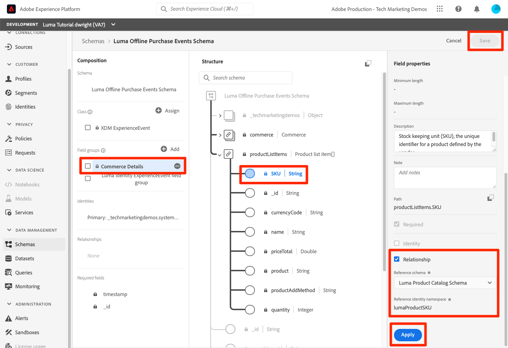

# ID のマッピング

<!-- 30 min-->

このレッスンでは、ID 名前空間を作成し、スキーマに ID フィールドを追加します。 その後、前のレッスンで作成したスキーマの関係も完了できます。

Adobe Experience Platform ID サービスを使用すると、デバイスやシステム間で ID を結び付け、顧客とその行動をより良く把握でき、効果的な個人のデジタルエクスペリエンスをリアルタイムで提供できます。 ID フィールドと名前空間は、異なるデータソースを結合して、360 度のリアルタイム顧客プロファイルを構築するための接着剤です。

**データアーキテクト** このチュートリアル以外で、id をマッピングする必要があります。

演習を始める前に、Adobe Experience Platformの ID の詳細については、以下の短いビデオをご覧ください。
>[!VIDEO](https://video.tv.adobe.com/v/27841?learn=on)

>[!NOTE]
>
>ID フィールドは、リアルタイム顧客プロファイルを作成する場合にのみ必要です。 データレイクにデータを取り込む場合にのみ必要です。

<!--explain identity maps-->
<!--explain the strategy behind the identity selection, how these identities will join all the data together-->

## 必要な権限

Adobe Analytics の [権限の設定](configure-permissions.md) レッスンでは、このレッスンを完了するために必要なすべてのアクセス制御を設定します。

<!--
* Permission items **[!UICONTROL Identity Management]** > **[!UICONTROL View Identity Namespaces]** and **[!UICONTROL Manage Identity Namespaces]**
* Permission item **[!UICONTROL Data Modeling]** > **[!UICONTROL View Schemas]** and **[!UICONTROL Manage Schemas]**
* Permission item **[!UICONTROL Sandboxes]** > `Luma Tutorial`
* User-role access to the `Luma Tutorial Platform` product profile
* Developer-role access to the `Luma Tutorial Platform` product profile (for API)
-->

## ID 名前空間を作成

この演習では、Luma のカスタム ID フィールドの ID 名前空間を作成します。 `loyaltyId`, `crmId`、および `productSku`. ID 名前空間は、同じ名前空間内の 2 つの一致する値により、2 つのデータソースで ID グラフを構成できるので、リアルタイム顧客プロファイルを作成するうえで重要な役割を果たします。


### UI での名前空間の作成

まず、Luma ロイヤリティスキーマ用の名前空間を作成します。

1. Platform ユーザーインターフェイスで、に移動します。 **[!UICONTROL ID]** 左のナビゲーションで
1. 標準の ID 名前空間がいくつか使用できます。 を選択します。 **[!UICONTROL ID 名前空間を作成]** ボタン
1. 次のように詳細を入力します

   | フィールド | 値 |
   |---------------|-----------|
   | 表示名 | Luma ロイヤリティ ID |
   | ID シンボル | lumaLoyaltyId |
   | タイプ | クロスデバイス |

1. 選択 **[!UICONTROL 作成]**

   

次に、以下の詳細を含む Luma 製品カタログスキーマ用に別の名前空間を設定します。

| フィールド | 値 |
|---------------|-----------|
| 表示名 | Luma 製品 SKU |
| ID シンボル | lumaProductSKU |
| タイプ | 人物以外の識別子 |


## API を使用して ID 名前空間を作成

API を使用して CRM 名前空間を作成します。

>[!NOTE]
>
>API の演習をスキップしたい場合は、以下の詳細と共に使用したユーザーインターフェイスメソッドを使用して、自由に CRM 名前空間を作成してください。
>
> 1. を **[!UICONTROL 表示名]**，使用 `Luma CRM Id`
> 1. を **[!UICONTROL ID シンボル]**，使用 `lumaCrmId`
> 1. を **[!UICONTROL タイプ]**、クロスデバイスを使用

ID 名前空間を作成しましょう `Luma CRM Id`:

1. ダウンロード [ID サービス.postman_collection.json](https://raw.githubusercontent.com/adobe/experience-platform-postman-samples/master/apis/experience-platform/Identity%20Service.postman_collection.json) を `Luma Tutorial Assets` フォルダー
1. コレクションの読み込み先 [!DNL Postman]
1. アクセストークンがない場合は、リクエストを開きます。 **[!DNL OAuth: Request Access Token]** を選択し、 **送信** をクリックして、新しいアクセストークンをリクエストします。
1. リクエストを選択 **[!UICONTROL ID サービス] > [!UICONTROL ID 名前空間] > [!UICONTROL 新しい ID 名前空間の作成].**
1. 以下を [!DNL Body] リクエストの：

   ```json
   {
       "name": "Luma CRM Id",
       "code": "lumaCrmId",
       "idType": "Cross_device"
   }
   ```

1. を押します。 **送信** ボタンをクリックすると、 **200 OK** 応答：

   

ユーザーインターフェイスに戻ると、3 つの新しいカスタム名前空間が表示されます。


## スキーマの ID フィールドのラベル付け

名前空間ができたので、次の手順は、スキーマを更新して ID フィールドにラベルを付けることです。


### プライマリID 用の XDM フィールドのラベル付け

リアルタイム顧客プロファイルで使用される各スキーマには、プライマリ ID を指定する必要があります。また、取り込まれる各レコードには、そのフィールドの値が必要です。

プライマリ ID を `Luma Loyalty Schema`:

1. `Luma Loyalty Schema` を開きます
1.  `Luma Identity profile field group`
1. を選択します。 `loyaltyId` フィールド
1. 次を確認します。 **[!UICONTROL ID]** ボックス
1. 次を確認します。 **[!UICONTROL プライマリID]** ボックス
1. を選択します。 `Luma Loyalty Id` 名前空間： **[!UICONTROL ID 名前空間]** ドロップダウン
1. 選択 **[!UICONTROL 適用]**
1. 「**[!UICONTROL 保存]**」を選択します

   

他のスキーマの一部に対して、次の手順を繰り返します。

1. Adobe Analytics の `Luma CRM Schema`、ラベル `crmId` を使用して、プライマリ id としてフィールドを `Luma CRM Id` 名前空間
1. Adobe Analytics の `Luma Offline Purchase Events Schema`、ラベル `loyaltyId` を使用して、プライマリ id としてフィールドを `Luma Loyalty Id` 名前空間
1. Adobe Analytics の `Luma Product Catalog Schema`、ラベル `productSku` を使用して、プライマリ id としてフィールドを `Luma Product SKU` 名前空間

>[!NOTE]
>
>Web SDK で収集されるデータは、スキーマの ID フィールドにラベルを付ける一般的な方法の例外です。 Web SDK は、 ID マップを使用して ID にラベルを付けます *実装側で* したがって、 `Luma Web Events Schema` Web SDK を Luma の Web サイトに実装する際に使用します。 この後のレッスンでは、Experience Cloud訪問者 ID(ECID) をプライマリ ID として、crmId をセカンダリ ID として収集します。

プライマリ ID を選択すると、 `Luma CRM Schema` は、次の場所に接続できます： `Luma Offline Purchase Events Schema` 両方ともが `loyaltyId` を識別子として設定します。 しかし、オフラインでの購入とオンラインでの行動を結び付けるにはどうすればよいのでしょうか？ 製品カタログと共に購入した製品を分類するにはどうすればよいですか？ 追加の ID フィールドとスキーマの関係を使用します。

<!--use a visual-->

### セカンダリID 用の XDM フィールドのラベル付け

1 つのスキーマに複数の ID フィールドを追加できます。 非プライマリ ID は、多くの場合、セカンダリ ID と呼ばれます。 オフラインでの購入をオンラインでの行動に結び付けるために、crmId をセカンダリ識別子としてアドビの `Luma Loyalty Schema` 後で Web イベントデータに含まれます。 次に、 `Luma Loyalty Schema`:

1. `Luma Loyalty Schema` を開きます
1. 選択 `Luma Identity Profile Field group`
1. 選択 `crmId` フィールド
1. 次を確認します。 **[!UICONTROL ID]** ボックス
1. を選択します。 `Luma CRM Id` 名前空間： **[!UICONTROL ID 名前空間]** ドロップダウン
1. 選択 **[!UICONTROL 適用]** 次に、 **[!UICONTROL 保存]** ボタンをクリックして変更を保存します。

   

## スキーマの関係を完了する

これで、ID フィールドにラベルが付いたので、Luma の製品カタログとイベントスキーマの間のスキーマ関係の設定を完了できます。

1. `Luma Offline Purchase Events Schema` を開きます
1. 選択 **[!UICONTROL コマースの詳細]** フィールドグループ
1. 選択 **[!UICONTROL productListItems]** > **[!UICONTROL SKU]** フィールド
1. 次を確認します。 **[!UICONTROL 関係]** ボックス
1. 選択 `Luma Product Catalog Schema` として **[!UICONTROL 参照スキーマ]**
1. `Luma Product SKU` は、 **[!UICONTROL 参照 ID 名前空間]**
1. 選択 **[!UICONTROL 適用]**
1. 「**[!UICONTROL 保存]**」を選択します

   

この手順を繰り返して、 `Luma Web Events Schema` そして `Luma Product Catalog Schema`.

関係を定義すると、 **[!UICONTROL 構成]** および **[!UICONTROL 構造]** スキーマエディターの「 」セクションに表示されます。


<!--need to verify that the relationship schema works-->

## その他のリソース

* [ID サービスドキュメント](https://experienceleague.adobe.com/docs/experience-platform/identity/home.html?lang=ja)
* [ID サービス API](https://www.adobe.io/experience-platform-apis/references/identity-service/)

ID が設定されたので、次の操作を実行できます。 [データセットを作成](create-datasets.md)!
