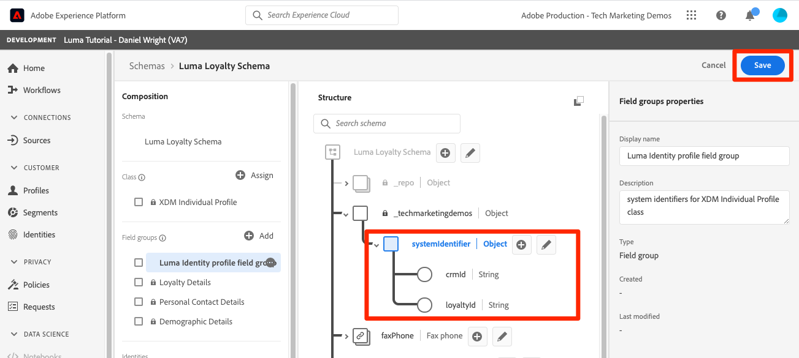

# スキーマのモデルデータ

<!-- 60min -->
このレッスンでは、Luma のデータをスキーマにモデル化します。 これは、チュートリアルで最も長いレッスンの 1 つなので、水のグラスを取得し、バックルアップ！

標準化と相互運用性は、Adobe Experience Platform の背後にある重要な概念です。エクスペリエンスデータモデル (XDM) は、顧客体験データを標準化し、顧客体験管理のスキーマを定義する取り組みです。

XDM は、デジタルエクスペリエンスを強化するために設計され、公式に文書化された仕様です。Platform サービスとの通信に使用するあらゆるアプリケーションに共通の構造と定義を提供します。XDM 標準に準拠することで、すべての顧客体験データを共通の表現に組み込み、より迅速かつ統合的な方法でインサイトを得ることができます。顧客の行動から貴重なインサイトを得たり、セグメントを使用して顧客のオーディエンスを定義したり、パーソナライゼーションを目的として顧客属性を表すことができます。

XDM は、Experience Platform が提供する Adobe Experience Cloud が、適切なタイミングに、適切なチャネル経由で、適切な相手へと適切なメッセージを届けることを可能にする、基本的なフレームワークです。Experience Platform の基礎となる **XDM システム**&#x200B;は、エクスペリエンスデータモデルスキーマを Platform サービスで操作できるようにします。

<!--
This seems too lengthy. The video should suffice

Key terms:

* **Schema**: a representation of your data. A schema is comprised of a class and optional field groups and is used to create datasets. A schema includes behavioral attributes, timestamp, identity, attribute definitions, and relationships.
* **XDM Profile Class**: a common schema class used to represent record data
* **XDM ExperienceEvent Class**: a common schema class used to represent time-series data
* **Field group**: allows users to extend reusable fields that contain variables defining one or more attribute intended to be included in a schema or added to a class.
* **Standard Field group**: an open-source Field group built to conform to common industry standards, used to accelerate implementation and support repeatable services operating on the data
* **Data type**: a reusable object with properties in a hierarchical representation. These can be standard types or custom-defined defined types to describe your own data in your own way (for example, a collection of fields that you use to describe your products). Unlike Field groups, data types can be used in schemas regardless of the class.
* **Field**: a field is the lowest level element of a schema. Each field has a name for referencing and a type to identify the type of data that it contains. Field types can include, integer, number, string, Boolean and schema.
-->

**データアーキテクト** は、このチュートリアル以外でスキーマを作成する必要がありますが、 **データエンジニア** は、データアーキテクトが作成したスキーマと密接に連携します。

演習を始める前に、次の短いビデオを見て、スキーマとエクスペリエンスデータモデル (XDM) の詳細を確認してください。
>[!VIDEO](https://video.tv.adobe.com/v/27105?quality=12&learn=on)

>[!TIP]
>
> Experience Platformでのデータモデリングについて詳しく見るには、このコースを受講することをお勧めします。 [XDM を使用した顧客体験データのモデル化](https://experienceleague.adobe.com/?recommended=ExperiencePlatform-D-1-2021.1.xdm&amp;lang=ja)(Experience League時に無料で利用可能 )

## 必要な権限

内 [権限の設定](configure-permissions.md) レッスンでは、このレッスンを完了するために必要なすべてのアクセス制御を設定します。

<!--, specifically:

* Permission items **[!UICONTROL Data Modeling]** > **[!UICONTROL View Schemas]** and **[!UICONTROL Manage Schemas]**
* Permission item **[!UICONTROL Sandboxes]** > `Luma Tutorial`
* User-role access to the `Luma Tutorial Platform` product profile
* Developer-role access to the `Luma Tutorial Platform` product profile (for API)-->


<!--
## Luma's goals
-->

## UI を使用したロイヤルティスキーマの作成

この演習では、Luma のロイヤルティデータのスキーマを作成します。

1. Platform ユーザーインターフェイスに移動し、サンドボックスが選択されていることを確認します。
1. に移動します。 **[!UICONTROL スキーマ]** 左のナビゲーション
1. を選択します。 **[!UICONTROL スキーマを作成]** 右上のボタン
1. ドロップダウンメニューで、「 」を選択します。 **[!UICONTROL XDM 個人プロファイル]**個々の顧客の属性（ポイント、ステータスなど）をモデリングするので、
   

### 標準フィールドグループを追加

次に、スキーマにフィールドグループを追加するよう求めるプロンプトが表示されます。 すべてのフィールドは、グループを使用してスキーマに追加する必要があります。 Adobeが提供する業界標準のフィールドグループの大きなセットから選択するか、独自のフィールドグループを作成できます。 Experience Platformで独自のデータのモデリングを開始する際は、Adobeが提供する業界標準のフィールドグループに慣れておくとよいでしょう。 可能な限り、顧客 AI、Attribution AI、Adobe Analyticsなどのダウンストリームサービスを強化する場合があるので、これらを使用することをお勧めします。

独自のデータを使用する場合、大きな手順は、Platform で取り込むデータと、そのモデル化方法を決定することです。 この大きなトピックについては、コースで詳しく説明します [XDM を使用した顧客体験データのモデル化](https://experienceleague.adobe.com/?recommended=ExperiencePlatform-D-1-2021.1.xdm&amp;lang=ja). このチュートリアルでは、事前に決定されたスキーマの実装について、ガイドします。

フィールドグループを追加するには：

1. 内 **[!UICONTROL フィールドグループの追加]** モーダルの場合は、次のフィールドグループを選択します。
   1. **[!UICONTROL 人口統計の詳細]** 名前や誕生日などの基本的な顧客データの場合
   1. **[!UICONTROL 個人の連絡先の詳細]** 電子メールアドレスや電話番号などの基本的な連絡先の詳細
1. 行の右側にあるアイコンを選択して、フィールドグループに寄稿されたフィールドをプレビューできます。
   

1. 次を確認します。 **[!UICONTROL 業界]** > **[!UICONTROL 小売]** 」ボックスを使用して、業界固有のフィールドグループを表示します。
1. 選択 **[!UICONTROL ロイヤルティ]** 「ロイヤルティプログラム」フィールドを追加します。
1. 「**[!UICONTROL フィールドグループを追加]**」を選択して、3 つのフィールドグループをすべてスキーマに追加します。
   


ここで、スキーマの現在の状態を調べます。 フィールドグループに、個人、連絡先の詳細、ロイヤルティプログラムのステータスに関連する標準フィールドが追加されています。 これら 2 つのフィールドグループは、自社のデータのスキーマを作成する際に役立つ場合があります。 特定のフィールドグループ行を選択するか、フィールドグループ名の横にあるボックスをオンにして、ビジュアライゼーションの変化を確認します。

スキーマを保存するには：

1. スキーマの一番上のノードを選択します。
1. 入力 `Luma Loyalty Schema` を **[!UICONTROL 表示名]**.
1. 「**[!UICONTROL 保存]**」を選択します。
   

>[!NOTE]
>
>収集していないデータポイントのフィールドをフィールドグループが追加しても問題ありません。 例えば、「faxPhone」は、Luma がデータを収集しないフィールドの場合があります。 いいよ。 スキーマでフィールドが定義されているので、そのデータを意味するわけではありません *必須* 後で取り込みます。

### カスタムフィールドグループを追加する

次に、カスタムフィールドグループを作成します。

ロイヤルティフィールドグループには `loyaltyID` フィールドに含まれる Luma では、スキーマ間の一貫性を確保するために、すべてのシステム識別子を 1 つのグループで管理する必要があります。

フィールドグループは、スキーマワークフローで作成する必要があります。 フィールドグループを作成するには：

1. 選択 **[!UICONTROL 追加]** の下に **[!UICONTROL スキーマフィールドグループ]** 見出し
   
1. 選択 **[!UICONTROL 新しいフィールドグループを作成]**
1. 用途 `Luma Identity profile field group` を **[!UICONTROL 表示名]**
1. 用途 `system identifiers for XDM Individual Profile class` を **[!UICONTROL 説明]**
1. 選択 **[!UICONTROL フィールドグループを追加]**
   

新しい空のフィールドグループがスキーマに追加されます。 この **[!UICONTROL +]** ボタンを使用して、階層内の任意の場所に新しいフィールドを追加できます。 ここでは、ルートレベルにフィールドを追加します。

1. スキーマ名の横にある「**[!UICONTROL +]**」を選択します。これにより、テナント ID 名前空間の下に新しいフィールドが追加され、カスタムフィールドと標準フィールドの競合を管理できます。
1. 内 **[!UICONTROL フィールドプロパティ]** サイドバーは、新しいフィールドの詳細を追加します。
   1. **[!UICONTROL フィールド名]**: `systemIdentifier`
   1. **[!UICONTROL 表示名]**: `System Identifier`
   1. **[!UICONTROL タイプ]**: **[!UICONTROL オブジェクト]**
   1. 選択 **[!UICONTROL 適用]**

   

次に、 `systemIdentifier` オブジェクト：

1. 最初のフィールド
   1. **[!UICONTROL フィールド名]**: `loyaltyId`
   1. **[!UICONTROL 表示名:]** `Loyalty Id`
   1. **[!UICONTROL タイプ]**: **[!UICONTROL 文字列]**
1. 2 番目のフィールド
   1. **[!UICONTROL フィールド名]**: `crmId`
   1. **[!UICONTROL 表示名]**: `CRM Id`
   1. **[!UICONTROL タイプ]**: **[!UICONTROL 文字列]**

新しいフィールドグループは次のようになります。 を選択します。 **[!UICONTROL 保存]** ボタンをクリックしてスキーマを保存しますが、次の演習ではスキーマを開いたままにします。


## データタイプの作成

新しいフィールドグループなど `Luma Identity profile field group`を他のスキーマで再利用して、複数のシステムに標準データ定義を適用できます。 ただし、再利用できるのは _クラスを共有するスキーマ内_&#x200B;の場合は、XDM Individual Profile クラス。

データタイプは、スキーマで再利用できる別の複数フィールド構成体です _複数のクラスにわたる_. 新しいを変換しましょう `systemIdentifier` オブジェクトをデータ型に変換します。

を使用 `Luma Loyalty Schema` 開いたまま、 `systemIdentifier` オブジェクトと選択  **[!UICONTROL 新しいデータ型に変換]**


次の場合、 **[!UICONTROL キャンセル]** スキーマ外で、 **[!UICONTROL データタイプ]** 「 」タブに移動すると、新しく作成したデータタイプが表示されます。 このデータタイプは、レッスンの後半で使用します。


## API を使用して CRM スキーマを作成

次に、API を使用してスキーマを作成します。

>[!TIP]
>
> API の演習をスキップする場合は、ユーザーインターフェイスメソッドを使用して、次のスキーマを作成できます。
>
> 1. 以下を使用： [!UICONTROL XDM 個人プロファイル] クラス
> 1. 名前を付ける `Luma CRM Schema`
> 1. 次のフィールドグループを使用します。人口統計の詳細、個人の連絡先の詳細、Luma ID プロファイルフィールドグループ

まず、空のスキーマを作成します。

1. オープン [!DNL Postman]
1. アクセストークンがない場合は、リクエストを開きます。 **[!DNL OAuth: Request Access Token]** を選択し、 **送信** をクリックして、新しいアクセストークンをリクエストします。
1. 環境変数を開き、 **CONTAINER_ID** から `global` から `tenant`. 次を使用する必要があります。 `tenant` スキーマの作成など、Platform 内の独自のカスタム要素を操作する場合。
1. 「**保存**」を選択します
   
1. リクエストを開く **[!DNL Schema Registry API > Schemas > Create a new custom schema.]**
1. を開きます。 **本文** 「 」タブに移動し、次のコードを貼り付けて「 」を選択します。 **送信** を呼び出します。 この呼び出しは、同じ `XDM Individual Profile` 基本クラス：

   ```json
   {
     "type": "object",
     "title": "Luma CRM Schema",
     "description": "Schema for CRM data of Luma Retail ",
     "allOf": [{
       "$ref": "https://ns.adobe.com/xdm/context/profile"
     }]
   }
   ```

   >[!NOTE]
   >
   >名前空間は、このコードおよび後続のコードサンプル ( 例： `https://ns.adobe.com/xdm/context/profile`) は、 **[!DNL CONTAINER_ID]** を受け入れ、ヘッダーの設定を正しい値に設定します。 また、ユーザーインターフェイスから簡単にアクセスできるものもあります。

1. 以下を受け取る必要があります。 `201 Created` 応答
1. コピー `meta:altId` 応答本文から。 後で別の演習で使用します。
   

1. 新しいスキーマは、ユーザーインターフェイスに表示されますが、フィールドグループは表示されません
   

>[!NOTE]
>
> この `meta:altId` または、スキーマ id は、API リクエストを作成して取得することもできます **[!DNL Schema Registry API > Schemas > Retrieve a list of schemas within the specified container.]** と **[!UICONTROL CONTAINER_ID]** に設定 `tenant` および accept ヘッダー `application/vnd.adobe.xdm+json`.

>[!TIP]
>
> この呼び出しに関する一般的な問題と、おそらく次の修正点が当てはまります。
>
> * 認証トークンがありません：を実行します。 **OAuth:アクセストークンをリクエスト** 新しいトークンを生成するリクエスト
> * `401: Not Authorized to PUT/POST/PATCH/DELETE for this path : /global/schemas/`:を更新します。 **CONTAINER_ID** 次の環境変数： `global` から `tenant`
> * `403: PALM Access Denied. POST access is denied for this resource from access control`:ユーザーの権限をAdmin Console

### 標準フィールドグループを追加

次に、フィールドグループをスキーマに追加します。

1. In [!DNL Postman]、リクエストを開きます。 **[!DNL Schema Registry API > Schemas > Update one or more attributes of a custom schema specified by ID.]**
1. 内 **パラメーター** 」タブに、 `meta:altId` 以前の応答の値を `SCHEMA_ID`
1. 「本文」タブを開き、次のコードを貼り付けて、「 」を選択します。 **送信** を呼び出します。 この呼び出しにより、標準フィールドグループが `Luma CRM Schema`:

   ```json
   [{
       "op": "add",
       "path": "/allOf/-",
       "value": {
         "$ref": "https://ns.adobe.com/xdm/context/profile-personal-details"
       }
     },
     {
       "op": "add",
       "path": "/allOf/-",
       "value": {
         "$ref": "https://ns.adobe.com/xdm/context/profile-person-details"
       }
     }
   ]
   ```

1. 応答に 200 OK ステータスが返され、フィールドグループが UI のスキーマの一部として表示されます

   


### カスタムフィールドグループを追加

次に、 `Luma Identity profile field group` をスキーマに追加します。 まず、リスト API を使用して、新しいフィールドグループの ID を見つける必要があります。

1. リクエストを開く **[!DNL Schema Registry API > Field groups > Retrieve a list of field groups within the specified container.]**
1. を選択します。 **送信** ボタンをクリックして、アカウント内のすべてのカスタムフィールドグループのリストを取得します
1. を取得 `$id` 値 `Luma Identity profile field group` （このスクリーンショットの値とは異なります）
   
1. リクエストを開く **[!DNL Schema Registry API > Schemas > Update one or more attributes of a custom schema specified by ID.]** 再度
1. この **パラメーター** タブには、 `$id` の
1. を開きます。 **本文** タブに貼り付け、次のコードを貼り付けます。 `$ref` 値を `$id` 自分の `Luma Identity profile field group`:

   ```json
   [{
     "op": "add",
     "path": "/allOf/-",
     "value": {
       "$ref": "REPLACE_WITH_YOUR_OWN_FIELD_GROUP_ID"
     }
   }]
   ```

1. 選択 **送信**
   

API 応答とインターフェイスの両方を確認して、フィールドグループがスキーマに追加されたことを確認します。

## オフライン購入イベントスキーマを作成

次に、 **[!UICONTROL XDM ExperienceEvent]** Luma のオフライン購入データのクラス。 これで、スキーマエディターのユーザーインターフェイスに慣れたので、手順に記載されているスクリーンショットの数を減らします。

1. を使用したスキーマの作成 **[!UICONTROL XDM ExperienceEvent]** クラス
1. 標準フィールドグループを追加 **[!UICONTROL コマースの詳細]** を使用して、共通の注文の詳細を取り込みます。 少しの間、内部のオブジェクトを探索します。
1. `Luma Identity profile field group` を検索します。使用できません。 フィールドグループは 1 つのクラスに関連付けられています。このスキーマに別のクラスを使用するので、使用できません。 ID フィールドを含む XDM ExperienceEvent クラス用に新しいフィールドグループを追加する必要があります。 私たちのデータタイプは、本当に簡単になります！
1. を選択します。 **[!UICONTROL 新しいフィールドグループを作成]** ラジオボタン
1. 次を入力します。 **[!UICONTROL 表示名]** as `Luma Identity ExperienceEvent field group` をクリックし、 **[!UICONTROL フィールドグループを追加]** ボタン
1. 次を確認します。 **[!UICONTROL +]** ボタンが **[!UICONTROL 構造]** セクションで新しいフィールドを追加できます
1. In **[!UICONTROL 構造]** セクション、選択 **[!UICONTROL +]** スキーマの最上位
1. を **[!UICONTROL フィールド名]**&#x200B;を入力して、 `systemIdentifier`
1. を **[!UICONTROL 表示名]**&#x200B;を入力して、 `System Identifier`
1. を **[!UICONTROL タイプ]**&#x200B;を選択します。 **システム識別子** 以前に作成したカスタムデータタイプ
1. を選択します。 **[!UICONTROL 適用]** ボタン
1. スキーマに名前を付ける `Luma Offline Purchase Events Schema`
1. を選択します。 **[!UICONTROL 保存]** ボタン

データタイプによってすべてのフィールドがどのように追加されたかを確認します。


また、 **[!UICONTROL XDM ExperienceEvent]** の下に **[!UICONTROL クラス]** このクラスが提供するフィールドの一部を見出して検査します。 XDM ExperienceEvent クラスを使用する場合、 _id フィールドと timestamp フィールドが必要です。これらのフィールドは、このスキーマを使用する際に取り込むすべてのレコードに対して設定する必要があります。


## ウェブイベントスキーマの作成

次に、Luma の Web サイトデータ用に、もう 1 つのスキーマを作成します。 この時点で、スキーマの作成に関するエキスパートになる必要があります。 これらのプロパティを使用して、次のスキーマを作成します。

| プロパティ | 値 |
|---------------|-----------------|
| クラス | XDM ExperienceEvent |
| フィールドグループ | AEP Web SDK ExperienceEvent Mixin |
| フィールドグループ | 消費者エクスペリエンスイベント |
| スキーマ名 | Luma Web イベントスキーマ |

を選択します。 **[!UICONTROL 消費者エクスペリエンスイベント]** フィールドグループを使用します。 このフィールドグループには、同じ場所にある commerce オブジェクトと productListItems オブジェクトが含まれます [!UICONTROL コマースの詳細]. 実際 [!UICONTROL 消費者エクスペリエンスイベント] は、別々に使用できるその他の標準フィールドグループの組み合わせです。 [!UICONTROL AEP Web SDK ExperienceEvent Mixin] フィールドグループには、他のフィールドグループも含まれます ( [!UICONTROL 消費者エクスペリエンスイベント]. 幸いにも、それらはシームレスに組み合わされます。

なお、 `Luma Identity ExperienceEvent field group` をこのスキーマに追加します。 これは、Web SDK の ID 収集方法が異なるからです。 次を選択した場合、 **[!UICONTROL XDM ExperienceEvent]** クラス **[!UICONTROL 構成]** スキーマエディターの「 」セクションに、デフォルトで追加されるフィールドの 1 つが、「 」と呼ばれます。 **[!UICONTROL IdentityMap]**. [!DNL IdentityMap] は、様々なAdobeアプリケーションで Platform にリンクするために使用されます。 ストリーミング取り込みのレッスンでは、identityMap を使用して ID が Platform に送信される方法を確認します。


## 商品カタログスキーマを作成

を使用する  [!UICONTROL コマースの詳細] および [!UICONTROL 消費者エクスペリエンスイベント] フィールドグループに基づいて、Luma は標準の productListItems データ型を使用して製品関連イベントの詳細をレポートします。 ただし、Platform に送信する追加の製品詳細フィールドもあります。 Luma では、POS（販売時点管理）システムと e コマースシステムでこれらのフィールドをすべて取り込む代わりに、これらのフィールドを製品カタログシステムから直接取り込むことをお勧めします。 「スキーマ関係」を使用すると、分類や参照の目的で、2 つのスキーマ間の関係を定義できます。 Luma は、関係を使用して製品の詳細を分類します。 ここでプロセスを開始し、次のレッスンの最後に完了します。

>[!NOTE]
>
>既存の Analytics または Target のお客様の場合、スキーマの関係でエンティティを分類することは、SAINTの分類や、Recommendations用の製品カタログのアップロードと似ています

まず、カスタムクラスを使用して Luma の製品カタログのスキーマを作成する必要があります。

1. を選択します。 **[!UICONTROL スキーマを作成]** ボタンをクリックし、 **[!UICONTROL 参照]** オプションをドロップダウンから選択
   
1. を選択します。 **[!UICONTROL 新しいクラスを作成]** ラジオボタン
1. 名前を付ける `Luma Product Catalog Class`
1. を **[!UICONTROL 動作]** as **[!UICONTROL レコード]**
1. を選択します。 **[!UICONTROL クラスを割り当て]** ボタン
   
1. 新しい [!UICONTROL フィールドグループ] 呼び出し `Luma Product Catalog field group` を次のフィールドに設定します。
   1. productName:製品名：文字列
   1. productCategory:製品カテゴリ：文字列
   1. productColor:製品の色：文字列
   1. productSku:製品 SKU:文字列 |必須
   1. productSize:製品サイズ：文字列
   1. productPrice:製品価格：ダブル
1. スキーマに名前を付けます `Luma Product Catalog Schema` （クラス名を更新しないで、正しいフィールドを必ず更新してください）。
1. ****&#x200B;スキーマの保存

新しいスキーマは次のようになります。 以下に、 `productSku` フィールドが [!UICONTROL 必須フィールド] セクション：


次の手順では、2 つの ExperienceEvent スキーマと `Luma Product Catalog Schema`ただし、その前に次のレッスンで実行する必要がある追加の手順がいくつかあります。


## その他のリソース

* [エクスペリエンスデータモデル (XDM) システムドキュメント](https://experienceleague.adobe.com/docs/experience-platform/xdm/home.html?lang=ja)
* [スキーマレジストリ API](https://www.adobe.io/experience-platform-apis/references/schema-registry/)


これで、次にスキーマを使用できます [id をマップ](map-identities.md)!
