# スキーマ内のモデルデータ

<!-- 60min -->
このレッスンでは、Lumaのデータをスキーマにモデル化します。 これはチュートリアルで最も長いレッスンの1つなので、水を入れてバックルアップしてください！

標準化と相互運用性は、Adobe Experience Platform の背後にある重要な概念です。Experience Data Model （XDM）とは、顧客体験データを標準化し、顧客体験管理のスキーマを定義するための取り組みです。

XDM は、デジタルエクスペリエンスを強化するために設計され、公式に文書化された仕様です。Platform サービスとの通信に使用するあらゆるアプリケーションに共通の構造と定義を提供します。XDM 標準に準拠することで、すべての顧客体験データを共通の表現に組み込み、より迅速かつ統合的な方法でインサイトを得ることができます。顧客のアクションから貴重なインサイトを得たり、セグメントを使用して顧客のオーディエンスを定義したり、パーソナライゼーションを目的として顧客属性を表すことができます。

XDM は、Experience Platform が提供する Adobe Experience Cloud が、適切なタイミングに、適切なチャネル経由で、適切な相手へと適切なメッセージを届けることを可能にする、基本的なフレームワークです。Experience Platform の基礎となる **XDM システム**&#x200B;は、エクスペリエンスデータモデルスキーマを Platform サービスで操作できるようにします。

<!--
This seems too lengthy. The video should suffice

Key terms:

* **Schema**: a representation of your data. A schema is comprised of a class and optional field groups and is used to create datasets. A schema includes behavioral attributes, timestamp, identity, attribute definitions, and relationships.
* **XDM Profile Class**: a common schema class used to represent record data
* **XDM ExperienceEvent Class**: a common schema class used to represent time-series data
* **Field group**: allows users to extend reusable fields that contain variables defining one or more attribute intended to be included in a schema or added to a class.
* **Standard Field group**: an open-source Field group built to conform to common industry standards, used to accelerate implementation and support repeatable services operating on the data
* **Data type**: a reusable object with properties in a hierarchical representation. These can be standard types or custom-defined defined types to describe your own data in your own way (for example, a collection of fields that you use to describe your products). Unlike Field groups, data types can be used in schemas regardless of the class.
* **Field**: a field is the lowest level element of a schema. Each field has a name for referencing and a type to identify the type of data that it contains. Field types can include, integer, number, string, Boolean and schema.
-->

**データアーキテクト**&#x200B;は、このチュートリアル以外でスキーマを作成する必要がありますが、**データエンジニア**&#x200B;は、データアーキテクトが作成したスキーマと緊密に連携します。

この演習を開始する前に、この短いビデオで、スキーマとエクスペリエンスデータモデル（XDM）について詳しく説明します。
>[!VIDEO](https://video.tv.adobe.com/v/27105?learn=on&enablevpops)

>[!TIP]
>
> Experience Platformのデータモデリングの詳細については、Experience Leagueで無料で利用できるプレイリスト [Model Your Customer Experience Data with XDM](https://experienceleague.adobe.com/ja/playlists/experience-platform-model-your-customer-experience-data-with-xdm)を視聴することをお勧めします。

## 権限が必要です

[権限の設定](configure-permissions.md) レッスンでは、このレッスンを完了するために必要なすべてのアクセス制御を設定します。

<!--
, specifically:

* Permission items **[!UICONTROL Data Modeling]** > **[!UICONTROL View Schemas]** and **[!UICONTROL Manage Schemas]**
* Permission item **[!UICONTROL Sandboxes]** > `Luma Tutorial`
* User-role access to the `Luma Tutorial Platform` product profile
* Developer-role access to the `Luma Tutorial Platform` product profile (for API)
-->


<!--
## Luma's goals
-->

## UIによるロイヤルティスキーマの作成

この演習では、Lumaのロイヤルティデータのスキーマを作成します。

1. Platform ユーザーインターフェイスに移動し、サンドボックスが選択されていることを確認します。
1. 左側のナビゲーションで&#x200B;**[!UICONTROL スキーマ]**&#x200B;に移動します。
1. 右上の「**[!UICONTROL スキーマを作成]**」ボタンを選択します。
   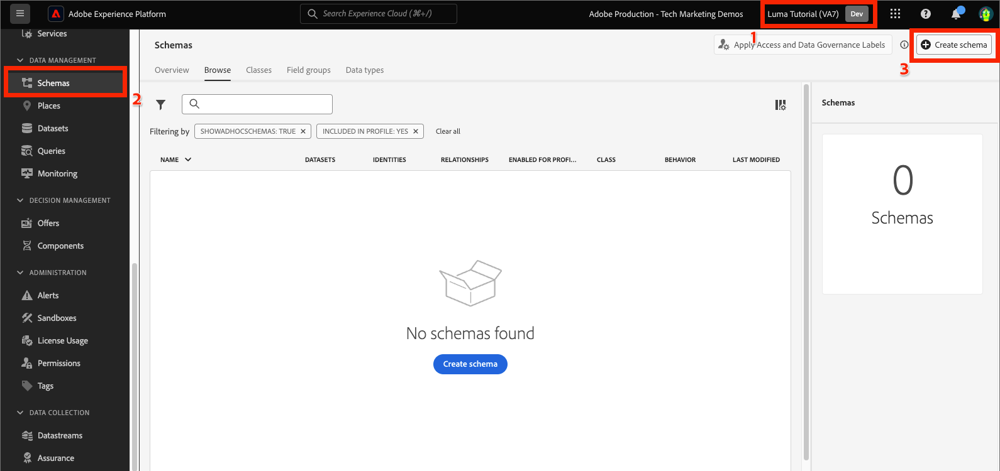

1. 「スキーマを作成」ワークフローで、個々の顧客の属性（ポイント、ステータスなど）をモデル化するので、「**[!UICONTROL 個人プロファイル]**」をスキーマの基本クラスとして選択します。
1. 「**[!UICONTROL 次へ]**」を選択します。
   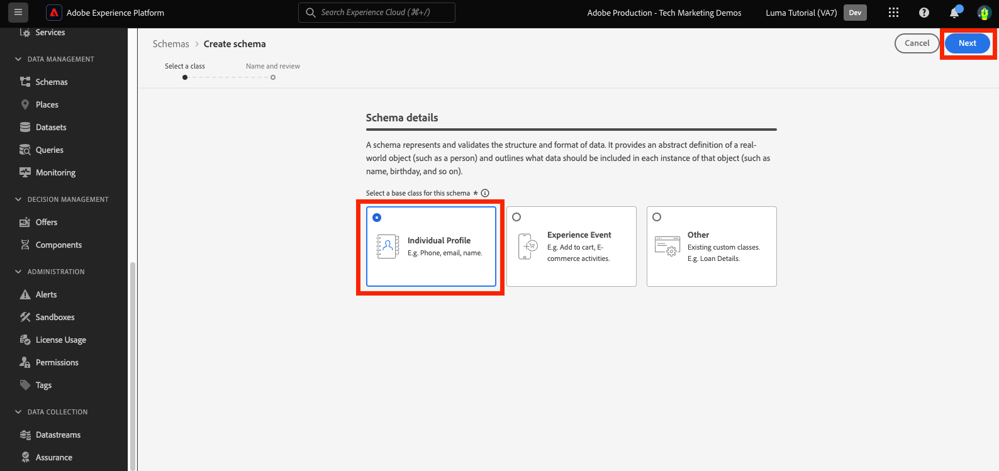

1. 「`Luma Loyalty Schema` スキーマ表示名&#x200B;**[!UICONTROL 」テキストフィールドに「]**」と入力します。 以下のキャンバスでは、選択したクラスによって提供される基本スキーマ構造を確認および検証することもできます。
1. 「**[!UICONTROL 完了]**」を選択して、スキーマを作成します。
   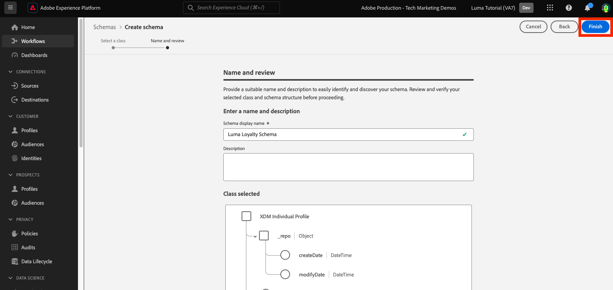

### 標準フィールドグループの追加

スキーマを作成すると、スキーマエディターにリダイレクトされ、スキーマにフィールドを追加できます。 個々のフィールドをスキーマに直接追加することも、フィールドグループを使用することもできます。 すべての個々のフィールドは、引き続きクラスまたはフィールドグループに関連付けられていることに注意してください。 Adobeが提供する業界標準の大規模なフィールドグループから選択するか、独自のフィールドグループを作成できます。 Experience Platformで独自のデータのモデリングを開始する際は、Adobeが提供する業界標準のフィールドグループに慣れておくとよいでしょう。 可能な限り、Customer AI、Attribution AI、Adobe Analyticsなどのダウンストリームサービスを強化する場合があるため、これらのツールを使用することがベストプラクティスとなります。

独自のデータを扱う場合、重要なステップは、Platformでキャプチャする独自のデータと、そのデータをどのようにモデル化するかを決定することです。 この大きなトピックについては、プレイリスト [顧客体験データをXDM](https://experienceleague.adobe.com/ja/playlists/experience-platform-model-your-customer-experience-data-with-xdm)でモデル化するで詳しく説明しています。 このチュートリアルでは、事前に決定されたスキーマの実装について説明します。

フィールドグループを追加するには：

1. 「**[!UICONTROL フィールドグループ]**」見出しの下にある「**[!UICONTROL 追加]**」を選択します。
   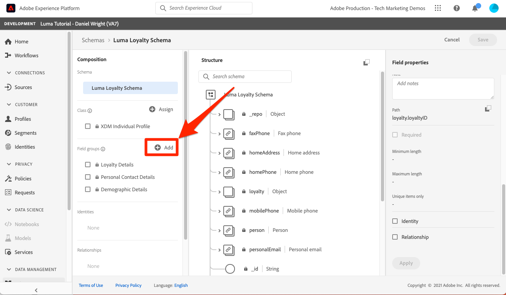
1. **[!UICONTROL フィールドグループを追加]** モーダルで、次のフィールドグループを選択します。
   1. 名前や生年月日などの基本的な顧客データの&#x200B;**[!UICONTROL デモグラフィックの詳細]**
   1. 電子メールアドレスや電話番号などの基本的な連絡先の詳細については、**[!UICONTROL 個人連絡先の詳細]**
1. 行の右側にあるアイコンを選択すると、フィールドグループに投稿されたフィールドをプレビューできます。
   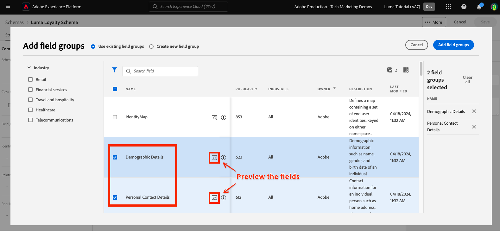

1. 業界固有のフィールドグループを表示するには、**[!UICONTROL 業界]** > **[!UICONTROL 小売]** ボックスをオンにします。
1. 「**[!UICONTROL ロイヤルティの詳細]**」を選択して、ロイヤルティプログラムのフィールドを追加します。
1. **[!UICONTROL フィールドグループを追加]**&#x200B;を選択して、3つのフィールドグループをすべてスキーマに追加します。
   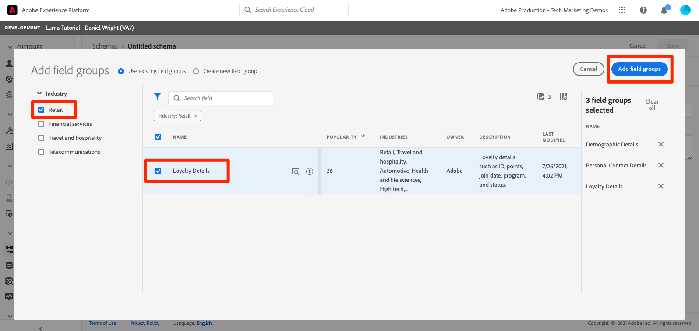


時間をかけて、スキーマの現状を探ります。 フィールドグループには、人物、連絡先の詳細、ロイヤルティプログラムのステータスに関連する標準フィールドが追加されています。 これらの2つのフィールドグループは、自社データのスキーマを作成する際に役立ちます。 特定のフィールドグループ行を選択するか、フィールドグループ名の横にあるボックスをオンにして、ビジュアライゼーションがどのように変化するかを確認します。

スキーマを保存するには、**[!UICONTROL 保存]**&#x200B;を選択します。
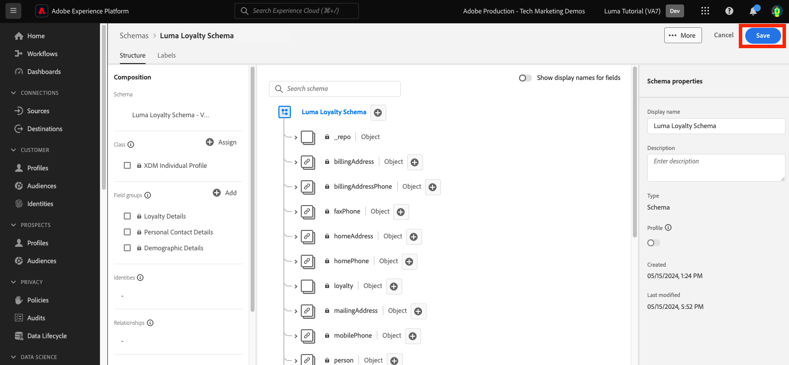

>[!NOTE]
>
>フィールドグループが、収集しないデータポイントのフィールドを追加しても問題ありません。 例えば、「faxPhone」は、Lumaがデータを収集しないフィールドです。 構いません。 スキーマでフィールドが定義されているからといって、そのフィールドのデータを後で&#x200B;*取り込む必要はありません。* スキーマからフィールドを削除することもできます。

### カスタムフィールドグループの追加

次に、カスタムフィールドグループを作成します。

ロイヤルティフィールドグループには`loyaltyID` フィールドが含まれていますが、Lumaでは、スキーマ全体の一貫性を確保するために、すべてのシステム識別子を1つのグループで管理したいと考えています。

フィールドグループは、スキーマワークフローで作成する必要があります。 以下のいずれかを実行できます。

* 最初にスキーマに新しいカスタムフィールドを追加し、次にカスタムフィールドグループを作成するか、
* まずカスタムフィールドグループを作成し、そこにフィールドを追加します。

このチュートリアルでは、まずカスタムフィールドグループを作成します。

フィールドグループを作成するには：

1. 「**[!UICONTROL スキーマフィールドグループ]**」見出しの「**[!UICONTROL 追加]**」を選択します
   
1. **[!UICONTROL 新しいフィールドグループを作成]**&#x200B;を選択
1. `Luma Identity profile field group`を&#x200B;**[!UICONTROL 表示名]**&#x200B;として使用
1. `system identifiers for XDM Individual Profile class`を&#x200B;**[!UICONTROL 説明]**&#x200B;として使用
1. **[!UICONTROL フィールドグループを追加]**&#x200B;を選択
   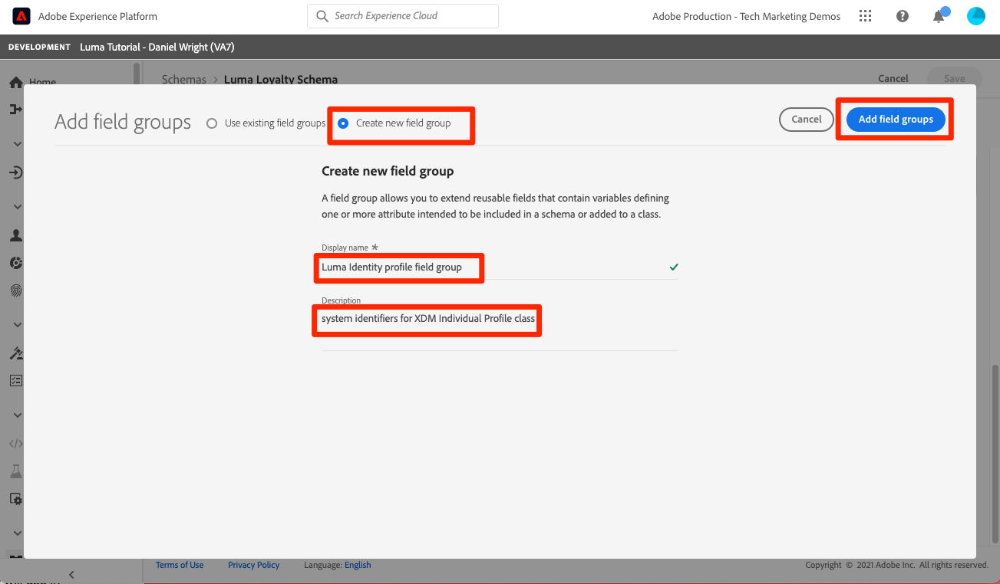

新しい空のフィールドグループがスキーマに追加されます。 **[!UICONTROL +]** ボタンを使用すると、階層内の任意の場所に新しいフィールドを追加できます。 この場合、ルートレベルにフィールドを追加します。

1. スキーマの名前の横にある&#x200B;**[!UICONTROL +]**&#x200B;を選択します。 これにより、テナント ID名前空間の下に新しいフィールドが追加され、カスタムフィールドと任意の標準フィールドとの間の競合を管理できます。
1. **[!UICONTROL フィールドプロパティ]** サイドバーで、新しいフィールドの詳細を追加します。
   1. **[!UICONTROL フィールド名]**: `systemIdentifier`
   1. **[!UICONTROL 表示名]**: `System Identifier`
   1. **[!UICONTROL タイプ]**: **[!UICONTROL オブジェクト]**
   1. **[!UICONTROL フィールドグループ]** ドロップダウンで、作成した&#x200B;**Luma ID プロファイルフィールフィールドグループ**&#x200B;を選択します。
      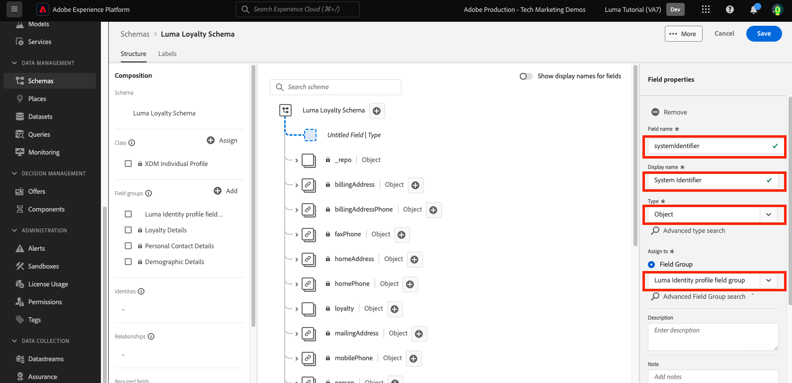
   1. **[!UICONTROL 適用]**&#x200B;を選択
      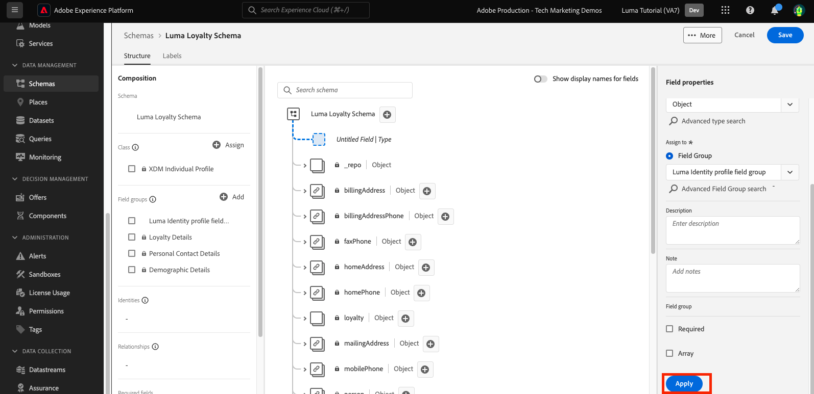

次に、`systemIdentifier` オブジェクトの下に2つのフィールドを追加します。

1. 最初のフィールド
   1. **[!UICONTROL フィールド名]**: `loyaltyId`
   1. **[!UICONTROL 表示名：]** `Loyalty Id`
   1. **[!UICONTROL Type]**: **[!UICONTROL 文字列]**
1. 2番目のフィールド
   1. **[!UICONTROL フィールド名]**: `crmId`
   1. **[!UICONTROL 表示名]**: `CRM Id`
   1. **[!UICONTROL Type]**: **[!UICONTROL 文字列]**

新しいフィールドグループは次のようになります。 「**[!UICONTROL 保存]**」ボタンを選択してスキーマを保存しますが、次の演習のためにスキーマを開いたままにしておきます。
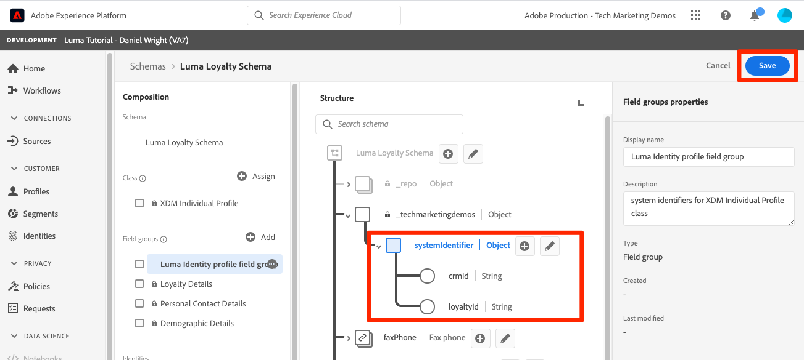

## データタイプの作成

新しい`Luma Identity profile field group`などのフィールドグループは、他のスキーマで再利用できるため、複数のシステムにわたって標準データ定義を適用できます。 ただし、クラスを共有するスキーマ内の&#x200B;_のみ再利用できます（この場合はXDM個人プロファイルクラス）。_

データタイプは、複数のクラス _をまたいでスキーマ_&#x200B;で再利用できる別のマルチフィールド構造です。 新しい`systemIdentifier` オブジェクトをデータ型に変換します。

`Luma Loyalty Schema`を開いたまま、`systemIdentifier` オブジェクトを選択し、**[!UICONTROL 新しいデータタイプに変換]**&#x200B;を選択します

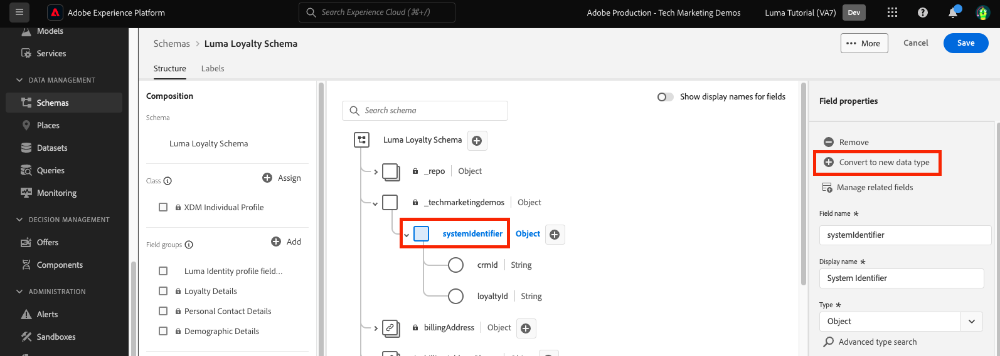

スキーマから&#x200B;**[!UICONTROL キャンセル]**&#x200B;し、**[!UICONTROL データタイプ]** タブに移動すると、新しく作成したデータタイプが表示されます。 このデータタイプは、レッスンの後半で使用します。

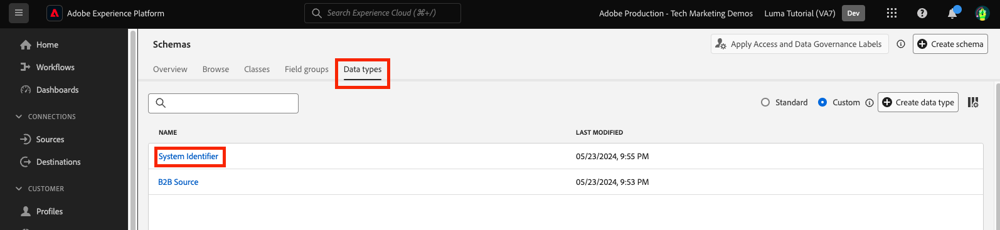


## API経由でのCRM スキーマの作成

次に、APIを使用してスキーマを作成します。

>[!TIP]
>
> APIの演習をスキップする場合は、ユーザーインターフェイスメソッドを使用して次のスキーマを作成できます。
>
> 1. [!UICONTROL 個人プロファイル &#x200B;] クラスの使用
> 1. 名前を`Luma CRM Schema`
> 1. デモグラフィックの詳細、個人の連絡先の詳細、Luma ID プロファイルフィールドグループのフィールドグループを使用します

まず、空のスキーマを作成します。

1. [!DNL Postman]を開
1. アクセストークンがない場合は、リクエスト **[!DNL OAuth: Request Access Token]**&#x200B;を開き、**送信**&#x200B;を選択して新しいアクセストークンをリクエストします。
1. 環境変数を開き、**CONTAINER_ID**&#x200B;の値を`global`から`tenant`に変更します。 スキーマの作成など、Platformで独自のカスタム要素を操作する場合は、`tenant`を使用する必要があります。
1. **保存**&#x200B;を選択
   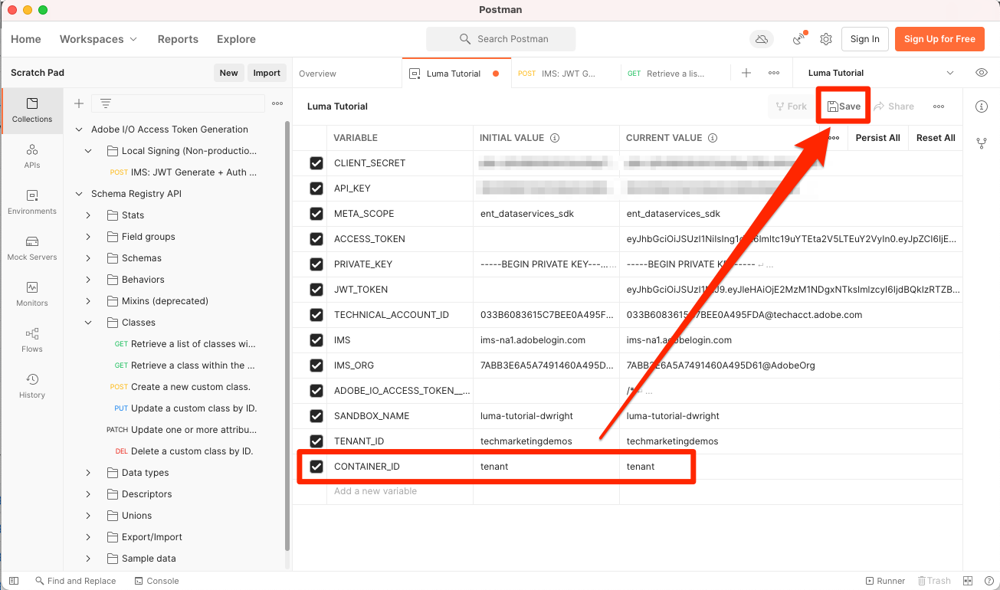に変更します
1. リクエスト **[!DNL Schema Registry API > Schemas > Create a new custom schema.]**&#x200B;を開きます
1. 「**Body**」タブを開き、次のコードを貼り付け、**Send**&#x200B;を選択してAPI呼び出しを行います。 この呼び出しは、同じ`XDM Individual Profile`基本クラスを使用して新しいスキーマを作成します。

   ```json
   {
     "type": "object",
     "title": "Luma CRM Schema",
     "description": "Schema for CRM data of Luma Retail ",
     "allOf": [{
       "$ref": "https://ns.adobe.com/xdm/context/profile"
     }]
   }
   ```

   >[!NOTE]
   >
   >この以降のコードサンプル（例：`https://ns.adobe.com/xdm/context/profile`）の名前空間参照は、**[!DNL CONTAINER_ID]**&#x200B;を使用してリスト API呼び出しを使用し、正しい値に設定されたヘッダーを受け入れることで取得できます。 ユーザーインターフェイスで簡単にアクセスできるものもあります。

1. `201 Created`件の応答が返されます
1. 応答本文から`meta:altId`をコピーします。 後で別の演習で使用します。
   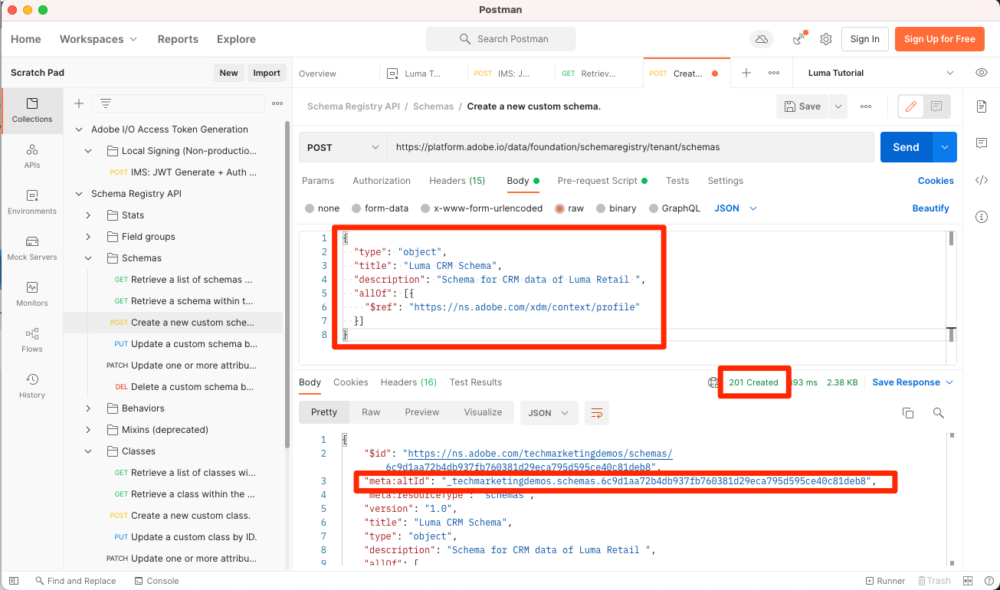

1. 新しいスキーマは、ユーザーインターフェイスでは表示されますが、フィールドグループは表示されません
   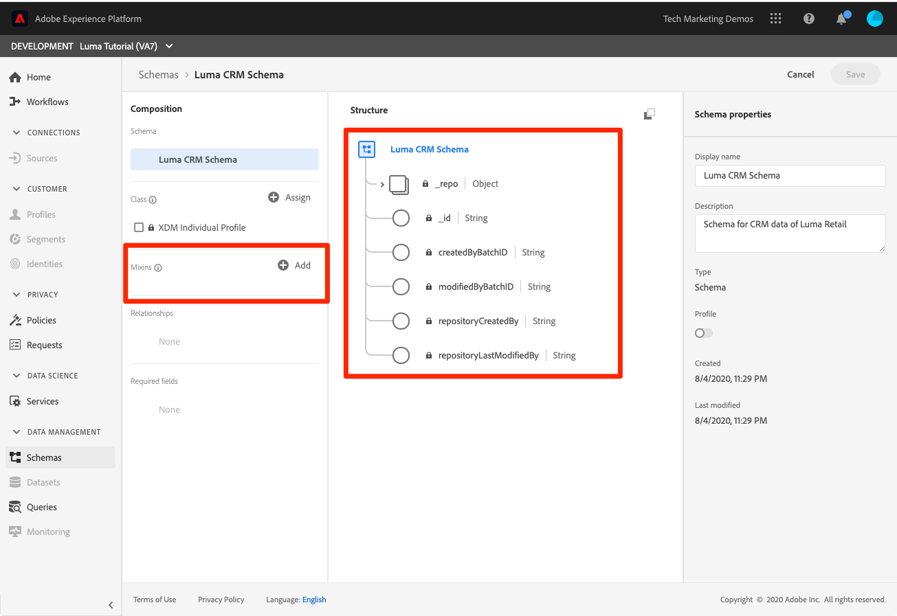

>[!NOTE]
>
> `meta:altId`またはスキーマ IDは、**[!DNL Schema Registry API > Schemas > Retrieve a list of schemas within the specified container.]** CONTAINER_ID **[!UICONTROL が]**&#x200B;に設定され、受け入れヘッダー`tenant`が設定されたAPI リクエスト `application/vnd.adobe.xdm+json`を行うことでも取得できます。

>[!TIP]
>
> この呼び出しに関する一般的な問題と、考えられる修正：
>
> * 認証トークンがありません：**OAuth: アクセストークンを要求**&#x200B;要求を実行して、新しいトークンを生成します
> * `401: Not Authorized to PUT/POST/PATCH/DELETE for this path : /global/schemas/`: **CONTAINER_ID**&#x200B;環境変数を`global`から`tenant`に更新します
> * `403: PALM Access Denied. POST access is denied for this resource from access control`: Admin Consoleでユーザー権限を確認します

### 標準フィールドグループの追加

次に、フィールドグループをスキーマに追加します。

1. [!DNL Postman]で、リクエスト **[!DNL Schema Registry API > Schemas > Update one or more attributes of a custom schema specified by ID.]**&#x200B;を開きます
1. 「**パラメーター**」タブに、以前の応答の`meta:altId`値を`SCHEMA_ID`として貼り付けます
1. 「Body」タブを開き、次のコードを貼り付け、**Send**&#x200B;を選択してAPI呼び出しを行います。 この呼び出しにより、標準フィールドグループが`Luma CRM Schema`に追加されます。

   ```json
   [{
       "op": "add",
       "path": "/allOf/-",
       "value": {
         "$ref": "https://ns.adobe.com/xdm/context/profile-personal-details"
       }
     },
     {
       "op": "add",
       "path": "/allOf/-",
       "value": {
         "$ref": "https://ns.adobe.com/xdm/context/profile-person-details"
       }
     }
   ]
   ```

1. 応答のステータスは200 OKで、フィールドグループはUIのスキーマの一部として表示されます

   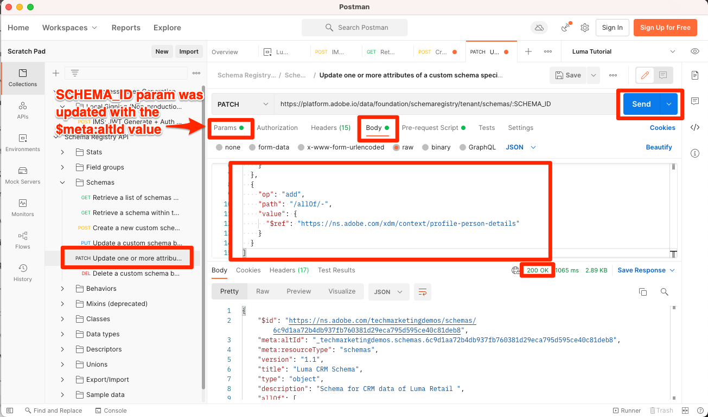


### カスタムフィールドグループを追加

次に、`Luma Identity profile field group`をスキーマに追加します。 まず、リスト APIを使用して、新しいフィールドグループのIDを見つける必要があります。

1. リクエスト **[!DNL Schema Registry API > Field groups > Retrieve a list of field groups within the specified container.]**&#x200B;を開きます
1. アカウント内のすべてのカスタムフィールドグループのリストを取得するには、**送信** ボタンを選択します
1. `$id`の`Luma Identity profile field group`値を取得します（このスクリーンショットの値とは異なります）
   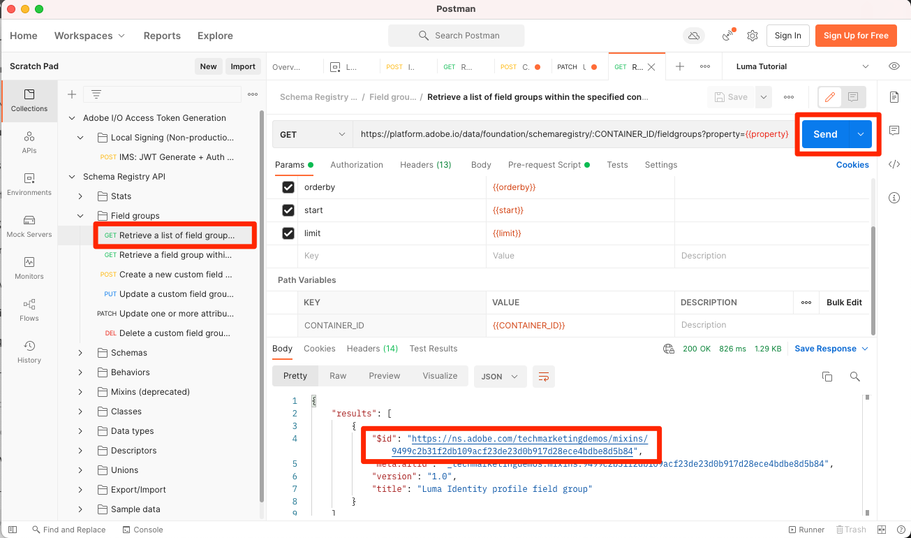
1. リクエスト **[!DNL Schema Registry API > Schemas > Update one or more attributes of a custom schema specified by ID.]**&#x200B;をもう一度開きます
1. **パラメーター** タブには、スキーマの`$id`が残っている必要があります
1. 「**Body**」タブを開き、次のコードを貼り付けて、`$ref`値を自分の`$id`の`Luma Identity profile field group`に置き換えます。

   ```json
   [{
     "op": "add",
     "path": "/allOf/-",
     "value": {
       "$ref": "REPLACE_WITH_YOUR_OWN_FIELD_GROUP_ID"
     }
   }]
   ```

1. **送信**&#x200B;を選択
   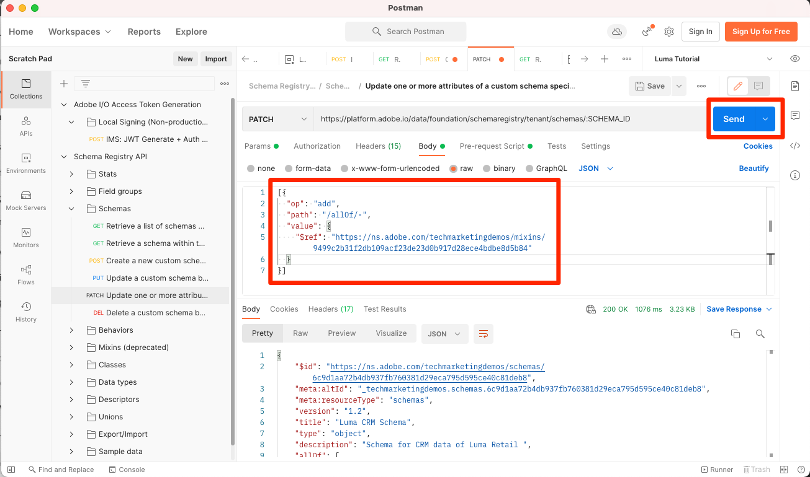

API応答とインターフェイスの両方を確認して、フィールドグループがスキーマに追加されたことを確認します。

## オフライン購入イベントスキーマの作成

次に、Lumaのオフライン購入データ用の&#x200B;**[!UICONTROL Experience Event]** クラスに基づいてスキーマを作成します。 スキーマエディターのユーザーインターフェイスに慣れてきたので、次の手順でスクリーンショットの数を減らします。

1. **[!UICONTROL Experience Event]** クラスを使用してスキーマを作成します。
1. スキーマに`Luma Offline Purchase Events Schema`という名前を付けます。
1. 標準フィールドグループ **[!UICONTROL Commerceの詳細]**&#x200B;を追加して、共通の注文の詳細を取得します。 中のオブジェクトを探索するのに数分を費やしてください。
1. `Luma Identity profile field group`を検索します。 利用できません。 フィールドグループはクラスに関連付けられているので、このスキーマには別のクラスを使用しているので、使用できません。 ID フィールドを含むXDM ExperienceEvent クラスの新しいフィールドグループを追加する必要があります。 データタイプを確認するだけなので非常に簡単です！
1. 「**[!UICONTROL 新しいフィールドグループを作成]**」ラジオボタンを選択
1. **[!UICONTROL 表示名]**&#x200B;を`Luma Identity ExperienceEvent field group`として入力し、**[!UICONTROL フィールドグループを追加]** ボタンを選択します
1. スキーマ名の横にある「**[!UICONTROL +]**」を選択します。
1. **[!UICONTROL フィールド名]**&#x200B;として、`systemIdentifier`と入力します。
1. **[!UICONTROL 表示名]**&#x200B;として、`System Identifier`と入力します。
1. **[!UICONTROL タイプ]**&#x200B;として、以前に作成したカスタムデータタイプである&#x200B;**システム識別子**&#x200B;を選択します。
1. **[!UICONTROL フィールドグループ]**&#x200B;として、**Luma Identity ExperienceEvent フィールドグループ**&#x200B;を選択します。
1. 「**[!UICONTROL 適用]**」ボタンを選択します。
1. 「**[!UICONTROL 保存]**」ボタンを選択します。

データタイプがすべてのフィールドを追加した方法に注意してください。

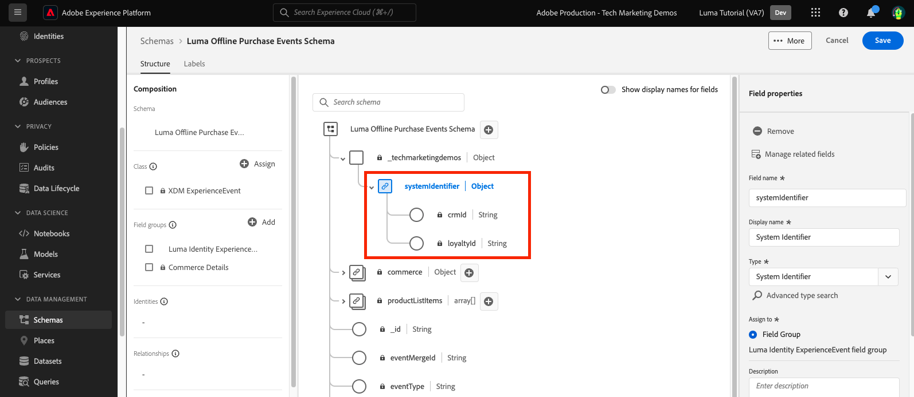

また、**[!UICONTROL Class]**&#x200B;見出しの下の&#x200B;**[!UICONTROL XDM ExperienceEvent]**&#x200B;を選択し、このクラスによって提供されるフィールドの一部を調べます。 XDM ExperienceEvent クラスを使用する場合は、_id フィールドとタイムスタンプフィールドが必要です。これらのフィールドは、このスキーマを使用する際に取り込むレコードごとに入力する必要があります。

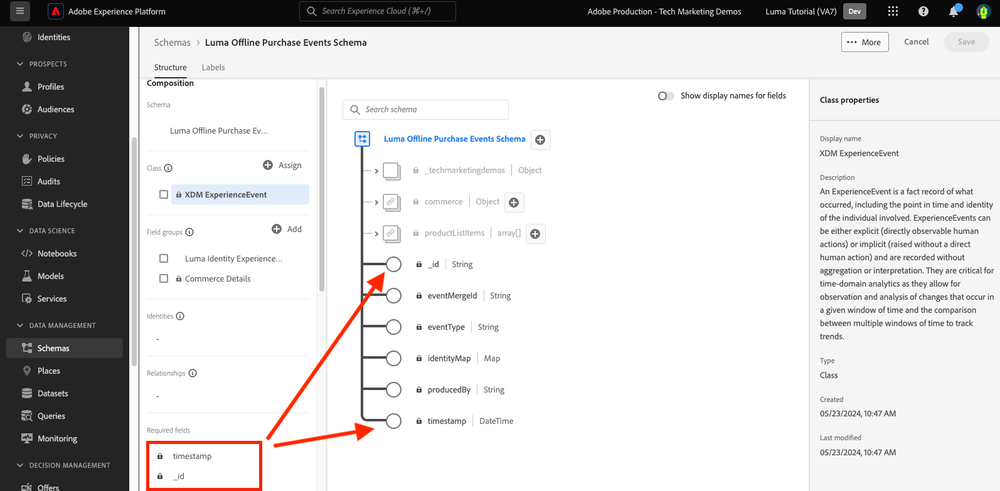

## Web イベントスキーマの作成

次に、Lumaのweb サイトデータ用にもう1つスキーマを作成します。 この時点で、あなたはスキーマの作成の専門家になるはずです。 これらのプロパティを使用して次のスキーマを構築します

| プロパティ | 値 |
|---------------|-----------------|
| クラス | エクスペリエンスイベント |
| スキーマ名 | Luma Web イベントスキーマ |
| フィールドグループ | AEP Web SDK ExperienceEvent |
| フィールドグループ | 消費者体験イベント |

「**[!UICONTROL 消費者エクスペリエンスイベント]**」フィールドグループを選択します。 このフィールドグループには、[!UICONTROL Commerce Details]にも存在するcommerceおよびproductListItems オブジェクトが含まれています。 実際[!UICONTROL 消費者体験イベント &#x200B;]は、他のいくつかの標準フィールドグループを組み合わせたもので、個別に利用することもできます。 [!UICONTROL AEP Web SDK ExperienceEvent] フィールドグループには、他のフィールドグループも含まれています。これには、[!UICONTROL &#x200B; コンシューマーエクスペリエンスイベント &#x200B;]の同じフィールドグループも含まれます。 幸いなことに、シームレスに連携できます。

このスキーマに`Luma Identity ExperienceEvent field group`を追加していないことに注意してください。 Web SDKでは、IDを収集する方法が異なるためです。 スキーマエディターの&#x200B;**[!UICONTROL コンポジション]** セクションで&#x200B;**[!UICONTROL XDM ExperienceEvent]** クラスを選択すると、デフォルトで追加されるフィールドの1つが&#x200B;**[!UICONTROL IdentityMap]**&#x200B;と呼ばれることがわかります。 [!DNL IdentityMap]は、様々なAdobe アプリケーションでPlatformにリンクするために使用されます。 ストリーミング取り込みレッスンのidentityMapを介してIDがPlatformに送信される方法を確認できます。


## 製品カタログスキーマの作成

[!UICONTROL Commerce Details]および[!UICONTROL Consumer Experience Event] フィールドグループを使用すると、Lumaは標準のproductListItems データタイプを介して製品関連イベントの詳細をレポートします。 さらに、商品詳細フィールドを追加してPlatformに送信することもできます。 Lumaは、POS システムやe コマースシステムでこれらのフィールドをすべて取得するのではなく、商品カタログシステムから直接フィールドを取り込むことを好みます。 「スキーマ関係」を使用すると、分類または参照の目的で2つのスキーマ間の関係を定義できます。 Lumaは、製品詳細を分類するために関係を使用します。 今からプロセスを開始し、次のレッスンの終わりに完了します。

>[!NOTE]
>
>既存のAnalyticsまたはTargetのお客様の場合、スキーマ関係を持つエンティティを分類することは、SAINTの分類に類似するか、商品カタログをRecommendationsにアップロードすることになります

まず、カスタムクラスを使用して、Luma製品カタログのスキーマを作成する必要があります。

1. 「**[!UICONTROL スキーマを作成]**」ボタンを選択します。
1. スキーマを作成ワークフローで、「**[!UICONTROL その他]**」オプションを選択します。
   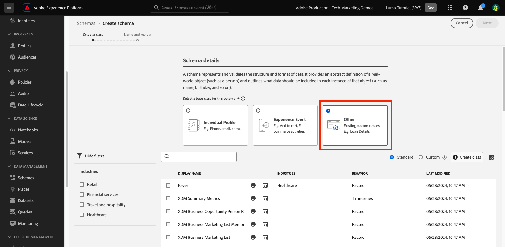
1. 「**[!UICONTROL クラスを作成]**」ボタンを選択します
1. 名前を`Luma Product Catalog Class`
1. **[!UICONTROL ビヘイビアー]**&#x200B;を&#x200B;**[!UICONTROL レコード]**&#x200B;のままにする
1. 「**[!UICONTROL 作成]**」ボタンを選択します。
   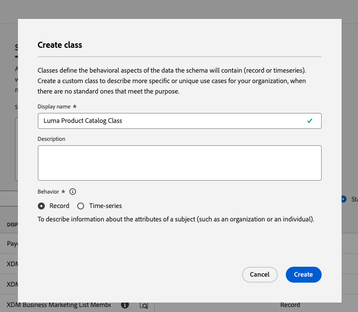
1. 作成した&#x200B;**Luma製品カタログクラス**&#x200B;は、以下のクラステーブルに表示されます。 クラスが選択されていることを確認し、**[!UICONTROL 次へ]**&#x200B;を選択します。
   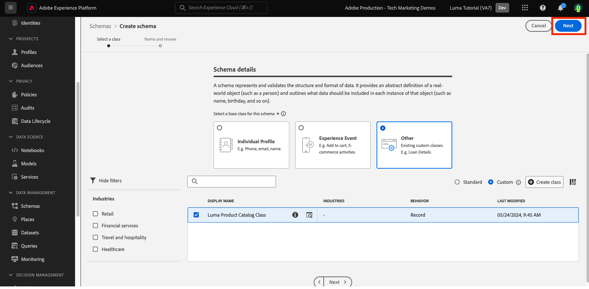
1. スキーマに`Luma Product Catalog Schema`という名前を付けます。
1. 次のフィールドを持つ[!UICONTROL という新しい] フィールドグループ `Luma Product Catalog field group`を作成します。
   1. productName：製品名：文字列
   1. productCategory：製品カテゴリ：文字列
   1. productColor：製品カラー：文字列
   1. productSku：製品SKU：文字列|必須
   1. productSize：製品サイズ：文字列
   1. productPrice：製品価格：ダブル
1. **[!UICONTROL スキーマを保存]**

新しいスキーマはこのようになります。 `productSku` フィールドが「[!UICONTROL 必須フィールド &#x200B;]」セクションに一覧表示される方法に注意してください。
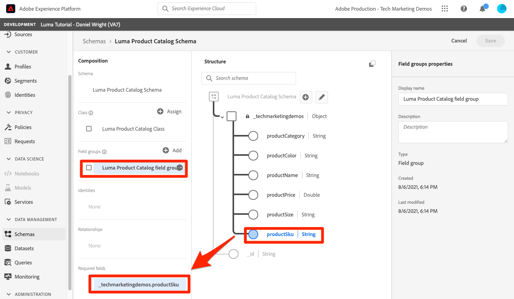

次のステップは、2つのExperienceEvent スキーマと`Luma Product Catalog Schema`の関係を定義することですが、これを行う前に次のレッスンで行う必要がある追加のステップがいくつかあります。


## その他のリソース

* [Experience Data Model （XDM） システムのドキュメント &#x200B;](https://experienceleague.adobe.com/docs/experience-platform/xdm/home.html?lang=ja)
* [スキーマレジストリ API](https://www.adobe.io/experience-platform-apis/references/schema-registry/)


スキーマが完成したので、[IDをマッピング &#x200B;](map-identities.md)できます。
