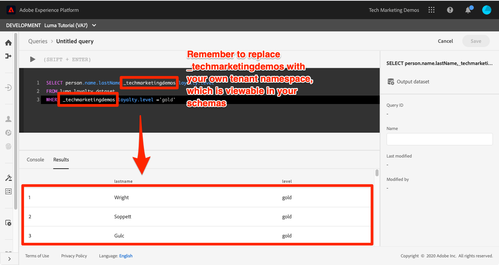

# クエリの実行

<!-- 15 min-->
このレッスンでは、クエリを設定、記述、実行して、取り込んだデータを検証する方法を学びます。

Adobe Experience Platform クエリサービスは、標準の SQL を使用して Platform でデータに対してクエリを実行できるようにすることで、データを把握するのに役立ちます。 クエリサービスを使用すると、データレイク内のデータセットを結合したり、クエリ結果を新しいデータセットとして取得したりして、レポートや機械学習で使用したり、リアルタイム顧客プロファイルに取り込んだりできます。

**データアーキテクト** と **データエンジニア** は、このチュートリアル以外でクエリサービスを使用する必要があります。

演習を開始する前に、この短いビデオを視聴してクエリサービスの詳細を確認してください。
>[!VIDEO](https://video.tv.adobe.com/v/35089?learn=on&enablevpops&captions=jpn)

## 必要な権限

[&#x200B; 権限の設定 &#x200B;](configure-permissions.md) レッスンでは、このレッスンを完了するために必要なすべてのアクセス制御を設定します。

<!-- Settings > **[!UICONTROL Services]** > **[!UICONTROL Query Service]**
* Permission items Data Management > **[!UICONTROL View Datasets]** and  **[!UICONTROL Manage Datasets]**
* Permission item Sandboxes > `Luma Tutorial`
* User-role access to the `Luma Tutorial Platform` product profile
-->

## 単純なクエリ

それでは、いくつかの単純なクエリから始めましょう。

1. Platform ユーザーインターフェイスの左側のナビゲーションで、**クエリ** に移動します
1. 右上の **クエリを作成** ボタンを選択して、クエリを実行および実行するテキストボックスを開きます
1. エディターに次のクエリを入力し、Shift + Enter キーまたは Shift + Return キーを押してクエリを実行します。

   ```
   SHOW TABLES
   ```

1. 使用可能なテーブルのリストが表示されます

   


1. 次に、このクエリを試して、`_techmarketingdemos` を独自のテナント名前空間に置き換えます。この名前空間は、思い出すと、スキーマに表示されます。

   ```
   SELECT person.name.lastName,loyalty.tier
   FROM luma_loyalty_dataset
   WHERE loyalty.tier ='gold'
   ```

   

1. エラーが発生した場合は、次の図のように、詳細なメッセージが **[!UICONTROL コンソール]** タブに表示されます
   

1. 正常に完了したクエリでは、**[!UICONTROL Name]** が `Luma Gold Level Customers` されます
1. 「**[!UICONTROL 保存]** ボタンを選択します
   


<!--SELECT COUNT(DISTINCT (_techmarketingdemos.systemIdentifier.loyaltyId)) FROM luma_loyalty_dataset 


SELECT _techmarketingdemos.systemIdentifier.loyaltyId, COUNT(_techmarketingdemos.systemIdentifier.loyaltyId)
FROM luma_loyalty_dataset 
GROUP BY _techmarketingdemos.systemIdentifier.loyaltyId
HAVING COUNT(_techmarketingdemos.systemIdentifier.loyaltyId) > 1;-->

## 追加の演習

クエリサービスの演習は、後日チュートリアルに追加される予定です。
<!--
## Join Datasets

In this exercise, we will join two datasets `Luma Loyalty Dataset` and `Luma Offline Purchase` to get list of gold customers who have spend over $500 dollars in one purchase.

1. Create a new query
1. Copy and paste following query in query editor and execute, again replacing `_techmarketingdemos` with your own tenant namespace
    
    ```
    SELECT DISTINCT lopd.commerce.order.purchaseID as PurchaseId ,
        lld.person.name.firstName as LastName ,
        lld.person.name.lastName as LastName ,
        lopd.personalEmail.address as email,
        lopd.commerce.order.priceTotal as Total

    FROM luma_loyalty_dataset lld
    JOIN luma_offline_purchase_event_dataset lopd
    ON lopd._techmarketingdemos.systemIdentifier.loyaltyId = lld._techmarketingdemos.systemIdentifier.loyaltyId

    WHERE lld._techmarketingdemos.loyalty.level ='gold' AND lopd.commerce.order.priceTotal >500;
    ```

1. You should get list of Gold Customers who have spend over $500 in single purchase.

## Output datasets

1. Select on Output Dataset button
1. Provide name and description to the dataset
1. Save.
1. Go to **Datasets** under **Data Management** to find new dataset created.

-->
<!--Add content for Adobe Defined Functions-->

## その他のリソース

* [&#x200B; クエリサービスドキュメント &#x200B;](https://experienceleague.adobe.com/docs/experience-platform/query/home.html?lang=ja)
* [&#x200B; クエリサービス API リファレンス &#x200B;](https://www.adobe.io/experience-platform-apis/references/query-service/)

最後の実践レッスンとして、[&#x200B; セグメントの作成 &#x200B;](build-segments.md) を行います。
