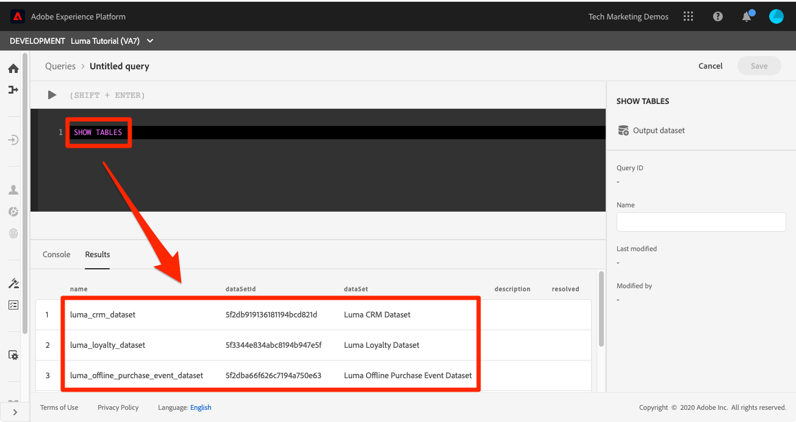
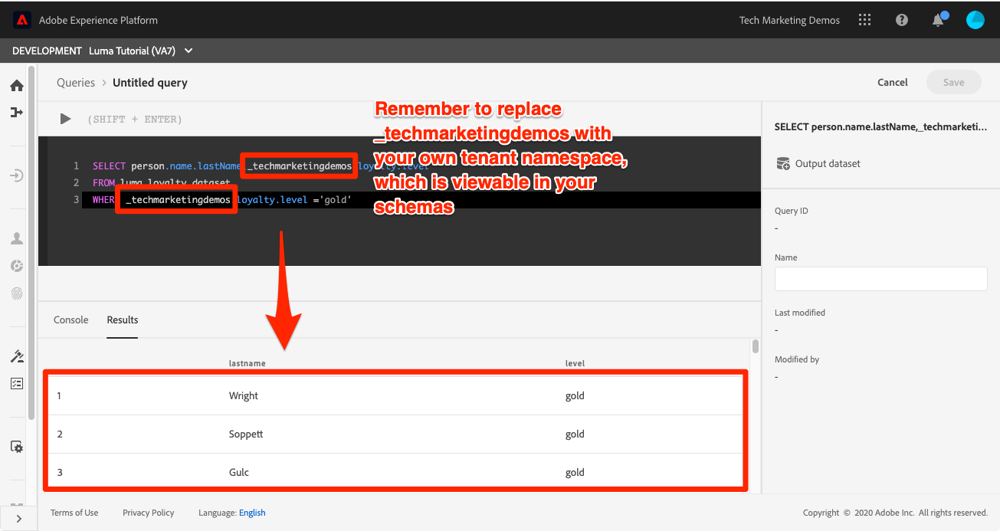
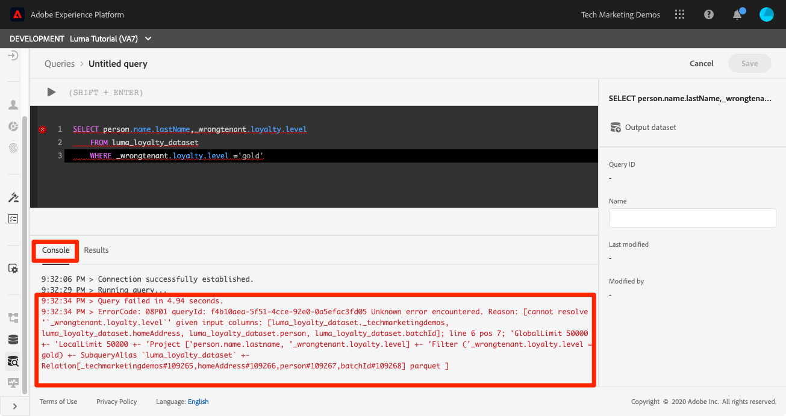
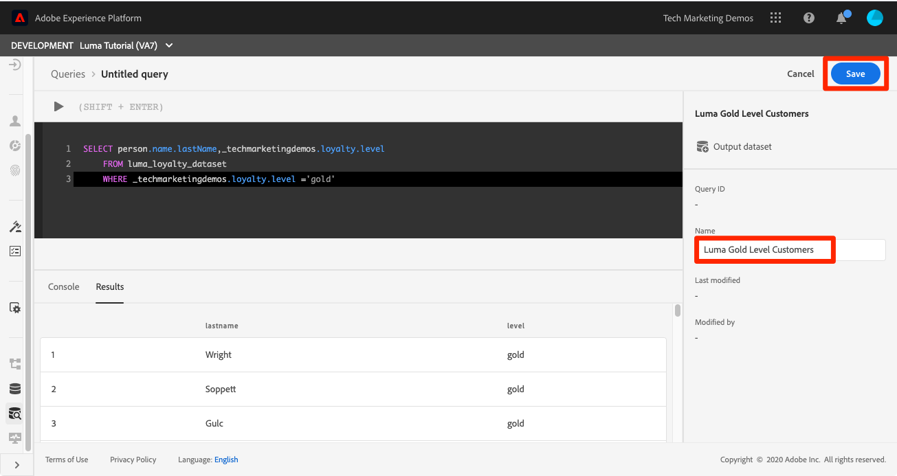

# クエリの実行

<!-- 15 min-->
このレッスンでは、取り込んだデータを検証するためにクエリを設定、記述、実行する方法について説明します。

Adobe Experience Platform Query Serviceでは、標準のSQLを使用してPlatformでデータをクエリできるため、データを正確に理解できます。 Query Serviceを使用すると、データレイク内の任意のデータセットを結合し、クエリの結果を新しいデータセットとして取得して、レポートやマシンラーニングで使用したり、リアルタイム顧客プロファイルに取り込んだりできます。

**データアーキテクト**&#x200B;および&#x200B;**データエンジニア**&#x200B;は、このチュートリアル以外でクエリサービスを使用する必要があります。

この演習を開始する前に、この短いビデオでクエリサービスの詳細をご覧ください。
>[!VIDEO](https://video.tv.adobe.com/v/29795?learn=on&enablevpops)

## 権限が必要です

[権限の設定](configure-permissions.md) レッスンでは、このレッスンを完了するために必要なすべてのアクセス制御を設定します。

<!-- 
Settings > **[!UICONTROL Services]** > **[!UICONTROL Query Service]**
* Permission items Data Management > **[!UICONTROL View Datasets]** and  **[!UICONTROL Manage Datasets]**
* Permission item Sandboxes > `Luma Tutorial`
* User-role access to the `Luma Tutorial Platform` product profile
-->

## シンプルなクエリ

簡単な質問から始めましょう。

1. Platform ユーザーインターフェイスで、左側のナビゲーションの&#x200B;**クエリ**&#x200B;に移動します
1. 右上の「**クエリを作成**」ボタンを選択して、クエリを実行および実行するためのテキストボックスを開きます
1. エディターで次のクエリを入力し、Shift + Enter キーまたはShift + Return キーを押してクエリを実行します。

   ```
   SHOW TABLES
   ```

1. 使用可能なテーブルのリストが表示されます

   


1. 次に、このクエリを試して、`_techmarketingdemos`を独自のテナント名前空間に置き換えます。覚えておくと、スキーマに表示されます。

   ```
   SELECT person.name.lastName,loyalty.tier
   FROM luma_loyalty_dataset
   WHERE loyalty.tier ='gold'
   ```

   

1. エラーが発生した場合、以下の図のように、**[!UICONTROL コンソール]** タブに詳細なメッセージが表示されます
   

1. 正常なクエリを実行すると、**[!UICONTROL 名前]**&#x200B;が`Luma Gold Level Customers`になります
1. 「**[!UICONTROL 保存]**」ボタンを選択します
   


<!--
SELECT COUNT(DISTINCT (_techmarketingdemos.systemIdentifier.loyaltyId)) FROM luma_loyalty_dataset 


SELECT _techmarketingdemos.systemIdentifier.loyaltyId, COUNT(_techmarketingdemos.systemIdentifier.loyaltyId)
FROM luma_loyalty_dataset 
GROUP BY _techmarketingdemos.systemIdentifier.loyaltyId
HAVING COUNT(_techmarketingdemos.systemIdentifier.loyaltyId) > 1;
-->

## その他の演習

後日、追加のクエリサービス演習がチュートリアルに追加されます。
<!--
## Join Datasets

In this exercise, we will join two datasets `Luma Loyalty Dataset` and `Luma Offline Purchase` to get list of gold customers who have spend over $500 dollars in one purchase.

1. Create a new query
1. Copy and paste following query in query editor and execute, again replacing `_techmarketingdemos` with your own tenant namespace
    
    ```
    SELECT DISTINCT lopd.commerce.order.purchaseID as PurchaseId ,
        lld.person.name.firstName as LastName ,
        lld.person.name.lastName as LastName ,
        lopd.personalEmail.address as email,
        lopd.commerce.order.priceTotal as Total

    FROM luma_loyalty_dataset lld
    JOIN luma_offline_purchase_event_dataset lopd
    ON lopd._techmarketingdemos.systemIdentifier.loyaltyId = lld._techmarketingdemos.systemIdentifier.loyaltyId

    WHERE lld._techmarketingdemos.loyalty.level ='gold' AND lopd.commerce.order.priceTotal >500;
    ```

1. You should get list of Gold Customers who have spend over $500 in single purchase.

## Output datasets

1. Select on Output Dataset button
1. Provide name and description to the dataset
1. Save.
1. Go to **Datasets** under **Data Management** to find new dataset created.

-->
<!--Add content for Adobe Defined Functions-->

## その他のリソース

* [ クエリサービスのドキュメント ](https://experienceleague.adobe.com/docs/experience-platform/query/home.html?lang=ja)
* [ クエリサービス API リファレンス ](https://www.adobe.io/experience-platform-apis/references/query-service/)

最後の実践レッスンは、[ セグメントの作成](build-segments.md)です。
