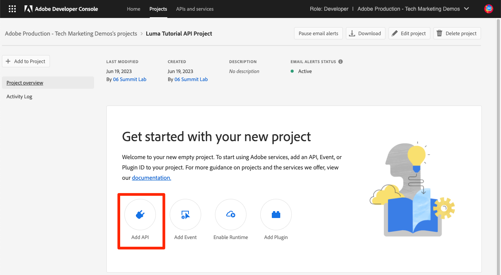
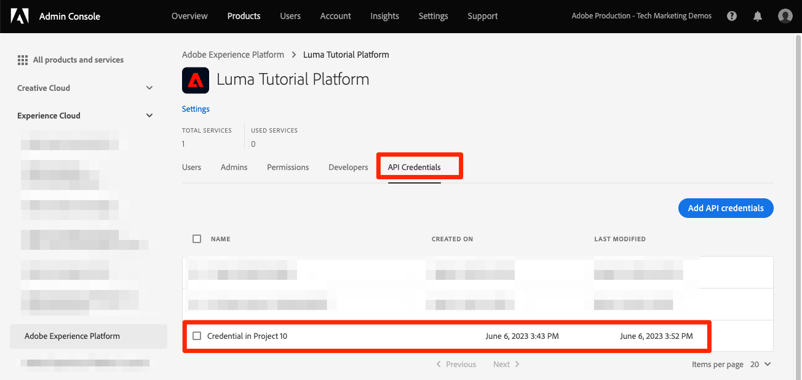

# 開発者コンソールの設定および [!DNL Postman]

<!--30min-->

このレッスンでは、Adobe Developer Console でプロジェクトを設定し、ダウンロードします [!DNL Postman] コレクションを作成して、Platform API の使用を開始できるようにします。

このチュートリアルの API の演習を完了するには、 [お使いのオペレーティングシステム用のPostmanアプリをダウンロードします。](https://www.postman.com/downloads/) Experience PlatformAPI を使用するためには必要ありませんが、Postmanでは API ワークフローが容易になります。Adobe Experience Platformでは、API 呼び出しの実行とその動作方法の学習に役立つ、数十のPostmanコレクションが提供されています。 このチュートリアルの残りの部分では、Postmanの操作に関する知識を前提としています。 不明な点は、 [Postmanドキュメント](https://learning.postman.com/).

Platform は、API を使用して最初に構築されます。 すべての主要タスクに対してインターフェイスオプションも存在しますが、ある時点で Platform API を使用する必要が生じる場合があります。 例えば、データを取り込むには、サンドボックス間で項目を移動したり、ルーチンタスクを自動化したり、ユーザーインターフェイスが構築される前に新しい Platform 機能を使用したりします。

**データアーキテクト** および **データエンジニア** このチュートリアル以外で、Platform API を使用する必要が生じる場合があります。

## 必要な権限

内 [権限の設定](configure-permissions.md) レッスンでは、このレッスンを完了するために必要なすべてのアクセス制御を設定します。

<!--
* Permission item Sandboxes > `Luma Tutorial`
* Developer-role access to the `Luma Tutorial Platform` product profile
-->

## Adobe Developer Console の設定

Adobe Developerコンソールは、AdobeAPI および SDK へのアクセス、ほぼリアルタイムのイベントのリッスン、Runtime での関数の実行、App Builder アプリのビルドをおこなう開発者の宛先です。 この変数を使用してExperience PlatformAPI にアクセスします。 詳しくは、 [Adobe Developer Console ドキュメント](https://www.adobe.io/apis/experienceplatform/console/docs.html)

1. ローカルマシン上に、という名前のフォルダーを作成します。 `Luma Tutorial Assets` 」を参照してください。

1. を開きます。 [Adobe Developer Console](https://console.adobe.io)

1. ログインし、正しい組織に属していることを確認します。

1. 選択 **[!UICONTROL 新規プロジェクトを作成]** in [!UICONTROL クイックスタート] メニュー

   

1. 新しく作成されたプロジェクトで、 **[!UICONTROL プロジェクトに追加]** ボタンをクリックし、 **[!UICONTROL API]**

   

1. 選択してリストをフィルター **[!UICONTROL Adobe Experience Platform]**

1. 使用可能な API のリストで、 **[!UICONTROL Experience PlatformAPI]** を選択し、 **[!UICONTROL 次へ]**.

   

1. のような外部システムからの認証用 [!DNL Postman]の場合、公開鍵と秘密鍵のペアが必要です。 新しいキーペアを生成するには、「 」を選択します。 **[!UICONTROL オプション 1]**  をクリックし、 **[!UICONTROL キーペアを生成]** ボタン

   

1. キーの準備が整ったら、ローカルマシンにキーをダウンロードするように求められる場合があります。 にパッケージ化されたキーを保存します。 `config.zip` フォルダーに `Luma Tutorial Assets`. 次の演習では、これらが必要になります。

1. キーが生成されると、スクリーンショットに示すように、公開鍵がプロジェクトに自動的に追加されます。 を選択します。 **[!UICONTROL 次へ]** 」ボタンをクリックします。

   

1. を選択します。 `Luma Tutorial Platform` 製品プロファイルを選択し、 **[!UICONTROL 設定済み API を保存]** ボタン

   

1. これで、開発者コンソールプロジェクトが作成されました。

1. 内 **[!UICONTROL 試す]** 「 」セクションで、「 」を選択します。 **[!UICONTROL Postman用のダウンロード]** 次に、 **[!UICONTROL サービスアカウント (JWT)]** をダウンロードするには [!DNL Postman] 環境 json ファイル。 保存する `service.postman_environment.json` の `Luma Tutorial Assets` フォルダー。

   

   >[!NOTE]
   >
   >組織のシステム管理者は、プロジェクトをAdmin Consoleの製品プロファイルで「API 資格情報」として表示できます
   >
   >

プロジェクトに番号が割り当てられていることに気付いたかもしれません（例：「Project 12」）。

1. パンくずリストでプロジェクト番号を選択
1. を選択します。 **[!UICONTROL プロジェクトを編集]** ボタン
1. を **[!UICONTROL プロジェクトタイトル]** から `Luma Tutorial API Project` （会社の複数の担当者がこのチュートリアルを受け取る場合は、名前を末尾に追加します）
1. を選択します。 **[!UICONTROL 保存]** ボタン

   

## Postmanの設定

>[!CAUTION]
>
>Postmanインターフェイスは定期的に更新されます。 このチュートリアルのスクリーンショットは、Postman v9.0.5 for Macで撮影したものですが、インターフェイスオプションが変更された可能性があります。

1. ダウンロードとインストール [[!DNL Postman]](https://www.postman.com/downloads/)
1. 開く [!DNL Postman] ダウンロードした json 環境ファイルをインポートします。 `service.postman_environment.json`
   
1. In [!DNL Postman]、ドロップダウンで環境を選択します

   
1. を選択します。 **目** アイコンをクリックして環境変数を表示します。

   

### 環境名の更新

開発者コンソールから書き出された環境の名前はランダムに生成されるので、説明的な名前を付けてください。そのため、実際の Platform 実装で作業を開始する際に、後で環境を混乱させないようにします。

1. 環境変数画面が開いたまま、「 」を選択します。 **編集** 右上に
1. を更新します。 **環境名** から `Luma Tutorial`
1. 終了 **環境の管理** 次の手順でさらに編集するので、編集モードでモーダルを開きます。

   

### 秘密鍵を追加

次に、 PRIVATE_KEY 値をPostman環境に追加します

1. ダウンロードした `config.zip` ファイルを作成します。 この zip には次の 2 つのファイルが含まれます。
   * `private.key`
   * `certificate_pub.crt`
1. を開きます。 `private.key` ファイルを編集し、コンテンツをコピーします。
1. Postmanで、 **環境の管理** > **編集** 最後の演習から開いたままのモーダルをコピーし、 **PRIVATE_KEY** 内 **初期値** および **現在の値** 列。
1. 選択 **保存**

   

### JWT とアクセストークンの追加

Adobeは、 [!DNL Postman] コレクションを参照してください。Experience Platformの API を調べるのに役立ちます。 これらのコレクションは、 [Adobe Experience Platform Postmanのサンプル GitHub リポジトリ](https://github.com/adobe/experience-platform-postman-samples). このチュートリアル全体でこのを何度も使用するので、後で独自の会社にExperience Platformを実装する際には、このリポジトリをブックマークする必要があります。

最初のコレクションはAdobeIdentity Managementサービス (IMS)API と連携します。 これは、Postman内から JWT_TOKEN と ACCESS_TOKEN を設定する便利な方法です *実稼動以外の使用例向け* 例えば、サンドボックスでこのチュートリアルを完了する場合などです。 または、Adobe Developerコンソール内で JWT トークンを生成できます。 ただし、このコレクションは定期的に期限切れになるので、このチュートリアルを完了する際に、Adobe Developerコンソールに再度アクセスしなくても、コレクションを使用して更新できます。

>[!WARNING]
>
>詳しくは、 [AdobeIdentity Management Service API の README](https://github.com/adobe/experience-platform-postman-samples/tree/master/apis/ims)の場合、指定された生成方法は非実稼動での使用に適しています。 ローカル署名は、サードパーティのホストから JavaScript ライブラリを読み込み、リモート署名は秘密鍵をAdobeが所有し、操作する Web サービスに送信します。 Adobeはこの秘密鍵を保存しませんが、実稼働鍵は誰とも共有しないでください。

トークンを生成するには：

1. をダウンロードします。 [開発者コンソールのアクセストークン生成コレクション](https://raw.githubusercontent.com/adobe/experience-platform-postman-samples/master/apis/ims/Identity%20Management%20Service.postman_collection.json) を `Luma Tutorial Assets` フォルダー
1. コレクションの読み込み先 [!DNL Postman]
1. リクエストを選択 **IMS:JWT 生成+ユーザートークンを介した認証** を選択し、 **送信**

   
1. この **JWT_TOKEN** および **ACCESS_TOKEN** の環境変数で自動入力 [!DNL Postman].

   

### サンドボックス名とテナント ID の追加

この `SANDBOX_NAME` および `TENANT_ID` および `CONTAINER_ID` 変数は、Adobe Developer Console の書き出しには含まれないので、手動で追加します。

1. In [!DNL Postman]、 **環境変数**
1. を選択します。 **編集** 環境名の右にリンク
1. 内 **新しい変数フィールドを追加**&#x200B;を入力して、 `SANDBOX_NAME`
1. 両方の値フィールドに、 `luma-tutorial`：前のレッスンでサンドボックスに付けた名前。 サンドボックスに別の名前（例：luma-tutorial-ignatiusjreilly）を使用した場合は、必ずその値を使用してください。
1. 内 **新しい変数フィールドを追加**&#x200B;を入力して、 `TENANT_ID`
1. Web ブラウザーに切り替え、Experience Platformのインターフェイスに移動して URL の一部を抽出し、会社のテナント ID を検索します *@記号の後*. 例えば、テナント ID がの場合、 `techmarketingdemos` でも、君のは違う。

   

1. この値をコピーして、 [!DNL Postman] 環境を管理画面
1. テナント ID を両方の値フィールドに貼り付けます
1. 内 **新しい変数フィールドを追加**&#x200B;を入力して、 `CONTAINER_ID`
1. 入力 `global` 両方の値フィールド

   >[!NOTE]
   >
   >`CONTAINER_ID` は、チュートリアルの間に値が複数回変更されるフィールドです。 条件 `global` が使用されている場合、API は Platform アカウント内でAdobeが指定した要素とやり取りします。 条件 `tenant` が使用されている場合、API は独自のカスタム要素とやり取りします。

1. 選択 **保存**

   

## Platform API 呼び出しの実行

次に、Platform API 呼び出しを作成して、すべてが正しく設定されていることを確認します。

を開きます。 [Experience Platform [!DNL Postman] GitHub のコレクション](https://github.com/adobe/experience-platform-postman-samples/tree/master/apis/experience-platform). 様々な Platform API に対し、このページには多数のコレクションがあります。 私はそれをブックマークすることを強くお勧めします。

次に、最初の API 呼び出しを作成します。

1. をダウンロードします。 [スキーマレジストリ API コレクション](https://raw.githubusercontent.com/adobe/experience-platform-postman-samples/master/apis/experience-platform/Schema%20Registry%20API.postman_collection.json) を `Luma Tutorial Assets` フォルダー
1. インポート先 [!DNL Postman]
1. 開く **スキーマレジストリ API > クラス > クラスの一覧**
1. 以下を見る： **パラメーター** および **ヘッダー** タブに、前に入力した環境変数の一部が含まれていることを確認します。
1. なお、 **ヘッダー/値を承認フィールド** が `application/vnd.adobe.xed-id+json`. スキーマレジストリ API では、次のいずれかが必要です [指定された Accept ヘッダー値](https://experienceleague.adobe.com/docs/experience-platform/xdm/api/getting-started.html?lang=en#accept) 応答で異なる形式を提供する
1. 選択 **送信** を使用して、最初の Platform API 呼び出しをおこないます。

うまくいけば `200 OK` 次の図に示すように、サンドボックス内で使用可能な標準 XDM クラスのリストを含む応答。

呼び出しが成功しなかった場合は、API 呼び出しのエラー応答の詳細を使用してデバッグに時間をかけ、上記の手順を確認します。 問題が発生した場合は、 [コミュニティフォーラム](https://experienceleaguecommunities.adobe.com/t5/adobe-experience-platform/ct-p/adobe-experience-platform-community?profile.language=ja) または、このページの右側にあるリンクを使用して「問題をログに記録」します。

Platform の権限、サンドボックス、 [!DNL Postman] を設定し、 [スキーマ内のモデルデータ](model-data-in-schemas.md)!
